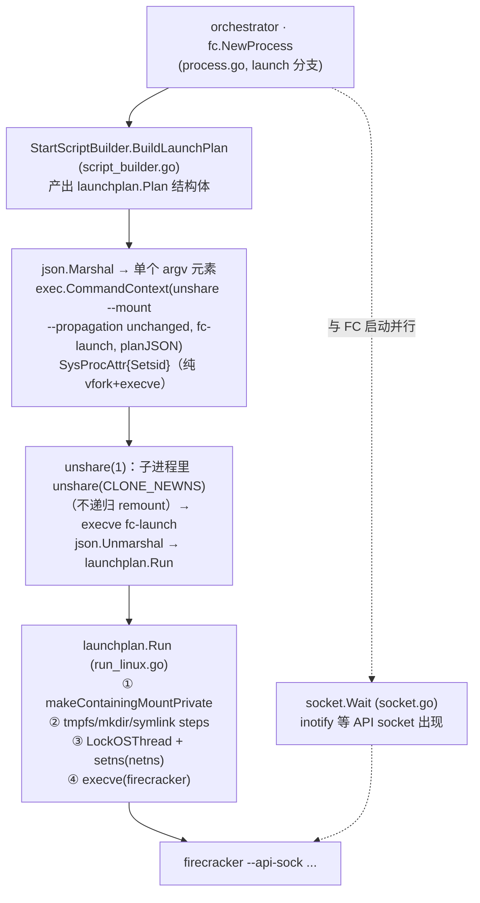

# FC 启动优化 · 档位 3：`launch` 详解

> **版本基准：e2b-infra `2026.09` tag + `0001-adapted-for-arm-architecture.patch` + `0002-fc-launch-dedicated-helper.patch`。**
> 本档全部源码都在 `0002-fc-launch-dedicated-helper.patch` 里，文中文件路径均指补丁应用后的路径。
> 三档开关机制、配置方法见 `single-node-offline-deploy.md` 第 9 节；耗时数据口径见 `启动耗时阶段分析.md`。
> 姊妹篇：`FC启动优化-netns-exec.md`（档位 2，含 baseline 管线成本的完整解剖，本文不重复）。

---

## 0. 一句话结论

> **`launch` 档把整条 shell 启动管线（~8 个 fork/exec + 2 次全挂载树递归遍历 + 10ms 轮询）压缩成
> "1 次 clone + 3 次 execve + 零遍历 + inotify"**：orchestrator 把启动步骤序列化成一个 JSON
> "launch plan"，经一层极小的 `unshare --mount --propagation unchanged` 包装交给专用静态
> helper `fc-launch`，由它在一个小进程里用纯 syscall 做完挂载/符号链/进 netns，最后原地
> execve 成 firecracker。
>
> **v2 变更**：mount ns 改由子进程里的 unshare(1) 创建，不再用 `Cloneflags` 在父进程
> clone(2) 时创建——100 并发实测 Cloneflags 让挂载表复制（copy_mnt_ns，持全局
> namespace_sem 写锁）落在 orchestrator 的 `cmd.Start()` 里，30 路 spawn 排成车队
> （spawn avg 143ms vs netns-exec 6.6ms），端到端反而输给档位 2。完整分析见 §3.2。

---

## 1. 动机：netns-exec 之后还剩什么

档位 2 只砍掉了 `ip netns exec` 一环（见姊妹篇 §2/§5），每沙箱还剩：

| 剩余成本 | 量级/性质 |
|---|---|
| bash + mount×2 + ln×2 + mkdir 共 ~7 个 fork/exec | 每个都过 ld.so、libc init；100 并发下在 CPU run queue 排队 |
| `mount --make-rprivate /` | O(主机挂载点数) 递归遍历，持**全局** `namespace_sem`，并发下互相串行 |
| bash 解析脚本 + 为 `&&` 链逐个 fork | 纯开销 |
| API socket 10ms ticker 轮询 | 平均白等 ~5ms + 长尾 |

这些没有一件需要独立进程来做——全是 syscall 的一层薄封装。`launch` 档的思路就是：
**把"要做什么"变成数据（plan），把"怎么做"变成一个尽可能小的执行器（fc-launch）**。

## 2. 设计总览



三个组成部分：

1. **`launchplan.Plan`**（`internal/sandbox/fc/launchplan/plan.go`）：无 shell 的启动描述。
   `Steps`（有序的 `mkdir`/`tmpfs`/`symlink` 三种操作）+ `NamespaceID` + `FirecrackerPath` +
   `FirecrackerSocket` 四个字段。**只依赖标准库**，保证 helper 二进制小、启动快。
2. **`fc-launch`**（`cmd/fc-launch/main.go`）：~50 行入口，反序列化 plan → `launchplan.Run()`。
   Run 成功即 execve，永不返回；走到 main 尾部说明 exec 失败，报错退出。
3. **inotify socket 等待**（`sandbox/socket/socket.go`）：仅本档启用（按 env 字符串判断，
   因为 socket 包不能 import fc 包），微秒级唤醒替代 10ms 轮询；inotify 不可用或非本档时
   回落原轮询逻辑，保持 A/B 基线纯净。

## 3. 实现走读

### 3.1 plan 的生成与传递（orchestrator 侧）

- `BuildLaunchPlan()`（`script_builder.go`）与 baseline 的脚本模板 `startScriptV1/V2` **逐步骤镜像**：
  - **V1 布局**（`TemplateVersion <= 1`）：rootfs tmpfs 挂在 `DeprecatedSandboxRootfsDir`，
    内核单独一个 tmpfs；
  - **V2 布局**：单个 tmpfs 挂在 `SandboxDir`，rootfs 符号链在其下，内核目录只 `mkdir`（不再单独 tmpfs）。

  改脚本模板时**必须同步改这里**，两边由同一个 `buildArgs()` 供参，路径不会漂，但步骤结构要人工对齐。
- plan 经 `json.Marshal` 后作为**单个 argv 元素**传给 helper。exec 的 argv 是数组传递，
  不经过 shell，所以路径里的空格/引号/`$` 都无需转义——这本身就消掉了一类注入/引用 bug。
  `plan_test.go` 的 round-trip 单测保证编解码不丢字段。

### 3.2 spawn：为什么经 `unshare --mount --propagation unchanged` 包装（两次踩坑的完整记录）

`process.go` launch 分支（v2，当前实现）：

```go
cmd = exec.CommandContext(execCtx,
    "unshare",
    "--mount",
    "--propagation", "unchanged",
    "--",
    fcLaunchHelperPath(),
    string(planJSON),
)
cmd.SysProcAttr = &syscall.SysProcAttr{
    Setsid: true, // Create a new session
}
```

mount namespace 由**子进程里的 unshare(1)** 创建，orchestrator 的 `cmd.Start()` 只做一次
纯 vfork+execve。走到这个形态踩过两个真实的坑，按时间顺序记录：

**坑一（v0 → v1）：`Unshareflags` 的隐藏 remount。** 初版用 `Unshareflags: CLONE_NEWNS`，
但 Go 的 `syscall/exec_linux.go` 对 Unshareflags 路径有一段"贴心"的兼容逻辑：子进程
`unshare(CLONE_NEWNS)` 之后、execve 之前，会**自动执行**

```
mount("none", "/", NULL, MS_REC|MS_PRIVATE, NULL)
```

（源码注释解释：systemd 把 `/` 挂成 shared，Go 要模拟 Plan 9 式的"干净 unshare"，
于是替调用者递归 make-private——`unshare(1)` 命令默认也这么干。）
这一下就把本档特意去掉的 **O(主机挂载点数) 全树遍历 + 全局 `namespace_sem` 串行化**原样
加了回来，而且藏在 runtime 里，代码评审根本看不见。于是 v1 改用 `Cloneflags: CLONE_NEWNS`
（ns 在 clone(2) 时创建，Go 不注入 remount）。

**坑二（v1 → v2）：`Cloneflags` 把 copy_mnt_ns 挪进了父进程的 clone(2)——100 并发实测翻车。**
带 CLONE_NEWNS 的 clone(2) 在**父进程的系统调用里**完成整棵主机挂载表的复制
（内核 `copy_mnt_ns`，持全局 `namespace_sem` 写锁），而 Go 的 `CLONE_VFORK|CLONE_VM`
快路径又让父线程一直阻塞到子进程 execve 完成。准入放行后 ~30 路 spawn **同一时刻**发起
clone，在这把全局锁上排成车队。100 并发实测（MAX_STARTING=30）：

| 段 | netns-exec | launch v1 (Cloneflags) |
|---|---|---|
| └拉起FC进程 (`cmd.Start()`) | avg 6.6ms | avg **143ms** / p50 170 / max 233（≈30×7.5ms 排队斜坡；min 11.4ms 即单次裸成本） |
| └等FC API socket | avg 138.4ms | avg 28.9ms（子进程侧优化完全达成） |
| 等待firecracker启动（和） | **145.6ms** | 177.0ms（倒赔 31ms，经准入排队放大后端到端输 49ms） |

教训：**把总功做少了没用，还得看剩下的活儿被放在了谁的关键路径上。** v1 做的命名空间
工作严格少于 netns-exec（1 次 copy_tree vs 2 次 copy_tree + 2 次全树遍历），但它把这唯一
一次 copy_tree 放在了最坏的位置：同步、在父进程、所有沙箱同刻发起。

v2 的解法是回到"ns 在子进程创建"（与 baseline 的 `unshare -m` 同侧），但不带 baseline 的
全树 remount：**`--propagation unchanged`（util-linux ≥ 2.26）让 unshare(1) 跳过默认的
递归 `MS_PRIVATE` remount**——正是坑一里 Go 替 Unshareflags 偷做的那件事。传播保护继续由
fc-launch 定点完成（§3.3，逻辑不变）。代价是多一次小动态二进制（仅链 libc）的 execve；
换来 `cmd.Start()` 与挂载表大小、`namespace_sem` 争用彻底解耦——copy_mnt_ns 依然存在，
但发生在 30 个已彼此独立的子进程里，错峰、且与各自管线其余工作重叠。

三种形态的 strace 对比（v2 一行在本容器实测验证）：

```
Unshareflags (v0): clone(...|CLONE_VFORK|CLONE_VM|SIGCHLD)
                   unshare(CLONE_NEWNS)
                   mount("none", "/", NULL, MS_REC|MS_PRIVATE, NULL)   ← 被偷走的优化
Cloneflags (v1):   clone(...|CLONE_VFORK|CLONE_VM|CLONE_NEWNS|SIGCHLD) ← copy_mnt_ns 卡在父进程
unshare 包装 (v2): clone(...|CLONE_VFORK|CLONE_VM|SIGCHLD)             ← 父进程只付 vfork+execve
                   execve(unshare) → unshare(CLONE_NEWNS)              ← 子进程，无递归 remount
                   → execve(fc-launch) → 定点 MS_PRIVATE → tmpfs → setns → execve(firecracker)
```

一个附带事实不变：**vfork 快路径始终保留**（Go 只在申请 `CLONE_NEWUSER` 时才放弃
`CLONE_VFORK|CLONE_VM`），`cmd.Start()` **从不复制 orchestrator 的页表**，spawn 成本与
orchestrator RSS（含 uffd handler mmap 的大 memfile）无关。——这也是为什么
"zygote/fork server"方案被否决：它解决的问题不存在。

### 3.3 传播保护：`makeContainingMountPrivate`（run_linux.go）

新 mount ns 与宿主机**共享传播关系**（systemd 主机上所有挂载默认 shared）：不做处理的话，
fc-launch 挂的 per-sandbox tmpfs 会**传播回宿主机挂载表**，且沙箱退出后没人清理，越积越多。

经典解法是 `mount --make-rprivate /`（正是 Go 替 Unshareflags 做的那个），但那是全树遍历。
本档改为：**只对将要承载 tmpfs 的挂载点做非递归 `MS_PRIVATE`**——

```go
// 对 plan 里每个 OpTmpfs 目标：
// 从目标路径向上走，逐级尝试 mount("", dir, "", MS_PRIVATE, "")：
//   EINVAL → dir 不是挂载点，continue 向上
//   ENOENT → 组件还不存在（后面 tmpfs 步骤才创建），continue 向上
//   成功   → 找到并标记了所在挂载点，结束
// "/" 一定是挂载点，循环必然终止。
```

成本 O(路径深度)（典型 ≤4 次 syscall），且**不动无关挂载的传播属性**。

注意**不能**偷懒只标 `/`：当前部署里 `/orchestrator`、`/fc-vm` 恰好是根文件系统上的普通目录，
但部署脚本里 `/orchestrator` 就叫 `MOUNT_POINT`（上游 GCP 部署在此挂缓存盘）。一旦沙箱目录
落在独立的 shared 挂载上，只标 `/` 挡不住传播。已用真实 `fc-launch` 二进制做过端到端验证：
共享挂载场景下按本逻辑零泄漏，而去掉标记的对照组确实把 tmpfs 泄漏到了宿主机。

### 3.4 步骤执行与进 netns（run_linux.go）

- `runStep()`：`mkdir` → `os.MkdirAll`；`tmpfs` → MkdirAll + `unix.Mount("tmpfs",...)`
  （等价脚本里的 `-o X-mount.mkdir`）；`symlink` → `os.Symlink`。全部纯 syscall。
- 进 netns 与档位 2 的 helper 完全同理：`runtime.LockOSThread()` 钉住线程 →
  `setns(CLONE_NEWNET)`（只影响当前线程）→ 同线程 `unix.Exec()`，execve 把进程收拢到该线程，
  firecracker 完整继承 netns。netns 按 `/var/run/netns` → `/run/netns` 顺序查找
  （对齐 iproute2 的 lookup 顺序）。

### 3.5 inotify 等 socket（socket.go）

- 先 `InotifyInit1` + `InotifyAddWatch(父目录, IN_CREATE|IN_MOVED_TO)`，**加完 watch 再 stat 一次**
  ——顺序不能反，否则"stat 时没有、加 watch 前刚好创建"的窗口会永久漏事件。
- 之后 `Poll` 阻塞等事件，250ms 兜底重查（防某些文件系统不投递 inotify / watch 竞态），
  事件到达只当唤醒信号用，真值以 re-stat 为准。
- inotify 建不起来 → 回落 10ms 轮询；非 launch 档 → 直接走原轮询（A/B 纯净）。
- 有效性依据：inotify 是 inode 级机制，FC 在自己的 mount ns 里创建 socket，
  但底层是与宿主机相同的文件系统/inode，事件照常投递（API socket 路径**不在**私有 tmpfs 上，
  否则 orchestrator 根本看不到它）。

## 4. 性能账本：三档对比

| 每沙箱成本 | 档1 disabled | 档2 netns-exec | 档3 launch |
|---|---|---|---|
| fork/exec 次数 | ~8 | ~7 | 1 次 clone + 3 次 execve（unshare→fc-launch→firecracker） |
| 全挂载树递归遍历（持全局锁） | 2 次（rprivate + ip 的 rslave） | 1 次（rprivate） | **0 次**（O(路径深度) 定点标记） |
| mount ns 创建位置 | 子进程 unshare(1) | 子进程 unshare(1) | 子进程 unshare(1)——v1 曾放在父进程 clone(2)（Cloneflags），100 并发下 spawn 车队，已废弃，见 §3.2 |
| /sys 卸载重挂 | 有 | 无 | 无 |
| shell 解析 | bash | bash | 无 |
| 动态链接加载 | unshare/bash/mount/ln/mkdir/ip | 少了 ip | 仅 unshare（只链 libc） |
| 等 API socket | 10ms 轮询 | 10ms 轮询 | **inotify**（µs 级唤醒） |
| 隐藏的 rec-private remount | 不适用 | 不适用 | 无（`--propagation unchanged`，见 §3.2） |

不可避免地保留的内核成本：创建 mount ns 时的挂载树复制（`copy_tree`，∝ 主机挂载点数、
持 `namespace_sem`）——三档都一样、都在子进程里发生，属于"每 FC 一个 mount ns"这个设计
本身的地板。控制手段是**主机挂载点卫生**（`wc -l /proc/mounts`）。

## 5. 运行时开关与验证

| 环境变量 | 作用 | 默认 |
|---|---|---|
| `E2B_FC_LAUNCH_MODE=launch` | 启用本档（同时激活 inotify 等 socket） | `disabled` |
| `E2B_FC_LAUNCH_HELPER` | helper 路径覆盖 | `/opt/e2b-infra/bin/fc-launch` |

```bash
# 0) 依赖检查：unshare 须支持 --propagation（util-linux ≥ 2.26）
unshare --help | grep -q propagation && echo OK

# 1) strace 验证 spawn 形态：clone 不带 CLONE_NEWNS（纯 vfork 快路径）；子进程
#    execve(unshare) → unshare(CLONE_NEWNS) → execve(fc-launch)，全程无
#    mount("/",...MS_REC|MS_PRIVATE)，只有对承载挂载点的一两次非递归 MS_PRIVATE
strace -f -e trace=clone,clone3,unshare,setns,mount,execve -p $(pgrep -f orchestrator) 2>&1 | grep -B2 -A6 fc-launch

# 2) 宿主机不应见到沙箱 tmpfs 传播（数量应恒为 0，不随沙箱创建增长）
grep -c '<沙箱目录前缀>' /proc/self/mountinfo

# 3) 压测（benchmark/run_benchmark.py）关注：
#    configured fc cost（总）/ fc spawn cost（clone+exec 段）/ fc socket wait cost（inotify 段）
```

## 6. 局限与下一步

- 本档（连同档 1/2）只是**让每次启动更便宜**，`configured fc cost` 里被 100 并发放大的
  CPU 争用部分仍在关键路径上。要把这段"基本清零"，方向是**按网络槽位预热池化 pre-boot、
  API-ready 的 FC 进程**（Resume 命中后只做翻转软链 → LoadSnapshot → ResumeVM），
  这是独立的后续工作，不属于本档。
- `BuildLaunchPlan` 与脚本模板是手工镜像关系（§3.1），rebase 上游时两处要一起核对。
- helper 仍是 Go 二进制（runtime 自启动 ~1-2ms），且 v2 多一层 unshare(1) 包装
  （一次小 execve）。用 C 重写 fc-launch 可同时消掉这两项：C 程序 execve 后单线程，
  可以自己 `unshare(CLONE_NEWNS)`（Go 因 runtime 多线程共享 fs_struct 做不到，这正是
  v1 被迫用 Cloneflags、v2 借用 unshare(1) 的根因），无需外部包装。若压测显示
  `fc spawn cost`/`fc socket wait cost` 仍显著再做。

## 7. 文件清单

| 文件（补丁后路径） | 内容 |
|---|---|
| `packages/orchestrator/internal/sandbox/fc/launchplan/plan.go` | Plan/Step 数据结构（纯标准库） |
| `packages/orchestrator/internal/sandbox/fc/launchplan/run_linux.go` | 执行器：传播标记、步骤、setns、execve |
| `packages/orchestrator/internal/sandbox/fc/launchplan/plan_test.go` | plan JSON round-trip 单测 |
| `packages/orchestrator/cmd/fc-launch/main.go` | helper 入口（JSON → Run） |
| `packages/orchestrator/internal/sandbox/fc/script_builder.go` | `BuildLaunchPlan()`（镜像 startScriptV1/V2） |
| `packages/orchestrator/internal/sandbox/fc/process.go` | launch 分支：plan 序列化 + `unshare --propagation unchanged` 包装 spawn |
| `packages/orchestrator/internal/sandbox/fc/mode.go` | 档位解析、helper 路径 |
| `packages/orchestrator/internal/sandbox/socket/socket.go` | inotify 等 socket + 轮询回落 |
| `packages/orchestrator/Makefile` | `make build` 产出 `bin/fc-launch` |
