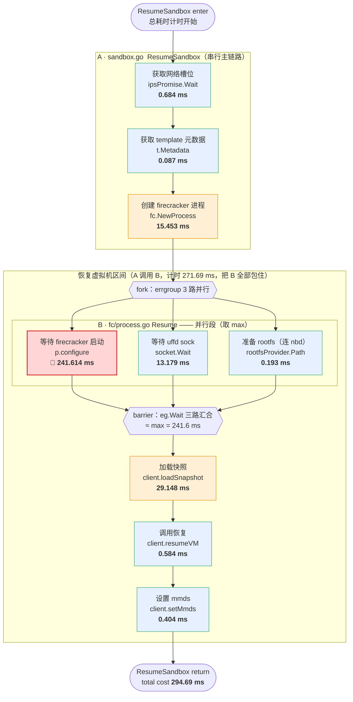
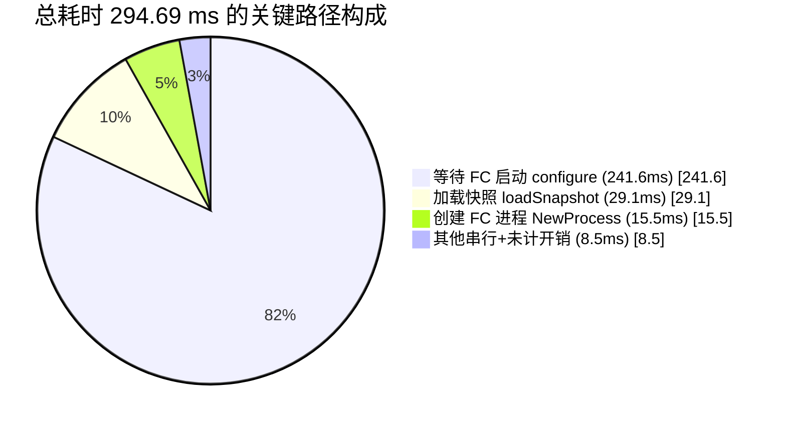
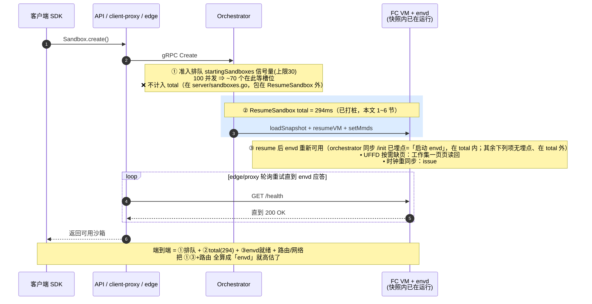

# 沙箱启动（ResumeSandbox）耗时阶段分析

> **版本基准：本文基于 e2b-infra `2026.09` tag** 的源码 + `0001-adapted-for-arm-architecture.patch` 分析。
> 项目持续演进，**其它版本的源码、函数划分、行号、甚至阶段顺序都可能不同**；文中近似行号、函数名、并行/串行结构均以 2026.09 为准，迁移到别的版本时请对照该版本源码重新核对。
>
> 数据来源：`parse_report.py` 解析 orchestrator `[ResumeSandbox]` 日志（100 个沙箱，avg/p50/p90… 单位 ms）。
> 埋点来源：`0001-adapted-for-arm-architecture.patch`，落在 orchestrator 的两个函数里。
> 本文目的：把报告里**串行/并行混排**的阶段，对照源码还原成真实的执行流程，并标出每个埋点的文件 / 函数 / 平均耗时。

---

## 0. 一句话结论

> **本数据是 100 并发压测**（刻意压高并发以暴露瓶颈，不是要去掉并发）。下面的占比正是「高并发下」的形态。

整条恢复链路平均 **294.69 ms**，其中 **82%（241.6 ms）卡在 `configure FC`（启动 Firecracker 进程并等其 API socket 就绪）**，
其次是 `load snapshot` 加载快照（29.1 ms，9.9%）和 `fc.NewProcess`（15.5 ms，5.2%）。其余所有阶段加起来不到 9 ms。
**优化只有一个主战场：把高并发下 `configure FC` 这 240 ms 降下来**——它涨到 240ms 主要是 100 并发下同时拉起/配置 FC 进程的**资源争用**（CPU、进程创建、socket 等待），单沙箱时它远没这么大。

---

## 1. 埋点总表（报告阶段 ↔ 日志 key ↔ 源码位置 ↔ 平均耗时）

四个被打桩的函数：

- **A. `sandbox.go`** → `func (f *Factory) ResumeSandbox(...)`
  路径 `packages/orchestrator/internal/sandbox/sandbox.go`
- **B. `fc/process.go`** → `func (p *Process) Resume(...)` 与 `configure(...)`
  路径 `packages/orchestrator/internal/sandbox/fc/process.go`
  （A 在 `resume VM` 计时区间里调用 B，所以 B 的所有阶段都被 A 的 `resume VM` 包住；
  `configure` 又被拆成 `拉起FC进程`+`等FC API socket`，二者之和≈`configured fc`）
- **C. `envd.go`** → `func (s *Sandbox) initEnvd(...)`
  路径 `packages/orchestrator/internal/sandbox/envd.go`
  （A 在「启动 envd」计时区间里经 `WaitForEnvd` 调 C，所以 C 的两个子阶段都被 A 的 `start envd` 包住）
- **D. `server/utils.go`** → `func (s *Server) waitForAcquire(...)`
  路径 `packages/orchestrator/internal/server/utils.go`
  （准入排队，在 `ResumeSandbox` **之前**、`total` **之外**；高并发瓶颈定位见 `高并发瓶颈定位方案.md`）

| 报告分组 | 报告描述 | 日志 key | 源码函数 | 近似行号¹ | avg(ms) | p99(ms) | 串/并 |
|---|---|---|---|---|---:|---:|---|
| 准入排队 | 准入排队(等starting槽位) | `acquire wait cost` | **D** `waitForAcquire`（`startingSandboxes.Acquire`，**在 `total` 之外**） | — | 待测³ | 待测³ | ➡️ 串行(等待) |
| 沙箱恢复准备 | 准备 rootfs（连接 nbd 设备） | `get rootfs path cost` | **B** `Resume` 内 errgroup 第 3 个 goroutine（`rootfsProvider.Path()` + 软链） | ~436 | **0.193** | 2.86 | 🟰 并行 |
| 沙箱恢复准备 | 获取网络槽位 | `wait network slot cost` | **A** `ResumeSandbox`（`ipsPromise.Wait`，等异步网络池槽位） | ~573 | **0.684** | 0.368² | ➡️ 串行(等待) |
| 沙箱恢复准备 | 获取 template 元数据 | `get template metadata cost` | **A** `ResumeSandbox`（`t.Metadata()`） | ~595 | **0.087** | 0.14 | ➡️ 串行 |
| 创建 firecracker 进程 | 创建 firecracker 进程 | `fc.NewProcess cost` | **A** `ResumeSandbox`（`fc.NewProcess(...)`） | ~620 | **15.453** | 80.49 | ➡️ 串行 |
| 创建 firecracker 进程 | 等待 firecracker 启动 | `configured fc cost` | **B** `Resume` 内 errgroup 第 1 个 goroutine（`p.configure(...)`，**启动 FC 进程 + 等 API socket**；父=下面两段之和） | ~402 | **241.614** | 329.14 | 🟰 并行 **(瓶颈)** |
| 创建 firecracker 进程 | └拉起FC进程 | `fc spawn cost` | **B** `configure`（`p.cmd.Start()` fork/exec，受 `E2B_FC_LAUNCH_MODE` 3 档影响） | — | 待测³ | 待测³ | ➡️ 串行 |
| 创建 firecracker 进程 | └等FC API socket | `fc socket wait cost` | **B** `configure`（`socket.Wait()` 等 FC API socket，含命名空间脚本/exec+FC 启动） | — | 待测³ | 待测³ | ➡️ 串行 |
| 创建 firecracker 进程 | 等待 uffd sock | `get uffd sock path cost` | **B** `Resume` 内 errgroup 第 2 个 goroutine（`socket.Wait(uffdSocketPath)`） | ~415 | **13.179** | 71.64 | 🟰 并行 |
| firecracker 恢复虚拟机 | 加载快照 | `load snapshot cost` | **B** `Resume`（errgroup 之后 `client.loadSnapshot(...)`） | ~457 | **29.148** | 54.44 | ➡️ 串行 |
| firecracker 恢复虚拟机 | 调用恢复 | `post resume cost` | **B** `Resume`（`client.resumeVM(...)`） | ~467 | **0.584** | 3.25 | ➡️ 串行 |
| firecracker 恢复虚拟机 | 设置 mmds | `set mmds cost` | **B** `Resume`（`client.setMmds(...)`） | ~488 | **0.404** | 1.53 | ➡️ 串行 |
| firecracker 恢复虚拟机 | 恢复虚拟机 | `resume VM cost` | **A** `ResumeSandbox`（**包住整个 B `Resume` 调用**） | ~671 | **271.69** | 369 | ⬛ 汇总区间 |
| 启动 envd | 启动 envd | `start envd cost` | **A** `ResumeSandbox`（包住 `sbx.WaitForEnvd(...)`，同步调 envd `/init`） | ~725 | 待测³ | 待测³ | ➡️ 串行 |
| 启动 envd | 请求init接口 | `envd init request cost` | **C** `initEnvd`（`doRequestWithInfiniteRetries`，POST `/init`，含重试） | ~123 | 待测³ | 待测³ | ➡️ 串行 |
| 启动 envd | 读取envd返回体 | `read envd response cost` | **C** `initEnvd`（`io.ReadAll(resp.Body)`） | ~143 | 待测³ | 待测³ | ➡️ 串行 |
| ResumeSandbox | ResumeSandbox总耗时 | `total cost` | **A** `ResumeSandbox`（`enter` → `defer`，整个函数；原「总耗时」，已重命名） | ~430/430 | **294.69** | 376 | ⬛ 汇总区间 |

> ¹ 行号是按 patch hunk 头推算的**打桩后**源码近似行号，仅供定位。
> ² 网络槽位 p99 比 avg 还小，是因为 avg 被极个别 max=61.87ms 的长尾（池子没命中）拉高；池子预热后基本接近 0。
> ³ 标「待测」的行（准入排队、`拉起FC进程`/`等FC API socket`、启动 envd 三行）埋点是后补的，
> 　本表其余数值来自补点前那次 100 并发压测、当时这些行为空；重新压测即可填上。其中 `start envd`
> 　（orchestrator→envd `/init` 往返）在 `total` 内、快照恢复下通常几 ms（见第 7 节）；`准入排队` 在
> 　`total` 之外。这些阶段的高并发瓶颈定位方法详见 `高并发瓶颈定位方案.md`。

### ⚠️ 报告分组 ≠ 代码结构（这就是"看起来乱"的根因）

报告把阶段按"概念"分了 3 组，但**代码执行结构是另一回事**：

- `准备 rootfs` 报告里挂在「沙箱恢复准备」组，**实际在 B `Resume` 里和两个"等待"并行执行**（errgroup 第 3 个 goroutine）。
- `等待 firecracker 启动` / `等待 uffd sock` 报告里挂在「创建 firecracker 进程」组，**实际也在 B `Resume` 的同一个 errgroup 里并行**，跟"创建 FC 进程"(`fc.NewProcess`, 在 A 里) 根本不是一个阶段。
- 真正能跟代码 1:1 对上的是下面的嵌套关系，请以它为准。

---

## 2. 真实执行流程（mermaid 流程图）

主链路自上而下串行；`恢复虚拟机` 区间里 fork 出 **3 路并行**，跑完一起汇合（errgroup barrier），再串行做加载快照/恢复/mmds。



🔴 红 = 主瓶颈；🟧 橙 = 次要可关注；🔵 蓝 = 基本可忽略（毫秒/亚毫秒级）。

---

## 3. 耗时占比（mermaid 饼图）

按**关键路径**拆分（并行段只计入最长的 `configure FC`，其余两路被它盖住不单独计）：



---

## 4. 时间轴（mermaid 甘特图）

直观看"并行段三条几乎同时开始、`configure FC` 最长决定汇合点"。
（条形按整数 ms 绘制，亚毫秒项按 1ms 兜底显示，精确值见标签/总表。）

```mermaid
gantt
    title ResumeSandbox 平均耗时时间轴（avg, ms）
    dateFormat x
    axisFormat %Lms

    section A 串行准备(sandbox.go)
    获取网络槽位 0.684ms      :a1, 0, 1ms
    获取template元数据 0.087ms :a2, after a1, 1ms
    创建FC进程 NewProcess 15.5ms :a3, after a2, 15ms

    section B 并行段(process.go errgroup)
    等待FC启动 configure 241.6ms :crit, p1, after a3, 242ms
    等待uffd sock 13.2ms        :p2, after a3, 13ms
    准备rootfs(nbd) 0.193ms     :p3, after a3, 1ms

    section B 串行段(汇合后)
    加载快照 loadSnapshot 29.1ms :s1, after p1, 29ms
    调用恢复 resumeVM 0.584ms    :s2, after s1, 1ms
    设置mmds setMmds 0.404ms     :s3, after s2, 1ms
```



---

## 5. 耗时嵌套/计算关系（对账用）

```
总耗时 total (294.69)
├─ 其他未单列开销 ≈ 6.8  ← total 减下面四项的差额；含 enter→网络槽位准备 + resume VM 之后的同步「启动 envd」/init（补点后从这拆出，见 §1 / §7.5）
├─ 获取网络槽位 wait network slot ........................ 0.684   [A 串行]
├─ 获取 template 元数据 get template metadata ............ 0.087   [A 串行]
├─ 创建 FC 进程 fc.NewProcess ........................... 15.453  [A 串行]
└─ 恢复虚拟机 resume VM (271.69) ......................... [A 调 B，包住整段]
   ├─ 并行段 max(configure, uffd, rootfs) ≈ 241.6        [B errgroup，取最长]
   │   ├─ 等待 FC 启动 configured fc ....... 241.614  ← 决定汇合点
   │   ├─ 等待 uffd sock ................... 13.179   （被 configure 盖住）
   │   └─ 准备 rootfs get rootfs path ...... 0.193    （被 configure 盖住）
   ├─ 加载快照 load snapshot ............... 29.148    [B 串行]
   ├─ 调用恢复 post resume ................. 0.584     [B 串行]
   └─ 设置 mmds set mmds ................... 0.404     [B 串行]
```

**自洽校验（用 avg 复算，与报告吻合）：**

```
恢复虚拟机 ≈ max(241.614, 13.179, 0.193) + 29.148 + 0.584 + 0.404 = 271.75   (报告 271.69 ✓)
总耗时    ≈ 0.684 + 0.087 + 15.453 + 271.69 + 6.78(其他开销)      = 294.69   (报告 294.69 ✓)
```

> `其他开销 ≈ 6.8 ms` = total 与四个串行项之和的差，含两段：① `enter` 到网络槽位等待前的准备（异步网络槽位 promise 启动、rootfs overlay `GetOverlay`、cgroup 创建、各埋点之间的空隙）；② resume VM 之后、`return` 之前的**同步 `/init`（即「启动 envd」）**。补点前两段都没单独拆，混在这 6.8ms 里；补 envd 点后，② 会单列为「启动 envd」三行（快照恢复下通常几 ms，是这 6.8ms 的主要成分）。

---

## 6. 给优化的提示

| 阶段 | avg | 性质 | 优化方向 |
|---|---:|---|---|
| 🔴 等待 FC 启动 `p.configure` | 241.6 | 启动 firecracker 进程 + 等 API socket。**高并发下被资源争用放大**（100 个一起拉起 FC，CPU/进程创建/socket 等待互相挤）；p99 329 ≫ avg 241 也是争用特征 | **唯一主战场**：限制同时 spawn 的 FC 数与可用核数匹配、FC 二进制/jailer 预热、socket 轮询间隔、绑核与调度优先级、降低单核依赖 |
| 🟧 加载快照 `loadSnapshot` | 29.1 | 快照文件 IO / 页缓存，受磁盘类型影响最大 | 快照常驻页缓存、NVMe、UFFD 预读策略 |
| 🟧 创建 FC 进程 `fc.NewProcess` | 15.5 | p99 飙到 80ms，有长尾 | 看 p90/p99 长尾来源（资源争用 / cgroup 创建） |
| 🔵 等待 uffd sock | 13.2 | 与 configure 并行，**已被盖住**，不在关键路径 | 只要 < configure 就不用动 |
| 🔵 网络槽位 / 元数据 / 调用恢复 / mmds / rootfs | 各 < 1～0.2 | 池命中后接近 0 | 保证网络池预热（`[Pool Status]` 充足）即可，无需优化 |

**结论重复一遍**：除非 `configure FC` 的 240ms 能降下来，否则动其它阶段对总耗时（294ms）几乎没有可感知收益。

---

## 7. 端到端视角：`total` 之外那 ~300 ms 是什么（envd / 排队 / 路由）

> **🔧 修正（埋点已更新）**：本节早先版本认为「等 envd」整体落在 `total` 之外——这只对一半。
> `Factory.ResumeSandbox` 在 `initialized FC` 之后、`return` 之前**还同步调了 `sbx.WaitForEnvd(...)`**
> （→ `initEnvd` → POST envd `/init`），这步**在 `total` 计时区间内**，现已拆成「启动 envd」三行
> （`start envd` / `envd init request` / `read envd response`，见第 1 节）。从快照恢复时 envd 已在运行，
> 这步通常只有几 ms——正好就是第 5 节那笔「其他开销 ≈ 6.8 ms」里没单独拆出来的部分，所以早先误以为「不在 total 内」。
> **真正在 `total` 之外**的是另一回事：客户端感受到的「envd 就绪」（proxy 轮询 health、准入排队、UFFD 缺页、路由往返）——本节下面讲的正是它。

报告里「启动 envd」3 行**现已埋点**（见第 1 节）。另一种常见做法是用 `客户端端到端 − orchestrator total(294ms) ≈ 300ms`，并把这 300ms 整笔当成「envd 启动耗时」。
**这个归因不准确**：`total` 计时的是整个 `Factory.ResumeSandbox` 函数（到 `return` 才由 `defer` 结束，**已含**上面那步同步 `/init`），而客户端那 ~300ms 差值里绝大部分是另外几件在它**计时区间之外**的事（排队 / 路由 / proxy 就绪轮询 / UFFD 缺页），不能整笔算成 envd。

### 7.1 客户端视角全链路（哪段计入 total，哪段没有）



### 7.2 那 ~300 ms 的成分拆解

| 差值里的成分 | 在哪 | 计入 total? | 100 并发下量级 |
|---|---|:--:|---|
| **准入排队**（`startingSandboxes` 信号量） | `server/sandboxes.go`，**包在** `ResumeSandbox` 外 | ❌ | **可能最大**。patch 把上限 3→30（`MAX_STARTING_INSTANCES_PER_NODE`）、`acquireTimeout` 15s→300s。100 并发 / 30 槽位 ⇒ ~70 个排队，**与 envd 无关** |
| 客户端→client-proxy→API→orchestrator(gRPC)→edge 路由 + 网络往返 | 链路两端 | ❌ | 几 ms ~ 几十 ms |
| **envd 就绪等待**（代理轮询/重试 envd 端口直到响应） | 代理层 | ❌ | envd 的真实贡献在这 |
| **resume 后 UFFD 缺页**（guest 一跑就触发，见 7.3） | guest 内 | ❌（发生在 resume 之后） | 并发下 I/O 争用，**被低估的大头** |

> 量级参照：E2B 官方**单沙箱**口径是「<200ms 就绪」。本次 **100 并发** 跑出 ~600ms(294+300)，多出来的主要是**高并发争用（信号量排队 + UFFD I/O）**，不是 envd 本身变慢。
> 本测试就是**刻意压并发 100**：30 个槽位、100 个一起进 ⇒ ~70 个在信号量排队，排队这块吃掉差值的一大部分。也正因高并发，`configured fc`（等待 FC 启动）才涨到 avg 241 / p99 329——**这正是要找的高并发瓶颈，不是 envd**。要把「排队」从差值里摘出来，见 7.4。

### 7.3 envd 在 resume 时到底做了什么（为什么不是「冷启动」）

**最重要的认知纠正：从快照恢复不是冷启动。** envd 进程在打快照那一刻就在运行，内存镜像被一起存进快照；resume 时**没有「启动 envd 二进制 / init 服务」这回事**，Go 进程不重新加载。这段时间是「**恢复后让 envd 重新可用**」，主要四件：

| 操作 | 说明 | 本仓库佐证 |
|---|---|---|
| **UFFD 惰性缺页**（通常隐藏大头） | FC resume 不整块读回内存，用 userfaultfd 按需缺页：guest 内核+envd 一恢复执行，每次首访的页由 orchestrator uffd handler 从快照 memfile 读出喂入。100 沙箱同时缺页 ⇒ 随机读 I/O + CPU 争用，「envd 开始响应」被卡在工作集缺完之前 | patch 调 `uffd/uffd.go`（`uffdMsgListenerTimeout` 10s→120s）、`userfaultfd.go`（写保护位处理） |
| **时钟重同步** | guest 墙钟停在打快照时刻，恢复后陈旧，需显式 sync；上游 issue#89「Clock drift on startup」明确是「开头几百 ms 漂移」——量级正好对上，但这是**待纠正窗口**，不等于「envd 忙 300ms」 | [e2b-dev/infra #89](https://github.com/e2b-dev/infra/issues/89) |
| **重新拿身份（MMDS）** | 每次 resume 是新沙箱（新 sandbox ID / access token / env），envd 经 MMDS 取新 access token | patch 改 `envd/internal/host/mmds.go`：`DisableKeepAlives:true` → 连接复用（说明在热路径、被优化过） |
| **/init 注入 + 就绪门控** | API 侧下发 env / access token，envd 应用后重新对外提供 gRPC+HTTP；代理**轮询 health 直到应答**才算就绪，轮询间隔会量化测得延迟 | socket 层 10ms ticker；架构上 edge/proxy 有「重试处理端口转发延迟」 |

一句话：envd 这段的「慢」**主要不是它在算什么**，而是 (a) 恢复后工作集靠 UFFD 一页页缺回、(b) 等时钟/身份重新就绪、(c) 代理重试轮询的间隔，且在 100 并发下被争用放大。

### 7.4 想在高并发下定位瓶颈：别用减法，补桩拆分

目标是**高并发下各阶段耗时**，所以不要去掉并发——而是把现在混在差值里的「排队 / 路由 / UFFD / envd」拆开，各自能在 100 并发下单独读数：

1. **orchestrator 侧补桩（最关键）**：在 `server/sandboxes.go` 的 `startingSandboxes.Acquire(...)` 前后各打一个时间戳 ⇒ 把「等槽位排队」从「真 resume」里拆出来。高并发下这一项可能很大，拆出来才知道瓶颈是排队还是 resume 本身。
2. **envd 侧补桩**：在 envd 的 `/init` 收到 → 时钟同步完 → health 首次 OK 各打时间戳（envd 日志），这才是 envd 真实耗时，而非外部相减。
3. **`--concurrency 1` 只作对照基线**（不是优化目标）：串行跑一遍拿到「无争用」的各阶段基线，再和 100 并发逐阶段相减 ⇒ **每个阶段被并发放大了多少**，一眼看出争用敏感的阶段（预期 `configure FC`、`load snapshot`、排队最明显）。

> 小结：报告里「启动 envd」三行现已埋点（量 orchestrator 同步 `/init`，在 `total` 内，快照恢复下通常几 ms，见 §1 / §7.5）；而客户端 `Sandbox.create()` 实测明显大于 294ms 仍是正常的，那段差值是 `total` **之外**的**排队 + 路由 + UFFD 缺页 + proxy 侧 envd 就绪轮询**的合计，不是单纯「envd 启动」——这部分要量得另在处理器层 / envd 层补桩（本节只做分析）。

### 7.5 「启动 envd」在 `total` 内，客户端感受到的「envd 就绪」在 `total` 外（已厘清）

关键是把两个都叫「envd」的东西分开——之前正是把它俩混成一谈才得出「envd 不在 total 内」的错误结论：

| 叫法 | 是什么 | 在 `total` 内？ | 量级（100 并发） | 埋点 |
|---|---|:--:|---|---|
| **(a) orchestrator 调 envd `/init`** | `ResumeSandbox` → `WaitForEnvd` → `initEnvd`，**同步** POST `/init` | ✅ 在 | 几 ms（快照里 envd 已在跑） | **现已打桩**＝「启动 envd」三行 |
| **(b) 客户端感受到的「envd 就绪」** | proxy 反复轮询 health 直到 200、准入排队、UFFD 缺页、路由往返 | ❌ 不在（在 Factory 返回之后 / 外层处理器 / proxy 懒触发） | 可达几百 ms | 需在处理器层 / envd 层补桩（见 7.4） |

**代码事实**：`[ResumeSandbox] total` 的 `defer` 加在 `Factory.ResumeSandbox` 函数入口、在 **`return` 时**触发；而该函数在 `initialized FC` 之后、`return` 之前**还同步调用了 `sbx.WaitForEnvd(...)`**（→ `initEnvd` → POST `/init`）。所以 (a) 落在 `total` 括号内，(b) 才在外面。早先「到 `initialized FC` 基本就结束」「等 envd 不在 total 括号内」的说法只对 (b)、对 (a) 是错的。

**那笔「算术」其实印证的是 (a) 很小，而不是「envd 不在 total 内」：** `total ≈ 294ms`，其它已打桩子阶段 ≈ 288ms（网络 0.68 + 元数据 0.09 + NewProcess 15.45 + resume VM 271.69），余量 **~6ms**——这 ~6ms 正是 (a) 那次同步 `/init` 往返（补点前没单独拆出来，混在第 5 节的「其他开销」里）。若把 (b) 的几百 ms 也塞进 `total`，那 `total` 早是 ~600ms 了——可它没有，恰恰说明 (b) 在 `total` 之外。

> 一句话：**(a) 启动 envd（orchestrator 同步 `/init`）现已埋点、且就在 `total` 内（快照恢复下通常几 ms）；(b) 客户端「envd 就绪」（proxy 轮询 / 排队 / UFFD）在 `total` 外，才是「端到端 − total」那笔大差值的主要来源。** 要量 (b) 仍需在处理器层 / envd 层补桩（见 7.4）。

---

### 参考来源

- [Clock drift on startup · Issue #89 · e2b-dev/infra](https://github.com/e2b-dev/infra/issues/89)（快照恢复后开头数百 ms 时钟漂移）
- [E2B Docs — Sandbox snapshots](https://e2b.dev/docs/sandbox/snapshots)（快照恢复、envd ≥ v0.5.0、单沙箱 <200ms 就绪）
- [e2b-dev/infra 系统架构（DeepWiki）](https://deepwiki.com/e2b-dev/E2B/1.1-system-architecture)（Client→Client-Proxy→API→Orchestrator→FC/envd 链路、proxy 重试处理端口转发延迟）
- 本仓库 `0001-adapted-for-arm-architecture.patch`：`server/sandboxes.go`（`startingSandboxes` 信号量、`maxStartingInstancesPerNode` 3→30、`acquireTimeout` 15s→300s）、`uffd/uffd.go` 与 `userfaultfd.go`（UFFD 惰性缺页）、`envd/internal/host/mmds.go`（MMDS access token）
