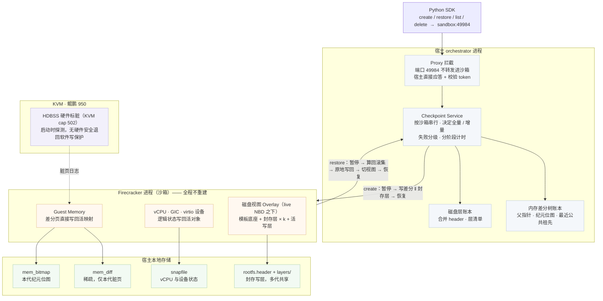
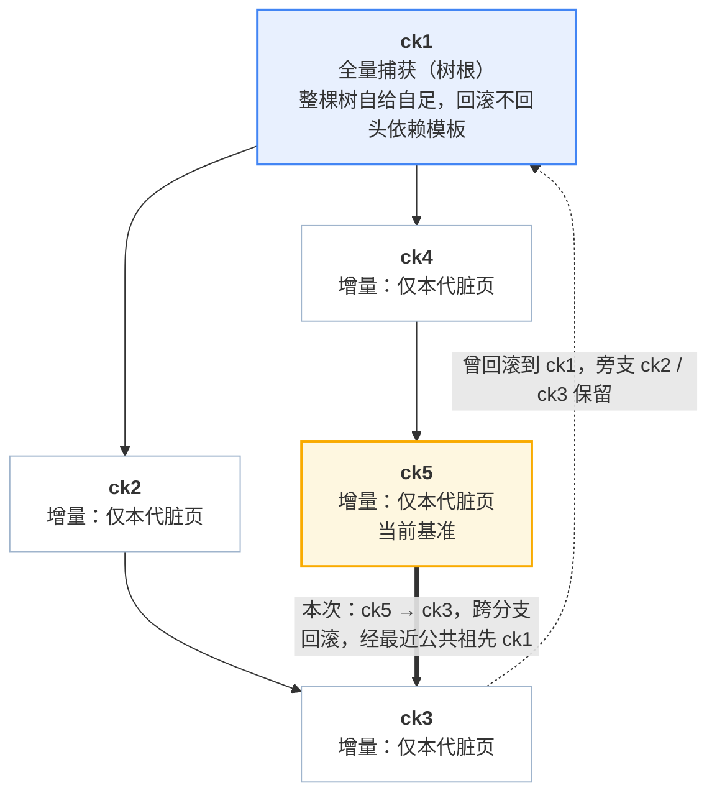
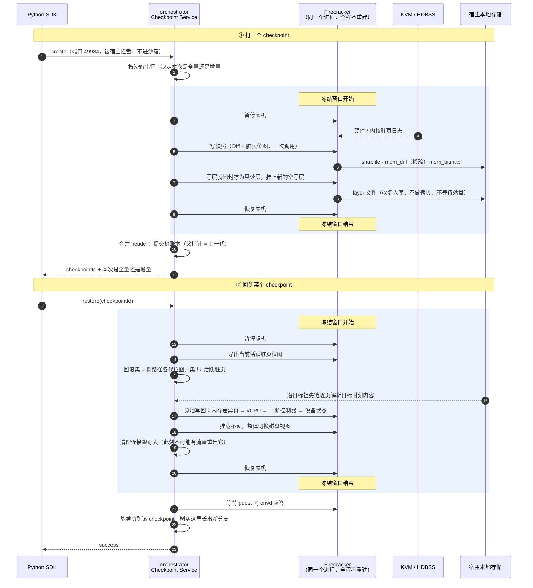

# Checkpoint / Restore 设计说明

> **适用范围**：950 ext4 路线，即本仓库 `0001-adapted-for-arm-architecture.patch` +
> 随包的分叉 Firecracker 二进制。另有一条 XFS + reflink 路线，两者只在**内存增量怎么存**上不同，
> orchestrator 与 Firecracker 必须成对使用，混用必失败。
>
> **配图**：本目录的 `01-architecture.svg`、`02-diff-tree.svg`、`03-vs-native.svg`，
> 内容与本文一致，用于汇报。文中内嵌的 mermaid 图可直接在 GitHub / VS Code 里渲染。

---

## 0. 定位：这套东西解决什么

沙箱在执行任务时出错，需要退回到上一个已知良好的状态继续跑 —— 这是一个**高频、低延迟、沙箱不能中断**的需求。
e2b 自带的 snapshot / resume 面向的是另一件事：沙箱离场后再回来。

| | e2b 原生 snapshot / resume | 本文的 checkpoint / restore |
|---|---|---|
| 场景 | 跨节点迁移、长期持久化、进程崩溃后恢复 | 活沙箱内部的快速回退 |
| 沙箱 | 打快照过程中被停掉再重新拉起 | 全程不中断 |
| 产物 | 进对象存储，跨节点可用 | 驻留宿主本地，随沙箱生命周期回收 |
| 成本 | 与虚机规格挂钩 | 与本次改动量挂钩 |

两条路径**并存**，本方案没有改动原生路径。沙箱进程死亡、虚机状态撕裂等场景不在本方案承诺范围内，
仍由原生 snapshot 负责。

不直接复用原生 snapshot 的三个原因：

1. **它会中断沙箱** —— 导出磁盘增量必须先停掉沙箱、等 NBD 设备释放；
2. **成本模型不对** —— 恢复要新建 Firecracker 进程并靠缺页把整个工作集换回内存，
   代价取决于虚机多大，而不是回退了多少；
3. **ARM 适配版上增量已经退化** —— 见 [§5.2](#52-脏页判据的三方差异)。

---

## 1. 总体结构



### 1.1 控制面：请求发往沙箱，却由宿主应答

SDK 把 checkpoint 请求发给沙箱的 49984 端口，但 orchestrator 的反向代理在转发之前把它截下来，
由宿主侧的 Checkpoint Service 直接回答。

理由很直接：**打快照要暂停虚机，沙箱内的程序没法暂停自己**。截获点位于代理自身的 token 校验之下，
所以 Service 自己又做了一遍 `e2b-traffic-access-token` 校验。

代价是沙箱内不需要安装任何代理程序 —— 对比基于 CRIU 的 guest 侧实现，省掉了一整个 guest agent。

### 1.2 存储布局

```
<store-root>/<sandbox-id>/
├── <checkpoint-id>/
│   ├── snapfile          # Firecracker 的 vmstate：vCPU、GIC、设备状态
│   ├── mem_diff          # 稀疏文件，只含本代写脏的页，写在各自的 guest 物理偏移上
│   ├── mem_bitmap        # FCDB 侧车：本代纪元位图（§2.7）
│   ├── rootfs.header     # 该时刻磁盘视图的合并映射表
│   └── timings.json      # 宿主侧分阶段耗时
├── layers/
│   ├── layer-<uuid>      # 封存写层，可被多代 checkpoint 共享引用
│   └── layer-<uuid>.meta # 该层持有哪些块偏移
└── last-restore-timings.json
```

产物**不进对象存储**，随沙箱销毁一并删除（`OnRemove`）。磁盘上的索引是为了事后可查，
不用于跨进程重启存活 —— orchestrator 重启本来就会带走它上面的所有沙箱。

---

## 2. 内存产物：差分树



### 2.1 每代只存自己写脏的页

一次增量 checkpoint 的内存产物就是一个稀疏文件：Firecracker 按 Diff 模式把本代脏页写在各自的
guest 物理偏移上，中间的干净页是文件空洞。成本 **O(本代脏页)**，与虚机规格和文件系统都无关。

### 2.2 为什么不是「每代自包含」

早期方案让每代产物是一份完整内存镜像：先克隆上一代镜像，再让 Firecracker 把 Diff 写在克隆上。
在 XFS 上这可行 —— `FICLONE` 是元数据操作，物理上只落脏页。

**ext4 没有 reflink**，克隆退化成真实字节拷贝，于是代价与改动量彻底脱钩：即使一代之内什么都没做，
也要付一次全内存拷贝。950 与客户环境全部是 ext4，所以整条数据路径不得依赖 reflink，
克隆这一步被取消，代之以「差分 + 按页解析」。

### 2.3 树，而不是链

每个 checkpoint 记录一个 `ParentID`。回滚**不剪枝**：比目标更新的 checkpoint 保留成旁支，
仍可恢复；回滚之后新打的 checkpoint 以回滚目标为父，于是树长出新分支。

由此支持三种线性链做不到的操作：回滚后再前滚、跨分支跳转、删除中间节点而不打断后代
（被后代依赖的节点转为隐藏保留，见 [§4.5](#45-删除与回收)）。

### 2.4 回滚集：树路径并集 ∪ 活跃脏页

从当前基准 `b` 回滚到目标 `t`，需要写回的页集合是：

```
revert = ⋃ 纪元位图(x)   x ∈ path(b → LCA) ∪ path(t → LCA)   （不含 LCA）
       ∪ Firecracker 当前的活跃脏页
```

**正确性**：若页 p 不在上式中，说明 p 在分叉之后的两侧都没有被写过,
那么它在 `b` 时刻的内容 == 在 LCA 时刻的内容 == 在 `t` 时刻的内容，无需回写。

活跃脏页那一项是必需的：虚机自上次快照以来写过的页尚未进入任何一代产物，
不并进来就会漏回滚。它通过分叉 Firecracker 新增的 `PUT /snapshot/save-dirty-bitmap` 导出。

路径上任何一代缺少侧车文件，该次回滚**直接报错**（「此目标不可原地回滚」），而不是静默降级。

### 2.5 内容解析：沿祖先链找最近的一代

对回滚集中的每一页 p，沿目标的祖先链 `t → parent(t) → …` 找**第一个**位图含 p 的那一代，
从它的 `mem_diff` 读取。树根是全量捕获，对解析而言等价于全 1 位图，因此解析必然在树内终止。

解析结果写成一个稀疏文件交给 Firecracker，连续同源的页合成单次读写（单次最多 1024 页）。
Firecracker 拿到后一次性写回活着的虚机内存。

> 这里有一条硬约束：Firecracker 在回滚时会把自己的活跃脏页并进写回集，并按页从调用方给的文件读内容。
> 所以 orchestrator 必须**事先知道**活跃脏页集，否则 Firecracker 会从文件空洞读到零页、静默损坏内存。
> 这正是 `save-dirty-bitmap` 端点存在的原因。

### 2.6 树根为什么要全量

改造前树根是「相对沙箱启动内存源的差分」，于是凡是从没被任何一代写过的页，都要回落到模板 memfile
读取 —— 而模板 memfile **本地并不存在**，它是经 chunker 从对象存储按需拉取的。
也就是说回滚路径上藏着一段跨网络依赖。

改为树根全量捕获后，整棵树自给自足，回滚只读本地文件。代价只落在每个沙箱的**第一次** checkpoint
（一次全内存写 + 一份全内存大小的存储），第 2..n 次不受影响。

开关 `CHECKPOINT_FULL_ROOT`，默认开。关掉它可让第一次 checkpoint 与其余各代同价，
代价是回滚路径重新依赖模板与对象存储 —— 适合「沙箱多、链短、存储紧、对象存储近」的部署。

### 2.7 恢复成本与链深无关

直觉上「沿祖先链解析」是这套方案最可能被长链拖垮的地方，实测（5 / 20 / 50 代）没有趋势。原因：

- 沿祖先链找「这一页最近写在哪一代」，只在**已加载到内存的位图**上做位测试，50 层查找相对一次 `pread`
  可以忽略；真正读文件只发生在命中的那一次。
- 创建侧也与链深无关，因为不做克隆。

所以**不需要周期性压平历史或做全量重整**。

### 2.8 位图侧车格式（FCDB）

orchestrator 与分叉 Firecracker 共享的小端二进制格式：

| 偏移 | 长度 | 内容 |
|---|---|---|
| 0 | 4 | magic `"FCDB"` |
| 4 | 4 | version（当前 1） |
| 8 | 8 | page_size |
| 16 | 8 | num_pages |
| 24 | 8 × ⌈num_pages/64⌉ | 位图字，第 w 字第 i 位对应文件偏移 `(w*64+i) * page_size` 的页 |

创建快照时由 Firecracker **在同一次调用内**写出并 fsync（`dirty_bitmap_path` 参数），
省掉 orchestrator 再发一轮「取脏页位图」的往返。

---

## 3. 磁盘产物：分层封存

### 3.1 原生做法与它的约束

沙箱的磁盘是一个 `Overlay`：底下是只读的模板 rootfs，上面是一层 COW 写层（一个稀疏文件 + mmap）。
guest 的写经 NBD dispatcher 落进写层，并把块偏移记入 dirty 集合。

原生导出增量的路径是 `ExportDiff`：

1. `EjectCache()` 把写层摘出来，Overlay 就此作废；
2. 停掉沙箱，等 NBD 设备释放；
3. 逐块从 mmap 取出脏块，全零块只记 empty 位不写，非零块**紧凑追加**进输出流；
4. 关闭并删除写层文件。

产物是紧凑的 diff 文件，storage offset ≠ device offset，靠映射表定位。
**它必须停沙箱**，这对高频 checkpoint 不可接受。

### 3.2 Seal：零拷贝换层

本方案在同一个 `Overlay` 上新增一条路径 `SealLayer`，它**不搬运任何数据**：

1. 对 NBD 块设备发一次 `BLKFLSBUF` ioctl —— 刷屏障，把内核块层已接受的写推进写层；
2. 新建一个空写层（open + truncate 出稀疏文件 + mmap，零数据写入）；
3. `Overlay.Seal()`：两次指针替换 —— 旧写层包装成 `SealedView` 折进读路径，新写层上位；
4. `MoveFile()` 把旧写层文件改名进 store（同一文件系统内是 rename，inode 不变，
   live mapping 继续有效；跨文件系统才退化为保洞的稀疏拷贝）。

guest 写进去的那个文件自始至终是同一个文件，只是身份从「写层」变成「只读层」。
类比：OverlayFS 把 upper 降级成 lower，再开一个新 upper，**挂载全程不卸载**。

因为不做紧凑化，层文件里 storage offset == device offset，映射表是恒等映射，比原生少一步偏移换算。
代价是不剔除全零块，层文件按块粒度占盘，比紧凑 diff 略费空间。

### 3.3 封存不等待落盘

`SealLayer` **刻意不做 msync**。封存层的脏页留在宿主 page cache，由内核按自己的节奏回写。

理由：后续所有读者 —— 还在运行的沙箱通过 `SealedView`、restore 时重新打开该文件 —— 都读同一份
page cache，一致性不欠这个 flush；msync 买到的是宿主崩溃后的持久性，而 store 的索引本来就活在
orchestrator 的进程内存里、随进程一起消失，checkpoint 的语义达不到那么远。

实测这一步的代价是 **0.49 ms / 脏 MB**，是封存耗时随改动量线性增长的唯一来源。去掉后封存基本恒定。

### 3.4 ResetView：挂载不动，整体换视图

回滚时磁盘侧要换掉的是整个视图（读路径 + 写层）。`ResetView` 在 live NBD 挂载之下完成：
NBD dispatcher 手里的 Device 指针不变，指针背后换成目标 checkpoint 的层栈加一个全新写层。
被丢弃时间线的写层连同文件一起关闭删除；旧的封存层只解除映射，文件归 store 所有，
可能还有别的 checkpoint 在引用。

### 3.5 恢复读路径不走层链

运行中的沙箱通过 `SealedView` 链读盘，链有多深就有多少层。但**恢复时不走这条链**：
`DiskViewForEntry` 用每层的 `.meta` 侧车重新打开层文件并标记它持有哪些块，
按 checkpoint 自己的合并 header 组装视图。所以层数永远不影响恢复。

---

## 4. 一次 checkpoint、一次 restore



### 4.1 冻结窗口是唯一对业务可见的代价

内存与磁盘在**同一次暂停**内完成。这不只是省一次暂停：两者因此是同一瞬间的镜像，
guest 尚未刷盘的数据留在内存镜像里，位置完全正确，不会出现半新半旧。

暂停之后才导出活跃脏页位图、才物化回滚数据 —— 因为虚机停住后活跃脏页集不再增长，
物化出来的内容必然覆盖 Firecracker 接下来要写回的全部页。

### 4.2 Firecracker 内部的原地回滚

分叉 Firecracker 的 `PUT /snapshot/rollback` 在 VMM 线程上、虚机暂停时执行，分为几个阶段：

| 阶段 | 做什么 |
|---|---|
| 1 校验 | 快照拓扑必须与运行中的虚机一致（同 vCPU 数、同内存大小、同设备集）；内存文件长度、位图几何都要对上 |
| 2 静默 | 排空在途设备 I/O：块设备等异步引擎结束，网络读掉并丢弃 tap 里缓存的帧 —— 那些帧属于正在被丢弃的时间线 |
| 3 取活跃脏图 | KVM 的读是破坏性的，所以先把结果折回用户态位图，无论后面发生什么都不会丢失「这些页脏过」这一信息 |
| **—— 提交点 ——** | 从这里开始改动 guest 状态 |
| 4 内存 | 按回滚集把页写回活映射，连续页合批 |
| 5 vCPU | 固定走 reinit 路线（KVM 定义的复位 + 完整恢复）|
| 6 中断控制器 | 对既有设备 fd 恢复 GIC 状态 |
| 7 设备 | virtio 队列、协商特性、中断状态写回活对象；串口重新初始化 |
| 8 VMGenID | 刷新代号，让 guest 知道时间被回拨；放在内存写回**之后**，避免被回滚覆盖 |
| 9 重置基线 | 清空脏页跟踪，使下一代 Diff 相对刚恢复的状态；队列页重新标脏（运行期队列写不被跟踪）|

宿主资源 —— 进程、KVM fd、eventfd、irqfd / ioeventfd 注册、tap、网络槽位、NBD 设备、内存映射 ——
**全部保留**。代价正比于回滚集大小，而不是虚机规格。

### 4.3 原地回滚特有的三个坑

进程重建路线天然不会遇到、原地回滚必须自己处理的：

- **网络 RX 描述符缓存**：队列索引被回退后，设备对象里还留着按旧时间线解析出的描述符链，
  而那些环页刚被回滚。第一个完成的帧会写入携带失效描述符 id 的 used 项，
  guest 驱动拒绝（`id N is not a head!`）后 RX 永久卡死。必须在应用设备状态后重建该缓存。
- **VMGenID**：必须在内存写回之后刷新，否则新代号会被回滚数据覆盖。
- **连接跟踪**：恢复后的 guest 忘记了内核仍在跟踪的连接，且 TCP 序号已经倒退。
  残留表项会让内核判定 guest 的包非法而丢弃 —— 表现为连接挂死而不是失败，最难排查。
  因此在暂停窗口内清空宿主与沙箱命名空间两侧的连接跟踪表：此刻没有流量，
  不可能有人重建一条刚被作废的表项。同时丢弃代理侧到该沙箱的连接池。

### 4.4 失败语义分级

不做兜底重建路线之后，失败必须分级报告，绝不允许「看起来成功、实际数据已坏」：

| 失败点 | 结果 |
|---|---|
| 路径缺侧车 / 位图损坏 / 物化失败 | 回滚报错，**沙箱保持原状态继续可用** |
| Firecracker 在提交点之前失败 | 同上，虚机原样恢复运行 |
| Firecracker 在提交点之后失败 | 虚机介于两个时刻之间 = 已撕裂，标记为死并报错，只能重建沙箱 |
| 回滚成功但 guest 的 envd 不应答 | 报错并在服务端留下带耗时的日志（等待上限 45s，刻意低于 SDK 的 60s 超时，否则客户端先放弃，真正的原因永远到不了调用方） |

创建侧还有一条纪律：**纪元不能丢**。Firecracker 一旦写完快照就清空了脏页位图，
此后该 diff 文件是那一代脏页的唯一副本。若后续步骤失败，该条目以**隐藏条目**提交，
仍参与内容解析与回滚集计算，只是 API 不展示；连这都失败才把链标记为断裂，
此后**拒绝恢复**直到下一次全量 checkpoint —— 不完整的回滚是静默的数据损坏，比报错糟得多。

### 4.5 删除与回收

`delete(id)` 是显式 API：

- 该节点有后代、或它是当前基准 ⇒ 标记为**隐藏**，列表不再展示，文件保留（后代要靠它解析内容）；
- 无后代且非基准 ⇒ 物理删除，并沿父指针级联回收那些「隐藏、无子、非基准」的祖先。

隐藏时会丢掉永远读不到的部分（snapfile、rootfs header —— 隐藏条目不可能成为恢复目标），
只保留 `mem_diff` 与位图。磁盘层按引用计数回收。

---

## 5. 脏页跟踪

### 5.1 HDBSS 怎么被启用

两侧各做一件事：

- **orchestrator** 启动时用 `KVM_CHECK_EXTENSION(502)` 探测一次（只查询，不创建 VM，
  在没有 `/dev/kvm` 的机器上也安全），据此决定这台机器上的虚机默认是否武装脏页跟踪；
- **Firecracker** 在 `setup_dirty_tracking()` 里用 `KVM_ENABLE_CAP(502, order)` 打开 HDBSS，
  失败则静默退回 KVM 软件写保护。

默认值跟着硬件走，因为**成本跟着硬件走**：有硬件标脏时武装几乎免费；没有时内核要写保护每个干净页
并在首次写入时陷出，对于从不打 checkpoint 的沙箱是纯亏损。

关键细节：**引导和快照加载两条路径都要武装**。e2b 的沙箱只从快照启动，
只改 machine-config 不改加载路径等于没开。

| 环境变量 | 作用 |
|---|---|
| `FC_TRACK_DIRTY_PAGES` | 强制开 / 关，覆盖硬件探测结果 |
| `FC_HDBSS_ORDER` | 每 vCPU 的 HDBSS 缓冲区阶数，默认 1（8 KiB）。写密集负载下缓冲区溢出会吃掉收益，值得实测 1 / 2 / 4 |
| `FC_HDBSS_REQUIRED` | 要求必须启用 HDBSS，否则启动即失败。回滚部署通常希望 fail fast，而不是默默退回软件路径 |

950 已确认 `CONFIG_ARM64_HDBSS=y`、`KVM_CHECK_EXTENSION(502) = 1`、`KVM_ENABLE_CAP` 实际调用成功，
**不需要配置任何环境变量**。

### 5.2 脏页判据的三方差异

这一节是理解本方案价值的前提，**不要跳过**。

| | 脏页怎么判定 | 结果 |
|---|---|---|
| **e2b x86 原生** | 读缺页填充时保留 uffd 写保护位，写缺页则清除；快照时取「已存在且未写保护」的页 | 增量**精确**，只有真正被写过的页算脏 |
| **ARM 适配版**（本方案的基线） | 该写保护路径在 arm64 上走不通，被注释掉；判据第二项恒真 | 增量**退化**：凡被换入过的页都算脏（读也算），量的下限 ≈ 整个常驻工作集 |
| **本方案** | 不经过 uffd，直接取 KVM / HDBSS 的脏页日志 | ARM 上**恢复精确增量**；950 上进一步由 CPU 硬件记录 |

必须明确：**这是修复 ARM 适配引入的退化，不是超越 x86 原生。** 在 x86 上 e2b 的增量本来就是精确的。

同样地，[§6](#6-与-e2b-原生的路径对比) 提到的「与改动量无关的下限」也只在 ARM 适配版上成立 ——
它是两件事叠加的结果：① 每次 snapshot 都会重建沙箱，工作集必须重新换入；
② 换入即被判脏。x86 上换入的是干净页，不计入增量。

> 补充一个实现细节：ARM 上「取脏页位图」这个接口实际是 mincore + pagemap 两级 ——
> 先用 mincore 一次筛出常驻页，再只对这些页读 pagemap。退化的是 pagemap 判据的第二项，
> 所以最终位图**等价于** mincore 的结果，但路径上仍在逐页 `pread`，那一级成了纯开销。

---

## 6. 与 e2b 原生的路径对比

完整对比见 `03-vs-native.svg`。要点：

| 维度 | e2b 原生 | 本方案 |
|---|---|---|
| 打快照时沙箱 | 停掉，再从新快照重新拉起一个新 Firecracker 进程 | 不停，同一个进程 |
| 快照后的身份 | SandboxID / ExecutionID 不变，但底层已是新进程（新 LifecycleID） | 无进程更替 |
| 内存搬运 | orchestrator 从 Firecracker 进程地址空间逐页拷出 | Firecracker 自己写稀疏差分，位图同一次调用落地 |
| 磁盘增量 | 停沙箱后把写层紧凑导出成 diff | 写层就地封存成只读层，零拷贝 |
| 历史结构 | 线性链，回滚后旧快照失去意义 | 树，可前滚、可跨分支 |
| 恢复方式 | 新建进程 + UFFD，靠缺页把工作集换回 | 原地写回差异页，宿主资源全保留 |
| 恢复成本 | 与虚机规格挂钩 | 与回退跨度挂钩 |
| 产物去向 | 对象存储，跨节点 | 宿主本地，随沙箱回收 |

---

## 7. 优化点汇总

| 层次 | 优化点 | 带来什么 |
|---|---|---|
| 脏页跟踪 | HDBSS 硬件标脏自动接管，启动探测能力，无硬件安全退回 | 由 CPU 记录脏页，950 上开箱即用 |
| | 判据取自硬件 / 内核日志，绕开 uffd | 补回 ARM 适配中丢掉的精确增量 |
| 内存产物 | 差分树：每代只存本代脏页，不复制上一代 | 成本只与改动量有关，ext4 上不需要 reflink |
| | 位图随快照同一次调用落地 | 省一轮接口往返和一次全内存扫描 |
| | 树形历史而非线性链 | 回滚后可再前滚、可跨分支跳，历史不丢 |
| | 树根存一次全量 | 整棵树自给自足，回滚路径不跨网络 |
| 恢复路径 | 按页沿祖先链解析，不合并链、不重建完整镜像 | 恢复成本与历史链长度无关 |
| | 进程内原地回滚 | 宿主资源全部保留，恢复后无需重新换入工作集 |
| | 回滚集精确到页 | 代价与回退跨度成正比 |
| 磁盘 | 写层就地封存 + 视图活体切换 | 打快照与回滚都不停沙箱 |
| | 封存不等待落盘 | 封存耗时不再随改动量增长 |
| 一致性 | 内存与磁盘在同一次暂停窗口内完成 | 两者是同一瞬间的镜像 |
| 架构 | 接口在宿主侧接管 | 沙箱内不需要任何代理程序 |
| 工程保障 | 失败语义分级、断链拒绝恢复、删除不打断后代 | 杜绝「看起来成功、实际数据已坏」 |
| | 三层计时 + 全量 / 增量模式回报 | 能定位到具体阶段，能发现静默退化 |

### 7.1 可观测性：三个时钟

- **客户端墙钟** —— 一次 SDK 调用花了多久；
- **冻结窗口** —— 业务实际感受到的停顿；
- **宿主分阶段耗时** —— 时间去了哪里，落在 `timings.json`（Firecracker 还会回报自己内部的分段）。

前两个说「差了多少」，第三个说「差在哪」。此外每次调用都回报本次是全量还是增量 ——
专门用来抓「静默退化成全量拷贝但仍然成功」这类藏在延迟均值里的问题。

---

## 8. 实测与缺口

**已验证（920B，ext4，`/mnt/ext4dev` 调优 loop 卷）**

- 正确性：三代内容逐字校验（内存标记 + 128MB blob 校验和 + 根文件系统的新建 / 删除 / 权限位）全部通过；
- 链深 5 / 20 / 50 代：全部正确，且恢复耗时无随链深增长的趋势；
- 稳定性：200 次回滚 0 失败；
- 分档基准（创建 p50）：全量 2GB **1.549 s**；增量 0 MB **0.022 s**、64 MB **0.062 s**、256 MB **0.183 s**；
- 恢复：常见档位在几十毫秒量级。

**缺口（重要）**

> 920B **没有 HDBSS 硬件能力**，上述全部数字来自 KVM 软件写保护路径。
> **HDBSS 的收益在 950 上零实测** —— 950 上至今一次 checkpoint 都没跑过。
> 上机后应依次完成：能力探测 → HDBSS 三级证据 → 在真盘上跑完整分档基准 →
> 可选地对 `FC_HDBSS_ORDER` 取 1 / 2 / 4 各测一轮。

---

## 附录 A：代码位置

分支：`infra-arm@jll`（orchestrator）、`KASandbox@jll`（Firecracker）。
交付形态是本仓库的 `0001-adapted-for-arm-architecture.patch` 与 `firecracker.arm`；
**单元测试只在 `infra-arm`**，不进 patch（rpmbuild 的 `%build` 只做 `go build`）。

| 关注点 | 位置 |
|---|---|
| 服务入口、create / restore 编排 | `packages/orchestrator/internal/checkpoint/service.go` |
| 树账本、回滚集、内容解析、物化 | `packages/orchestrator/internal/checkpoint/store.go` |
| FCDB 位图读写 | `packages/orchestrator/internal/checkpoint/bitmap.go` |
| 磁盘层账本、层侧车 | `packages/orchestrator/internal/checkpoint/rootfs.go` |
| 暂停窗口内的两个动作 | `packages/orchestrator/internal/sandbox/checkpoint.go` |
| 写层封存、视图活体切换 | `packages/orchestrator/internal/sandbox/block/overlay.go`、`block/sealed_view.go`、`rootfs/nbd.go` |
| 脏页跟踪的默认值决策 | `packages/orchestrator/internal/sandbox/fc/dirtytracking.go` |
| 回滚端点的客户端 | `packages/orchestrator/internal/sandbox/fc/rollback.go` |
| 连接跟踪清理 | `packages/orchestrator/internal/sandbox/network/conntrack.go` |
| 分阶段计时 | `packages/orchestrator/internal/sandbox/phasetimings.go` |
| 原地回滚本体（Firecracker） | `src/vmm/src/rollback.rs` |
| HDBSS 启用与脏跟踪后端选择 | `src/vmm/src/arch/aarch64/vm.rs`、`src/vmm/src/vstate/vm.rs` |
| 快照写出与位图侧车 | `src/vmm/src/vstate/vm.rs`、`src/vmm/src/vstate/memory.rs` |

## 附录 B：验收脚本

本仓库 `benchmark/` 下两个**零共享依赖**的单文件脚本，供交付方在 950 上直接运行：

| 脚本 | 用途 |
|---|---|
| `checkpoint_verify.py` | 只证正确性：三代各留 11 个观测点（内存 + 根文件系统，含删除与权限位），恢复必须逐字复现。先自证「这个检查会失败」，再验证恢复；活性只断言心跳在推进 —— 恢复会把 guest 的单调时钟拨回快照时刻，墙钟和 tick 速率都不能当判据 |
| `checkpoint_bench.py` | 分档扫描：建链后逐级回退。恢复单独成表（从 gN 回到 gN-1 的代价属于上一行）。每档抓两次：刚写完（回写争用的最坏情况）与宿主平静后（日常代价）。宿主内部耗时取服务端自己的 `timings.json`，不靠外部推断 |
