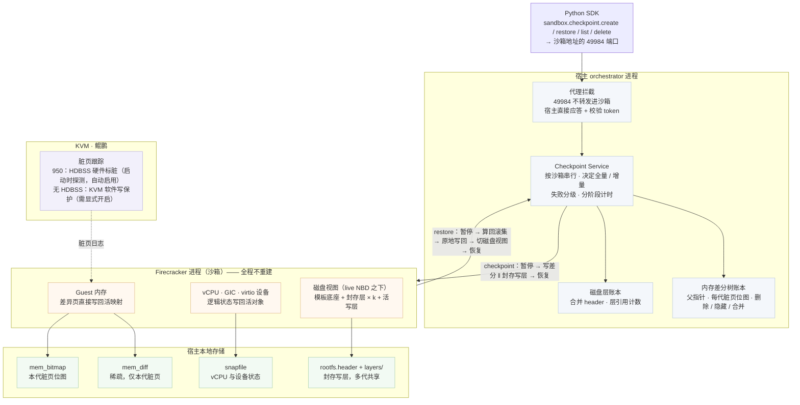
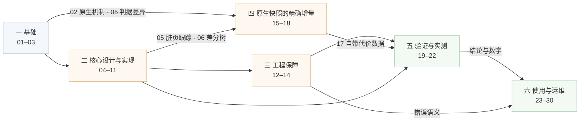

# 00 · 导读

## 本章目标

读完本章，你应当能够：

- 用两三句话说清这套 checkpoint / restore 是什么、解决什么问题、不解决什么问题；
- 说出全书六个部分各讲什么、前后怎么依赖，从而决定自己从哪里开始读；
- 说清本方案与 e2b 原生快照（pause / resume）是什么关系；
- 拿着"一次 checkpoint、一次 restore"这条主线，知道每一步的原理和实现分别在哪一章。

---

## 1. 这本书讲什么

### 1.1 一句话

**在不中断沙箱的前提下，把一台正在运行的虚拟机退回到过去某一时刻。**

它是 e2b 沙箱上的一组接口，挂在 Python SDK 的 `sandbox.checkpoint` 下：

- **checkpoint**：把沙箱此刻的完整状态（内存、vCPU、中断控制器、设备状态、磁盘）记下来，得到一个 checkpoint ID；
- **restore**：把沙箱原地放回某个 checkpoint 那一刻，沙箱不重建、IP 和端口不变；
- **list / delete**：列出、删除本沙箱的 checkpoint。

一个沙箱的 checkpoint 构成一棵树：restore 之后比目标更新的 checkpoint 仍然保留，可以前滚回去，也可以在分支之间直接跳。

实现分三块，同在 openEuler KASandbox 仓库里：宿主上的 **orchestrator**（接口、编排、账本）、
分叉的 **Firecracker**（原地回滚、脏页位图），以及 **Python SDK 覆盖层**。沙箱内部不需要安装任何东西。

### 1.2 它解决什么问题

一个 AI Agent 在沙箱里执行多步任务：装依赖、改配置、跑构建、跑测试。某一步把环境搞坏了 ——
装错了版本、删错了文件、改崩了配置。它需要回到上一步结束时的状态，换个做法重试。

这个需求有三个特征，决定了全书的技术选择（[01](01-background.md) 从这里展开）：

- **高频**：一个任务里要打十几个点，单次成本必须低到可以随手用；
- **低延迟**：回退发生在 Agent 的决策循环里，几十毫秒和几秒是完全不同的体验。客户给的参考上限是
  增量 checkpoint ≤ 200 ms、restore ≤ 100 ms（这两个数字怎么变成可测的口径见 [03](03-goals-and-design-choices.md) 与 [20](20-performance-methodology.md)）；
- **沙箱不能中断**：沙箱有 IP、有端口映射、有正在保持的连接、有外部持有的引用，中断一次这些全要重建。

### 1.3 适用与不适用

**适用**：

- Agent 或自动化任务在沙箱里逐步执行，需要"走坏了就退回上一步"；
- 在同一个起点上尝试多种做法，再在几个结果之间来回切换（树形历史）；
- 需要把沙箱反复放回一个已知良好的状态（例如每轮测试前复位），而不想每次重建沙箱。

**不适用**：

- **长期保存、跨会话、跨节点**：checkpoint 存在宿主本地，随沙箱生命周期回收，不进对象存储 —— 用原生 snapshot；
- **从进程崩溃、宿主故障中恢复**：restore 只能写回一个活着的虚机 —— 用原生 snapshot；
- **撤销对外部世界的影响**：已经发出去的 API 调用、写进外部数据库的数据，任何虚机快照都退不回来；
- **跨越 restore 保持 TCP 连接**：restore 会作废这个沙箱上所有跨越回滚的连接，客户端必须重连。

"为什么不适用"不是偷懒没做，而是由设计选择推出来的，推导在 [03](03-goals-and-design-choices.md) 与 [14](14-lifecycle-reasoning.md)。

---

## 2. 总体结构一图

四个层次：SDK 发请求 → orchestrator 编排并持有账本 → 分叉的 Firecracker 读写内存与设备状态 → KVM / 硬件提供脏页信息。
两个关键选择先记住，全书反复用到：

- **控制面在宿主侧**。做 checkpoint 要暂停虚机，沙箱里的程序没法暂停自己，所以请求虽然发往沙箱的 49984 端口，
  却在 orchestrator 的代理处被截下、由宿主应答。收益是沙箱内不需要任何代理程序（[04](04-architecture.md)）。
- **恢复是原地写回，不是重建**。restore 不新建 Firecracker 进程，而是往活着的进程里写回"变了的那些页"和设备状态，
  代价因此正比于回退跨度而不是虚机规格（这一分野在 [01](01-background.md) 讲清，实现在 [09](09-in-place-rollback.md)）。

---

## 3. 六个部分，以及它们怎么依赖

| 部分 | 章 | 回答的问题 |
|---|---|---|
| 一 基础 | 01–03 | 问题是什么？被快照的对象是什么？快照原理是什么？原生方案怎么做、为什么不直接用？目标和约束是什么？ |
| 二 核心设计与实现 | 04–11 | 各部件怎么分工？脏页怎么知道？内存和磁盘各自怎么存、怎么回？Firecracker 里怎么原地写回？ |
| 三 工程保障 | 12–14 | 出错时怎么保证不静默损坏？并发和持久性怎么处理？边界为什么在那里？ |
| 四 原生快照的精确增量 | 15–18 | 原生 pause 的增量为什么不精确、怎么改精确、代价与验证；两种快照怎么分工配合 |
| 五 验证与实测 | 19–22 | 怎么证明它对、它快？口径是什么？分档数据、长跑与并发数据是什么？ |
| 六 使用与运维 | 23–30 | 怎么调用、有哪些边界和错误？怎么部署、配置、观测、排障、验收？ |

依赖关系（箭头表示"读后者之前应先读前者"）：

几点说明：

- **第一部分是一切的前提。** 01 建立"重建 vs 原地回写""内存与磁盘必须同一瞬间"这些概念；02 把原生方案当作基线讲透；
  03 由此推出目标、约束和四条原则。后面每一个设计决定都能在 03 找到出处。
- **第二、三部分是主体。** 第二部分讲"它怎么工作"，第三部分讲"它出错时怎么不坏事"。第三部分大量引用第二部分的机制，反过来不成立。
- **第四部分依赖 02 和 05。** 它讲的是对原生 pause 路径的改进：与 checkpoint / restore 是两套机制，但两者经常串起来用，改进本身也要照顾到叠加使用；
  要理解它，需要先知道原生怎么判脏页（02）、"读也算脏"是什么（05）、本方案的差分为什么天生精确（06）。
  它的最后一章 18 把两种快照放在一起比较，并讲怎么配合使用。
- **第五部分给证据。** 方法（19、20）在前，数据（21、22）在后；判定性的实测数字只放在 21、22，原生精确增量自己的代价数据放在 17；原理篇只举标明出处与平台的量级示例。
- **第六部分面向使用者和运维。** 可以不读前五部分直接上手，每一节都链接回对应的原理章节。

---

## 4. 与原生快照的关系

e2b 自带的 snapshot（pause / resume）面向的是**沙箱离场之后再回来**：它要停掉沙箱、新起进程再加载，产物自足、进对象存储，
所以能跨节点、跨会话、长期保存，也能在进程崩溃后恢复，但每次的代价随虚机规格走。本方案面向**活沙箱内部的快速回退**：
沙箱全程不停，代价随"这一步改了多少"走，但产物离不开这台活着的沙箱。两者并存、分工，不互相替代：
先用 checkpoint / restore 在活沙箱里精确定位到想要的那一刻，再对它做一次原生 pause 固化下来，是最典型的配合方式。
逐项对比、优化点表与配合方式见 [18](18-native-and-checkpoint-together.md)；
原生快照自身的增量怎么被改成精确的，见第四部分 [15](15-native-increment-diagnosis.md)–[17](17-native-increment-cost-and-verification.md)。

---

## 5. 主线：一次 checkpoint、一次 restore 各经过哪几章

全书可以看成是在反复放大这两条路径上的某一步。先把路径列出来，读每一章时知道自己在哪一步。

### 5.1 一次 checkpoint

| # | 这一步做什么 | 原理 / 实现在哪 |
|---|---|---|
| 1 | SDK 把请求发到沙箱的 49984 端口 | 用法 [23](23-quickstart.md) |
| 2 | orchestrator 代理截下请求、补做 token 校验 | [04](04-architecture.md) |
| 3 | 取沙箱的串行锁；检查个数、字节、产物盘余量 | [13](13-state-concurrency-durability.md)、[27](27-configuration-and-capacity.md) |
| 4 | 决定全量还是增量，新节点的父节点取当前基准 | [06](06-memory-diff-tree.md) |
| 5 | 暂停虚机 | 冻结窗口的概念 [01](01-background.md) |
| 6 | Firecracker 只写本代脏页成稀疏文件，脏页位图同一次调用落地 | 脏页怎么知道 [05](05-dirty-page-tracking-and-hdbss.md)；接口 [08](08-firecracker-api-contract.md)；差分的组织 [06](06-memory-diff-tree.md) |
| 7 | 磁盘写层原地封存成只读层，换上新的空写层 | [07](07-disk-layering.md) |
| 8 | 恢复虚机；封存层移入 store，合并磁盘 header | [07](07-disk-layering.md) |
| 9 | 原子提交（rename，不 fsync），基准移到新节点 | [04](04-architecture.md)、[13](13-state-concurrency-durability.md) |
| 10 | 失败时按"纪元不能丢"处理 | [12](12-failure-semantics.md) |
| 11 | 写分阶段计时，回报 `memMode` | [28](28-observability-reference.md) |

### 5.2 一次 restore

| # | 这一步做什么 | 原理 / 实现在哪 |
|---|---|---|
| 1 | 拦截、鉴权、取串行锁，取目标条目 | [04](04-architecture.md) |
| 2 | 暂停之前按目标条目的层清单装配磁盘视图 | [07](07-disk-layering.md) |
| 3 | 暂停虚机；后台开始清连接跟踪表项 | [10](10-rollback-pitfalls.md) |
| 4 | 导出活跃脏页位图 | [05](05-dirty-page-tracking-and-hdbss.md)、[08](08-firecracker-api-contract.md) |
| 5 | 回滚集 = 树路径上各代位图的并集 ∪ 活跃脏页；逐页找目标时刻的内容，物化成两个文件 | [06](06-memory-diff-tree.md) |
| 6 | Firecracker 原地写回内存、vCPU、GIC、设备状态，以提交点为界 | [09](09-in-place-rollback.md) |
| 7 | 处理原地回滚特有的状态：网络描述符缓存、VMGenID、连接跟踪、时间 | [10](10-rollback-pitfalls.md) |
| 8 | 磁盘换成目标视图（挂载不动） | [07](07-disk-layering.md) |
| 9 | 恢复虚机，等 guest 里的 envd 应答；基准切到目标 | [09](09-in-place-rollback.md)、[11](11-end-to-end.md) |
| 10 | 失败时区分"沙箱原样可用"与"撕裂" | [12](12-failure-semantics.md)、错误表 [25](25-errors-timeouts-concurrency.md) |

把这两条路径完整走一遍的是 [11](11-end-to-end.md)。内存与磁盘在同一次暂停里拍下、在同一次暂停里换回，
所以两者永远是同一瞬间的镜像；宿主资源 —— 进程、KVM 句柄、tap 网卡、NBD 设备、内存映射 —— 全部保留。

---

## 6. 能力边界

checkpoint 的产物**随沙箱生命周期回收**。而且因果顺序不是"因为删了所以恢复不了"——
即使把目录完整留下来，也恢复不了：原地回滚需要那台**活着的**虚机、磁盘产物要叠在模板底座之上、
账本不从磁盘加载、进程与设备等运行时环境一个都不重建。补齐这些得到的基本就是原生 snapshot 本身，
这是分工的结果，不是缺陷（推导见 [14](14-lifecycle-reasoning.md)）。

由此得到的边界：

- **失效**：沙箱删除或超时回收、orchestrator 重启、宿主重启、沙箱迁移，checkpoint 都随之消失；
  沙箱经原生 pause / resume 换了一代，之前的 checkpoint 全部作废，新的一代从零开始（[24](24-semantics-and-limits.md)）；
- **外部世界不回滚**；**跨越 restore 的 TCP 连接作废**；**单调时钟倒退、墙钟被校回**（[24](24-semantics-and-limits.md)）；
- **同一沙箱的操作串行**；多个调用方同时操作一个沙箱时，restore 会打断在途调用，已经开始流式回数据的调用会被截断（[25](25-errors-timeouts-concurrency.md)）；
- **宿主不跟踪脏页时每次都是全量**：功能正确，只多花时间与空间，可从 `mem_mode` 字段看出（[23](23-quickstart.md)、[26](26-deployment-prerequisites.md)）；
- **撕裂**：restore 在提交点之后失败时沙箱停在两个时刻之间，只能销毁重建；其余失败沙箱都保持可用（[12](12-failure-semantics.md)、[25](25-errors-timeouts-concurrency.md)）。

---

## 7. 当前状态

920B（KVM 软件写保护）上功能全部通过，性能按脏页档位判定的结论见 [21](21-benchmarks-and-compliance.md)，
长时间、多沙箱并发的实测见 [22](22-long-run-and-concurrency.md)；目标平台 950（HDBSS）的性能数据待补。

下一章（[01](01-background.md)）从最基础的问题讲起：为什么要把运行中的机器退回过去，快照到底要保存什么。

---

## 本章要点

1. 本方案在**不中断沙箱**的前提下把运行中的虚机原地退回过去某一刻，面向高频、低延迟的活沙箱内回退。
2. 控制面在宿主侧（沙箱不能暂停自己），恢复是**原地写回**而非重建，代价随回退跨度而不是虚机规格。
3. 全书六部分：基础 → 设计与实现 → 工程保障 → 原生精确增量 → 验证与实测 → 使用与运维；第一部分是一切的前提，第四部分依赖 02、05、06。
4. 与原生快照是**分工**关系：原生管离场、持久化、跨节点与崩溃恢复，本方案管活沙箱内的快速回退；对比与配合在 18。
5. 一次 checkpoint 与一次 restore 的每一步都能在本章 §5 的两张表里找到对应章节，[11](11-end-to-end.md) 把它们完整走一遍。
6. 产物随沙箱生命周期消失，这是设计取舍推出的边界，推导在 14。
