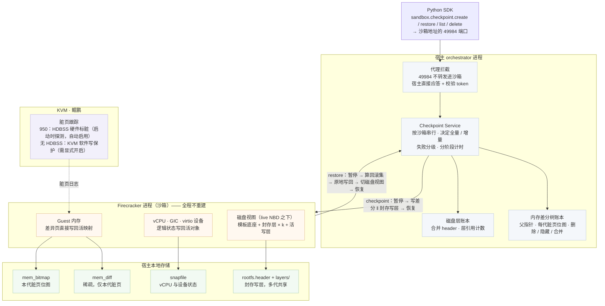

# 00 · 导读与总览

> **这篇给谁看**：所有人。
> **读完能做什么**：说清这套 checkpoint / restore 是什么、解决什么问题、由哪些部件组成、边界在哪、现在做到哪一步，
> 然后按自己的角色从 [README](README.md) 的阅读路径往下读。本篇只给结论和链接，不放具体数字。

---

## 1. 这是什么

**在不中断沙箱的前提下，把一台正在运行的虚拟机退回到过去某一时刻。**

它是 e2b 沙箱上的一组接口，挂在 Python SDK 的 `sandbox.checkpoint` 下：

- **checkpoint**：把沙箱此刻的完整状态（内存、vCPU、中断控制器、设备状态、磁盘）记下来，得到一个 checkpoint ID；
- **restore**：把沙箱原地放回某个 checkpoint 那一刻，沙箱不重建、IP 和端口不变；
- **list / delete**：列出、删除本沙箱的 checkpoint。

一个沙箱的 checkpoint 构成一棵树：restore 之后比目标更新的 checkpoint 仍然保留，可以前滚回去，也可以在分支之间直接跳。

实现分三块，同在 openEuler KASandbox 仓库里：宿主上的 **orchestrator**（接口、编排、账本）、
分叉的 **Firecracker**（原地回滚、脏页位图），以及 **Python SDK 覆盖层**。沙箱内部不需要安装任何东西。

---

## 2. 解决什么问题

一个 AI Agent 在沙箱里执行多步任务：装依赖、改配置、跑构建、跑测试。某一步把环境搞坏了 ——
装错了版本、删错了文件、改崩了配置。它需要回到上一步结束时的状态，换个做法重试。

这个需求有三个特征，决定了后面的技术选择：

- **高频**：一个任务里要打十几个点，单次成本必须低到可以随手用；
- **低延迟**：回退发生在 Agent 的决策循环里，几十毫秒和几秒是完全不同的体验。客户给的参考上限是
  增量 checkpoint ≤ 200 ms、restore ≤ 100 ms（口径见 [24](24-performance-methodology.md)）；
- **沙箱不能中断**：沙箱有 IP、有端口映射、有正在保持的连接、有外部持有的引用，中断一次这些全要重建。

e2b 自带的 snapshot（pause / resume）面向的是另一件事 —— **沙箱离场之后再回来**：它要停掉沙箱、新起进程再加载，
成本随虚机规格走，适合跨节点、跨会话、长期保存。本方案面向**活沙箱内部的快速回退**：沙箱全程不停，
成本随"这一步改了多少"走。两者并存、分工，不互相替代；逐项对比见 [11](11-baseline-goals-and-native.md)，
怎么配合使用见 [02](02-semantics-and-limits.md)。

---

## 3. 适用与不适用

**适用**：

- Agent 或自动化任务在沙箱里逐步执行，需要"走坏了就退回上一步"；
- 在同一个起点上尝试多种做法，再在几个结果之间来回切换（树形历史）；
- 需要把沙箱反复放回一个已知良好的状态（例如每轮测试前复位），而不想每次重建沙箱。

**不适用**：

- **长期保存、跨会话、跨节点**：checkpoint 存在宿主本地，随沙箱生命周期回收，不进对象存储 —— 用原生 snapshot；
- **从进程崩溃、宿主故障中恢复**：restore 只能写回一个活着的虚机 —— 用原生 snapshot；
- **撤销对外部世界的影响**：已经发出去的 API 调用、写进外部数据库的数据，任何虚机快照都退不回来；
- **跨越 restore 保持 TCP 连接**：restore 会作废这个沙箱上所有跨越回滚的连接，客户端必须重连。

---

## 4. 总体结构

四个层次：SDK 发请求 → orchestrator 编排并持有账本 → 分叉的 Firecracker 读写内存与设备状态 → KVM / 硬件提供脏页信息。

- **控制面在宿主侧**。SDK 把请求发到沙箱的 49984 端口，orchestrator 的代理在转发之前截下，由宿主上的服务直接应答。
  理由很直接：做 checkpoint 要暂停虚机，沙箱里的程序没法暂停自己。收益是沙箱内不需要任何代理程序。
- **产物在宿主本地**。每个沙箱一个目录，随沙箱删除；账本在 orchestrator 进程内存里，不跨进程重启。目录布局见 [12](12-architecture.md)。

---

## 5. 一次 checkpoint，一次 restore

**checkpoint**（一次暂停内完成）：

1. 同一沙箱上的操作排队串行；决定这次是全量（沙箱的第一次，作为树根）还是增量；
2. 暂停虚机 → Firecracker 只把自上一个点以来写脏的内存页写成稀疏文件，脏页位图同一次调用落地 →
   磁盘写层**原地封存**成只读层、换上一个新的空写层（不拷贝数据）→ 恢复虚机；
3. 记账：新节点的父节点是上一个 checkpoint（或上一次 restore 的目标）。

**restore**（一次暂停内完成）：

1. 在暂停之前先把目标时刻的磁盘视图组装好；
2. 暂停虚机 → 取出当前的活跃脏页 → 回滚集 = 从当前点到目标沿树路径各代脏页位图的并集，再并上活跃脏页 →
   沿目标的祖先链逐页找出目标时刻的内容 → Firecracker **原地**写回内存、vCPU、中断控制器、设备状态 →
   磁盘换成目标视图（挂载不动）→ 清掉这个沙箱的连接跟踪表项 → 恢复虚机；
3. 基准切到目标（之后的 checkpoint 从这里长出新分支），再等 guest 里的 envd 应答（它会把墙钟校回当前时间）。

内存与磁盘在同一次暂停里拍下、在同一次暂停里换回，所以两者永远是同一瞬间的镜像。
宿主资源 —— 进程、KVM 句柄、tap 网卡、NBD 设备、内存映射 —— 全部保留，代价正比于回滚集大小而不是虚机规格。
完整走查见 [19](19-end-to-end.md)。

---

## 6. 几个关键设计（结论与去处）

| 设计 | 带来什么 | 详见 |
|---|---|---|
| 脏页取自硬件 / 内核日志：950 上 HDBSS 自动接管，其他机器可显式开软件写保护 | 增量只含真正写过的页 | [13](13-dirty-page-tracking-and-hdbss.md) |
| 内存差分树：每代只存本代脏页，树根存一次全量 | 成本只与改动量有关，不依赖文件系统的 reflink；回滚只读本地文件 | [14](14-memory-diff-tree.md) |
| 删除感知依赖：有后代的节点隐藏保留，只剩一个子节点时合并（compact / fold）进子节点 | 删除不打断后代；"保留最新 N 个"的滚动用法占盘收敛 | [14](14-memory-diff-tree.md) |
| 磁盘写层原地封存、视图活体切换、层按引用计数回收 | checkpoint 与 restore 都不停沙箱，不再被需要的层及时回收 | [16](16-disk-layering.md) |
| 进程内原地回滚，Firecracker 以提交点为界 | 宿主资源全保留；失败时能分清"沙箱原样可用"与"撕裂" | [15](15-firecracker-api-contract.md)、[17](17-in-place-rollback.md) |
| 原地回滚特有问题的处理：网络描述符缓存、VMGenID 次序、连接跟踪 | restore 之后网络与 guest 内核状态自洽 | [18](18-rollback-pitfalls.md) |
| 失败语义分级：reason 字段 + 按调用方动作划分的异常类 | 杜绝"看起来成功、实际数据已坏" | [03](03-errors-timeouts-concurrency.md)、[20](20-failure-semantics.md) |
| 每沙箱个数上限、字节上限、产物盘余量闸 | 一个沙箱写不满整个节点 | [06](06-configuration-and-capacity.md) |
| 每次调用回报全量 / 增量，宿主分阶段计时 | 能发现"静默退化成全量"这类不报错的问题 | [07](07-observability-reference.md) |

---

## 7. 能力边界

checkpoint 的产物**随沙箱生命周期回收**。而且因果顺序不是"因为删了所以恢复不了"——
即使把目录完整留下来，也恢复不了：原地回滚需要那台**活着的**虚机、磁盘产物要叠在模板底座之上、
账本不从磁盘加载、进程与设备等运行时环境一个都不重建。补齐这些得到的基本就是原生 snapshot 本身，
这是分工的结果，不是缺陷（推导见 [22](22-lifecycle-reasoning.md)）。

由此得到的边界：

- **失效**：沙箱删除或超时回收、orchestrator 重启、宿主重启、沙箱迁移，checkpoint 都随之消失；
  沙箱经原生 pause / resume 换了一代，之前的 checkpoint 全部作废，新的一代从零开始（[02](02-semantics-and-limits.md)）；
- **外部世界不回滚**；**跨越 restore 的 TCP 连接作废**；**单调时钟倒退、墙钟被校回**（[02](02-semantics-and-limits.md)）；
- **同一沙箱的操作串行**；多个调用方同时操作一个沙箱时，restore 会打断在途调用，已经开始流式回数据的调用会被截断（[03](03-errors-timeouts-concurrency.md)）；
- **宿主不跟踪脏页时每次都是全量**：功能正确，只多花时间与空间，可从 `mem_mode` 字段看出（[01](01-quickstart.md)）；
- **撕裂**：restore 在提交点之后失败时沙箱停在两个时刻之间，只能销毁重建；其余失败沙箱都保持可用（[03](03-errors-timeouts-concurrency.md)）。

要长期保存：先用 checkpoint / restore 定位到想要的那一刻，再对它做一次原生 pause。

---

## 8. 当前状态

**920B（KVM 软件写保护）上功能全部通过、性能按档判定的结论见 [25](25-results-and-compliance.md)（摘要见 [04](04-performance-expectations.md)）；目标平台 950（HDBSS）的性能数据待补。**

---

## 9. 接下来读什么

按角色的阅读路径见 [README](README.md)。最短的几条：

| 你想要 | 读 |
|---|---|
| 马上在代码里用起来 | [01](01-quickstart.md) → [02](02-semantics-and-limits.md) → [03](03-errors-timeouts-concurrency.md) |
| 部署、配置、排障 | [05](05-deployment-prerequisites.md) → [06](06-configuration-and-capacity.md) → [08](08-troubleshooting.md) → [09](09-acceptance-runbook.md) |
| 搞懂机制 | [12](12-architecture.md) → [13](13-dirty-page-tracking-and-hdbss.md) → [14](14-memory-diff-tree.md) → [16](16-disk-layering.md) → [17](17-in-place-rollback.md) → [19](19-end-to-end.md) |
| 看证据、对照客户指标 | [04](04-performance-expectations.md) → [23](23-testing-and-functional-verification.md) → [25](25-results-and-compliance.md) |
