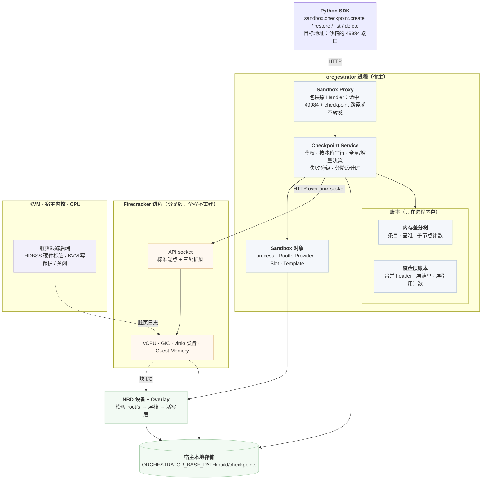

# 04 · 总体架构

## 本章目标

本章是第二部分的地图，后面每一章都在展开这里的某一个方块。读完本章，你应当能够：

- 说出一个 checkpoint 请求从 SDK 发出后经过哪些进程、哪些函数，各层负责什么、**不**负责什么；
- 解释为什么请求发往沙箱的端口却由宿主应答，以及为什么被截下的请求要再校验一次 token；
- 说出 orchestrator 里持有哪些状态、哪些只在内存里、磁盘上的索引为什么从不读回，以及 Firecracker 分叉了多少、为什么要保持这么小；
- 对着产物目录说出每个文件由谁写、谁读、什么时候消失（全书的目录布局只在本章定义）；
- 说明为什么考虑过的三条备选架构被否掉，以及为什么交付用 ext4。

上一章（[03](03-goals-and-design-choices.md)）推出了目标、约束与四条原则，第一部分到此结束：它讲清了问题（[01](01-background.md)）、基线（[02](02-e2b-native-snapshot.md)）和目标与原则。
本章开始进入实现：先看整体怎么分工，下一章（[05](05-dirty-page-tracking-and-hdbss.md)）从最底层的"怎么知道哪些页被写过"讲起。

主要代码：`packages/orchestrator/internal/proxy/proxy.go`、`internal/checkpoint/service.go`、`internal/checkpoint/store.go`
（下文未注明前缀的 `internal/...` 路径都在 `packages/orchestrator/` 下）。

---

## 1. 四个层次



每一层的职责与**边界**：

| 层 | 负责 | **不**负责 |
|---|---|---|
| SDK | 把四个 RPC 发到沙箱地址 | 不知道请求其实没进沙箱 |
| Proxy | 认出 checkpoint 请求并改道 | 不理解 checkpoint 语义 |
| Checkpoint Service | 编排、串行化、失败分级、计时 | 不碰 guest 内存，不算回滚集 |
| 账本（Store） | 树结构、回滚集、内容解析、层清单、合并（compact / fold） | 不与 Firecracker 通信 |
| Sandbox 对象 | 暂停/恢复、封存层、切视图、清 conntrack | 不知道 checkpoint 树 |
| Firecracker（分叉） | 写快照、导出活跃脏图、原地回滚 | 不知道有"树"这回事 |
| KVM / CPU | 记录脏页 | —— |

这个分层的一条纪律是**语义只在一处**。"什么是一棵树、回滚集怎么算"只有账本知道；Firecracker 收到的是一个位图和一个文件，
它不需要理解它们是怎么来的。反过来，"怎么把一页写进活着的 guest 内存"只有 Firecracker 知道，orchestrator 不去碰它的地址空间。
这样任何一侧改动，另一侧只要契约（[08](08-firecracker-api-contract.md)）不变就不受影响。

---

## 2. 控制面：请求发往沙箱，却由宿主应答

### 2.1 问题：谁来暂停虚机

打快照的第一步是暂停虚机。**沙箱内的程序无法暂停自己** —— 它跑在被暂停的那台机器上。所以 checkpoint 的执行者必须在宿主侧。

但从使用方的角度，最自然的 API 形态是 `sandbox.checkpoint.create()` —— 和 `sandbox.files.write()`、`sandbox.commands.run()` 一样，
是沙箱对象上的一个方法，走同一个地址、同一套鉴权。这两件事要同时成立。

### 2.2 拦截

SDK 把请求发到沙箱地址的 **49984** 端口。orchestrator 的反向代理在转发之前把它截下来（`internal/proxy/proxy.go:203-231`）：

```go
if checkpoints != nil {
    proxied := proxy.Handler
    proxy.Handler = http.HandlerFunc(func(w http.ResponseWriter, r *http.Request) {
        sandboxID, port, err := getTargetFromRequest(r)
        if err == nil && checkpoint.Handles(port, r.URL.Path) {
            checkpoints.ServeCheckpoint(w, r, sandboxID)
            return
        }
        if err == nil && checkpoints.RestoreInProgress(sandboxID) {
            // restore 期间直接回答，不放进沙箱
            ...
            return
        }
        proxied.ServeHTTP(w, r)
    })
}
```

`Handles`（`internal/checkpoint/service.go:401`）的判据是：端口 == `Port`（49984，:30）且路径是 `/health` 或以 `/checkpoint.Checkpoint/` 开头。
其余一切照旧转发进沙箱 —— 拦截是**加法**，不改变任何既有行为。

第二个分支处理 restore 进行中的其它请求：那时 guest 已暂停、TCP 状态正要退回过去，放进去的请求只会挂到回滚结束再失败，
所以代理立刻回答，不再挂着。这类回答对调用方意味着什么见 [25](25-errors-timeouts-concurrency.md)。

> 沙箱里其实没有任何东西监听 49984。SDK 的 `is_running()` 探活打的也是这个端口的 `/health`，由宿主应答 ——
> 所以它探的是**宿主侧服务的活性**，不是 guest 里某个守护进程的活性。`is_available()` 是同一个调用更准确的名字
> （`py-sdk/e2b/sandbox_sync/checkpoint.py:54`、:88）。

### 2.3 地址是怎么解析的

e2b 的沙箱通过一个统一的入口暴露：请求的 Host 头里带着端口与沙箱 id，代理据此把它路由到本节点上对应的沙箱。
`getTargetFromRequest` 解出 `(sandboxID, port)` 之后，才轮到 `checkpoint.Handles(port, path)` 判断要不要改道。
所以拦截**复用了既有的寻址机制**，没有引入新的地址空间 —— 这也是 SDK 侧几乎不需要特殊处理的原因：它照常构造一个沙箱内端口的 URL。

### 2.4 为什么要再校验一次 token

代理自身的 `e2b-traffic-access-token` 校验在**拦截点之下**。被截走的请求绕过了它，所以 `ServeCheckpoint`（`service.go:405`）
先查沙箱存在，再由 `authorize`（:458）做同样的校验。

这是**必要的重复**，不是冗余。把安全检查放在会被绕过的路径上，是一类经典的漏洞成因；这里的处理是让绕过者自己补上。

### 2.5 换来了什么

沙箱内**不需要安装任何代理程序**。对比另一条自然路线 —— 在 guest 里跑一个 agent 去 checkpoint 进程树（§7.1）——
那要处理 agent 的分发与版本、它自己的权限、它在 checkpoint 时刻的状态，以及"agent 自己怎么被 checkpoint"。
宿主侧方案把这些全部消掉了：**guest 完全不知道自己被 checkpoint 过**（VMGenID 那一次通知除外，见 [10](10-rollback-pitfalls.md)）。

### 2.6 API 面

```protobuf
service Checkpoint {
  rpc CreateCheckpoint(CreateCheckpointRequest)   returns (CreateCheckpointResponse);
  rpc RestoreCheckpoint(RestoreCheckpointRequest) returns (RestoreCheckpointResponse);
  rpc ListCheckpoints(ListCheckpointsRequest)     returns (ListCheckpointsResponse);
  rpc DeleteCheckpoint(DeleteCheckpointRequest)   returns (DeleteCheckpointResponse);
}
```

定义在 `spec/checkpointd/checkpoint/checkpoint.proto`，走 Connect 协议、JSON 编码。四个 RPC 加一个 `/health`，就是全部对外接口。

`CreateCheckpointResponse.mem_mode` 值得单独说：它存在的唯一理由是**让静默退化可见**。除了沙箱的第一个 checkpoint，
出现 `full` 就意味着这台宿主没在跟踪脏页 —— 功能照常，只是每次多拷一整份 guest 内存。没有这个字段，这种退化只表现为"有点慢"，
藏在延迟均值里，可能很久都没人发现（字段含义见 [28](28-observability-reference.md)）。

---

## 3. orchestrator 侧的部件

### 3.1 Service：编排者

`Service` 自己几乎不持有语义状态。它做的是：

| 职责 | 说明 |
|---|---|
| 鉴权与路由 | 四个方法分发 |
| 串行化 | 每个操作全程持有该沙箱的 gate（`Store.LockSandboxWithin`，`store.go:634`） |
| 全量 / 增量决策 | `service.go:577-578`：`rooting := parentID == "" && fullRootEnabled()`；`diff := fc.TrackDirtyPagesEnabled() && !broken && !rooting`（三个条件的来由见 [06](06-memory-diff-tree.md)） |
| 失败分级 | 区分"沙箱还能用""沙箱撕裂了""纪元丢了"（[12](12-failure-semantics.md)） |
| 计时与回报 | 分阶段耗时写进 `timings.json` / `last-restore-timings.json`，`memMode` 回给调用方 |
| 生命周期挂钩 | 同一 id 换了一代（原生 resume 之后）时丢掉上一代的全部产物（`OnInsert`，:313）；沙箱移除时清掉它的全部产物（`OnRemove`，:355） |

一个容易忽略但重要的细节：checkpoint 与 restore 都用 `context.WithoutCancel(r.Context())`（`service.go:504`、:1154）。

> 请求上下文在客户端放弃时就取消了，但那时虚机可能**正处于暂停态**。
> 一个所有人都以为在运行、实际停着的沙箱，比一个失败的快照糟得多。
> 所以操作一旦开始就不受请求生命周期约束（"请求生命周期 ≠ 操作生命周期"，见 [13](13-state-concurrency-durability.md)）。

### 3.2 Store：账本

`Store`（`internal/checkpoint/store.go:457`）是所有 checkpoint 语义的所在地。主要的表：

| 表 | 内容 |
|---|---|
| `bySandbox` | 沙箱 → (checkpoint id → 条目) |
| `bases` | 沙箱 → 当前基准（下一代的父亲）+ 断链标志 |
| `rootfs` | 沙箱 → 磁盘视图账本（合并 header、层清单、污染标志、未入账层） |
| `layerRefs` | 沙箱 → (层路径 → 引用数)，归零即回收（[07](07-disk-layering.md)） |
| `children` | 沙箱 → (条目 id → 子节点数)，O(1) 判"有没有子节点" |
| `usedBytes` / `layerBytes` | 字节配额的计数（[27](27-configuration-and-capacity.md)） |
| `owners` | 沙箱 id → 当前拥有它的 generation（LifecycleID） |
| `opLocks` | 沙箱 → gate（带超时可放弃的锁） |
| `compactPending` | 沙箱 → 待合并的候选队列（[06](06-memory-diff-tree.md)） |

**这些表只在进程内存里。** `NewStore`（:535）启动时先 `os.RemoveAll(root)` 再 `MkdirAll`：上一个进程留下的产物没人引用、
也永远不会被回收，所以直接清空，**从不读盘恢复**。磁盘上的 `manifest.json`（和可选的 `index.json`）只为事后排查，
store 从不读回（包注释 `store.go:26-32`）。

为什么不做跨重启持久化？因为 orchestrator 重启本来就会带走它上面的所有沙箱，而 checkpoint 要恢复到的正是那台活着的沙箱。
为一个恢复不了的目标持久化账本没有意义（完整推论见 [14](14-lifecycle-reasoning.md)）。

所有账本变更在一把全局锁 `Store.mu` 下完成；**删文件不在锁内**：锁内只把要删的东西从表里摘下、收进 `reclaim`，
放锁后由调用方在返回前删除（`store.go:133-174` 的注释逐条论证了为什么这样仍然安全，另见 [13](13-state-concurrency-durability.md)）。

### 3.3 Sandbox 对象：活体资源的持有者

`Service` 通过 `sandbox.Map` 拿到 `*Sandbox`，再通过它触达三样东西：

| 通过 | 做什么 |
|---|---|
| `s.process` | 暂停 / 恢复虚机、调 Firecracker 的三个扩展端点 |
| `s.Rootfs()` 断言为 `rootfs.LayerSealer` / `rootfs.ViewResetter` | 封存写层、切换磁盘视图 |
| `s.Slot` | 清连接跟踪表 |

两个 rootfs 接口是**类型断言**取得的（`internal/sandbox/checkpoint.go:211-214`）：

```go
sealer, ok := provider.(rootfs.LayerSealer)
if !ok {
    return false, nil, fmt.Errorf("rootfs provider %T cannot seal write layers", provider)
}
```

e2b 支持多种 rootfs 提供方式，只有 NBD + Overlay 那一种能封存换层。断言失败就明确报错，而不是走一条半对的路。

---

## 4. Firecracker 侧：分叉了多少

分叉版 Firecracker 在**功能上是上游 Firecracker 的超集**，加了三处：

| 扩展 | 形态 |
|---|---|
| `CreateSnapshotParams.dirty_bitmap_path` | 已有端点的一个可选字段 |
| `PUT /snapshot/save-dirty-bitmap` | 新端点 |
| `PUT /snapshot/rollback` | 新端点 |

外加 HDBSS 的启用与能力上报，以及回滚路径需要的 seccomp 白名单条目。**没有改动任何既有语义** ——
一个不使用这三处的调用方，看到的行为与上游一致。

这个克制是有意的：分叉越小，跟上游越容易，出问题时越容易判断是不是我们引入的。三个端点的完整契约见 [08](08-firecracker-api-contract.md)。

> **版本必须成对。** orchestrator 与 Firecracker 一起交付。未打补丁的 Firecracker 在 `/snapshot/rollback` 上返回 404，
> orchestrator 把它翻译成"this firecracker does not support in-place rollback"（`internal/sandbox/fc/rollback.go:69`、:197），
> 而不是一个含糊的 HTTP 错误。部署时怎么核对配对见 [26](26-deployment-prerequisites.md)。

---

## 5. 数据面：目录布局

store 根是 `${ORCHESTRATOR_BASE_PATH}/build/checkpoints`（`packages/orchestrator/main.go:400`；`DefaultCacheDir` 默认
`${ORCHESTRATOR_BASE_PATH}/build`，`ORCHESTRATOR_BASE_PATH` 默认 `/orchestrator`，见 `internal/cfg/model.go:23`、:28）。

```
/orchestrator/build/checkpoints/                ← store 根，NewStore 启动时清空
├── .trash-<uuid>/                              ← 被丢弃的整棵沙箱树，锁内改名至此、锁外删除
└── <sandbox-id>/
    ├── ckpt_<UnixNano>/                        ← 一个 checkpoint 条目
    │   ├── manifest.json
    │   ├── snapfile
    │   ├── mem_diff        或 mem_diff.<H-id>          ← 合并后可能换名
    │   ├── mem_bitmap      或 mem_bitmap.<H-id>        ← 合并后换名；全量条目可能没有
    │   ├── rootfs.header   或 rootfs.header.<条目-id>.<H-id>  ← 层合并后换名
    │   ├── timings.json
    │   └── （临时）*.tmp、mem_bitmap.tmp.live、live_bitmap.tmp、revert_mem.tmp、revert_bitmap.tmp
    ├── layers/
    │   ├── layer-<uuid>          + layer-<uuid>.meta
    │   └── layer-<uuid>.<H-id>   + .meta              ← 层合并产物
    ├── last-restore-timings.json
    └── index.json                                     ← 只有 CHECKPOINT_DEBUG_INDEX=true 时才写
```

`<H-id>` 是被合并掉的那个隐藏条目的 id（[06](06-memory-diff-tree.md)）。沙箱正在写的活写层不在这里，
在沙箱缓存目录 `${ORCHESTRATOR_BASE_PATH}/sandbox/rootfs-<sandbox-id>-<uuid>.cow`，封存后才移进 `layers/`。

| 文件 | 谁写 | 谁读 | 什么时候消失 |
|---|---|---|---|
| `snapfile` | Firecracker | Firecracker（回滚时） | 条目被隐藏或物理删除时 |
| `mem_diff` | Firecracker；合并时由 orchestrator 补页 | orchestrator（内容解析） | 条目物理删除时，或被合并时（被合并条目的，以及被新名字替换掉的旧文件） |
| `mem_bitmap` | Firecracker；合并时 orchestrator 写并集 | orchestrator（回滚集、内容解析） | 同上 |
| `rootfs.header` | orchestrator | orchestrator（restore 后重置磁盘账本） | 条目被隐藏或物理删除时；层合并改写后旧的一份 |
| `layer-<uuid>` | **guest**（经 NBD 写进去的写层文件，改名而来）；层合并时 orchestrator 补块 | 运行中的沙箱 + restore 重开 | **引用计数归零**（最后一个列它的视图和活账本都放手）或**被合并**时；否则随沙箱 |
| `layer-<uuid>.meta` | orchestrator | orchestrator（重开层、层合并） | 与层文件同时 |
| `manifest.json` | orchestrator | 无人（事后排查） | 随条目目录 |
| `index.json` | 后台写者，每沙箱最多每 5 s 一次（`store.go:118`、:2282） | 无人（事后排查） | 随沙箱目录 |
| `timings.json` / `last-restore-timings.json` | orchestrator | 基准脚本 | 随目录 |
| `mem_bitmap.tmp.live` | Firecracker（全量捕获前导出活跃脏图） | orchestrator | 用完即删（`internal/sandbox/checkpoint.go:173`） |
| `live_bitmap.tmp` / `revert_mem.tmp` / `revert_bitmap.tmp` | Firecracker / orchestrator | orchestrator / Firecracker | 一次 restore 结束即删，无论成败 |

`layer-<uuid>` 那一行是这套设计的特征：**它就是 guest 自己写出来的那个文件**。没有人把数据从一处搬到另一处，
只是把文件改了个名、换了个身份（[07](07-disk-layering.md)）。

### 5.1 原子提交

产物先写成 `<name>.tmp`，再 `rename` 到最终名字（`commitFiles`，`store.go:1032`），**不做 fsync**：原子性来自 rename，
而 checkpoint 不承诺活过 orchestrator 进程（承诺什么、不承诺什么见 [13](13-state-concurrency-durability.md)）。条目在账本里有两个状态：

- `prepared` —— 目录已建、临时文件在写，`Get` / `List` 都看不见；
- `committed` —— 文件已就位，可见、可恢复。

**半写完的快照永远不可能成为恢复目标。** 这是一条硬不变量（[12](12-failure-semantics.md)）。

---

## 6. 一次调用，十行

先给骨架，逐步走查见 [11](11-end-to-end.md)。

**checkpoint**：

```
拦截 → 鉴权 → 取沙箱 gate → 读当前基准，决定全量还是增量
   ↓
Prepare：建目录，登记 prepared 条目（个数与字节限额在这里检查）
   ↓
┌─ 暂停虚机 ───────────────────────────────────────┐
│  （全量时）先导出活跃脏图                           │
│  Firecracker 写快照：snapfile + 差分 + 位图，一次调用 │
│  封存写层，挂上新的空写层                           │
└─ 恢复虚机 ───────────────────────────────────────┘
   ↓
封存层移入 layers/ → 合并磁盘 header → Commit（rename + 账本发布，基准 ← 本条目）
   ↓
写 timings.json → 回报 checkpointId + memMode
```

**restore**：

```
拦截 → 鉴权 → 取沙箱 gate → 取条目 → 读层侧车，装配磁盘视图（暂停之前）
   ↓
┌─ 暂停虚机 ───────────────────────────────────────┐
│  后台开始清 conntrack                               │
│  导出活跃脏页位图（save-dirty-bitmap）               │
│  回滚集 = 树路径纪元并集 ∪ 活跃脏页；物化两个文件      │
│  Firecracker 原地回滚（内存 → vCPU → GIC → 设备）    │
│  切换磁盘视图（ResetView）；等 conntrack 清完         │
└─ 恢复虚机 ───────────────────────────────────────┘
   ↓
等 envd 应答（上限 45 s）→ 基准 ← 本条目；磁盘账本 ← 本条目的 header
   ↓
写 last-restore-timings.json → 回报 success
```

**delete**：锁内隐藏或摘下条目并剪枝 → 放锁删文件 → **同步合并**最多 `CHECKPOINT_COMPACT_MAX_PER_OP` 个候选（[06](06-memory-diff-tree.md)）。

---

## 7. 备选架构，以及为什么不是它们

三条真实考虑过的路线。

### 7.1 在 guest 里跑一个 agent（CRIU 路线）

沙箱内的守护进程 checkpoint 进程树。**否决理由**不止一条：

- 它恢复不了内核态。guest 内核的页缓存、网络协议栈状态、文件系统日志都不在进程树里；
- 它自己也是一个进程 —— "agent 怎么被 checkpoint"没有干净的答案；
- 它要分发、要升级、要权限，而且会出现在用户的进程列表里；
- 最关键的是**它解决不了磁盘**。进程树回退了，文件系统还停在未来（[01](01-background.md) §3.1）。

虚机级快照没有这些问题：guest 的**一切**都在内存镜像和磁盘视图里，包括它自己不知道的部分。

### 7.2 独立的 checkpointd 进程

在宿主上跑一个专门的服务，与 orchestrator 通过 IPC 协作。**否决理由**：checkpoint 的每一步都要触达 orchestrator 私有的活体对象 ——
Overlay 的指针、NBD 挂载、网络槽位、沙箱表。把它们暴露给另一个进程，要么复制一套生命周期管理，要么设计一套跨进程的所有权协议，
两者都比"在同一个进程里加一个包"贵得多。

代价是 checkpoint 逻辑与 orchestrator 同生共死，这也正是 [14](14-lifecycle-reasoning.md) 讨论的那条边界的来源之一。

### 7.3 全部逻辑放进 Firecracker

让 Firecracker 自己管理 checkpoint 树、自己写产物。**否决理由**：

- 磁盘那一半根本不在 Firecracker 里 —— Overlay、NBD、层文件都是 orchestrator 的东西；
- 分叉会从"一个字段 + 两个端点"膨胀到一个完整的存储子系统，跟上游立刻变得困难；
- Firecracker 的进程边界是安全边界（seccomp 白名单极窄），往里加文件系统操作要开很多口子。

最终形态是**语义在 orchestrator、机械动作在 Firecracker**：Firecracker 只做"把这个位图指定的页从这个文件写进 guest 内存"这类
无状态的动作，它不知道树是什么。

### 7.4 这张图里没有的东西

| 没有 | 因为 |
|---|---|
| 对象存储 | 产物宿主本地，不跨节点（[14](14-lifecycle-reasoning.md)） |
| guest 内的 agent | 全部动作在宿主侧（§2.5） |
| **后台任务** | 没有后台任务，删除时同步合并（[06](06-memory-diff-tree.md)）；恢复成本本来就与链深无关，不需要后台压平 |
| 兜底的"重建沙箱"路线 | 只有原地回滚一条路；进程已死的场景划给原生 snapshot（[03](03-goals-and-design-choices.md)） |
| 跨沙箱共享 | checkpoint id 只在所属沙箱的生命周期内有意义 |

最后一条之前的"没有兜底路线"是个重要的设计决定：它把"失败必须分级报告"从一个好习惯变成了一条硬要求（[12](12-failure-semantics.md)）。
（`CHECKPOINT_DEBUG_INDEX=true` 时的 index 后台写者只是调试辅助，不参与任何语义。）

---

## 8. 为什么交付用 ext4

内存产物有过两种存法，分歧只在一个文件系统特性 **reflink**（`FICLONE`：两个文件共享同一批 extent，写时才分裂；
XFS、Btrfs 支持，**ext4 不支持**）：

- **每代自足**：每代克隆上一代的完整内存镜像，再把本代脏页覆盖上去。在 XFS 上克隆是元数据操作，这是更简单的设计 ——
  产物自足、恢复路径短、不需要"导出活跃脏图 + 物化"两步；但在 ext4 上克隆退化成整份 guest 内存的真实拷贝，
  **即使这一代什么都没做也要付一次全内存拷贝**，而且结果照样正确、完全静默。
- **差分树**（交付方案）：每代只存本代脏页的稀疏差分，内容按页沿祖先链解析（[06](06-memory-diff-tree.md)），不依赖任何文件系统特性。

交付选 ext4 方案，理由不是它更快，而是它**没有前提**：客户环境（950）的产物盘是 ext4，一个要求"请把产物盘做成带 reflink 的 XFS"
的方案，在交付时会变成一条需要对方配合、而且不满足时静默退化的约束。代价是 restore 要在冻结窗口里多做"导出活跃脏图 + 物化"两步
（[08](08-firecracker-api-contract.md)），这是为不依赖 reflink 付的价。磁盘那一半两种存法完全相同：封存是改名，本来就不依赖 reflink。
XFS 方案已不交付。

---

## 本章要点

1. 四层：SDK / 代理拦截 / orchestrator（Service + 账本 + Sandbox 对象）/ 分叉 Firecracker / KVM。**语义只在一处**：树在账本里，页写回在 Firecracker 里，互不越界。
2. 请求发往沙箱 49984 端口、由宿主应答，因为**沙箱不能暂停自己**；拦截复用既有寻址，代价是在拦截点自己补一次 token 校验，收益是 guest 里什么都不用装。
3. checkpoint 与 restore 一旦开始就不受请求上下文取消的影响，因为半途放弃可能留下一台停着的虚机。
4. 账本**只在进程内存**；store 根启动时清空，manifest / index 只为排查，从不读回。锁内只改表，删文件在锁外。
5. Firecracker 的分叉是加法：一个可选字段 + 两个新端点，不改既有语义；两侧必须成对交付。
6. 目录布局以本章为准：层在引用计数归零或被合并时消失，`mem_diff` 在条目物理删除或合并时消失，`index.json` 默认不写；产物 rename 原子提交、不 fsync。
7. 三条备选架构（guest 内 agent、独立 checkpointd、全放进 Firecracker）各有否决理由；没有后台任务、没有兜底重建路线。
8. 交付用 ext4 方案，因为它没有文件系统前提；代价是 restore 多两步。
