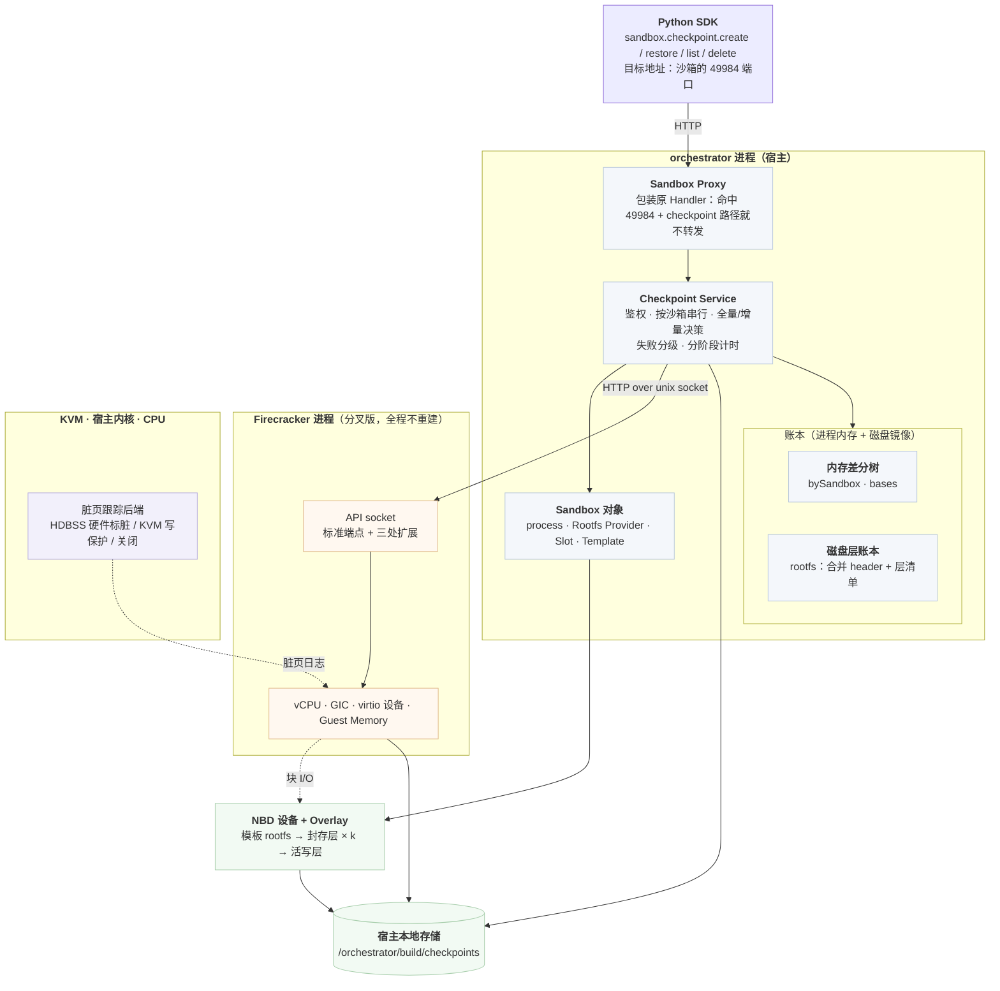

# 06 · 总体架构

> 这套系统由哪些部件组成，各自负责什么、不负责什么，数据在它们之间怎么流动。
> 本篇是第二部分的地图 —— 后面每一篇都在展开这里的某一个方块。
>
> **读者**：工程师。
> **预备**：[第 5 篇 · 设计目标](05-design-goals.md)。若完全不了解 e2b，先看[第 2 篇](02-microvm-and-e2b.md)。
> **代码**：`internal/proxy/proxy.go`、`internal/checkpoint/service.go`、`internal/checkpoint/store.go`

---

## 0. 本篇要回答的问题

1. 一个 checkpoint 请求从 SDK 发出后，经过哪些进程、哪些函数？
2. 为什么请求发给沙箱的端口，却由宿主回答？这个选择换来了什么？
3. orchestrator 里持有哪些状态？哪些在内存里、哪些在磁盘上？
4. 为什么要分叉 Firecracker，分叉了多少？
5. 每个产物文件由谁写、谁读、什么时候消失？

---

## 1. 四个层次



每一层的职责与**边界**：

| 层 | 负责 | **不**负责 |
|---|---|---|
| SDK | 把四个 RPC 发到沙箱地址 | 不知道请求其实没进沙箱 |
| Proxy | 认出 checkpoint 请求并改道 | 不理解 checkpoint 语义 |
| Checkpoint Service | 编排、串行化、失败分级、计时 | 不碰 guest 内存，不算回滚集 |
| 账本 | 树结构、回滚集、内容解析、层清单 | 不与 Firecracker 通信 |
| Sandbox 对象 | 暂停/恢复、封存层、切视图、清 conntrack | 不知道 checkpoint 是什么 |
| Firecracker（分叉） | 写快照、导出活跃脏图、原地回滚 | 不知道有「树」这回事 |
| KVM / CPU | 记录脏页 | —— |

这个分层的一条纪律：**语义只在一处**。「什么是一棵树、回滚集怎么算」只有账本知道；
Firecracker 收到的是一个位图和一个文件，它不需要理解它们是怎么来的。
反过来，「怎么把一页写进活着的 guest 内存」只有 Firecracker 知道，orchestrator 不去碰它的地址空间。

---

## 2. 控制面：请求发往沙箱，却由宿主应答

### 2.1 问题：谁来暂停虚机

打快照的第一步是暂停虚机。**沙箱内的程序无法暂停自己** —— 它跑在被暂停的那台机器上。
所以 checkpoint 的执行者必须在宿主侧。

但从使用方的角度，最自然的 API 形态是 `sandbox.checkpoint.create()` —— 和
`sandbox.files.write()`、`sandbox.commands.run()` 一样，是沙箱对象上的一个方法，
走同一个地址、同一套鉴权。

这两件事要同时成立。

### 2.2 拦截

SDK 把请求发到沙箱地址的 **49984** 端口。orchestrator 的反向代理在转发之前把它截下来：

```go
if checkpoints != nil {
    proxied := proxy.Handler
    proxy.Handler = http.HandlerFunc(func(w http.ResponseWriter, r *http.Request) {
        sandboxID, port, err := getTargetFromRequest(r)
        if err == nil && checkpoint.Handles(port, r.URL.Path) {
            checkpoints.ServeCheckpoint(w, r, sandboxID)
            return
        }
        proxied.ServeHTTP(w, r)
    })
}
```

`Handles` 的判据是「端口 == 49984 且路径是 checkpoint RPC 之一或 `/health`」。
其他一切照旧转发进沙箱 —— 拦截是**加法**，不改变任何既有行为。

> 沙箱里其实没有任何东西监听 49984。SDK 的 `is_running()` 探活打的也是这个端口的
> `/health`，由宿主应答 —— 所以它探的是**宿主侧服务的活性**，不是 guest 里某个守护进程的活性。
> 这一点在文档和方法命名上都刻意说清楚了（`is_available()` 是同一个调用的更准确的名字）。

### 2.3 为什么要再校验一次 token

代理自身的 `e2b-traffic-access-token` 校验在**拦截点之下**。被截走的请求绕过了它，
所以 `ServeCheckpoint` 第一件事就是自己做一遍同样的校验：

```go
sbx, ok := s.sandboxes.Get(sandboxID)        // 沙箱必须存在
if err := authorize(r, sbx); err != nil {    // token 必须对
    writeError(w, http.StatusUnauthorized, ...)
}
```

这是**必要的重复**，不是冗余。把安全检查放在被绕过的路径上，是一类经典的漏洞成因；
这里的处理方式是让绕过者自己补上。

### 2.4 换来了什么

沙箱内**不需要安装任何代理程序**。

对比一下另一条自然路线：在 guest 里跑一个 CRIU 风格的 agent，由它 checkpoint guest 内的进程树。
那样要处理 agent 的分发与版本、它自己的权限、它在 checkpoint 时刻的状态、
以及「agent 自己怎么被 checkpoint」。而且它只能恢复进程，恢复不了内核态、文件描述符之外的状态、
以及设备。

宿主侧方案把这些全部消掉了：**guest 完全不知道自己被 checkpoint 过**
（除了 VMGenID 那一次通知，见[第 12 篇](12-rollback-pitfalls.md)）。

### 2.5 地址是怎么解析的

e2b 的沙箱通过一个统一的入口暴露：请求的 Host 头里带着沙箱 id 与端口
（形如 `<port>-<sandbox-id>.<domain>`），代理据此把它路由到本节点上对应的沙箱。

`getTargetFromRequest` 解出 `(sandboxID, port)` 之后，才轮到 `checkpoint.Handles(port, path)`
判断要不要改道。所以拦截**复用了既有的寻址机制**，没有引入新的地址空间 ——
这也是为什么 SDK 侧几乎不需要特殊处理：它照常构造一个沙箱内端口的 URL。

### 2.6 API 面

```protobuf
service Checkpoint {
  rpc CreateCheckpoint(CreateCheckpointRequest)   returns (CreateCheckpointResponse);
  rpc RestoreCheckpoint(RestoreCheckpointRequest) returns (RestoreCheckpointResponse);
  rpc ListCheckpoints(ListCheckpointsRequest)     returns (ListCheckpointsResponse);
  rpc DeleteCheckpoint(DeleteCheckpointRequest)   returns (DeleteCheckpointResponse);
}
```

走 Connect 协议、JSON 编码。四个 RPC 加一个 `/health`，就是全部对外接口。

`CreateCheckpointResponse` 里有一个字段值得单独说：

```protobuf
// "incremental" 只写了本代脏页；"full" 拷了整个 guest 内存。
string mem_mode = 2;
```

它存在的唯一理由是**让静默退化可见**。除了沙箱的第一个 checkpoint，
出现 `full` 就意味着这台宿主没在跟踪脏页 —— 功能照常，只是每次多拷两个 GiB。
没有这个字段，这种退化只表现为「有点慢」。

---

## 3. orchestrator 侧的部件

### 3.1 Service：编排者

`Service` 自己几乎不持有状态。它做的是：

| 职责 | 说明 |
|---|---|
| 鉴权与路由 | 四个方法分发 |
| **串行化** | 每个操作全程持有该沙箱的操作锁 |
| 全量 / 增量决策 | 三个判据，见[第 8 篇 §8](08-memory-diff-tree.md#8-全量与增量怎么选) |
| 失败分级 | 区分「沙箱还能用」「沙箱撕裂了」「纪元丢了」 |
| 计时与回报 | 分阶段耗时写进 `timings.json`，`memMode` 回给调用方 |
| 生命周期挂钩 | 实现 `sandbox.MapSubscriber`，沙箱移除时清掉它的全部产物 |

一个容易忽略但重要的细节：create 和 restore 都用 `context.WithoutCancel(r.Context())`。

> 请求上下文在客户端放弃时就取消了，但那时虚机可能**正处于暂停态**。
> 一个所有人都以为在运行、实际停着的沙箱，比一个失败的快照糟得多。
> 所以操作一旦开始就不受请求生命周期约束。

### 3.2 Store：账本

`Store` 是所有 checkpoint 语义的所在地。它持有四张表：

| 表 | 内容 | 生命周期 |
|---|---|---|
| `bySandbox` | 沙箱 → (checkpoint id → 条目) | 沙箱移除时删 |
| `bases` | 沙箱 → 当前基准（下一代的父亲）+ 断链标志 | 同上 |
| `rootfs` | 沙箱 → 磁盘视图账本（合并 header + 层清单 + 污染标志） | 同上 |
| `opLocks` | 沙箱 → 操作锁 | 同上 |

**这四张表都在进程内存里。** 磁盘上有 `manifest.json` 和 `index.json`，
但 `NewStore` 启动时只做 `MkdirAll`，**不读盘**：

```go
func NewStore(root string) (*Store, error) {
    if err := os.MkdirAll(root, 0o755); err != nil { ... }
    return &Store{
        root: root,
        bySandbox: make(map[string]map[string]*Entry),
        bases:     make(map[string]baseRef),
        rootfs:    make(map[string]*rootfsState),
        opLocks:   make(map[string]*sync.Mutex),
    }, nil
}
```

磁盘上的索引是**为了事后可查**，不是为了跨重启存活 —— orchestrator 重启本来就会带走
它上面的所有沙箱。这个取舍的完整推论见[第 16 篇](16-lifecycle-and-portability.md)。

### 3.3 Sandbox 对象：活体资源的持有者

`Service` 通过 `sandbox.Map` 拿到 `*Sandbox`，再通过它触达三样东西：

| 通过 | 做什么 |
|---|---|
| `s.process` | 暂停 / 恢复虚机、调 Firecracker 的三个端点 |
| `s.Rootfs()`（`LayerSealer` / `ViewResetter` 接口） | 封存写层、切换磁盘视图 |
| `s.Slot` | 清连接跟踪表 |

注意这两个接口是**类型断言**取得的：

```go
sealer, ok := provider.(rootfs.LayerSealer)
if !ok {
    return fmt.Errorf("rootfs provider %T cannot seal write layers", provider)
}
```

e2b 支持多种 rootfs 提供方式，只有 NBD + Overlay 那一种能封存换层。
断言失败就明确报错，而不是走一条半对的路。

---

## 4. Firecracker 侧：分叉了多少

分叉版 Firecracker 在**功能上是上游 Firecracker 的超集**，加了三处：

| 扩展 | 形态 |
|---|---|
| `CreateSnapshotParams.dirty_bitmap_path` | 已有端点的一个可选字段 |
| `PUT /snapshot/save-dirty-bitmap` | 新端点 |
| `PUT /snapshot/rollback` | 新端点 |

加上 HDBSS 的启用与能力上报，以及回滚路径需要的 seccomp 白名单条目。**没有改动任何既有语义** ——
一个不使用这三处的调用方，看到的行为与上游一致。

这个克制是有意的：分叉越小，跟上游越容易，出问题时越容易判断是不是我们引入的。
三个端点的完整契约见[第 9 篇](09-firecracker-api-contract.md)。

> **版本必须成对。** orchestrator 与 Firecracker 一起交付。
> 未打补丁的二进制在 `/snapshot/rollback` 上返回 404，客户端把它翻译成
> 「这个 firecracker 不支持原地回滚」而不是一个含糊的 HTTP 错误。

---

## 5. 数据面：产物在哪、谁写谁读

```
<store-root>/<sandbox-id>/
├── <checkpoint-id>/
│   ├── snapfile
│   ├── mem_diff
│   ├── mem_bitmap
│   ├── rootfs.header
│   ├── manifest.json
│   └── timings.json
├── layers/
│   ├── layer-<uuid>
│   └── layer-<uuid>.meta
├── index.json
└── last-restore-timings.json
```

| 文件 | 谁写 | 谁读 | 什么时候消失 |
|---|---|---|---|
| `snapfile` | Firecracker | Firecracker（回滚时） | 条目删除 / 隐藏时 |
| `mem_diff` | Firecracker | orchestrator（内容解析） | 条目物理删除时 |
| `mem_bitmap` | Firecracker | orchestrator（回滚集 + 解析） | 条目物理删除时 |
| `rootfs.header` | orchestrator | orchestrator（恢复后重置账本） | 条目删除 / 隐藏时 |
| `layer-<uuid>` | **guest**（经 NBD 写进去的原文件，改名而来） | 运行中的沙箱 + 恢复时重开 | 沙箱销毁时 |
| `layer-<uuid>.meta` | orchestrator | orchestrator（重开层时） | 同上 |
| `manifest.json` / `index.json` | orchestrator | **无人**（事后排查用） | 随目录 |
| `timings.json` | orchestrator | 基准脚本 | 随目录 |
| `revert_mem.tmp` / `revert_bitmap.tmp` | orchestrator | Firecracker | 一次回滚结束即删 |

`layer-<uuid>` 那一行是这套设计的一个特征：**它是 guest 自己写出来的那个文件**。
没有人把数据从一处搬到另一处，只是把文件改了个名、换了个身份。见[第 10 篇](10-disk-layering.md)。

### 5.1 原子提交

产物先写成 `<name>.tmp`，`fsync` 之后 `rename` 到最终名字，再 `fsync` 目录。
条目在账本里有两个状态：

- `prepared` —— 目录已建、临时文件在写，`Get` / `List` 都看不见；
- `committed` —— 文件已就位，可见、可恢复。

**半写完的快照永远不可能成为恢复目标。** 这是一条硬不变量，见[第 15 篇](15-state-and-concurrency.md)。

---

## 6. 一次调用，十行

**create**：

```
拦截 → 鉴权 → 取沙箱操作锁
   ↓
读当前基准，决定本次全量还是增量
   ↓
Prepare：建目录，登记一个 prepared 条目
   ↓
┌─ 暂停虚机 ────────────────────────────────┐
│  Firecracker 写快照（snapfile + 差分 + 位图，一次调用）│
│  封存写层，挂上新的空写层                  │
└─ 恢复虚机 ────────────────────────────────┘
   ↓
合并磁盘 header → Commit（rename + 账本发布，基准 ← 本条目）
   ↓
写 timings.json → 回报 checkpointId + memMode
```

**restore**：

```
拦截 → 鉴权 → 取沙箱操作锁 → 取条目 → 加载磁盘视图
   ↓
┌─ 暂停虚机 ────────────────────────────────┐
│  导出活跃脏页位图（save-dirty-bitmap）      │
│  算回滚集 = 树路径纪元并集 ∪ 活跃脏页       │
│  物化：revert_mem（稀疏）+ revert_bitmap    │
│  Firecracker 原地回滚（内存→vCPU→GIC→设备） │
│  切换磁盘视图（ResetView）                  │
│  清 conntrack                              │
└─ 恢复虚机 ────────────────────────────────┘
   ↓
等 envd 应答（上限 45 s）
   ↓
基准 ← 本条目；磁盘账本 ← 本条目的 header；丢弃代理连接池
   ↓
写 last-restore-timings.json → 回报 success
```

逐步走查见[第 13 篇](13-end-to-end.md)。

---

## 6.5 备选架构，以及为什么不是它们

三条当时真实考虑过的路线：

### 在 guest 里跑一个 agent（CRIU 路线）

沙箱内的守护进程 checkpoint 进程树。**否决理由**不止一条：

- 它恢复不了内核态。guest 内核的页缓存、网络协议栈状态、文件系统日志都不在进程树里；
- 它自己也是一个进程 —— 「agent 怎么被 checkpoint」没有干净的答案；
- 它要分发、要升级、要权限，而且会出现在用户的进程列表里；
- 最关键的是**它解决不了磁盘**。进程树回退了，文件系统还停在未来。

虚机级快照没有这些问题：guest 的**一切**都在内存镜像和磁盘视图里，包括它自己不知道的部分。

### 独立的 checkpointd 进程

在宿主上跑一个专门的服务，与 orchestrator 通过 IPC 协作。**否决理由**：checkpoint 的每一步都要触达
orchestrator 私有的活体对象 —— `Overlay` 的指针、NBD 挂载、网络槽位、沙箱表。
把它们暴露给另一个进程，要么复制一套生命周期管理，要么设计一套跨进程的所有权协议。
两者都比「在同一个进程里加一个包」贵得多。

代价是 checkpoint 逻辑与 orchestrator 同生共死，这也正是[第 16 篇](16-lifecycle-and-portability.md)
讨论的那条边界的来源之一。

### 全部逻辑放进 Firecracker

让 Firecracker 自己管理 checkpoint 树、自己写产物。**否决理由**：

- 磁盘那一半根本不在 Firecracker 里 —— Overlay、NBD、层文件都是 orchestrator 的东西；
- 分叉会从「一个字段 + 两个端点」膨胀到一个完整的存储子系统，跟上游立刻变成噩梦；
- Firecracker 的进程边界是安全边界（seccomp 白名单极窄），往里加文件系统操作要开很多口子。

最终形态是**语义在 orchestrator、机械动作在 Firecracker**：
Firecracker 只做「把这个位图指定的页从这个文件写进 guest 内存」这类无状态的动作，
它不知道树是什么。这个划分让分叉保持在几百行的量级。

---

## 7. 这张图里没有的东西

也值得说清楚：

| 没有 | 因为 |
|---|---|
| 对象存储 | 产物是宿主本地的，不跨节点（[第 16 篇](16-lifecycle-and-portability.md)）|
| guest 内的 agent | 全部动作在宿主侧（[§2.4](#24-换来了什么)）|
| 后台压平 / 合并任务 | 恢复成本与链深无关，不需要（[第 8 篇 §7.1](08-memory-diff-tree.md#71-恢复为什么不随链深变慢)）|
| 兜底的「重建沙箱」路线 | 只有原地回滚一条路。进程已死的场景明确划给原生 snapshot（[第 5 篇](05-design-goals.md)）|
| 跨沙箱共享 | checkpoint id 只在所属沙箱的生命周期内有意义 |

最后一条（没有兜底路线）是个重要的设计决定，它把「失败必须分级报告」从一个好习惯
变成了一条硬要求 —— 详见[第 14 篇](14-failure-semantics.md)。

---

## 8. 小结

1. 四层：SDK / 代理拦截 / orchestrator（Service + 账本 + Sandbox 对象）/ 分叉 Firecracker / KVM。
   **语义只在一处**：树在账本里，页写回在 Firecracker 里，互不越界。
2. 请求发往沙箱端口、由宿主应答，是因为**沙箱不能暂停自己**；代价是要在拦截点自己补一次鉴权，
   收益是 guest 里一行代码都不用装。
3. 账本**全部在进程内存里**；磁盘上的 manifest / index 是事后排查用的，不用于跨重启存活。
4. Firecracker 的分叉是**加法**：一个可选字段 + 两个新端点，不改既有语义。
5. 产物里最特别的是封存层 —— 它就是 guest 自己写的那个文件，只是改了名。
6. 没有后台整理任务、没有兜底重建路线 —— 后者把失败分级从习惯变成了硬要求。

---

## 代码位置

| 关注点 | 位置 |
|---|---|
| 拦截与改道 | `internal/proxy/proxy.go`（`checkpoint.Handles` 那段包装） |
| 端口常量、路由、鉴权 | `internal/checkpoint/service.go` — `Port`、`Handles`、`ServeCheckpoint`、`authorize` |
| 四张表与操作锁 | `internal/checkpoint/store.go` — `Store`、`NewStore`、`LockSandbox` |
| 磁盘视图账本 | `internal/checkpoint/rootfs.go` — `rootfsState`、`AppendLayer` |
| 生命周期挂钩 | `internal/checkpoint/service.go` — `OnInsert` / `OnRemove` |
| 暂停窗口内的两个动作 | `internal/sandbox/checkpoint.go` — `CheckpointToFiles`、`RollbackInPlace` |
| 接口定义 | `spec/checkpointd/checkpoint/checkpoint.proto` |
| SDK | `packages/python-sdk/e2b/sandbox_sync/checkpoint.py`（异步版在 `sandbox_async/`） |

**下一篇**：[07 · 脏页跟踪](07-dirty-page-tracking.md) —— 整套成本模型建立在「知道谁写脏了」之上，
那一篇讲这件事在 ARM 上到底怎么做到的。
