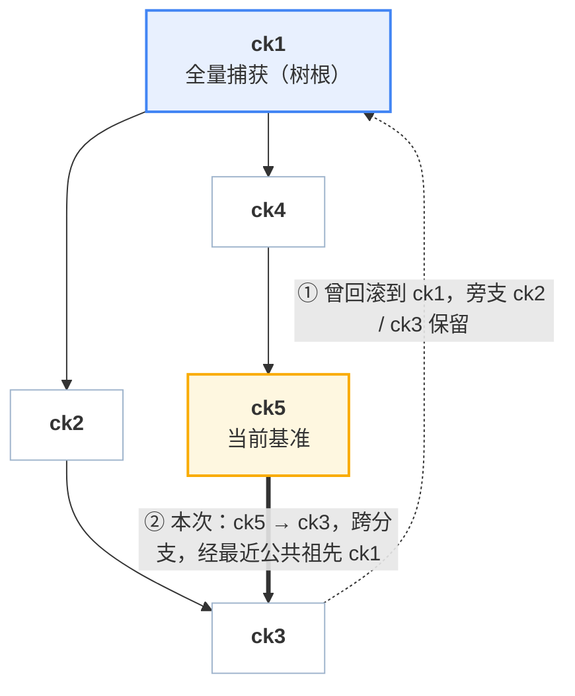

# 06 · 内存差分树

## 本章目标

一个沙箱可能打几十个 checkpoint，每个都要能回去。怎么存这些内存状态，才能让**打快照的代价只和本次改动量有关、回滚的代价只和回退跨度有关**？
本章是这个问题的完整答案，也是全书技术密度最高的一章。读完本章，你应当能够：

- 比较存 n 代内存状态的三种存法，说清为什么在 ext4 上选"每代只存差分"；说出一代内存产物由什么组成，以及"纪元位图 `E_x` 恰好覆盖 `(parent(x), x]`"这条不变量由谁维持；
- 解释历史为什么是树而不是链，写出回滚集的定义并给出正确性证明，说明活跃脏页为什么必须并入；
- 对一个具体的树和位图，手算回滚集、每页的内容来源和合并出的 extent；
- 说清删除时的隐藏、物理删除、级联与**合并**（compact / fold），证明合并不改变任何 restore 的结果，并推出条目数上界 2V + 1；
- 知道打过 checkpoint 的沙箱再做原生 pause 时，本章的位图为什么还要替原生路径记一笔账（细节在第四部分）。

上一章（[05](05-dirty-page-tracking-and-hdbss.md)）讲了脏页位图从哪来、为什么精确。本章用它组织 n 代内存状态。
磁盘那一半在下一章（[07](07-disk-layering.md)），它的层合并与本章的内存合并成对出现。

代码主要在 `packages/orchestrator/internal/checkpoint/`（`store.go`、`bitmap.go`、`compact.go`）。

---

## 1. 问题：怎么存 n 代内存状态

一个沙箱有 2 GiB guest 内存。它打了 20 个 checkpoint，每次之间实际改动 40 MiB 左右。现在要能回到其中任意一代。三种存法：

| 存法 | 单次创建成本 | 恢复成本 | 20 代存储 | 依赖 |
|---|---|---|---|---|
| **每代全量** | O(内存)，每次 2 GiB 写 | O(内存) | 40 GiB | 无 |
| **每代自足**（克隆上一代 + 覆盖本代脏页） | O(元数据)，**前提是文件系统支持 reflink** | O(回滚集) | 约 2 GiB + 20 × 40 MiB | `FICLONE` |
| **每代只存差分** | O(本代脏页)，每次 40 MiB 写 | O(回滚集) | 约 2 GiB + 20 × 40 MiB | 无 |

第一种显然不行。第二种和第三种在支持 reflink 的文件系统（XFS、Btrfs）上几乎等价：克隆 2 GiB 镜像是一次元数据操作，
之后只有本代脏页真正落盘，产物是一份完整镜像，恢复时直接用。

问题出在 **ext4 上第二种不成立**。ext4 不支持 reflink，克隆只能退回真实字节拷贝，于是：

> **即使这一代之内什么都没做，也要付一次全内存拷贝。** 成本与改动量彻底脱钩 —— 这正是整套设计要避免的事。

交付环境的产物盘是 ext4（[03](03-goals-and-design-choices.md) 硬约束 2），所以整条数据路径不得依赖 reflink，
交付的是第三种：**差分 + 按页解析**（为什么交付用 ext4 见 [04](04-architecture.md#8-为什么交付用-ext4)）。

这不是"差分比克隆更好"。在 XFS 上克隆是更简单的设计：产物自足、恢复路径短、不需要 [08](08-firecracker-api-contract.md) 里那个导出活跃脏图的端点。
这是**在没有 reflink 的文件系统上，克隆这个方案不成立**。

---

## 2. 一代产物：稀疏差分 + 位图侧车

### 2.1 稀疏文件

Firecracker 以 Diff 模式写快照时，把每一个脏页写在它自己的 **guest 物理偏移**上，中间的干净页不写。
文件系统对没写过的区间不分配物理块 —— 这就是**稀疏文件**（sparse file）。

```
文件逻辑大小：等于 guest 内存
物理占用    ：约等于脏页总量
                                       ← 逻辑偏移 = guest 物理地址
 ┌────┬──────────────┬────┬────┬────────────────┬────┐
 │page│    空洞      │page│page│      空洞      │page│
 │ 3  │  (未分配)    │ 17 │ 18 │   (未分配)     │ 99 │
 └────┴──────────────┴────┴────┴────────────────┴────┘
```

读空洞返回零，`SEEK_DATA` / `SEEK_HOLE` 可以枚举出真正有数据的区间。所以"文件逻辑上是完整的 guest 内存"和
"物理上只占改动量"这两件事同时成立。这一点在恢复端很重要：Firecracker 的回滚端点会校验内存文件长度等于 guest 内存大小，
稀疏文件天然满足，不需要额外的元数据来描述"这个文件其实只有一部分"。

### 2.2 纪元与它的位图

**纪元**（epoch）是两次"脏页跟踪被重置"之间的时间段。Firecracker 在两个时刻重置脏页跟踪：

- 写完一个快照时（`dump_dirty` 成功后调用 `reset_dirty`，[05](05-dirty-page-tracking-and-hdbss.md) §3.3）；
- 完成一次回滚时（阶段 9，[09](09-in-place-rollback.md)）。

因此，随 checkpoint `x` 一起落地的位图 `E_x` **恰好**是这样一个集合：

> `E_x` = 从 `parent(x)` 所在时刻到 `x` 所在时刻之间，guest 写过的页。

**这条不变量是后面所有推导的地基。** 它由两侧共同维持：Firecracker 侧"写快照与回滚都重置跟踪"，
以及账本侧"新 checkpoint 的 `ParentID` 取当时的基准"。**改动任何一侧都必须重新检查它。**

位图与快照在**同一次 Firecracker 调用**内落地（`CreateSnapshotParams.dirty_bitmap_path`），省掉 orchestrator 再发一轮
"取脏页位图"的往返，也保证了位图与差分文件描述的是同一件事。格式 FCDB 见 [08](08-firecracker-api-contract.md)。
**全量快照也写位图**，内容全 1，这在 §4.4 和 §6 有用。

### 2.3 一代产物的清单

一代产物是 `snapfile`（vCPU、GIC、设备状态，[09](09-in-place-rollback.md) 用）、`mem_diff`（稀疏差分）、`mem_bitmap`（`E_x`，FCDB 格式）、
`rootfs.header`（磁盘视图，[07](07-disk-layering.md)）和 `manifest.json`（条目记录）；目录布局见 [04](04-architecture.md#5-数据面目录布局)。

创建成本 **O(本代脏页)**：与虚机规格无关，与历史长度无关，与文件系统无关。

---

## 3. 树，而不是链

### 3.1 线性链在回滚之后就不够用了

假设历史是一条链 `ck1 → ck2 → ck3`，现在回滚到 `ck1`。`ck2`、`ck3` 怎么办？

- **删掉**：那就没法"回滚之后发现走错了，再前滚回去"。对 Agent 场景这是常用操作 —— 回退一步、换个做法、发现原来那条路其实是对的。
- **留着**：那历史就不是链了。下一个 checkpoint 的父亲是 `ck1`，`ck2` / `ck3` 挂在 `ck1` 的另一侧。

所以历史**天然是树**。这不是为了炫技加的功能，是"回滚不删除历史"这条产品要求的直接结论。

### 3.2 树是怎么长出来的

每个条目记一个 `ParentID`。规则只有两条：

1. 打一个新 checkpoint，`ParentID` = **当前基准**；
2. 回滚到 `t` 成功后，**当前基准 ← t**。

于是：连续打点长出一条链；回滚一次，下一个点从回滚目标分叉。



由此支持三种线性链做不到的操作：

| 操作 | 说明 |
|---|---|
| 回滚后**前滚** | 回到 ck1 之后，仍可恢复到 ck2 / ck3 |
| **跨分支**跳转 | 从 ck5 直接到 ck3，经最近公共祖先 |
| 删除中间节点**不打断后代** | 被后代依赖的节点转为隐藏保留（§10） |

### 3.3 条目结构

条目结构（`Entry`，`store.go:342`）的要点：

| 字段 | 含义 |
|---|---|
| `State` | `prepared` / `committed`，只有 committed 可见、可恢复 |
| `ParentID` | `""` 表示树根 |
| `Hidden` | 在树里、不在 API 里（§10） |
| `MemDiff`、`MemBitmap` | 本代差分文件与 `E_x` 的路径 |
| `MemMode` | `full` / `incremental` |
| `ListedMemMode` | 合并改了模式时，`List` 仍报拍摄时的模式（§10.2） |
| `Rootfs` | 本条目的磁盘视图；`layer` 是本条目封存的层（[07](07-disk-layering.md)） |

`bases[sandbox]` 记当前基准（下一代的父亲）和"链已断"标志（[12](12-failure-semantics.md)）。这两样都是**每沙箱的运行时状态，不属于任何一代**。

---

## 4. 回滚集

### 4.1 问题

虚机现在的内存 = **基准 `b` 时刻的内容** + **自 `b` 以来写过的页**（活跃脏页集 `L`）。要把它变成**目标 `t` 时刻的内容**，必须写回哪些页？

写回全部内存当然对，但那就退回到"成本与虚机规格挂钩"。我们要一个**尽量小、但保证覆盖**的集合。

### 4.2 定义与正确性

设 `A = LCA(b, t)`（树上的最近公共祖先），`P` 是从 `b` 和 `t` 各自走到 `A` 的两段路径（**不含 `A`**），则

```
revert = ⋃ E_x (x ∈ P)  ∪  L
```

用文字说：**从基准爬到最近公共祖先、再从最近公共祖先爬到目标，沿途每一代的纪元位图求并，再并上当前的活跃脏页。**

> **命题.** 对任意页 `p ∉ revert`，虚机当前 `p` 的内容 == `t` 时刻 `p` 的内容。

**证明.** 分三段：

1. `p ∉ L` ⇒ 自 `b` 时刻起 `p` 没被写过 ⇒ **当前内容 = `b` 时刻内容**。
2. `p ∉ ⋃ E_x (x ∈ path(b→A))` ⇒ 从 `A` 到 `b` 的每一代纪元都没写过 `p` ⇒ **`b` 时刻内容 = `A` 时刻内容**。
3. 同理 `p ∉ ⋃ E_x (x ∈ path(t→A))` ⇒ **`t` 时刻内容 = `A` 时刻内容**。

三段串起来：当前内容 = `b` = `A` = `t`。∎

第 2、3 步用的正是 §2.2 的不变量：`E_x` 恰好覆盖 `(parent(x), x]`。位图漏记一页，命题就不成立，回滚就会漏一页 ——
这也是为什么脏页跟踪的**精确性**（[05](05-dirty-page-tracking-and-hdbss.md)）是正确性问题，不只是性能问题。

两段路径缺一不可。假如只取 `path(b→A)`、不取 `path(t→A)`：页 `p` 在目标那一侧被写过（比如 ck2 写了页 1），而基准那一侧没动过，
那么当前内容等于 `A` 时刻的内容，却不等于 `t` 时刻的内容，而 `p` 不在回滚集里 —— 回滚后页 1 停在 ck1 时刻的旧值。

**这是充分覆盖，不是最小集。** `revert` 里可能包含"两侧都改过、但恰好改成了同一个值"的页，它们会被无谓地回写一次。
求最小集需要逐页比较内容，代价远大于收益。

### 4.3 为什么必须并入活跃脏页

`L` 那一项不是保险起见，是必需的。反例：

> 虚机在 `b` 之后把页 42 从 `X` 改成了 `Y`，还没打新的 checkpoint。
> 页 42 从未出现在任何一代的纪元位图里（它属于**还没结束的**那个纪元）。
> 不并入 `L`，回滚后页 42 仍是 `Y` —— guest 内存里混进了一页来自被丢弃时间线的数据。

这种损坏是**静默的**：虚机照常运行，只是某一页的内容属于另一个时刻，可能几分钟后才以莫名其妙的方式暴露，也可能永远不暴露、只是算错一个结果。

`L` 由分叉 Firecracker 的 `PUT /snapshot/save-dirty-bitmap` 导出，而且必须在**虚机暂停之后**导出：暂停后活跃脏页集不再增长，
导出的才是完整的 `L`（[08](08-firecracker-api-contract.md)）。

### 4.4 最近公共祖先怎么求，以及哨兵

不需要通用的 LCA 算法（`revertPathLocked`，`store.go:1357`）。目标的祖先链本来就要算（§6 要用），把它做成集合，
然后从基准往上爬，第一个落在集合里的就是 LCA：

```go
inTargetChain := map[string]bool{"": true}      // 哨兵：树根之上
for _, e := range targetChain { inTargetChain[e.ID] = true }

path := []*Entry{}
lca := baseID
for !inTargetChain[lca] {                       // 从基准往上爬
    e := entries[lca]
    path = append(path, e)
    lca = e.ParentID
}
for _, e := range targetChain {                 // 再从目标往下走到 LCA
    if e.ID == lca { break }
    path = append(path, e)
}
```

树深最多几十，链表遍历的代价可以忽略。

**哨兵 `""` 值得单独说明。** 它让两种情形自然得到正确答案：

- **还没有任何 checkpoint**（`baseID == ""`）：整条目标链都进 `path`；
- **基准与目标不在同一棵树上**：断链之后新的全量根会开一棵新树（[12](12-failure-semantics.md)），跟踪关着时每个 checkpoint 都是一棵树的根。
  从基准往上爬会一路爬到 `""`，于是 `lca = ""`，第二个循环把**整条目标链**加进 `path` —— 其中包含目标那棵树的全量根。

**全量根的回滚因子恒为全 1。** 全量条目永远是树根（checkpoint 决定全量时把 `parentID` 置空，`service.go:591-595`），只在跨树回滚时进入路径。
此时它的因子必须覆盖"它的时刻与启动内存源之间所有可能不同的页"，**包括之前丢失的纪元里写过的页** —— 那些页不在任何侧车里，只有全 1 能带进来。
`entryBitmap`（`store.go:1424-1427`）对 `MemModeFull` 直接返回全 1、不读侧车；只有增量条目读侧车，没有侧车就报错。
Firecracker 对 Full 快照本来就写全 1 侧车（`firecracker/src/vmm/src/vstate/vm.rs:519-530`），所以这条是零代价的加固：
它让跨树回滚不再依赖 writer 的这个约定。守它的测试是 `full_root_revert_test.go:190` `TestCrossTreeRevertAfterLostEpoch`
与 Firecracker 侧 `vm.rs:731` `test_full_snapshot_sidecar_is_all_ones`。

> 跨树意味着两个时刻之间的差异无法用纪元位图界定，唯一安全的答案就是全部回写。代码没有为这种情形写专门的分支，
> 是哨兵加全 1 因子让它自动正确 —— 这类"不用特判也对"的设计，在重构时最容易被破坏。

### 4.5 一个完整的例子

沿用 §3.2 的树。设 guest 有 16 页，各代的纪元位图：

| 条目 | 父 | `E_x` |
|---|---|---|
| ck1 | — | 全 1（全量根） |
| ck2 | ck1 | {1, 5, 9} |
| ck3 | ck2 | {5, 7} |
| ck4 | ck1 | {2, 5} |
| ck5 | ck4 | {9, 11} |

当前基准 `b = ck5`，活跃脏页 `L = {3}`，目标 `t = ck3`。

**第一步，求路径**：目标链 = `[ck3, ck2, ck1]`。从 ck5 上爬：ck5 → ck4 → ck1 ∈ 目标链，所以 `A = ck1`，`path(b→A) = [ck5, ck4]`；
再从目标链走到 ck1：`path(t→A) = [ck3, ck2]`。**ck1 本身不在路径里** —— 它的全 1 位图不会被读到。

**第二步，求并**：

```
revert = {9,11} ∪ {2,5} ∪ {5,7} ∪ {1,5,9} ∪ {3}
       = {1, 2, 3, 5, 7, 9, 11}
```

16 页里只有 7 页需要回写。页 4、6、8 等虽然可能在更早的历史里被写过，但它们在分叉之后两侧都没动，所以两个时刻的内容一致，无需回写。

**第三步，逐页解析内容**（沿目标链 `[ck3, ck2, ck1]` 找第一个含该页的内容位图，§6）：

| 页 | ck3 {5,7} | ck2 {1,5,9} | ck1 全 1 | 取自 |
|---|---|---|---|---|
| 1 | ✗ | ✓ | — | `ck2/mem_diff` |
| 2 | ✗ | ✗ | ✓ | `ck1/mem_diff` |
| 3 | ✗ | ✗ | ✓ | `ck1/mem_diff` |
| 5 | ✓ | — | — | `ck3/mem_diff` |
| 7 | ✓ | — | — | `ck3/mem_diff` |
| 9 | ✗ | ✓ | — | `ck2/mem_diff` |
| 11 | ✗ | ✗ | ✓ | `ck1/mem_diff` |

页 3 值得注意：它之所以进回滚集，是因为**现在**脏（`L`），但它的 ck3 时刻内容要一路回溯到全量根才找得到。
**"为什么要回写"和"内容从哪来"是两个独立的问题**，用的是两组不同的位图。

**第四步，合并 extent**：按页号升序扫描，把"连续且同源"的页合成一次读写：

| extent | 页 | 来源 |
|---|---|---|
| 1 | 1 | ck2 |
| 2 | 2–3 | ck1 |
| 3 | 5 | ck3 |
| 4 | 7 | ck3 |
| 5 | 9 | ck2 |
| 6 | 11 | ck1 |

页 5 和 7 同源但不连续（页 6 不在回滚集里），所以是两个 extent。单个 extent 最多 1024 页（`revertExtentPages`，`store.go:1613`），
避免一次巨大的回滚要一个巨大的缓冲区。

这个场景的骨架由单元测试守着：`bitmap_test.go:156` `TestMaterializeRevertTreePath` 断言"最近公共祖先不参与回滚集"，
:200 `TestMaterializeRevertResolvesThroughAncestors` 断言"因新纪元而回滚、内容却来自老祖先"这条路径。

### 4.6 缺侧车即报错

路径或目标链上任何一代读不出合法位图，`MaterializeRevert` **直接返回错误**，回滚不发生，沙箱保持原状态。
不静默降级成全量回滚，理由是：读不出位图说明账本与产物已经不一致，这种情况下"全量回滚"也未必对（内容解析同样要靠位图）。
报错让问题在第一现场暴露。

位图读出来还要做**几何校验**：`page_size` 与 `num_pages` 必须与运行中的虚机对上。对不上说明产物属于另一个虚机或另一次运行，同样报错。

---

## 5. 物化：交给 Firecracker 的两个文件

orchestrator 算出回滚集之后，在目标 checkpoint 目录下写两个临时文件（`MaterializeRevert`，`store.go:1515`）：

| 文件 | 内容 |
|---|---|
| `revert_bitmap.tmp` | 回滚集本身，FCDB 格式 |
| `revert_mem.tmp` | 稀疏文件，逻辑大小 = guest 内存；回滚集中每一页的**目标时刻内容**，写在各自偏移上 |

然后调用 `PUT /snapshot/rollback` 把两个路径递过去，回滚结束后无论成败都删掉它们。

### 5.1 一条必须遵守的契约

Firecracker 在回滚时会**把自己的活跃脏页并进写回集**，然后按页从 `revert_mem` 读内容。也就是说：Firecracker 写回的页集合 ⊇ orchestrator 给的位图。
如果某一页 Firecracker 要写、而 orchestrator 没有物化，它就会从文件空洞读到零页。

`revert` 的定义里并入了 `L`，而 `L` 正是 Firecracker 自己会并进来的那个集合，所以两边相等，契约成立。
**这就是 `save-dirty-bitmap` 端点存在的理由**：orchestrator 必须**事先**知道 Firecracker 会写哪些页，才能把它们的内容物化好。

Firecracker 另有一道防线：提交点之前用 `SEEK_DATA` / `SEEK_HOLE` 检查内存文件在回滚集的每个偏移上都有数据，没有就以可恢复错误拒绝
（`firecracker/src/vmm/src/rollback.rs:858` `validate_mem_file_coverage`；文件系统不支持时跳过并告警）。
所以漏物化的后果是 restore 被拒，而不是页被清零。

### 5.2 短读是错误

按构造，差分文件在它侧车声明的页上一定有数据。如果读的时候文件提前结束（短读），说明文件与自己的位图矛盾。
`writeRevertMem`（`store.go:1715-1730`）直接拒绝这次 restore，而不是把缓冲区剩下的部分清零继续：清零意味着把一页零写进 guest 内存而不告诉任何人，
guest 醒来后在别处莫名其妙地失败。拒绝只损失这一次 restore —— 物化仍在回滚的提交点之前，虚机虽然暂停着但没被动过，调用方拿回的是一台照常运行的沙箱。

文件内部的空洞不算短读：写成全零的页是合法页，读出来是零、读取长度也是满的。只有从启动内存源读、窗口被夹在 guest 内存末尾时才允许短读，
并把复用缓冲的尾部清零。

---

## 6. 内容解析：这一页的目标时刻内容在哪

### 6.1 规则

对回滚集中的每一页 `p`，沿目标的祖先链 `t → parent(t) → …` 找**第一个**"文件里含有 `p`"的条目，从它的 `mem_diff` 的偏移
`p × page_size` 处读一页。

"文件里含有"用的是**内容位图**（`entryContentBitmap`，`store.go:1402`），与纪元位图（`entryBitmap`，:1419）的区别只在全量条目：

| 条目类型 | 纪元位图（算回滚集用） | 内容位图（解析内容用） |
|---|---|---|
| 增量条目 | 侧车 | 侧车 |
| 全量条目 | **全 1** | **全 1** |

对全量条目两者都不读侧车：它的文件里确实每一页都在，内容位图全 1；它作为回滚因子时要覆盖所有可能不同的页，纪元位图也是全 1（§4.4）。

### 6.2 为什么必然终止

树根要么是全量捕获（`CHECKPOINT_FULL_ROOT` 开，默认），要么是相对"沙箱启动内存源"的差分：

- **全量根**：内容位图全 1，解析必在树内终止，只读本地文件；
- **差分根**（把开关关掉）：解析可能穿过根，落到沙箱的启动内存源 —— 也就是模板 memfile。

### 6.3 全量根为什么是默认

模板 memfile **在宿主本地并不存在**，它由 chunker 从对象存储按需拉取（[01](01-background.md) §5.3）。差分根意味着
**回滚路径上藏着一段跨网络依赖**：一次本该是几十毫秒的本地回滚，可能变成一次对象存储往返，而且是在虚机暂停期间。

改成全量根后，整棵树自给自足。代价只落在每个沙箱的**第一次** checkpoint：

| | 第 1 次 | 第 2..n 次 |
|---|---|---|
| 写入量 | 全内存 | 本代脏页 |
| 存储 | 全内存 | 本代脏页 |
| 量级示例：客户端墙钟 | 0.283 s | 0.113 s（p50） |

量级示例一行出自开发早期在 950 上跑的一轮 `checkpoint_verify.py`（2026-08-29，HDBSS 硬件标脏，ext4 真盘，2 GB 模板，当时的开发版本，restore 10 次）。它只用来说明"第一次比之后贵几倍"，不是当前代码的判定数字：当前代码在 920B 上的全量与增量见 [21](21-benchmarks-and-compliance.md#全量为什么单列)，950 上的当前数据待补。

这也是 [03](03-goals-and-design-choices.md) 所说"唯一保留的固定开销"。什么时候值得关掉 `CHECKPOINT_FULL_ROOT`：沙箱多、每个只打两三个点、存储紧张、
且对象存储就在同机房 —— 此时第一次 checkpoint 的固定开销比偶尔一次跨网络读更值得省。这是部署决策，不是代码决策（[27](27-configuration-and-capacity.md)）。

全量根还有一个副作用：**内存差分树在数据上是自包含的**。[14](14-lifecycle-reasoning.md) 讨论"能不能把 checkpoint 搬走"时会用到这一点 ——
内存那一半已经不缺什么了，缺的是磁盘和运行时环境。

### 6.4 对齐读

差分根的情形下要读模板 memfile，而它由 chunker 提供，`ReadAt` 只接受**块对齐**的偏移和长度。页（4 KiB）小于块，
所以要读的窗口先向外对齐到块边界，逐块读进临时缓冲，再切出需要的那一段；窗口末端用 guest 内存大小夹一下，避免越过设备末尾
（`readAlignedFromBase`，`store.go:1619`）。这段代码只在 `CHECKPOINT_FULL_ROOT=false` 时才会走到。

---

## 7. 成本模型

| 操作 | 复杂度 | 与什么无关 |
|---|---|---|
| 创建（增量） | O(本代脏页) | 虚机规格、历史长度、文件系统 |
| 创建（全量根） | O(内存) | 每沙箱只发生一次 |
| 回滚集计算 | O(路径长度 × 位图字数)，全在内存里做位运算 | —— |
| 内容解析 | 按 64 页一个字做位运算 + O(extent 数) 次 I/O | 链深（见 §7.1） |
| 物化写出 / Firecracker 写回 | O(回滚集) | 虚机规格、历史长度 |
| 存储 | O(Σ 各代脏页) + 一份全量 | —— |

### 7.1 恢复为什么不随链深变慢

直觉上"沿祖先链逐页解析"是最可能被长链拖垮的地方。实际上：

- 内容解析按字进行（`forEachRevertRun`，`store.go:1765`）：回滚集通常只占内存的几个百分点，绝大多数 64 位字为零，一次比较就跳过；
  每个非零字对链上各代做一次 AND，全部页找到归属即离开链。所有位图在解析开始前就已加载进内存，链深只增加这些位运算；
- 真正的文件 I/O 只发生在**命中的那一代**、按 extent 进行，与链深无关；
- 创建侧不做克隆，也与链深无关。

所以**恢复成本与链深无关**，不需要为了恢复速度周期性压平历史或做全量重整。这是差分树相对"链式增量快照"（每次恢复要重放整条链）
的结构性优势：它是**按页寻址**的，不是**按代重放**的。怎样把"链深"与"回滚集大小"这两个绑在一起的变量拆开来测，见 [20 §4.4](20-performance-methodology.md#44-把两个绑在一起的变量拆开)；本期代码上这项对照还没有重跑（[21 §7](21-benchmarks-and-compliance.md#7-已知项与缺口)），长跑各轮的链深与耗时见 [22 §3](22-long-run-and-concurrency.md#3-轮次总表)。

---

## 8. 全量与增量怎么选

每次 checkpoint 都要先决定本次写全量还是增量（`service.go:577-595`）。判据三条，任一成立就走全量：

| 条件 | 为什么 |
|---|---|
| 脏页跟踪没开 | 没有位图，无法产生合法的增量条目 |
| 链已断 | 上一个纪元丢了，任何增量都无法解释那段时间的改动（[12](12-failure-semantics.md)） |
| 沙箱的第一个 checkpoint，且 `CHECKPOINT_FULL_ROOT` 开 | 树根要自足（§6.3） |

结果通过 `memMode` 回报给调用方。这个字段的用途很具体：

> **在第一个 checkpoint 之后仍然出现 `full`，说明这台宿主没有在跟踪脏页。**
> 它照常成功，只是每次多拷一整份内存。没有这个字段，这种退化只会表现为"有点慢"，藏在延迟均值里，可能很久都没人发现。

---

## 9. checkpoint 之后再做原生 pause 的正确性前提

原生 pause 导出的内存差分是**相对模板 memfile** 的，必须包含 guest **自启动以来**写过的每一页；而 Firecracker 的写跟踪位图在每次 checkpoint（`dump_dirty` 后 `reset_dirty`）和每次 restore（阶段 9）都会清零，restore 写回回滚集走的又是 KVM 不记日志的映射。只看位图的话，打过 checkpoint 的沙箱做原生 pause 时会少导页，而 pause 本身报成功。
所以 orchestrator 为每台虚机维护一个**自启动以来脏页集**：在每次清零之前，把即将被忘掉的位图并进去 —— 用的正是本章的纪元位图（增量 checkpoint 的侧车）、restore 前导出的活跃脏图和物化出的回滚集位图；原生 pause 时再把集合并回写跟踪位图。任何一份并不进去，整个集合就标为不可信、退回按驻留页导出 —— 导多了只费时间，导少了毁掉沙箱。这个集合服务的是原生 pause 路径：何时并入什么、不可信时怎么退、代价与验证，见第四部分的 [16 §4](16-native-increment-fix.md#4-与-checkpoint-叠加累积位图)；内存与磁盘两半合起来的完整前提见 [18 §7](18-native-and-checkpoint-together.md#7-checkpoint-之后做原生-pause-的正确性前提)。

反方向不成立：原生 pause / resume 之后是新一代沙箱（新的 LifecycleID），之前的 checkpoint 全部失效。用户视角的说法见 [24](24-semantics-and-limits.md)。

---

## 10. 删除、隐藏与合并

### 10.1 三种处理

`ck2` 有个后代 `ck3`，`ck3` 的很多页要靠 `ck2` 的差分文件解析内容（§6）。直接删掉 `ck2` 的文件，`ck3` 就变成了一个看起来正常、
恢复时却会读到错误内容的条目。所以删除必须**依赖感知**。`Delete`（`store.go:2014`）的账本部分 `deleteLocked`（:2043）按条目的处境处理：

| 情形 | 处理 |
|---|---|
| **隐藏**：有子节点，或它是当前基准 | 标 `Hidden`，`List` / `Get` 不再返回；删 `snapfile` 与 `rootfs.header`（只有恢复才用得着，而隐藏条目不可能成为恢复目标），放掉视图对层的引用；保留 `mem_diff` 与 `mem_bitmap`（后代要靠它们）；若成为合并候选则入队（:2071-2107） |
| **物理删除**：无子节点且非基准 | 摘出条目，放掉视图引用，然后从父节点开始**级联**（:2109-2125） |
| **级联**（`pruneLocked`，:1293） | 沿父指针向上，逐个删除"隐藏、无子、非基准"的祖先，直到不成立；停下的那个若是候选则入队 |

基准移动也触发级联：一个只因"身为基准"才被保留的隐藏条目，基准一挪走（commit、restore、断链）就进入 `pruneLocked`（`setBaseLocked`，:1267）。
"有没有子节点"查的是子节点计数表（`children`，:488；`hasChildLocked`，:1907），O(1)。账本在全局锁下改，目录删除在放锁后
（`reclaim`，[13](13-state-concurrency-durability.md)）。**隐藏条目仍完整参与内容解析与回滚集计算** —— 它在树里，只是不在 API 里。

### 10.2 合并（compact）

只靠隐藏和级联，有一种最常见的用法会出问题："保留最新 N 个、删最旧"。每次删的都是最旧的那个，而它总是下一个的父节点 ——
有子节点，只能隐藏；它永远不会变成"无子"的叶子，级联也就永远删不到它。隐藏条目于是无界积累，磁盘跟着涨，restore 的解析链越来越长；
个数上限只数可见条目，拦不住它。合并解决这个问题。

**条件**（`compactCandidateLocked`，`compact.go:232`）：候选 H **隐藏、已提交、不是基准、恰有一个子节点** C。

**做法**：把 H 并入 C，C 接管 H 的父节点，H 离开树：

- 回滚因子取并集：`rev(C') = rev(H) ∪ rev(C)`；
- 内容以 C 为准：`cont(C') = cont(H) ∪ cont(C)`，两者都有的页取 C 的；
- H 是全量（必为树根）时 C' 成为全量根（`foldMemory`，`compact.go:699-702`），`ListedMemMode` 保留 C 被拍时的模式；
- 数据往少的一边拷：`H 有而 C 没有`的页不多于 C 的页时，把这些页填进 C 差分的空洞；否则把 C 的页覆盖到 H 的差分上，
  再以新名字 `mem_diff.<H-id>` 硬链接进 C 的目录；并集侧车写成 `mem_bitmap.<H-id>`（:739-801）；
- rootfs 层在条件满足时**成对合并**（C 封存的层与紧挨在下面那层），条件与证明见 [07](07-disk-layering.md#10-层合并)。

用上面的例子说：假如用户删掉了 ck2（它有唯一的子 ck3），ck2 被隐藏、入队；合并把 ck2 并进 ck3，新的 ck3' 以 ck1 为父，
`rev(ck3') = {1,5,9} ∪ {5,7} = {1,5,7,9}`，内容上页 5、7 取原 ck3 的，页 1、9 取原 ck2 的。§4.5 那次 restore 算出的回滚集与每页来源都不变。

**顺序与失败**：拷页、写新名字的侧车、层合并都在全局锁外、沙箱 gate 内进行，只写没人读的字节或还没人引用的新名字；最后在锁内一次切换
（`switchFoldLocked`，:549）：先核对树没变，再改 C 的父节点与文件名、删 H、旧文件进 reclaim。切换前任何一步失败都删掉新名字，树原样不动；
候选之后的 delete 重试，失败满 3 次（`compactMaxAttempts`，:133）就放弃，行为等同没有合并。用新名字而不是覆盖改名，是为了避免切换失败后
H 与 C 共享一个 inode。

**何时运行**：没有后台任务。合并在 `Delete` 末尾同步执行（`store.go:2039` → `runCompaction`，`compact.go:425`），每次最多
`CHECKPOINT_COMPACT_MAX_PER_OP`（默认 8，:127）个，剩下的等下一次 delete。候选在"隐藏、级联停下的节点、基准移动"三处入队（`queueCompactLocked`，:208）。
合并从不让触发它的 delete 失败。delete 因此多了合并的耗时，这是已知项（数字见 [22 §4.10](22-long-run-and-concurrency.md#410-删除同步合并delete-变慢)）。

### 10.3 为什么合并不改变任何 restore

记 `chain(X)` 为 X 及其祖先（新到旧），一次 restore 由基准 B 与目标 T 决定：LCA `A` 是 `chain(B)` 上第一个落在 `chain(T) ∪ {""}` 里的节点；
路径 `P` 是 `chain(B)` 与 `chain(T)` 在 `A` 之前的部分；`R = L ∪ ⋃_{x∈P} rev(x)`；页 `p` 的内容取自 `chain(T)` 上第一个满足 `p ∈ cont(x)` 的 x。
合并前提保证 **T ≠ H**（隐藏条目不能被 `Get` 取到，不能当目标）且 **B ≠ H**（H 不是基准）；合并期间持有沙箱 gate，没有 restore 并发。

**引理 1（相邻）。** 对任意 X ≠ H：`H ∈ chain(X)` ⇔ `C ∈ chain(X)`，且 C 紧挨在 H 之前。
*证*：H ∈ chain(X) 且 X ≠ H，则 chain(X) 中 H 的前一个节点以 H 为父，即 H 的子节点，只能是 C；反之 C ∈ chain(X) 则其父 H 紧随其后。

**引理 2。** `A ≠ H`。*证*：若 A = H，则 H ∈ chain(B) 且 B ≠ H，由引理 1 C 在 chain(B) 中紧挨 H 之前；又 H ∈ chain(T)、T ≠ H，
故 C ∈ chain(T)。于是 C 同时在两条链上且在 chain(B) 中先于 H，从 B 上爬应在 C 处（或更早）停下，与 A = H 矛盾。

**引理 3。** `H ∈ P` ⇔ `C ∈ P`。*证*：P 的每一段都是某条链在 A 之前的前缀。若 H 在某段中，C 在同一条链上紧挨 H 之前，也在该段中。
若 C 在某段中，则 A 在该链上位于 C 之后；A ≠ H（引理 2），所以 A 还在 H 之后，H 也在该段中。跨树时 `A = ""`，两段就是两条整链，由引理 1 直接成立。

**回滚集不变。** 合并等于把树上 C–H 这条边收缩成一个节点 C'：每条链把相邻的 (C, H) 换成 C'，其余节点与位图不变；若原 A = C 则新 A = C'，
否则 A 不变。由引理 3，P 要么同时含 C、H（换成 C'），要么都不含。`rev(C') = rev(C) ∪ rev(H)`，并集不变；`L` 来自 Firecracker，
合并不碰它。所以每个可能的 restore 的 `R` 逐位相同。

**内容不变。** 在 `chain(T)` 上，C' 之前的节点不变。到 C'：`p ∈ cont(C)` 时原来由 C 提供，现在 C' 提供 C 的那份；`p ∉ cont(C)`、`p ∈ cont(H)`
时原来由 H 提供，现在 C' 在同一偏移上持有 H 的那份；两者都不含时照旧落到 H 的父节点。不经过 H 的链完全不变。
H 为全量时 `cont(H)` 全 1，C' 标为全量并持有每一页，`rev(C')` 也是全 1，与 `rev(H) ∪ rev(C)` 相等。C 本身不可能是全量：全量条目总是树根，而 C 有父节点 H。

**不变量延续。** `rev(C') = E_H ∪ E_C` 覆盖 `(parent(H), H] ∪ (H, C] = (parent(C'), C']`，§2.2 的不变量对 C' 仍成立，此后的回滚集证明（§4.2）照样适用。

**切换前的文件改动对读者不可见。** 往 C 的差分里补页，写的是 C 的内容位图不含的偏移；解析只在 `cont(x)` 声明的偏移上读差分，这些字节没人读。
把 C 的页覆盖到 H 的差分上，写的是 `cont(C)` 的偏移；由引理 1，任何到达 H 的链都先经过 C，这些页已由 C 回答，H 在这些偏移上从不被读。
新名字的文件在切换前无人引用。所以切换前失败，树与每个 restore 的结果都与合并前完全相同。

这个结论由属性测试 `TestFoldingChangesNoRestore`（`compact_sim_test.go:868`）守着：开 / 关合并两个 store 跑同一随机序列，
每步对每个可见 checkpoint 比 `MaterializeRevert` 的位图与内存文件逐字节相同。

### 10.4 条目数上界 ≤ 2V + 1

合并追平时，每个非基准的隐藏条目至少有 2 个子节点：无子的会被级联删掉，恰有一个子的会被合并。数森林的边：n 个条目分成 r ≥ 1 棵树，
父子边共 n − r 条。设可见 V 个、非基准隐藏 h₂ 个、隐藏基准 b ≤ 1 个，则 n = V + h₂ + b，且 h₂ 个节点各自至少贡献 2 条出边：

```
V + h₂ + b − r ≥ 2·h₂   ⇒   h₂ ≤ V + b − 1
```

所以隐藏条目数 `h₂ + b ≤ V + 1`，总条目 ≤ **2V + 1**。也就是说，"保留最新 N 个"的滚动用法，树里最多 2N + 1 个条目，占盘随之收敛。

合并没追平时（一次 delete 最多合并 `CHECKPOINT_COMPACT_MAX_PER_OP` 个，checkpoint 与 restore 只入队不合并），每个待处理或已放弃的候选多出 1 个。
测试断言 `hidden ≤ V + 1 + pending`、`entries ≤ 2V + 1 + pending`，并检查每个候选都已入队（`compact_sim_test.go:583-599` `checkFoldBounds` 的注释与实现）。

跟踪关着时每个 checkpoint 都是全量根，没有"隐藏且只有一个子"的条目，也就没有合并；隐藏条目只会是基准。

### 10.5 关掉合并

`CHECKPOINT_COMPACT=false`（按 `strconv.ParseBool` 读，`compact.go:143-159`）时 `queueCompactLocked` 不入队、`runCompaction` 直接返回，
行为回到没有合并时：隐藏条目只在成为"无子、非基准"的叶子时才被级联删除。由 `compact_test.go:509` `TestFoldingOffKeepsTheOldBehaviour` 守着。
给用户看的"怎么删才释放空间"见 [24](24-semantics-and-limits.md)，开关总表见 [27](27-configuration-and-capacity.md)。

---

## 本章要点

1. ext4 没有 reflink，"每代自足"会让每代都付一次全内存拷贝，所以交付的是**差分 + 按页解析**。
2. 每代内存产物是**稀疏差分 + 纪元位图**，创建 O(本代脏页)；地基是"`E_x` 恰好覆盖 `(parent(x), x]`"，由 Firecracker 的重置时机与账本的 `ParentID` 规则共同维持。
3. 历史是**树**，因为"回滚不删除历史"必然导致分叉；回滚集 = **树路径纪元并集 ∪ 活跃脏页**，三步证明，两段路径和活跃脏页都不可少。
4. "为什么回写"和"内容从哪来"是两个问题，用纪元位图和内容位图分别回答；全量条目两者都恒为全 1，加上哨兵，跨树回滚自动退化为全量回写。
5. 物化出的内存文件由 Firecracker 再做一次覆盖检查；差分短读直接拒绝，不补零；缺侧车报错，不降级。
6. 恢复成本与链深无关：解析按字做位运算，I/O 只在命中处。全量根让树自给自足，是唯一保留的固定开销。
7. 做过 checkpoint / restore 的沙箱再原生 pause，要靠"自启动以来脏页集"补回被清掉的位图（本章的纪元位图是它的原料），不可信时退回驻留判据；细节在第四部分。
8. 删除有隐藏、物理删除、级联三种处理；**合并**把"隐藏、非基准、独子"的条目并入其子，回滚集与内容逐位不变，条目数 ≤ 2V + 1；`CHECKPOINT_COMPACT=false` 恢复旧行为。
