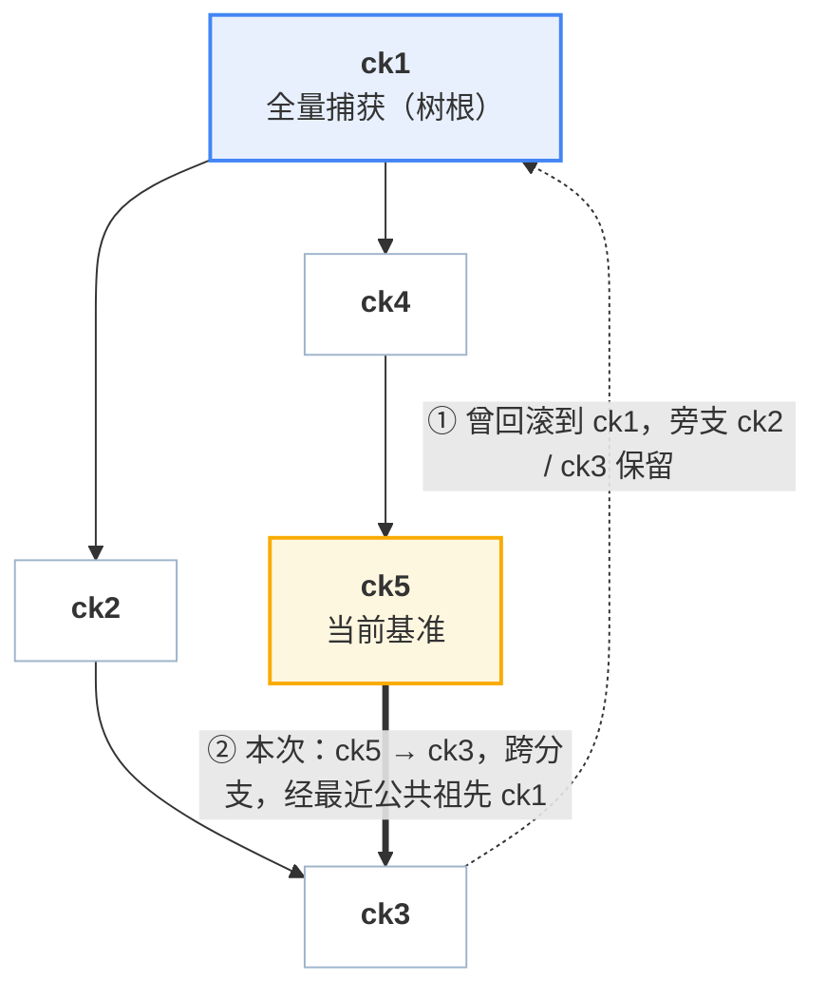

# 08 · 内存差分树

> 一个沙箱可能打几十个 checkpoint，每个都要能回去。怎么存这些内存状态，才能让
> **打快照的代价只和本次改动量有关、回滚的代价只和回退跨度有关**？本篇是这个问题的完整答案。
>
> **读者**：工程师。本篇是全书技术密度最高的一章。
> **预备**：[第 6 篇 · 总体架构](06-architecture.md)、[第 7 篇 · 脏页跟踪](07-dirty-page-tracking.md)。
> 需要知道「脏页位图」是什么、由谁产生。
> **代码**：`packages/orchestrator/internal/checkpoint/store.go`、`bitmap.go`
> **范围**：ext4 方案。XFS 方案的内存产物形态完全不同，见[第 18 篇](18-ext4-vs-xfs.md)。

---

## 0. 本篇要回答的问题

1. 存 n 代内存状态，有哪几种存法？各自的成本模型是什么？
2. 为什么这套方案选了「每代只存本代脏页」，而不是更直观的「每代自包含」？
3. 回滚到某一代时，到底哪些页需要写回？这个集合怎么算出来，凭什么是对的？
4. 一页的「目标时刻内容」在哪个文件里？怎么找？会不会找不到？
5. 历史链变长之后，恢复会不会变慢？

---

## 1. 问题：怎么存 n 代内存状态

一个沙箱有 2 GiB guest 内存。它打了 20 个 checkpoint，每次之间实际改动 40 MiB 左右。
现在要能回到其中任意一代。

有三种存法，成本差别很大：

| 存法 | 单次创建成本 | 恢复成本 | 20 代存储 | 依赖 |
|---|---|---|---|---|
| **每代全量** | O(内存) = 2 GiB 写 | O(内存) | 40 GiB | 无 |
| **每代自包含（克隆 + 覆盖）** | O(元数据) —— **前提是文件系统支持 reflink** | O(内存) 或 O(回滚集) | 物理约 2 GiB + 20×40 MiB | 需要 `FICLONE` |
| **每代只存差分** | O(本代脏页) = 40 MiB 写 | O(回滚集) | 约 2 GiB + 20×40 MiB | 无 |

第一种显然不行。第二种和第三种在 XFS 上几乎等价 —— 这也是为什么本项目最早走的是第二条路。
问题出在**ext4 上第二种不成立**。

### 1.1 reflink 是什么，为什么 ext4 没有

`FICLONE` ioctl 让两个文件共享同一批磁盘 extent，并在任一方写入时才真正分裂（copy-on-write）。
XFS、Btrfs、ZFS 支持；**ext4 不支持**。

在支持的文件系统上，「克隆 2 GiB 内存镜像」是一次元数据操作，毫秒级，物理上不占新空间；
之后 Firecracker 以 Diff 模式往克隆上写 40 MiB 脏页，只有这 40 MiB 真正落盘。
产物是一份完整的 2 GiB 镜像，恢复时直接用。

在 ext4 上，`unix.IoctlFileClone` 返回 `EOPNOTSUPP`，代码退回真实字节拷贝
（`copy_file_range`，保洞）。于是：

> **即使这一代之内什么都没做，也要付一次全内存拷贝。**
> 成本与改动量彻底脱钩 —— 这正是整套设计要避免的事。

950 与客户环境的产物盘全部是 ext4，所以整条数据路径**不得依赖 reflink**。
克隆这一步被取消，代之以「差分 + 按页解析」。

这不是「差分比克隆更好」。在 XFS 上克隆是更简单的设计（产物自足、恢复路径短、不需要
[第 9 篇](09-firecracker-api-contract.md)里那个额外的 API 端点）。这是**在没有 reflink 的文件系统上，
克隆这个方案不成立**。

> 启动时会探测一次 reflink 可用性并打日志。XFS 方案里这个探测是必要的告警 ——
> 没有 reflink 时它仍然正确，只是慢几十倍，而且完全静默。

---

## 2. 一代产物：稀疏差分 + 位图侧车

### 2.1 稀疏文件

Firecracker 以 Diff 模式写快照时，把每一个脏页写在它自己的 **guest 物理偏移**上，
中间的干净页不写。文件系统对没写过的区间不分配物理块 —— 这就是**稀疏文件**（sparse file）。

```
文件逻辑大小：2 GiB（等于 guest 内存）
物理占用    ：约等于脏页总量
                                       ← 逻辑偏移 = guest 物理地址
 ┌────┬──────────────┬────┬────┬────────────────┬────┐
 │page│    空洞      │page│page│      空洞      │page│
 │ 3  │  (未分配)    │ 17 │ 18 │   (未分配)     │ 99 │
 └────┴──────────────┴────┴────┴────────────────┴────┘
```

读空洞返回零，`SEEK_DATA` / `SEEK_HOLE` 可以枚举出真正有数据的区间。
所以「文件逻辑上是完整的 2 GiB」和「物理上只占 40 MiB」这两件事同时成立。

这一点在恢复端很重要：Firecracker 的回滚端点会**校验内存文件长度等于 guest 内存大小**，
稀疏文件天然满足，不需要额外的元数据来描述「这个文件其实只有一部分」。

### 2.2 纪元（epoch）与它的位图

**纪元**是两次「脏页跟踪被重置」之间的时间段。Firecracker 在两个时刻重置脏页跟踪：

- 写完一个快照时（`dump_dirty` 成功后调用 `reset_dirty`）；
- 完成一次回滚时（阶段 9）。

因此，随 checkpoint `x` 一起落地的位图 `E_x` **恰好**是这样一个集合：

> `E_x` = 从 `parent(x)` 所在时刻到 `x` 所在时刻之间，guest 写过的页。

这条不变量是后面所有推导的地基。它由两件事共同维持：Firecracker 侧「写快照与回滚都重置跟踪」，
以及账本侧「新 checkpoint 的 `ParentID` 取当时的基准」。**改动任何一侧都必须重新检查它。**

位图与快照在**同一次 Firecracker 调用**内落地（`CreateSnapshotParams.dirty_bitmap_path`），
省掉 orchestrator 再发一轮「取脏页位图」的往返，也保证了位图与差分文件描述的是同一件事。
格式（FCDB）见[第 9 篇 §4](09-firecracker-api-contract.md)。

> **全量快照也写位图**，内容是全 1。这在[第 6 节](#6-内容解析这一页的目标时刻内容在哪)有用。

### 2.3 一代产物的完整清单

```
<checkpoint-id>/
├── snapfile      # Firecracker vmstate：vCPU、GIC、设备逻辑状态（与本篇无关，见第 11 篇）
├── mem_diff      # 稀疏文件，本代脏页，写在各自的 guest 物理偏移上
├── mem_bitmap    # E_x，FCDB 格式
├── rootfs.header # 磁盘视图（见第 10 篇）
└── manifest.json # 条目记录
```

创建成本：**O(本代脏页)**。与虚机规格无关，与历史长度无关，与文件系统无关。

---

## 3. 树，而不是链

### 3.1 线性链在回滚之后就不够用了

假设历史是一条链 `ck1 → ck2 → ck3`，现在回滚到 `ck1`。`ck2`、`ck3` 怎么办？

- **删掉**：那就没法「回滚之后发现走错了，再前滚回去」。对 Agent 场景这是常用操作 ——
  回退一步、换个做法、发现原来那条路其实是对的。
- **留着**：那历史就不是链了。下一个 checkpoint 的父亲是 `ck1`，`ck2`/`ck3` 挂在 `ck1` 的另一侧。

所以历史**天然是树**。这不是为了炫技加的功能，是「回滚不删除历史」这条产品要求的直接结论。

### 3.2 树是怎么长出来的

每个条目记一个 `ParentID`。规则只有两条：

1. 打一个新 checkpoint，`ParentID` = **当前基准**；
2. 回滚到 `t` 成功后，**当前基准 ← t**。

于是：连续打点长出一条链；回滚一次，下一个点从回滚目标分叉。



由此支持三种线性链做不到的操作：

| 操作 | 说明 |
|---|---|
| 回滚后**前滚** | 回到 ck1 之后，仍可恢复到 ck2 / ck3 |
| **跨分支**跳转 | 从 ck5 直接到 ck3，经最近公共祖先 |
| 删除中间节点**不打断后代** | 被后代依赖的节点转为隐藏保留（[第 9 节](#9-删除与回收)）|

### 3.3 条目结构

```go
type Entry struct {
    ID        string
    SandboxID string
    State     string    // prepared | committed —— 只有 committed 可见、可恢复
    ParentID  string    // "" 表示树根
    Hidden    bool      // 在树里，不在 API 里

    Dir       string
    Snapfile  string
    MemDiff   string
    MemMode   string    // full | incremental
    MemBitmap string    // E_x 的路径

    Rootfs *RootfsView
}
```

`bases[sandboxID]` 记录当前基准（下一代的父亲），并带一个 `invalid` 标志表示链已断
（[第 14 篇](14-failure-semantics.md)）。这两样都是**每沙箱的运行时状态，不属于任何一代 checkpoint**。

---

## 4. 回滚集

### 4.1 问题

虚机现在的内存 = **基准 `b` 时刻的内容** + **自 `b` 以来写过的页**（活跃脏页集 `L`）。
要把它变成 **目标 `t` 时刻的内容**，必须写回哪些页？

写回全部 2 GiB 当然对，但那就退回到「成本与虚机规格挂钩」。我们要一个**尽量小、但保证覆盖**的集合。

### 4.2 定义

设 `A = LCA(b, t)`（树上的最近公共祖先），`P` 是从 `b` 和 `t` 各自走到 `A` 的两段路径
（**不含 `A`**），则：

```
revert = ⋃ E_x  (x ∈ P)  ∪  L
```

用文字说：**从基准爬到最近公共祖先、再从最近公共祖先爬到目标，沿途每一代的纪元位图求并，
再并上当前的活跃脏页。**

### 4.3 正确性

> **命题.** 对任意页 `p ∉ revert`，虚机当前 `p` 的内容 == `t` 时刻 `p` 的内容。

**证明.** 分三段：

1. `p ∉ L` ⇒ 自 `b` 时刻起 `p` 没被写过 ⇒ **当前内容 = `b` 时刻内容**。
2. `p ∉ ⋃ E_x (x ∈ path(b→A))` ⇒ 从 `A` 到 `b` 的每一代纪元都没写过 `p`
   ⇒ **`b` 时刻内容 = `A` 时刻内容**。
3. 同理 `p ∉ ⋃ E_x (x ∈ path(t→A))` ⇒ **`t` 时刻内容 = `A` 时刻内容**。

三段串起来：当前内容 = `b` = `A` = `t`。∎

第 2、3 步用的正是 [§2.2](#22-纪元epoch与它的位图) 的不变量：`E_x` 恰好覆盖
`(parent(x), x]` 这个区间。位图漏记一页，命题就不成立，回滚就会漏一页 ——
这也是为什么脏页跟踪的**精确性**（[第 7 篇](07-dirty-page-tracking.md)）是正确性问题，不只是性能问题。

**这是充分覆盖，不是最小集。** `revert` 里可能包含「两侧都改过、但恰好改成了同一个值」的页，
它们会被无谓地回写一次。求最小集需要逐页比较内容，代价远大于收益。

### 4.4 为什么必须并入活跃脏页

`L` 那一项不是保险起见，是必需的。反例：

> 虚机在 `b` 之后把页 42 从 `X` 改成了 `Y`，还没打新的 checkpoint。
> 页 42 从未出现在任何一代的纪元位图里（它属于**还没结束的**那个纪元）。
> 不并入 `L`，回滚后页 42 仍是 `Y` —— guest 内存里混进了一页来自被丢弃时间线的数据。

这种损坏是**静默的**：虚机照常运行，只是某一页的内容属于另一个时刻。可能几分钟后才以
莫名其妙的方式暴露出来，也可能永远不暴露、只是算错一个结果。

`L` 由分叉 Firecracker 的 `PUT /snapshot/save-dirty-bitmap` 导出，虚机必须处于暂停态。
[第 9 篇 §3](09-firecracker-api-contract.md) 讲这个端点为什么非有不可。

### 4.5 最近公共祖先怎么求

不需要通用的 LCA 算法。目标的祖先链本来就要算（[第 6 节](#6-内容解析这一页的目标时刻内容在哪)要用），
把它做成集合，然后从基准往上爬，第一个落在集合里的就是 LCA：

```go
inTargetChain := map[string]bool{"": true}      // 哨兵：树根之上
for _, e := range targetChain { inTargetChain[e.ID] = true }

path := []*Entry{}
lca := baseID
for !inTargetChain[lca] {                       // 从基准往上爬
    e := entries[lca]
    path = append(path, e)
    lca = e.ParentID
}
for _, e := range targetChain {                 // 再从目标往下走到 LCA
    if e.ID == lca { break }
    path = append(path, e)
}
```

树深最多几十，链表遍历的代价可以忽略。

**哨兵 `""` 值得单独说明。** 它让两种情形自然落到「全量回滚」这个正确答案上：

- **还没有任何 checkpoint**（`baseID == ""`）：整条目标链都进 `path`；
- **基准与目标不在同一棵树上**：断链之后新的全量根会开一棵新树（[第 14 篇](14-failure-semantics.md)）。
  从新树的基准往上爬会一路爬到 `""`，于是 `lca = ""`，第二个循环把**整条目标链**加进 `path` ——
  其中包含目标那棵树的全量根，它的纪元位图是全 1。回滚集退化为全内存。

  > **推论**：这正是应有的行为。跨树意味着两个时刻之间的差异无法用纪元位图界定，
  > 唯一安全的答案就是全部回写。代码没有为这种情形写专门的分支，是哨兵让它自动正确 ——
  > 这类「不用特判也对」的设计值得在改动时特别小心，很容易在重构中被破坏。

### 4.6 一个完整的例子

沿用 [§3.2](#32-树是怎么长出来的) 的树。设 guest 有 16 页，各代的纪元位图：

| 条目 | 父 | `E_x` |
|---|---|---|
| ck1 | — | 全 1（全量根） |
| ck2 | ck1 | {1, 5, 9} |
| ck3 | ck2 | {5, 7} |
| ck4 | ck1 | {2, 5} |
| ck5 | ck4 | {9, 11} |

当前基准 `b = ck5`，活跃脏页 `L = {3}`，目标 `t = ck3`。

**第一步，求路径**：目标链 = `[ck3, ck2, ck1]`。从 ck5 上爬：ck5 → ck4 → ck1 ∈ 目标链，
所以 `A = ck1`，`path(b→A) = [ck5, ck4]`；再从目标链走到 ck1：`path(t→A) = [ck3, ck2]`。
**ck1 本身不在路径里** —— 它的全 1 位图不会被读到。

**第二步，求并**：

```
revert = {9,11} ∪ {2,5} ∪ {5,7} ∪ {1,5,9} ∪ {3}
       = {1, 2, 3, 5, 7, 9, 11}
```

16 页里只有 7 页需要回写。注意页 4、6、8 等虽然可能在更早的历史里被写过，
但它们在分叉之后两侧都没动，所以两个时刻的内容一致，无需回写。

**第三步，逐页解析内容**（沿目标链 `[ck3, ck2, ck1]` 找第一个含该页的位图）：

| 页 | ck3 {5,7} | ck2 {1,5,9} | ck1 全 1 | 取自 |
|---|---|---|---|---|
| 1 | ✗ | ✓ | — | `ck2/mem_diff` |
| 2 | ✗ | ✗ | ✓ | `ck1/mem_diff` |
| 3 | ✗ | ✗ | ✓ | `ck1/mem_diff` |
| 5 | ✓ | — | — | `ck3/mem_diff` |
| 7 | ✓ | — | — | `ck3/mem_diff` |
| 9 | ✗ | ✓ | — | `ck2/mem_diff` |
| 11 | ✗ | ✗ | ✓ | `ck1/mem_diff` |

页 3 值得注意：它之所以进回滚集，是因为**现在**脏（`L`），但它的 `ck3` 时刻内容要一路回溯到
全量根才找得到。「为什么要回写」和「内容从哪来」是两个独立的问题，用的是两组不同的位图。

**第四步，合并 extent**：按页号升序扫描，把「连续且同源」的页合成一次读写：

| extent | 页 | 来源 |
|---|---|---|
| 1 | 1 | ck2 |
| 2 | 2–3 | ck1 |
| 3 | 5 | ck3 |
| 4 | 7 | ck3 |
| 5 | 9 | ck2 |
| 6 | 11 | ck1 |

页 5 和 7 同源但不连续（页 6 不在回滚集里），所以是两个 extent。
单个 extent 最多 1024 页（`revertExtentPages`），避免一次巨大的回滚要一个巨大的缓冲区。

> 这个场景的骨架有单元测试守着：`bitmap_test.go` 的 `TestMaterializeRevertTreePath`
> 断言「最近公共祖先不参与回滚集」，`TestMaterializeRevertResolvesThroughAncestors`
> 断言「因新纪元而回滚、内容却来自老祖先」这条路径。

### 4.7 缺侧车即报错

路径上任何一代读不出合法位图，`MaterializeRevert` **直接返回错误**，回滚不发生，沙箱保持原状态。

不静默降级成全量回滚，理由是：读不出位图说明账本与产物已经不一致，
这种情况下「全量回滚」也未必对（内容解析同样要靠位图）。报错让问题在第一现场暴露。

位图读出来还要做**几何校验**：`page_size` 与 `num_pages` 必须与运行中的虚机对上。
对不上说明产物属于另一个虚机或另一次运行，属于严重错误，同样报错。

---

## 5. 物化：交给 Firecracker 的两个文件

orchestrator 算出回滚集之后，在目标 checkpoint 目录下写两个临时文件：

| 文件 | 内容 |
|---|---|
| `revert_bitmap.tmp` | 回滚集本身，FCDB 格式 |
| `revert_mem.tmp` | 稀疏文件，逻辑大小 = guest 内存；回滚集中每一页的**目标时刻内容**，写在各自偏移上 |

然后调用 `PUT /snapshot/rollback` 把两个路径递过去，回滚结束后无论成败都删掉它们。

### 5.1 一条必须遵守的契约

Firecracker 在回滚时会**把自己的活跃脏页并进写回集**，然后按页从 `revert_mem` 读内容。

也就是说：Firecracker 写回的页集合 ⊇ orchestrator 给的位图。如果某一页 Firecracker 要写、
而 orchestrator 没有物化，它会从**文件空洞读到零页**，把 guest 的那一页清零 —— 静默损坏。

`revert` 的定义里并入了 `L`，而 `L` 正是 Firecracker 自己会并进来的那个集合，所以两边相等，
契约成立。**这就是 `save-dirty-bitmap` 端点存在的唯一理由**：orchestrator 必须**事先**
知道 Firecracker 会写哪些页。

> 次序上还有一条：`L` 必须在**虚机暂停之后**导出。暂停后活跃脏页集不再增长，
> 物化出来的内容才必然覆盖 Firecracker 接下来要写的全部页。

### 5.2 短读与缓冲区清零

一个容易写错、且错了不会立刻暴露的细节：

按构造，差分文件在这些偏移上一定有数据（页在它的位图里）。但如果文件因为某种原因提前结束，
`ReadAt` 会短读。缓冲区是复用的，**短读之后必须显式清零尾部**，否则上一个 extent 的内容
会被当成这一页的内容写进去。

```go
n, err := readAt(b, off)
if err != nil && err != io.EOF { return ... }
clear(b[n:])                       // ← 少了这一行就是脏数据
if _, err := out.WriteAt(b, off); err != nil { return ... }
```

---

## 6. 内容解析：这一页的目标时刻内容在哪

### 6.1 规则

对回滚集中的每一页 `p`，沿目标的祖先链 `t → parent(t) → …` 找**第一个**「文件里含有 `p`」的条目，
从它的 `mem_diff` 的偏移 `p × page_size` 处读一页。

「文件里含有 `p`」用的是**内容位图**，与纪元位图有一处关键区别：

| 条目类型 | 纪元位图（算回滚集用） | 内容位图（解析内容用） |
|---|---|---|
| 增量条目 | 侧车 | 侧车 |
| **全量条目** | 侧车（Firecracker 写的是全 1） | **无条件全 1** |

对全量条目，即使侧车缺失或内容异常，内容位图也是全 1 —— 因为它的**文件里确实每一页都在**。
这保证了解析一定能终止。

### 6.2 为什么必然终止

树根要么是全量捕获（`CHECKPOINT_FULL_ROOT` 开，默认），要么是相对「沙箱启动内存源」的差分。

- **全量根**：内容位图全 1，解析必在树内终止，只读本地文件。
- **差分根**（把开关关掉）：解析可能穿过根，落到沙箱的启动内存源 —— 也就是模板 memfile。

### 6.3 全量根为什么是默认

模板 memfile **在宿主本地并不存在**。它由 chunker 从对象存储按需拉取。
差分根意味着**回滚路径上藏着一段跨网络依赖**：一次本该是几十毫秒的本地回滚，
可能变成一次对象存储往返，而且是在虚机暂停期间。

改成全量根后，整棵树自给自足。代价只落在每个沙箱的**第一次** checkpoint：

| | 第 1 次 | 第 2..n 次 |
|---|---|---|
| 写入量 | 全内存（2 GiB） | 本代脏页 |
| 存储 | 全内存 | 本代脏页 |
| 950 实测墙钟 | 0.283 s | 0.113 s |

什么时候值得关掉 `CHECKPOINT_FULL_ROOT`：沙箱多、每个只打两三个点、存储紧张、
且对象存储就在同机房 —— 此时第一次 checkpoint 的固定开销比偶尔一次跨网络读更值得省。
这是个部署决策，不是代码决策。

> 顺带一提，全量根还有个副作用：**内存差分树在数据上是自包含的**。
> 这件事在[第 16 篇](16-lifecycle-and-portability.md)讨论「能不能把 checkpoint 搬走」时会用到 ——
> 结论是内存那一半已经不缺什么了，缺的是磁盘那一半。

### 6.4 对齐读

差分根的情形下要读模板 memfile，而它由 chunker 提供，`ReadAt` 只接受**块对齐**的偏移和长度。
页（4 KiB）小于块，所以要读的窗口要先向外对齐到块边界，逐块读进临时缓冲，再切出需要的那一段；
窗口末端用 guest 内存大小夹一下，避免越过设备末尾。

这段代码只在 `CHECKPOINT_FULL_ROOT=false` 时才会走到。

---

## 7. 成本模型

| 操作 | 复杂度 | 与什么无关 |
|---|---|---|
| 创建（增量） | O(本代脏页) | 虚机规格、历史长度、文件系统 |
| 创建（全量根） | O(内存) | 只发生一次 |
| 回滚集计算 | O(路径长度 × 位图字数) | 全在内存里做位运算 |
| 内容解析 | O(回滚集页数 × 链深) 次**位测试** + O(extent 数) 次 **I/O** | —— |
| 物化写出 | O(回滚集) | 虚机规格、历史长度 |
| Firecracker 写回 | O(回滚集) | 虚机规格 |
| 存储 | O(Σ 各代脏页) + 一份全量 | —— |

### 7.1 恢复为什么不随链深变慢

直觉上「沿祖先链逐页解析」是最可能被长链拖垮的地方。实测 5 / 20 / 50 代**没有趋势**。原因：

- 链深只影响**位测试**次数，而所有位图在解析开始前就已经加载进内存了。
  50 层的位测试相对一次 `pread` 完全可以忽略；
- 真正的文件 I/O 只发生在**命中的那一次**，与链深无关；
- 创建侧不做克隆，也与链深无关。

所以**不需要周期性压平历史或做全量重整**。这是差分树相对「链式增量快照」（每次恢复要重放整条链）
的结构性优势：它是**按页寻址**的，不是**按代重放**的。

### 7.2 实测

| 平台 | 脏页后端 | 结果 |
|---|---|---|
| 950 · ext4 真盘 | HDBSS 硬件标脏 | 正确性 59 项全过；create 全量 0.283 s / 增量 p50 0.113 s / restore p50 0.100 s |
| 920B · loop-ext4 | KVM 软件写保护 | 链深 5 / 20 / 50 全部正确，恢复耗时**无随链深增长趋势**；200 次回滚 0 失败 |

两组数字口径不同（模板大小、存储介质、脏页后端三项全不一样），**不能相减**。
完整结果、条件标签与达标判定见[第 25 篇](25-results-and-compliance.md)，
两台机器的差异表见[第 25 篇 §1](25-results-and-compliance.md#1-条件标签)。

---

## 8. 全量与增量怎么选

每次 create 都要先决定本次写全量还是增量。判据三条，任一成立就走全量：

| 条件 | 为什么 |
|---|---|
| 脏页跟踪没开 | 没有位图，无法产生合法的增量条目 |
| 链已断（`invalid`） | 上一个纪元丢了，任何增量都无法解释那段时间的改动 |
| 这是沙箱的第一个 checkpoint，且 `CHECKPOINT_FULL_ROOT` 开 | 树根要自足 |

结果通过 `memMode` 字段回报给调用方。这个字段的用途很具体：

> **在第一个 checkpoint 之后仍然出现 `full`，说明这台宿主没有在跟踪脏页。**
> 它照常成功，只是每次多拷 2 GiB。没有这个字段，这种退化只会表现为「有点慢」，
> 藏在延迟均值里，可能几个月都没人发现。

---

## 9. 删除与回收

### 9.1 不能简单删

`ck2` 有个后代 `ck3`。`ck3` 的很多页要靠 `ck2` 的差分文件解析内容。
直接删掉 `ck2` 的文件，`ck3` 就变成了一个看起来正常、恢复时却会读到错误内容的条目。

### 9.2 隐藏

`delete(id)` 的规则：

| 情形 | 处理 |
|---|---|
| 有后代，或它是当前基准 | 标记 **Hidden**：`List` / `Get` 不再返回，文件保留 |
| 无后代且非基准 | 物理删除，并沿父指针**级联回收**那些「隐藏、无子、非基准」的祖先 |

隐藏条目**仍然完整参与**内容解析与回滚集计算 —— 它在树里，只是不在 API 里。

隐藏时会丢掉**永远读不到的部分**：`snapfile` 和 `rootfs.header`。
理由是隐藏条目不可能成为恢复目标，这两样只有恢复才用得着。
保留的是 `mem_diff` 与 `mem_bitmap` —— 后代要靠它们。

### 9.3 级联

基准移动（回滚之后）也会触发回收：一个隐藏条目如果只是因为「身为基准」才被保留，
基准一挪走它就该走。`pruneLocked` 从该条目开始沿父指针向上，
逐个检查「隐藏 且 无子 且 非基准」，成立就删，直到不成立为止。

---

## 10. 与 XFS 方案的分野

XFS 方案的每代产物是**完整镜像**（克隆上一代 + Diff 覆盖），因此：

- 不需要内容解析 —— 产物自足；
- 树账本只用来**算回滚集**，不用来解析内容；
- 递给回滚端点的是完整镜像，任何页都读得到，因此**不需要** `save-dirty-bitmap` 端点。

也就是说，本篇的[第 4 节](#4-回滚集)（回滚集）两套方案共用，[第 5](#5-物化交给-firecracker-的两个文件)、
[第 6 节](#6-内容解析这一页的目标时刻内容在哪)（物化与解析）是 ext4 方案独有的。
完整对照见[第 18 篇](18-ext4-vs-xfs.md)。

---

## 11. 小结

1. 每代内存产物是一个**稀疏差分文件 + 纪元位图**，创建成本 O(本代脏页)，不依赖任何文件系统特性。
2. 整个不变量体系建立在一条事实上：**`E_x` 恰好覆盖 `(parent(x), x]` 之间写过的页**。
   Firecracker 在写快照和回滚时重置跟踪，账本把 `ParentID` 设为当时的基准 —— 两侧共同维持它。
3. 历史是**树**，因为「回滚不删除历史」必然导致分叉。回滚集 = **树路径纪元位图并集 ∪ 活跃脏页**，
   证明只需要三步。
4. 「为什么要回写这一页」和「这一页的内容从哪来」是**两个独立问题**，用两组不同的位图回答。
5. **活跃脏页必须并进回滚集**，否则被丢弃时间线的数据会静默留在 guest 内存里。
   这也是 `save-dirty-bitmap` 端点存在的唯一理由。
6. 恢复成本**与链深无关**：链深只增加内存里的位测试，不增加 I/O。所以不需要压平历史。
7. 删除是**依赖感知**的：被后代依赖的条目转为隐藏保留，而不是删掉文件打断后代的解析链。

---

## 思考题

1. 若把 `revert` 的定义改成「只取 `path(b→A)`，不取 `path(t→A)`」，会漏掉哪一类页？
   构造一个最小的反例。
2. `E_x` 里可能出现「被写了但值没变」的页（例如写入了与原值相同的内容）。
   这会导致回滚集偏大。有没有低成本的办法把它们剔掉？代价是什么？
3. 假设某一代的差分文件损坏了（比如某几页读出了垃圾），但位图完好。
   这个错误会在什么时候、以什么形式暴露出来？怎么让它更早暴露？
4. 全量根让树自足。如果改成「每 N 代插入一个全量条目」，成本模型会怎么变？
   在什么样的使用模式下这是划算的？

---

## 代码位置

| 关注点 | 位置 |
|---|---|
| 条目、树账本、基准 | `internal/checkpoint/store.go` — `Entry`、`baseRef`、`publishLocked` |
| 祖先链与树路径 | 同上 — `ancestorChainLocked`、`revertPathLocked` |
| 回滚集与物化 | 同上 — `MaterializeRevert`、`writeRevertMem`、`readAlignedFromBase` |
| 内容位图 vs 纪元位图 | 同上 — `entryContentBitmap`、`entryBitmap` |
| 删除与级联回收 | 同上 — `Delete`、`pruneLocked`、`setBaseLocked` |
| FCDB 位图读写与位运算 | `internal/checkpoint/bitmap.go` |
| 全量 / 增量的决策 | `internal/checkpoint/service.go` — `create`、`fullRootEnabled` |
| Firecracker 侧写差分与位图 | `src/vmm/src/vstate/vm.rs` — `snapshot_memory_to_file`；`vstate/memory.rs` — `dump_dirty` |
| 单元测试 | `internal/checkpoint/bitmap_test.go`、`store_test.go` |

**下一篇**：[09 · 分叉 Firecracker 的接口契约](09-firecracker-api-contract.md) —— 本篇反复提到的
`save-dirty-bitmap`、`dirty_bitmap_path`、FCDB 格式，在那里讲透。
