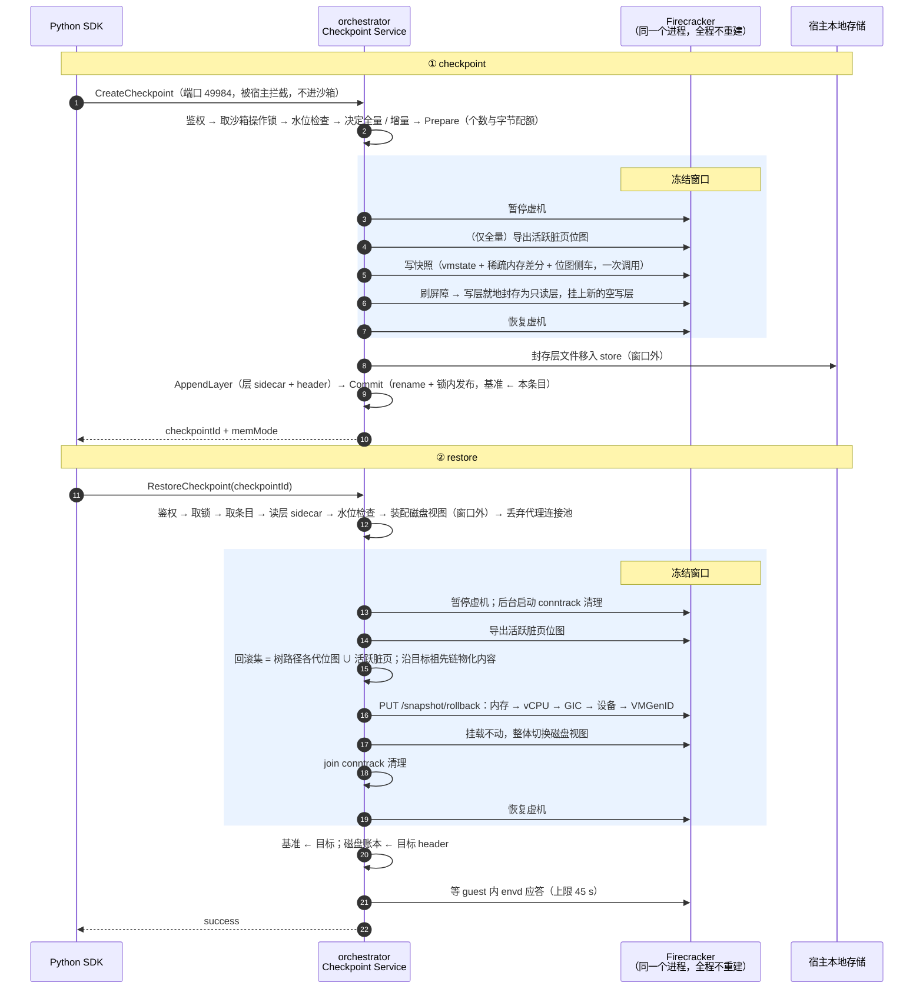

# 11 · 端到端走查

## 本章目标

读完本章，你应当能：

1. 从 SDK 调用出发，按时间顺序说出一次 checkpoint、一次 restore 经过的每一步：在哪个进程、哪个函数、写了哪些文件、记了哪个计时键；
2. 指出哪几步在冻结窗口里、每一步的代价与什么成正比，并解释为什么 restore 窗口内的代价与虚机规格基本无关；
3. 说清编排层的五条顺序约束，以及每一条被打破后的后果（多数是静默的）；
4. 说清 restore 结束后账本里哪些东西变了、为什么要在等 envd **之前**更新；
5. 拿本章当路线图，把一次慢的或失败的操作定位到具体步骤。

---

上一章（[10](10-rollback-pitfalls.md)）讲完了原地回滚特有的问题。第 [04](04-architecture.md)–10 章各讲一个部件：04 是架构与目录布局，05 是脏页从哪来，06 是内存差分树与回滚集，
07 是磁盘分层与视图装配，08 是两个进程之间的接口，09、10 是 Firecracker 里的原地回滚。本章按时间顺序把它们串起来 ——
从 SDK 调用出发，逐步、逐文件、逐时钟地走完一次 checkpoint 和一次 restore，并指出每一步"为什么是这个顺序"。每一步都标注它在哪一章讲过，可以按需回查。

本章是第二部分的收束。它只描述正常路径和最直接的失败出口；失败的完整分级、并发与持久性、生命周期边界，分别是第三部分的
[12](12-failure-semantics.md)、[13](13-state-concurrency-durability.md)、[14](14-lifecycle-reasoning.md) 章；下一章（[12](12-failure-semantics.md)）从失败语义讲起。

主体代码：`packages/orchestrator/internal/checkpoint/service.go`（编排）、`internal/sandbox/checkpoint.go`（冻结窗口）、
`internal/checkpoint/store.go`（账本）。计时键只给名字，定义见 [28](28-observability-reference.md)，实测见 [21](21-benchmarks-and-compliance.md)。

---

## 1. 时序全图



---

## 2. 一次 checkpoint，逐步

### 2.1 进入服务（窗口外）

| # | 步骤 | 说明 |
|---|---|---|
| 1 | SDK 发 `POST /checkpoint.Checkpoint/CreateCheckpoint` 到沙箱地址的 49984 端口 | 代理识别端口与路径后改道给 `ServeCheckpoint`，不进沙箱（[04](04-architecture.md)） |
| 2 | 取沙箱对象；不存在 → 404 | `service.go:405` |
| 3 | 校验 `e2b-traffic-access-token` | 拦截点在代理自己的校验之下，所以服务自己再做一遍 |
| 4 | `ctx = context.WithoutCancel(r.Context())` | 客户端放弃不能让虚机停在暂停态（[13](13-state-concurrency-durability.md)） |
| 5 | `refuseIfTorn`：这一代沙箱已撕裂则拒绝 | [12](12-failure-semantics.md) |
| 6 | `LockSandboxWithin`：取沙箱操作锁，排队超过 `CHECKPOINT_LOCK_WAIT_TIMEOUT` 回 busy | 全程持有 |
| 7 | `refuseIfGone`：锁内再确认沙箱还在、还是同一代 | 排队期间沙箱可能被 kill 或经原生 pause/resume 换了一代 |
| 8 | `refuseIfDiskFull`：产物盘可用空间低于水位则拒绝 | 在锁内做，两个并发 checkpoint 不会看到同一份空闲空间 |

### 2.2 决定与准备（窗口外）

```go
parentID, broken := s.store.BaseState(sandboxID)                 // service.go:576
rooting := parentID == "" && fullRootEnabled()
diff := fc.TrackDirtyPagesEnabled() && !broken && !rooting
```

| # | 步骤 | 说明 |
|---|---|---|
| 9 | 读当前基准与断链标志；三个判据决定全量还是增量 | 全量时 `parentID = ""`，成为一棵新树的根（[06](06-memory-diff-tree.md)） |
| 10 | 字节上限过小时每沙箱每代打一次告警 | `warnIfByteLimitTooSmall`（[27](27-configuration-and-capacity.md)） |
| 11 | `Prepare`：锁内做代际准入、个数上限、字节上限三项检查；锁外建目录 `ckpt_<UnixNano>`、写 `prepared` 的 manifest | 此时条目**不在账本里**，对 `Get` / `List` 不可见。超限回 429 |
| 12 | 取 layers 目录、模板 rootfs 的 header（首次封存时给磁盘账本播种）、生成封存层的 uuid 与路径 | |

这一段的失败都是干净的：`Discard(entry)` 删掉目录，虚机没被碰过。

### 2.3 冻结窗口

`CheckpointToFiles`（`internal/sandbox/checkpoint.go:205`）的骨架：

```go
pausedAt := time.Now()
if err := pauseVM(ctx, sandboxID, process, timings); err != nil { ... }        // pause，超时会补一次 resume

defer func() { /* seal_move：封存层文件移入 store（登记在 resume 之前，所以在它之后执行） */ }()
defer func() {                                                                  // ← 无论如何都要恢复
    timings.Timed("resume", func() error {
        return fcCall(context.WithoutCancel(ctx), process.ResumeVM)
    })
    timings.Mark("frozen", pausedAt)
}()

epoch.beforeSnapshot(...)                                                       // 仅全量：save-dirty-bitmap
timings.Timed("snapshot", func() error {
    return fcCall(ctx, func(ctx context.Context) error {
        return process.CreateSnapshotWithMemFile(ctx, snapfilePath, memfilePath, dirtyBitmapPath, diff)
    })
})
epoch.afterSnapshot(...)                                                        // 本代侧车并入「开机以来写过的页」

sealStart := time.Now()
sealed, err := sealer.SealLayer(ctx, newCachePath)
timings.Mark("seal", sealStart)
```

两个 `defer` 的登记顺序决定了执行顺序：后登记的先执行，所以 resume 先于 seal_move —— 跨文件系统时 seal_move 是一次拷贝，
它必须落在窗口外，冻结时长才不随"上次 checkpoint 以来 guest 写了多少"增长。

| # | 步骤 | 计时键 | 代价与什么成正比 |
|---|---|---|---|
| 13 | **暂停虚机** | `pause` | 常数 |
| 14 | （仅全量）`save-dirty-bitmap` 导出活跃脏页，折进「开机以来写过的页」集合 | `save_live_bitmap` | 内存 / 64 的位图导出 |
| 15 | 写快照：vmstate + 稀疏内存差分 + 位图侧车，**一次调用** | `snapshot` | 本代脏页数（全量时是整份内存） |
| 16 | 封存写层：刷屏障（NBD `BLKFLSBUF`）→ 新空写层 → 把旧写层追加进活的层栈 → 换指针 | `seal` | **常数**，不搬数据、不等落盘（[07](07-disk-layering.md)） |
| 17 | **恢复虚机**（`defer`，无条件） | `resume` | 常数 |
| 18 | 封存层文件移入 store 的 layers 目录（`defer`，登记在 resume 之前，所以在它之后执行） | `seal_move` | 同一文件系统是一次 rename；跨文件系统是一次拷贝，所以放到窗口外 |

冻结窗口长度记在 `frozen`（pause 到 resume）。第 14 步只在全量时做：增量快照写出的侧车恰好就是 Firecracker 随即清掉的那批页；
全量快照的侧车是「全 1」，对「开机以来写过哪些页」毫无信息量，所以在拍之前先要一份活跃位图。这个集合服务于
checkpoint 之后的原生 pause，见第四部分的 [16 §4](16-native-increment-fix.md#4-与-checkpoint-叠加累积位图)。

**恢复虚机是无条件的**：快照失败、封存失败、调用方已经放弃，虚机都要跑起来（`checkpoint.go:247-256`）。
一个所有人都以为在运行、实际停着的沙箱，比一个失败的快照糟得多。注意 `ResumeVM` 外面又套了一层 `WithoutCancel`：即使外层 ctx 因为别的原因被取消，
恢复虚机这个动作也不能被跳过（[13](13-state-concurrency-durability.md) §6）。

### 2.4 顺序约束一：内存与磁盘在同一个窗口里

这不只是「省一次暂停」。内存镜像和磁盘层是**同一瞬间**的两半：guest 尚未刷盘的数据（page cache 里的脏页、未提交的文件系统日志）
留在内存镜像里，位置完全正确；恢复时两者一起回到那个时刻，guest 看到的世界是自洽的。分成两次暂停，中间 guest 继续运行，
就会出现「内存是 T1、磁盘是 T2」，文件系统日志与块内容对不上，guest 内核可能在恢复后直接报文件系统损坏。

### 2.5 提交（窗口外）

| # | 步骤 | 计时键 | 说明 |
|---|---|---|---|
| 19 | `AppendLayer`：锁内把新层折进合并映射；锁外写层 sidecar（`.meta`，该层持有的块偏移）与本条目的 `rootfs.header` | `append_layer`、`append_lock_wait` | 锁外写失败会把磁盘账本标为 poisoned（[07](07-disk-layering.md)） |
| 20 | `Commit`：临时文件 rename 到位（不 fsync）→ manifest 翻成 `committed` → 锁内发布：条目进账本、子节点计数 +1、层引用 +1、字节计数、**基准 ← 本条目** | `commit_files`、`commit_manifest`、`commit_lock_wait`、`commit_index` | 发布是 O(1) 的，不再重写整份 index（[13](13-state-concurrency-durability.md)） |
| 21 | 写本条目的 `timings.json`，回 `{checkpointId, memMode}` | `total` | |

### 2.6 这里的失败不再干净

第 15 步一旦成功，**纪元就前进了**：Firecracker 清空了脏页位图，那份差分文件成了那一代脏页的唯一副本。
所以 16–20 任何一步失败都不能简单删目录，而是走 `failCreate`（`service.go:724`）：

```go
func (s *Service) failCreate(ctx, entry, memMode string, epochAdvanced, layerRecorded bool, sealedLayerPath string, timings) {
    if epochAdvanced && !layerRecorded {
        s.store.PoisonRootfs(entry.SandboxID, sealedLayerPath)   // 封存可能已换进活的层栈，却没人登记它
    }
    if epochAdvanced {
        if err := s.store.CommitHidden(entry, memMode, timings); err != nil {
            s.store.InvalidateBase(entry.SandboxID)              // 连抢救都失败 → 标记断链
            s.store.Discard(entry)
        }
        return
    }
    s.store.Discard(entry)                                       // 纪元没动，删干净
}
```

三层降级：**正常提交 → 隐藏提交（保住纪元）→ 标记断链（此后拒绝恢复）**；封存之后失败且层尚未登记时，还要把磁盘账本标为 poisoned。
完整讨论见 [12](12-failure-semantics.md) §4。

---

## 3. 一次 restore，逐步

### 3.1 准备（窗口外）

| # | 步骤 | 计时键 | 说明 |
|---|---|---|---|
| 1–7 | 与 checkpoint 相同：拦截、鉴权、`WithoutCancel`、`refuseIfTorn`、取锁、`refuseIfGone` | | |
| 8 | `Get`：只返回本代、非隐藏的条目 | | 未提交的条目不在账本里，半写完的快照不可能成为目标 |
| 9 | `DiskViewForEntry`：读并解码各层 `.meta`，得到「层文件 + 它持有哪些块」的清单 | `disk_view_read` | 随视图块数增长（每块 8 字节）。条目没有视图 → 412 `chain_broken`；读 sidecar 出错 → 500 `internal` |
| 10 | `refuseIfDiskFull` | | 物化的回滚集最大可达一份 guest 内存；在暂停前拒绝，好过提交点之后写满 |
| 11 | 打开沙箱的启动内存源 | | 只有树根是差分时才会真正读它（[06](06-memory-diff-tree.md)） |
| 12 | `AssembleView`：以模板 rootfs 为底，逐层重新打开封存层文件，按 sidecar 标记块、建层栈的块→层索引 | `assemble_view_pre` | 在窗口**外**做；标记与索引都按连续区间批量处理，块集合是按块号的位图（[07](07-disk-layering.md)）。失败是一次普通的失败 restore，沙箱没被碰过 |
| 13 | `beginRestore`：打开 restore 窗口，丢弃代理到该沙箱的连接池 | | 窗口内到达的请求被告知回头重试（[10](10-rollback-pitfalls.md)） |

第 12 步能挪到窗口外，是因为它读的全是不可变的东西（已封存的层文件和 sidecar），而同沙箱的操作已被操作锁串行，
没有人能在它背后再封一层：此刻装配与暂停后装配等价。计时键 `assemble_view` 仍保留在分解里、恒为 0，便于与旧数据对齐。

### 3.2 冻结窗口

`RollbackInPlace`（`internal/sandbox/checkpoint.go:461`）：

| # | 步骤 | 计时键 | 代价与什么成正比 |
|---|---|---|---|
| 14 | **暂停虚机**；随即在后台启动 conntrack 清理（与 15–19 并行） | `pause` | 常数 |
| 15 | `save-dirty-bitmap` 导出活跃脏页；并入「开机以来写过的页」集合 | `save_live_bitmap` | 内存 / 64 |
| 16 | `MaterializeRevert`：短暂持全局锁算出目标祖先链与回滚路径；放锁后读位图算回滚集、沿祖先链逐页解析内容，写稀疏的 `revert_mem` 与 `revert_bitmap` | `materialize`、`materialize_lock_wait`、`revert_mem_write`、`revert_bitmap_write`、`materialize_read_mb`、`materialize_base_read_mb` | 回滚集大小 |
| 17 | 回滚位图再并入「开机以来写过的页」集合 | | Firecracker 写回走 VMM 映射，KVM 不记录，这批页不会出现在任何后续位图里 |
| 18 | `PUT /snapshot/rollback`：九个阶段（[09](09-in-place-rollback.md)） | `fc_rollback`、`fc_*` | 回滚集大小 + 常数的设备状态恢复 |
| 19 | `ResetView`：刷屏障，把第 12 步装配好的视图与一个新空写层整体换上 | `reset_view` | 常数，无数据搬运 |
| 20 | join 第 14 步启动的 conntrack 清理 | `conntrack`（等待）、`conntrack_bg`（清理自身） | 通常接近零 |
| 21 | **恢复虚机** | `resume` | 常数 |

冻结窗口长度记在 `frozen`（从 pause 到 resume 之后），**包含第 20 步的等待**。`materialize_disk_read_mb` 与 `fc_rollback_disk_read_mb`
是「这次是否碰了盘」的旁证，前者是进程级口径，并发时混入其他沙箱的读（[28](28-observability-reference.md)）。

### 3.3 顺序约束二：暂停之后才导出、才物化

第 14 步必须在第 15、16 步之前。虚机暂停后活跃脏页集**不再增长**，所以第 15 步导出的就是最终集合，第 16 步物化的内容必然覆盖
Firecracker 在第 18 步要写回的全部页。若在暂停前导出，中间 guest 又写脏几页 —— Firecracker 会把它们并进写回集（它自己会再取一次活跃脏图），
但物化文件里没有，文件在那里是空洞。Firecracker 的覆盖校验会在提交点之前拒绝这次回滚（[09](09-in-place-rollback.md)）；
这道校验是保险，顺序本身才是正确性的来源。

### 3.4 顺序约束三：清 conntrack 在恢复之前完成

表项必须在流量放回来（第 21 步）之前清完。它只要求「虚机已停」，不要求「回滚已完成」，所以从第 14 步起并行，第 20 步只是等它。
提交点之前失败、原样恢复虚机的路径同样先 join 再 resume。详见 [10](10-rollback-pitfalls.md)。

### 3.5 收尾（窗口外）

`finishRestore`（`service.go:1349`）：

| # | 步骤 | 计时键 | 说明 |
|---|---|---|---|
| 22 | `SetBaseToEntry`：**基准 ← 目标条目**，树从这里长出新分支；比目标新的条目仍可作为另一支恢复 | | [06](06-memory-diff-tree.md) |
| 23 | `SetRootfsToEntry`：磁盘账本重置为目标的 header（顺带清除 poisoned），给新视图加层引用、还旧状态的 | | 失败时标 poisoned，此后 checkpoint 被拒、restore 仍可用 |
| 24 | `WaitForEnvdAfterRestore`，上限 45 s | `wait_envd` | guest 醒来时墙钟停在快照时刻，envd 初始化把它校回。不计作一次沙箱启动。45 s 刻意低于 SDK 的请求超时，让失败由服务端而不是客户端超时来报告（[12](12-failure-semantics.md) §3） |
| 25 | 写 `last-restore-timings.json`，回 `{success: true}` | `total` | 失败的 restore 也写这份文件 |

**22、23 在等 envd 之前**，这个顺序是有意的：提交点已经过去，内存基准与磁盘账本描述的是虚拟机与磁盘的既成事实，
与这次 RPC 是否成功无关。若因为 guest 没应答就不更新账本，下一次 checkpoint 会对一个 guest 已经离开的父节点做差分 ——
静默损坏，没有任何报错。**账本跟着状态走，不跟着 RPC 走。**

第 22 步与 Firecracker 阶段 9（重置脏页基线）是**同一件事的两半**：账本把 `ParentID` 指向目标，Firecracker 把跟踪清零。
两者都做，下一代纪元位图才恰好覆盖 `(目标时刻, 下一个 checkpoint]`。

---

## 4. 冻结窗口里有什么

这是**唯一对业务可见的代价**。

**checkpoint**：

| 步骤 | 代价 |
|---|---|
| pause / resume | 常数 |
| （仅全量）导出活跃位图 | 内存 / 64 的位图，很小 |
| 写快照 | **本代脏页数**；全量时是整份内存 |
| 封存写层 | **常数**：刷屏障 + 几次指针写；层文件移入 store 在窗口外 |

**restore**：

| 步骤 | 代价 |
|---|---|
| pause / resume | 常数 |
| 导出活跃脏图 | 内存 / 64 的位扫描 —— 与内存线性，但常数极小 |
| 物化 | **回滚集大小**的读 + 写；另有一次短暂的全局锁 |
| Firecracker 回滚 | **回滚集大小**的写回 + 常数的设备状态恢复；另有内存 / 64 的取图 |
| 换磁盘视图 | 常数（视图在窗口外装配好） |
| 清 conntrack | 与上面并行；窗口内只剩 join 的等待，宿主表很大、restore 频率很高时才会露出来 |

与虚机规格线性相关的只有两次位图扫描（orchestrator 导出一次、Firecracker 阶段 3 展平一次），其余都与**回滚集**相关。
位图扫描的量级可以直接算：2 GiB 内存、4 KiB 页是 524288 页 = 8192 个 u64 字，按字处理只是几千次字操作，可以忽略。
所以一台 2 GiB 的沙箱和一台 16 GiB 的沙箱，回退同样多的页，冻结窗口几乎一样长 —— 这就是"成本只随回退跨度增长"在窗口内的具体含义。

---

## 5. 三个时钟

```
├──────────────── 客户端墙钟 ────────────────┤   SDK 调用耗时（含网络往返）
       ├────── 冻结窗口 ──────┤                  业务实际感受到的停顿（frozen）
   │pause│snapshot│ seal │resume│                宿主分阶段（timings）
                                                  ↑ 其中 fc_* 来自 Firecracker 自报
```

三个时钟回答三个不同的问题：客户端墙钟是"调用方等了多久"（含网络往返与排队），冻结窗口是"业务停了多久"，
宿主分阶段是"停的这段时间花在哪"。排查时先看哪个时钟异常，就知道该往哪一层找。

`PhaseTimings` 是 `map[string]float64`，默认毫秒；以 `_mb` 结尾的键是 MB，以 `_count` 结尾的是计数。三处来源：

| 来源 | 方法 | 例子 |
|---|---|---|
| orchestrator 自己计时 | `Mark(name, start)` / `Timed(name, fn)` | `pause`、`snapshot`、`seal`、`materialize` |
| Firecracker 回报（微秒） | `SetUs(name, us)` | `fc_validate`、`fc_memory`、`fc_vcpus`、`fc_gic`、`fc_devices` |
| 派生 | `Mark("frozen", pausedAt)` | 冻结窗口总长 |

`nil` 的 `PhaseTimings` 是可用的空操作：不要分解的调用方传 `nil` 即可，一分钱不花。这让计时能加在热路径上而不必条件编译。
全部键的定义见 [28](28-observability-reference.md)。

---

## 6. 顺序约束汇总

编排层改代码时最容易破坏的五条：

| # | 约束 | 破坏后果 |
|---|---|---|
| 1 | 内存与磁盘在**同一个**暂停窗口内 | guest 看到内存与磁盘属于不同时刻，可能报文件系统损坏 |
| 2 | **暂停之后**才导出活跃脏图、才物化 | 物化文件漏页；靠 Firecracker 覆盖校验兜底才不会静默清零 |
| 3 | 清 conntrack 在**恢复之前**完成 | 残留表项让跨越回滚的连接挂死，或新表项与恢复后的 guest 不符 |
| 4 | 账本基准与 Firecracker 脏页基线**同时**重置 | 下一代纪元位图覆盖区间错位，回滚集不再是超集 → 漏页 |
| 5 | 提交点之后先更新账本、再等 envd | 账本停在 guest 已离开的状态，下一次 checkpoint 差分错父节点 |

再加上 Firecracker 内部的三条（[09](09-in-place-rollback.md)、[10](10-rollback-pitfalls.md)）：内存先于设备、VMGenID 后于内存、
队列页在阶段 9 之后重新标脏。

**这八条里，破坏之后能立刻报错的只有第 2 条（靠 Firecracker 的覆盖校验兜底）**；第 1 条可能以 guest 文件系统报错的形式露头，
其余都是静默的：连接挂死没有错误信息，漏页、错父节点、guest 不知道时间被回拨，都要等到某个进程读到错误内容才会显形。
这就是为什么第三部分的 [12](12-failure-semantics.md) 要把不变量单列成清单。

---

## 代码位置

| 关注点 | 位置 |
|---|---|
| checkpoint 编排 | `packages/orchestrator/internal/checkpoint/service.go` — `create`、`failCreate` |
| restore 编排与收尾 | 同上 — `restore`、`finishRestore`、`beginRestore` |
| 冻结窗口（checkpoint） | `internal/sandbox/checkpoint.go` — `CheckpointToFiles`、`createEpoch` |
| 视图装配 | 同上 — `AssembleView`、`ReleaseView` |
| 冻结窗口（restore） | 同上 — `RollbackInPlace` |
| 准备、提交、物化 | `internal/checkpoint/store.go` — `Prepare`、`Commit`、`MaterializeRevert`；`rootfs.go` — `AppendLayer`、`DiskViewForEntry`、`SetRootfsToEntry` |
| 封存与换视图 | `internal/sandbox/rootfs/nbd.go` — `SealLayer`、`ResetView`；`rootfs.go` — `SealedLayer.MoveInto` |
| 分阶段计时 | `internal/sandbox/phasetimings.go` |

---

## 本章要点

1. checkpoint 的冻结窗口只有：暂停、（全量时）导出位图、写快照（与脏页数成正比）、封存写层（常数）、恢复；层文件移入 store 在窗口外。
2. restore 的准备工作（读 sidecar、装配视图、丢弃连接池）全在窗口外；窗口内的代价与**回滚集**相关，与虚机规格无关。
3. 恢复虚机是 `defer` 里的无条件动作。
4. 纪元一旦前进，失败处理从「删干净」变成「隐藏提交保住纪元」，再失败才「标记断链」。
5. restore 收尾时账本基准与 Firecracker 脏页基线同时重置，且先于等 envd。
6. 编排层五条顺序约束加 Firecracker 内部三条，破坏后多数是静默的；三个时钟（客户端、冻结窗口、宿主分阶段）分别回答"等了多久""停了多久""花在哪"。
