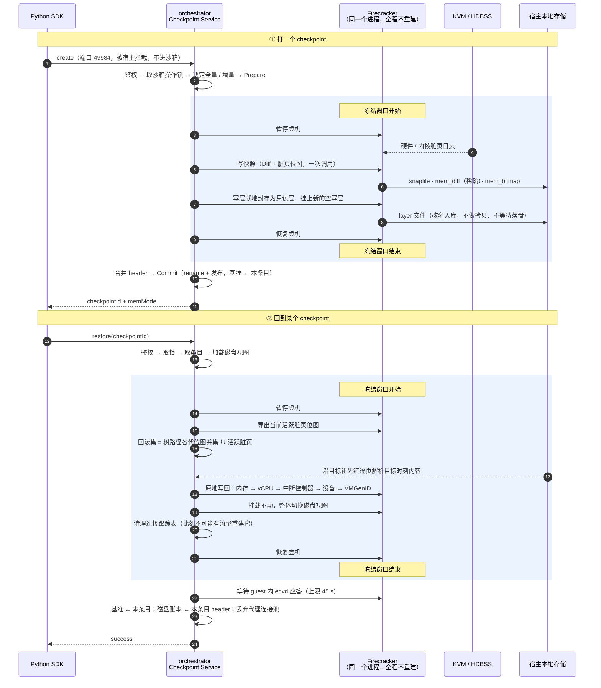

# 13 · 端到端：一次 checkpoint 与一次 restore

> 前七篇各讲一个部件。本篇按时间顺序把它们串起来 —— 从 SDK 调用出发，
> 逐步、逐文件、逐时钟地走完一次 create 和一次 restore，并指出每一步「为什么是这个顺序」。
>
> **读者**：工程师。本篇是第二部分的收束，也是排查问题时的路线图。
> **预备**：[第 6](06-architecture.md)–[12 篇](12-rollback-pitfalls.md)。
> 每一步都会标注它在哪一篇讲过，可以按需回查。
> **代码**：`internal/checkpoint/service.go`、`internal/sandbox/checkpoint.go`

---

## 0. 本篇要回答的问题

1. 一次 `create` 从进程到进程、从函数到文件，完整发生了什么？
2. 冻结窗口里到底有哪几步？各自大概什么量级？
3. 有哪几处的**顺序**是不能动的？动了会怎样？
4. `restore` 之后，账本里有哪些东西变了？

---

## 1. 时序全图



---

## 2. 一次 create，逐步

### 2.1 进入服务（窗口外）

| # | 步骤 | 在哪讲过 |
|---|---|---|
| 1 | SDK 发 `POST /checkpoint.Checkpoint/CreateCheckpoint` 到沙箱地址的 49984 端口 | [第 6 篇 §2](06-architecture.md#2-控制面请求发往沙箱却由宿主应答) |
| 2 | 代理解出 `(sandboxID, port)`，`checkpoint.Handles` 命中，改道给 `ServeCheckpoint` | 同上 |
| 3 | 取沙箱对象；不存在 → `404 not_found` | 同上 |
| 4 | 校验 `e2b-traffic-access-token`（拦截点在代理自己的校验之下，所以自己再做一遍） | [第 6 篇 §2.3](06-architecture.md#23-为什么要再校验一次-token) |
| 5 | `ctx = context.WithoutCancel(r.Context())` —— 客户端放弃**不能**让虚机留在暂停态 | [第 6 篇 §3.1](06-architecture.md#31-service编排者) |
| 6 | `LockSandbox(sandboxID)`，全程持有 | [第 15 篇](15-state-and-concurrency.md) |

### 2.2 决定与准备（窗口外）

```go
parentID, broken := s.store.BaseState(sandboxID)
rooting := parentID == "" && fullRootEnabled()
diff := fc.TrackDirtyPagesEnabled() && !broken && !rooting
```

| # | 步骤 | 说明 |
|---|---|---|
| 7 | 读当前基准与断链标志 | 基准就是本次的 `ParentID` |
| 8 | 三个判据决定全量还是增量 | [第 8 篇 §8](08-memory-diff-tree.md#8-全量与增量怎么选) |
| 9 | `Prepare`：建目录、写一个 `prepared` 的 manifest | 此时条目对 `Get` / `List` **不可见** |
| 10 | 取模板 rootfs 的 header（首次封存时给磁盘账本播种） | [第 10 篇 §4.2](10-disk-layering.md#42-合并-header) |
| 11 | 生成本次封存层的 uuid 与路径 | |

**这一步的失败都是干净的**：`Discard(entry)` 删掉目录就完事，虚机没被碰过。

### 2.3 冻结窗口

`CheckpointToFiles` 里的六步：

```go
pausedAt := time.Now()
timings.Timed("pause", func() error { return process.Pause(ctx) })

defer func() {                                    // ← 无论如何都要恢复
    timings.Timed("resume", func() error {
        return process.ResumeVM(context.WithoutCancel(ctx))
    })
    timings.Mark("frozen", pausedAt)
}()

timings.Timed("snapshot", func() error {
    return process.CreateSnapshotWithMemFile(ctx, snapfilePath, memfilePath, dirtyBitmapPath, diff)
})

sealStart := time.Now()
layer, err := sealer.SealLayer(ctx, newCachePath, sealedLayerPath)
timings.Mark("seal", sealStart)
```

| # | 步骤 | 在哪讲过 | 量级 |
|---|---|---|---|
| 12 | **暂停虚机** | | 毫秒级 |
| 13 | 写快照：vmstate + 稀疏差分 + 位图侧车，**一次调用** | [第 9 篇 §2](09-firecracker-api-contract.md#2-扩展一dirty_bitmap_path) | O(本代脏页) |
| 14 | 封存写层：刷屏障 → 新空写层 → 两次指针替换 → 改名入库 | [第 10 篇 §3](10-disk-layering.md#3-seal不搬运任何数据的换层) | **O(1)** |
| 15 | **恢复虚机** | | 毫秒级 |

那个 `defer` 值得单独看：**恢复虚机是无条件的**。快照失败、封存失败、甚至调用方已经放弃，
虚机都要跑起来。

> 「一个所有人都以为在运行、实际停着的沙箱，比一个失败的快照糟得多。」

### 2.4 顺序约束一：内存与磁盘必须在同一个窗口里

这不只是「省一次暂停」。真正的理由是**一致性**：

> 内存镜像和磁盘层是**同一瞬间**的两半。guest 尚未刷盘的数据（page cache 里的脏页、
> 未提交的文件系统日志）留在内存镜像里，位置完全正确。恢复时两者一起回到那个时刻，
> guest 看到的世界是自洽的。

如果分成两次暂停，中间那段时间 guest 继续运行，就会出现「内存是 T1 的、磁盘是 T2 的」——
文件系统日志与实际块内容对不上，guest 内核可能在恢复后直接报文件系统损坏。

### 2.5 提交（窗口外）

| # | 步骤 | 说明 |
|---|---|---|
| 16 | `AppendLayer`：把新层折进合并 header，写 `rootfs.header` 与层 `.meta` | [第 10 篇 §4](10-disk-layering.md#4-恒等映射) |
| 17 | `Commit`：临时文件 fsync + rename，manifest 翻成 `committed`，**基准 ← 本条目** | [第 15 篇](15-state-and-concurrency.md) |
| 18 | 写 `timings.json` | [第 17 篇](17-observability-and-verification.md) |
| 19 | 回 `{checkpointId, memMode}` | |

### 2.6 这里的失败不再干净

第 13 步一旦成功，**纪元就前进了** —— Firecracker 清空了脏页位图，那份差分文件成了
那一代脏页的唯一副本。所以 14–17 任何一步失败，都不能简单地删掉目录：

```go
func (s *Service) failCreate(ctx, entry, memMode string, epochAdvanced bool) {
    if epochAdvanced {
        if err := s.store.CommitHidden(entry, memMode); err != nil {
            s.store.InvalidateBase(entry.SandboxID)   // 连抢救都失败 → 标记断链
            s.store.Discard(entry)
        }
        return
    }
    s.store.Discard(entry)     // 纪元没动，删干净
}
```

三层降级：**正常提交 → 隐藏提交（保住纪元）→ 标记断链（此后拒绝恢复）**。
完整讨论见[第 14 篇](14-failure-semantics.md)。

---

## 3. 一次 restore，逐步

### 3.1 准备（窗口外）

| # | 步骤 | 说明 |
|---|---|---|
| 1–6 | 与 create 相同：拦截、鉴权、`WithoutCancel`、取锁 | |
| 7 | `Get(sandboxID, id)` —— 只返回 `committed` 且非隐藏的条目 | 半写完的快照永远不可能成为恢复目标 |
| 8 | `DiskViewForEntry`：读各层 `.meta`，得到「层文件 + 它持有哪些块」的清单 | [第 10 篇 §6.2](10-disk-layering.md#62-恢复不走链) |
| 9 | 打开沙箱的启动内存源（只有差分树根时才会真正读它） | [第 8 篇 §6.3](08-memory-diff-tree.md#63-全量根为什么是默认) |

### 3.2 冻结窗口

| # | 步骤 | 在哪讲过 | 量级 |
|---|---|---|---|
| 10 | **暂停虚机** | | 毫秒级 |
| 11 | `SaveDirtyBitmap` 导出活跃脏页 | [第 9 篇 §4](09-firecracker-api-contract.md#4-扩展三put-snapshotsave-dirty-bitmap) | O(内存/64) 位扫描 |
| 12 | 算回滚集 = 树路径纪元并集 ∪ 活跃脏页 | [第 8 篇 §4](08-memory-diff-tree.md#4-回滚集) | 内存里的位运算 |
| 13 | 物化 `revert_mem`（稀疏）+ `revert_bitmap` | [第 8 篇 §5](08-memory-diff-tree.md#5-物化交给-firecracker-的两个文件) | O(回滚集) |
| 14 | `PUT /snapshot/rollback`：九个阶段 | [第 11 篇](11-in-place-rollback.md) | O(回滚集) |
| 15 | `assembleView` + `ResetView`：整体换磁盘视图 | [第 10 篇 §7](10-disk-layering.md#7-resetview挂载不动整体换视图) | O(层数)，无数据搬运 |
| 16 | `FlushConntrack`：命名空间整表 + 宿主按 slot IP 过滤删除 | [第 12 篇 §4](12-rollback-pitfalls.md#4-连接跟踪) | 毫秒级 |
| 17 | **恢复虚机** | | 毫秒级 |

### 3.3 顺序约束二：暂停之后才导出、才物化

第 10 步必须在第 11、13 步之前。理由：

> 虚机暂停后，活跃脏页集**不再增长**。所以第 11 步导出的集合就是最终的集合，
> 第 13 步物化出来的内容**必然覆盖** Firecracker 在第 14 步要写回的全部页。

如果在暂停之前导出，中间 guest 又写脏了几页 —— 这几页会被 Firecracker 并进写回集
（它自己会重新取一次活跃脏图），但 orchestrator 没有物化它们，
`restore_dirty` 会从**文件空洞读到零**。静默损坏。
（[第 9 篇 §4.1](09-firecracker-api-contract.md#41-为什么非有不可)）

### 3.4 顺序约束三：清 conntrack 必须在恢复之前

第 16 步必须在第 17 步之前，且必须在暂停窗口内：

> 此刻没有流量，不可能有人重建一条刚被作废的表项。

放在恢复之后会有竞态：guest 已经在跑、可能已经发包，我们正在删的表项可能是它刚建立的。
（[第 12 篇 §4.4](12-rollback-pitfalls.md#44-时机必须在暂停窗口内)）

### 3.5 收尾（窗口外）

| # | 步骤 | 说明 |
|---|---|---|
| 18 | `WaitForEnvd`，上限 **45 s** | guest 醒来时墙钟停在快照时刻，envd 初始化把它校回；45 s 刻意低于 SDK 的 60 s 默认超时（[第 14 篇](14-failure-semantics.md)） |
| 19 | `SetBaseToEntry(entry)` —— **基准 ← 目标条目**，树从这里长出新分支 | [第 8 篇 §3.2](08-memory-diff-tree.md#32-树是怎么长出来的) |
| 20 | `SetRootfsToEntry(entry)` —— 磁盘账本重置为该条目的 header（顺带清除污染） | [第 10 篇 §8](10-disk-layering.md#8-账本与污染) |
| 21 | `dropConnections(sbx.LifecycleID)` —— 丢弃代理侧连接池 | [第 12 篇 §4.5](12-rollback-pitfalls.md#45-代理侧的连接池) |
| 22 | 写 `last-restore-timings.json`，回 `{success: true}` | |

第 19 步和 Firecracker 阶段 9（重置脏页基线）是**同一件事的两半**：
账本把 `ParentID` 指向目标，Firecracker 把跟踪清零。两者同时做，
下一代的纪元位图才恰好覆盖 `(目标时刻, 下一个 checkpoint]`。
少做任何一半，[第 8 篇 §4.3](08-memory-diff-tree.md#43-正确性) 的证明就不成立了。

---

## 4. 冻结窗口里有什么

这是**唯一对业务可见的代价**，所以值得单独列。

**create**：

| 步骤 | 代价 |
|---|---|
| pause | 常数，毫秒级 |
| 写快照 | **O(本代脏页)** |
| 封存写层 | **O(1)** —— 几次 ioctl + 几次指针写 + 一次 rename（[第 10 篇 §5](10-disk-layering.md#5-封存不等待落盘)） |
| resume | 常数 |

**restore**：

| 步骤 | 代价 |
|---|---|
| pause | 常数 |
| 导出活跃脏图 | O(内存/64) 的位扫描 —— 与内存大小线性，但常数极小 |
| 算回滚集 | 内存里的位运算 |
| 物化 | **O(回滚集)** 读 + 写 |
| Firecracker 回滚 | **O(回滚集)** 写回 + 常数的设备状态恢复 |
| 换磁盘视图 | O(层数) 次 `NewCache`，**无数据搬运** |
| 清 conntrack | 两次 netlink 操作 |
| resume | 常数 |

唯一与虚机规格线性相关的是「导出活跃脏图」的位扫描 ——
2 GiB 内存 = 524288 页 = 8192 个 u64 字，可以忽略。

---

## 5. 三个时钟怎么对上

```
├──────────────── 客户端墙钟 ────────────────┤   SDK 调用耗时（含网络往返）
       ├────── 冻结窗口 ──────┤                  业务实际感受到的停顿
   │pause│snapshot│ seal │resume│                宿主分阶段（timings.json）
                                                  ↑ 其中 fc_* 来自 Firecracker 自报
```

`PhaseTimings` 是一个 `map[string]float64`（毫秒），三处来源：

| 来源 | 方法 | 例子 |
|---|---|---|
| orchestrator 自己计时 | `Mark(name, start)` / `Timed(name, fn)` | `pause`、`snapshot`、`seal`、`materialize` |
| Firecracker 回报（微秒） | `SetUs(name, us)` | `fc_validate`、`fc_memory`、`fc_vcpus`、`fc_gic`、`fc_devices` |
| 派生 | `Mark("frozen", pausedAt)` | 冻结窗口总长 |

> `PhaseTimings` 是 `nil` 安全的：不想要分解的调用方传 `nil`，一分钱不花。
> 这让计时能加在热路径上而不必条件编译。

完整讨论见[第 17 篇](17-observability-and-verification.md)。

---

## 6. 顺序约束汇总

改代码时最容易破坏的四条：

| # | 约束 | 破坏后果 |
|---|---|---|
| 1 | 内存与磁盘在**同一个**暂停窗口内 | guest 看到内存与磁盘属于不同时刻，可能直接报文件系统损坏 |
| 2 | **暂停之后**才导出活跃脏图、才物化 | Firecracker 从文件空洞读到零，**静默**清零 guest 的若干页 |
| 3 | 清 conntrack 在**恢复之前**、暂停窗口内 | 竞态：可能删掉 guest 刚建立的连接表项 |
| 4 | 账本基准与 Firecracker 脏页基线**同时**重置 | 下一代纪元位图覆盖区间错位，回滚集不再是超集 → 漏页 |

再加上 Firecracker 内部的三条（[第 11 篇](11-in-place-rollback.md)、
[第 12 篇](12-rollback-pitfalls.md)）：内存先于设备、VMGenID 后于内存、
队列页在阶段 9 之后重新标脏。

**七条里有五条，破坏之后的表现是静默的。** 这也是为什么[第 14 篇](14-failure-semantics.md)
要把不变量单列成清单。

---

## 7. 小结

1. create 的冻结窗口里只有四步：暂停、写快照（O(脏页)）、封存写层（**O(1)**）、恢复。
2. restore 的冻结窗口里有八步，代价全部与**回滚集**相关，与虚机规格无关。
3. 恢复虚机是 `defer` 里的**无条件动作** —— 快照失败也要跑起来。
4. 纪元一旦前进（Firecracker 写完快照），失败处理就从「删干净」变成
   「隐藏提交保住纪元」，再失败才「标记断链」。
5. 四条编排层的顺序约束，其中三条被破坏后是**静默**的。
6. restore 收尾时账本基准与 Firecracker 脏页基线**必须同时**重置 ——
   这是回滚集正确性证明的前提。

---

## 代码位置

| 关注点 | 位置 |
|---|---|
| create 编排 | `internal/checkpoint/service.go` — `create`、`failCreate` |
| restore 编排 | 同上 — `restore` |
| 冻结窗口（create） | `internal/sandbox/checkpoint.go` — `CheckpointToFiles` |
| 冻结窗口（restore） | 同上 — `RollbackInPlace` |
| 分阶段计时 | `internal/sandbox/phasetimings.go` |
| 快照调用 | `internal/sandbox/fc/process.go` — `CreateSnapshotWithMemFile` |

**下一部分**：[14 · 失败语义与不变量](14-failure-semantics.md) —— 正常路径讲完了，
接下来是「怎么保证它不出错，以及出错时怎么让人知道」。
