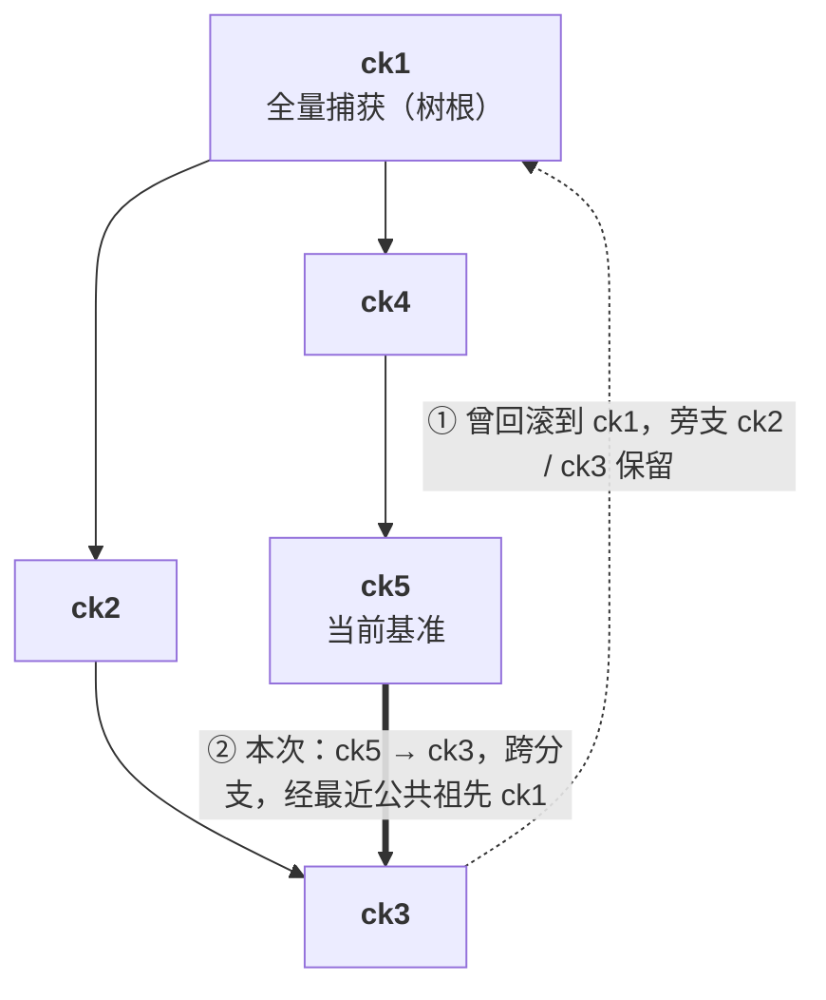

# 14 · 内存差分树

> 这篇给要改账本或要审查正确性的开发者看，是第三部分技术密度最高的一篇。读完你能说清：每一代内存产物是什么；
> 历史为什么是树；回滚时哪些页要写回、内容从哪来、凭什么是对的；删除时如何隐藏、剪枝与**合并**（compact / fold），以及合并为什么不改变任何
> restore 的结果、条目数为什么有上界。代码主要在 `packages/orchestrator/internal/checkpoint/`（`store.go`、`bitmap.go`、`compact.go`）。

---

## 1. 问题：怎么存 n 代内存状态

一个 2 GiB 的沙箱打了 20 个 checkpoint，每次之间改动约 40 MiB，要能回到任意一代：

| 存法 | 单次创建成本 | 恢复成本 | 依赖 |
|---|---|---|---|
| 每代全量 | O(内存) | O(内存) | 无 |
| 每代自足（克隆上一代 + 覆盖） | O(元数据)，**前提是 reflink** | O(回滚集) | `FICLONE` |
| **每代只存差分** | O(本代脏页) | O(回滚集) | 无 |

第二种在 ext4 上退化成每代一次全内存拷贝（[12](12-architecture.md#8-为什么交付用-ext4)），所以交付的是第三种：
**差分 + 按页解析**。

---

## 2. 一代产物：稀疏差分 + 位图侧车

### 2.1 稀疏文件

Firecracker 以 Diff 模式写快照时，把每个脏页写在它自己的偏移上，干净页不写，文件系统对没写过的区间不分配物理块。
文件逻辑大小等于 guest 内存，物理占用约等于脏页总量；读空洞返回零。Firecracker 的回滚端点会校验内存文件长度等于 guest 内存大小，
稀疏文件天然满足。

### 2.2 纪元与它的位图

**纪元**是两次"脏页跟踪被重置"之间的时间段。Firecracker 在写完一个快照（`dump_dirty` 成功后 `reset_dirty`）和完成一次回滚
（阶段 9）时重置跟踪。因此随 checkpoint `x` 一起落地的位图 `E_x` 恰好是：

> `E_x` = 从 `parent(x)` 所在时刻到 `x` 所在时刻之间，guest 写过的页。

**这条不变量是后面所有推导的地基**，由两侧共同维持：Firecracker"写快照与回滚都重置跟踪"，账本"新 checkpoint 的 `ParentID`
取当时的基准"。改动任何一侧都必须重新检查它。位图与快照在同一次 Firecracker 调用内落地（`dirty_bitmap_path`），格式 FCDB 见
[15](15-firecracker-api-contract.md)。全量快照也写位图，内容全 1。

一代产物是 `snapfile`、`mem_diff`、`mem_bitmap`、`rootfs.header`、`manifest.json`（目录布局见 [12](12-architecture.md#5-数据面目录布局)），
创建成本 **O(本代脏页)**，与虚机规格、历史长度、文件系统都无关。

---

## 3. 树，而不是链

历史是 `ck1 → ck2 → ck3`，回滚到 `ck1` 之后 `ck2`、`ck3` 怎么办？删掉就不能"回退之后发现原来那条路是对的，再前滚回去"；
留着，历史就不是链了。所以历史**天然是树**，这是"回滚不删除历史"的直接结论。规则只有两条：

1. 打新 checkpoint，`ParentID` = **当前基准**；
2. 回滚到 `t` 成功后，**当前基准 ← t**。



支持回滚后前滚、跨分支跳转、删除中间节点不打断后代（§10）。条目结构（`store.go:342`）的要点：`State`（prepared / committed，
只有 committed 可见）、`ParentID`（`""` 为树根）、`Hidden`（在树里、不在 API 里）、`MemDiff`、`MemMode`（full / incremental）、
`ListedMemMode`（合并改了模式时，List 仍报拍摄时的模式）、`MemBitmap`、`Rootfs`（视图）、`layer`（本条目封存的层）。
`bases[sandbox]` 记当前基准和"链已断"标志，是每沙箱的运行时状态，不属于任何一代。

---

## 4. 回滚集

### 4.1 定义

虚机现在的内存 = 基准 `b` 时刻的内容 + 自 `b` 以来写过的页（活跃脏页集 `L`）。要变成目标 `t` 时刻的内容，设
`A = LCA(b, t)`，`P` 是从 `b` 和 `t` 各自走到 `A` 的两段路径（**不含 `A`**），则

```
revert = ⋃ E_x (x ∈ P)  ∪  L
```

### 4.2 正确性

> **命题.** 对任意页 `p ∉ revert`，虚机当前 `p` 的内容 == `t` 时刻 `p` 的内容。

**证明.** ① `p ∉ L` ⇒ 自 `b` 起 `p` 没被写过 ⇒ 当前 = `b` 时刻内容。② `p ∉ ⋃ E_x (x ∈ path(b→A))` ⇒ 从 `A` 到 `b` 的每一代都没写过 `p`
⇒ `b` 时刻 = `A` 时刻。③ 同理 `t` 时刻 = `A` 时刻。串起来：当前 = `b` = `A` = `t`。∎

②③用的正是 §2.2 的不变量。位图漏记一页命题就不成立，所以脏页跟踪的**精确性**是正确性问题（[13](13-dirty-page-tracking-and-hdbss.md)）。
这是充分覆盖，不是最小集：两侧都改过、恰好改成同一个值的页会被无谓回写一次；求最小集要逐页比内容，不值得。

### 4.3 为什么必须并入活跃脏页

反例：`b` 之后 guest 把页 42 从 `X` 改成 `Y`，还没打新的 checkpoint。页 42 不在任何一代的纪元位图里（它属于还没结束的纪元）。
不并入 `L`，回滚后页 42 仍是 `Y`，guest 内存里混进一页来自被丢弃时间线的数据，而且是静默的。
`L` 由 `PUT /snapshot/save-dirty-bitmap` 在**虚机暂停之后**导出（[15](15-firecracker-api-contract.md)）。

### 4.4 最近公共祖先与哨兵

不需要通用 LCA 算法（`revertPathLocked`，`store.go:1352`）：

```go
inTargetChain := map[string]bool{"": true}      // 哨兵：树根之上
for _, e := range targetChain { inTargetChain[e.ID] = true }
lca := baseID
for !inTargetChain[lca] { path = append(path, entries[lca]); lca = entries[lca].ParentID }  // 从基准往上爬
for _, e := range targetChain { if e.ID == lca { break }; path = append(path, e) }          // 目标链走到 LCA
```

哨兵 `""` 让两种情形自然得到正确答案：还没有任何 checkpoint（`baseID == ""`）时整条目标链都进 `path`；
**基准与目标不在同一棵树上**（断链后新的全量根开一棵新树，或跟踪关着时每个 checkpoint 都是树根）时，从基准一路爬到 `""`，
`lca = ""`，整条目标链进 `path`，其中包含目标那棵树的全量根。

**全量根的回滚因子恒为全 1。** 全量条目永远是树根（checkpoint 决定全量时把 `parentID` 置空，`service.go:591-595`），只在跨树回滚时
进入路径。此时它的因子必须覆盖"它的时刻与启动内存源之间所有可能不同的页"，**包括之前丢失的纪元里写过的页** —— 那些页不在任何侧车里，
只有全 1 能带进来。`entryBitmap`（`store.go:1419-1422`）对 `MemModeFull` 直接返回全 1、不读侧车；只有增量条目读侧车，
没有侧车就报错。Firecracker 对 Full 快照本来就写全 1 侧车（`firecracker/src/vmm/src/vstate/vm.rs:519-530`），
所以这条是零代价的加固：它让跨树回滚不再依赖 writer 的这个约定。守它的测试是 `full_root_revert_test.go:190`
`TestCrossTreeRevertAfterLostEpoch` 与 Firecracker 侧 `vm.rs:731` `test_full_snapshot_sidecar_is_all_ones`。

> 跨树意味着两个时刻之间的差异无法用纪元位图界定，唯一安全的答案就是全部回写。代码没有为它写专门分支，
> 是哨兵加全 1 因子让它自动正确 —— 这类"不用特判也对"的设计在重构时最容易被破坏。

### 4.5 一个完整的例子

沿用 §3 的树，guest 16 页：ck1 全 1（全量根），ck2 = {1,5,9}，ck3 = {5,7}，ck4 = {2,5}，ck5 = {9,11}；
基准 `b = ck5`，`L = {3}`，目标 `t = ck3`。

- 目标链 `[ck3, ck2, ck1]`；从 ck5 上爬 ck5 → ck4 → ck1 ∈ 目标链，`A = ck1`，`P = [ck5, ck4, ck3, ck2]`。**ck1 不在路径里**。
- `revert = {9,11} ∪ {2,5} ∪ {5,7} ∪ {1,5,9} ∪ {3} = {1,2,3,5,7,9,11}`，16 页里只写回 7 页。
- 逐页解析（沿 `[ck3, ck2, ck1]` 找第一个含该页的内容位图）：页 5、7 取自 ck3；页 1、9 取自 ck2；页 2、3、11 取自 ck1。
- 页 3 之所以进回滚集是因为**现在**脏（`L`），内容却要一路回溯到全量根。"为什么要回写"和"内容从哪来"是两个独立问题，用两组不同的位图。
- 按页号扫描，把"连续且同源"的页合成一个 extent：`1←ck2`、`2–3←ck1`、`5←ck3`、`7←ck3`、`9←ck2`、`11←ck1`，单个 extent 最多 1024 页
  （`revertExtentPages`，`store.go:1608`）。

骨架由 `bitmap_test.go:156` `TestMaterializeRevertTreePath`（LCA 不参与回滚集）和 :200
`TestMaterializeRevertResolvesThroughAncestors`（因新纪元回滚、内容来自老祖先）守着。

### 4.6 缺侧车即报错

路径或目标链上任何一代读不出合法位图，`MaterializeRevert` 直接返回错误，回滚不发生，沙箱保持原状态；读出来还要做几何校验
（`page_size`、`num_pages` 与运行中的虚机一致）。不静默降级成全量回滚：读不出位图说明账本与产物已不一致，全量回滚也未必对。

---

## 5. 物化：交给 Firecracker 的两个文件

orchestrator 在目标条目目录下写 `revert_bitmap.tmp`（回滚集本身，FCDB）和 `revert_mem.tmp`（稀疏文件，逻辑大小 = guest 内存，
回滚集中每一页的目标时刻内容写在各自偏移上），调 `PUT /snapshot/rollback`，结束后无论成败都删掉（`MaterializeRevert`，`store.go:1510`）。

**契约**：Firecracker 回滚时会把自己的活跃脏页并进写回集，再按页从 `revert_mem` 读内容，所以它写回的集合 ⊇ orchestrator 给的位图。
`revert` 的定义已并入 `L`，两边相等。Firecracker 另有一道防线：提交点之前用 `SEEK_DATA` / `SEEK_HOLE` 检查内存文件在回滚集的每个偏移上都有数据，
没有就以可恢复错误拒绝（`rollback.rs:858` `validate_mem_file_coverage`；文件系统不支持时跳过并告警）。所以漏物化的后果是 restore 被拒，而不是页被清零。

**短读是错误**（`writeRevertMem`，`store.go:1710-1725`）：差分文件在它侧车声明的页上必须有数据，读短了说明文件与自己的位图矛盾，
直接拒绝这次 restore（此时仍在提交点之前，虚机未动）。文件内部的空洞不算短读：写成全零的页是合法页。只有从启动内存源读、
窗口被夹在 guest 内存末尾时才允许短读并把复用缓冲的尾部清零。

---

## 6. 内容解析：这一页的目标时刻内容在哪

对回滚集中的每一页 `p`，沿目标祖先链找**第一个**"文件里含有 `p`"的条目，从它的 `mem_diff` 偏移 `p × page_size` 读一页。
"文件里含有"用的是**内容位图**（`entryContentBitmap`，`store.go:1397`），与纪元位图的区别只在全量条目：

| 条目类型 | 纪元位图（算回滚集） | 内容位图（解析内容） |
|---|---|---|
| 增量条目 | 侧车 | 侧车 |
| 全量条目 | **全 1** | **全 1** |

**为什么必然终止**：树根要么是全量捕获（`CHECKPOINT_FULL_ROOT` 开，默认），内容位图全 1，解析在树内终止、只读本地文件；
要么是相对启动内存源的差分（开关关掉），解析可能穿过根落到模板 memfile。

**全量根为什么是默认**：模板 memfile 在宿主本地并不存在，由 chunker 从对象存储按需拉取（[10](10-background.md)）。差分根意味着回滚路径上
藏着一段跨网络依赖，而且发生在虚机暂停期间。全量根让整棵树自给自足，代价只落在每个沙箱的第一次 checkpoint（写全内存、存全内存）。
什么时候值得关：沙箱多、每个只打两三个点、存储紧、对象存储就在同机房 —— 这是部署决策（[06](06-configuration-and-capacity.md)）。
差分根时读模板 memfile 要按块对齐（`readAlignedFromBase`，`store.go:1614`），只在开关关掉时走到。

---

## 7. 成本模型

| 操作 | 复杂度 |
|---|---|
| 创建（增量） | O(本代脏页) |
| 创建（全量根） | O(内存)，每沙箱一次 |
| 回滚集计算 | O(路径长度 × 位图字数)，内存里做位运算 |
| 内容解析 | 按 64 页一个字做：每个非零字对链上各代做一次 AND，全部页找到归属即离开链；I/O 只发生在 extent 上 |
| 物化写出 / Firecracker 写回 | O(回滚集) |
| 存储 | O(Σ 各代脏页) + 一份全量 |

内容解析按字进行（`forEachRevertRun`，`store.go:1760`）：回滚集通常只占内存的几个百分点，绝大多数字为零，一次比较就跳过。
链深只增加内存里的位运算，真正的文件 I/O 只发生在命中的那一代上，所以**恢复成本与链深无关**：差分树是按页寻址的，不是按代重放的。
（链深对 restore 的实测影响见 [25](25-results-and-compliance.md)。）

---

## 8. 全量与增量怎么选

每次 checkpoint 先决定写全量还是增量（`service.go:577-595`），任一成立就走全量：

| 条件 | 为什么 |
|---|---|
| 脏页跟踪没开 | 没有位图，无法产生合法的增量条目 |
| 链已断 | 上一个纪元丢了，任何增量都无法解释那段时间的改动 |
| 沙箱的第一个 checkpoint，且 `CHECKPOINT_FULL_ROOT` 开 | 树根要自足 |

结果经 `memMode` 回报：**第一个之后仍出现 `full`，说明这台宿主没在跟踪脏页**，它照常成功，只是每次多拷整份内存。

---

## 9. checkpoint 之后再做原生 pause 的正确性前提

原生 pause 导出的内存差分是**相对模板 memfile** 的，必须包含 guest **自启动以来**写过的每一页。但 Firecracker 的写跟踪位图在每次
checkpoint（`dump_dirty` 后 `reset_dirty`）和每次 restore（阶段 9）都会清零，restore 还经一条 KVM 不记日志的映射把回滚集写进 guest 内存。
只看位图的话，打过 checkpoint 的沙箱做原生 pause 时只导出"上一次 checkpoint / restore 以来"的页，更早的页在 resume 后回到模板基线，
guest 内存由两个时刻拼成 —— 而 pause 本身报成功。

所以 orchestrator 维护一个每虚机的**自启动以来脏页集**，把 Firecracker 即将忘掉的位图并进去（`internal/sandbox/checkpoint.go`）：

| 时机 | 并进什么 | 位置 |
|---|---|---|
| 增量 checkpoint | 快照写出的侧车（正是被清掉的那些页） | `createEpoch.afterSnapshot`，:180 |
| 全量 checkpoint | 拍之前先导出的活跃脏图（全 1 侧车不能用，会让之后每次 pause 导出全部内存） | `createEpoch.beforeSnapshot`，:160 |
| restore | 回滚前导出的活跃脏图 + 物化的回滚集位图 | :539、:584 |

原生 pause 时导出 = 写跟踪位图 ∪ 这个集合。任何一份并不进去（侧车缺失、几何不符、没有 `save-dirty-bitmap` 端点），整个集合标为不可信，
pause 退回按驻留判据导出 —— 导多了只费时间，导少了毁掉沙箱。跟踪没开时同样退回驻留判据。pause 日志写明依据：
`tracked` / `tracked+accumulated` / `resident`（`internal/sandbox/uffd/uffd.go:250-346`）。从不 checkpoint 的沙箱不受影响。

反方向不成立：原生 pause / resume 之后是新一代沙箱（新的 LifecycleID），之前的 checkpoint 全部失效。用户视角的说法见
[02](02-semantics-and-limits.md)。

---

## 10. 删除、隐藏与合并

### 10.1 三种处理

`ck2` 有后代 `ck3`，`ck3` 的很多页要靠 `ck2` 的差分解析，直接删 `ck2` 的文件会让 `ck3` 变成一个看起来正常、恢复时读到错内容的条目。
`Delete`（`store.go:2009`）的账本部分 `deleteLocked`（:1980）按条目的处境处理：

| 情形 | 处理 |
|---|---|
| **隐藏**：有子节点，或它是当前基准 | 标 `Hidden`，`List` / `Get` 不再返回；删 `snapfile` 与 `rootfs.header`（只有恢复才用得着），放掉视图对层的引用；保留 `mem_diff` 与 `mem_bitmap`（后代要靠它们）；若成为合并候选则入队（:2008-2042） |
| **物理删除**：无子节点且非基准 | 摘出条目，放掉视图引用，然后从父节点开始**级联**（:2045-2062） |
| **级联**（`pruneLocked`，:1244） | 沿父指针向上，逐个删除"隐藏、无子、非基准"的祖先，直到不成立；停下的那个若是候选则入队 |

基准移动也触发级联：一个只因"身为基准"才被保留的隐藏条目，基准一挪走（commit、restore、断链）就进入 `pruneLocked`（`setBaseLocked`，:1218）。
"有没有子节点"查的是子节点计数表（`children`，:477、`hasChildLocked` :1857），O(1)。账本在全局锁下改，目录删除在放锁后
（`reclaim`，[21](21-state-concurrency-durability.md)）。隐藏条目仍完整参与内容解析与回滚集计算。

### 10.2 合并（compact）

只靠隐藏和级联，"保留最新 N 个、删最旧"这种常见用法永远产生不了隐藏叶子：每次删的都是下一个的父节点。隐藏条目于是无界积累，
磁盘跟着涨，restore 的解析链越来越长；个数上限只数可见条目，拦不住它。合并解决这个问题。

**条件**（`compactCandidateLocked`，`compact.go:230`）：候选 H **隐藏、已提交、不是基准、恰有一个子节点** C。

**做法**：把 H 并入 C，C 接管 H 的父节点，H 离开树：

- 回滚因子取并集：`rev(C') = rev(H) ∪ rev(C)`；
- 内容以 C 为准：`cont(C') = cont(H) ∪ cont(C)`，两者都有的页取 C 的；
- H 是全量（必为树根）时 C' 成为全量根（`foldMemory`，`compact.go:697-700`），`ListedMemMode` 保留 C 被拍时的模式；
- 数据往少的一边拷：`H 有而 C 没有`的页不多于 C 的页时，把这些页填进 C 差分的空洞；否则把 C 的页覆盖到 H 的差分上，
  再以新名字 `mem_diff.<H-id>` 硬链接进 C 的目录；并集侧车写成 `mem_bitmap.<H-id>`（:739-801）；
- rootfs 层在条件满足时**成对合并**（C 封存的层与紧挨在下面那层），条件与证明见 [16](16-disk-layering.md#10-层合并)。

**顺序与失败**：拷页、写新名字的侧车、层合并都在全局锁外、沙箱 gate 内进行，只写没人读的字节或还没人引用的新名字；最后在锁内一次切换
（`switchFoldLocked`，:549）：先核对树没变，再改 C 的父节点与文件名、删 H、旧文件进 reclaim。切换前任何一步失败都删掉新名字，树原样不动；
候选之后的 delete 重试，失败满 3 次（`compactMaxAttempts`，:133）就放弃，行为等同没有合并。用新名字而不是覆盖改名，是为了避免切换失败后
H 与 C 共享一个 inode。

**何时运行**：没有后台任务。合并在 `Delete` 末尾同步执行（`store.go:2034` → `runCompaction`，`compact.go:423`），每次最多
`CHECKPOINT_COMPACT_MAX_PER_OP`（默认 8，:126-127）个，剩下的等下一次 delete。候选在"隐藏、级联停下的节点、基准移动"三处入队（:208）。
合并从不让触发它的 delete 失败。delete 因此多了合并的耗时，这是已知项（数字见 [25](25-results-and-compliance.md)）。

### 10.3 为什么合并不改变任何 restore

记 `chain(X)` 为 X 及其祖先（新到旧），一次 restore 由基准 B 与目标 T 决定：LCA `A` 是 `chain(B)` 上第一个落在 `chain(T) ∪ {""}` 里的节点；
路径 `P` 是 `chain(B)` 与 `chain(T)` 在 `A` 之前的部分；`R = L ∪ ⋃_{x∈P} rev(x)`；页 `p` 的内容取自 `chain(T)` 上第一个满足 `p ∈ cont(x)` 的 x。
合并前提保证 **T ≠ H**（隐藏条目不能被 `Get` 取到，不能当目标）且 **B ≠ H**（H 不是基准）；合并期间持有沙箱 gate，没有 restore 并发。

**引理 1（相邻）。** 对任意 X ≠ H：`H ∈ chain(X)` ⇔ `C ∈ chain(X)`，且 C 紧挨在 H 之前。
*证*：H ∈ chain(X) 且 X ≠ H，则 chain(X) 中 H 的前一个节点以 H 为父，即 H 的子节点，只能是 C；反之 C ∈ chain(X) 则其父 H 紧随其后。

**引理 2。** `A ≠ H`。*证*：若 A = H，则 H ∈ chain(B) 且 B ≠ H，由引理 1 C 在 chain(B) 中紧挨 H 之前；又 H ∈ chain(T)、T ≠ H，
故 C ∈ chain(T)。于是 C 同时在两条链上且在 chain(B) 中先于 H，从 B 上爬应在 C 处（或更早）停下，与 A = H 矛盾。

**引理 3。** `H ∈ P` ⇔ `C ∈ P`。*证*：P 的每一段都是某条链在 A 之前的前缀。若 H 在某段中，C 在同一条链上紧挨 H 之前，也在该段中。
若 C 在某段中，则 A 在该链上位于 C 之后；A ≠ H（引理 2），所以 A 还在 H 之后，H 也在该段中。跨树时 `A = ""`，两段就是两条整链，由引理 1 直接成立。

**回滚集不变。** 合并等于把树上 C–H 这条边收缩成一个节点 C'：每条链把相邻的 (C, H) 换成 C'，其余节点与位图不变；若原 A = C 则新 A = C'，
否则 A 不变。由引理 3，P 要么同时含 C、H（换成 C'），要么都不含。`rev(C') = rev(C) ∪ rev(H)`，并集不变；`L` 来自 Firecracker，
合并不碰它。所以每个可能的 restore 的 `R` 逐位相同。

**内容不变。** 在 `chain(T)` 上，C' 之前的节点不变。到 C'：`p ∈ cont(C)` 时原来由 C 提供，现在 C' 提供 C 的那份；`p ∉ cont(C)`、`p ∈ cont(H)`
时原来由 H 提供，现在 C' 在同一偏移上持有 H 的那份；两者都不含时照旧落到 H 的父节点。不经过 H 的链完全不变。
H 为全量时 `cont(H)` 全 1，C' 标为全量并持有每一页，`rev(C')` 也是全 1，与 `rev(H) ∪ rev(C)` 相等。C 本身不可能是全量：全量条目总是树根，而 C 有父节点 H。

**不变量延续。** `rev(C') = E_H ∪ E_C` 覆盖 `(parent(H), H] ∪ (H, C] = (parent(C'), C']`，§2.2 的不变量对 C' 仍成立，此后的回滚集证明（§4.2）照样适用。

**切换前的文件改动对读者不可见。** 往 C 的差分里补页，写的是 C 的内容位图不含的偏移；解析只在 `cont(x)` 声明的偏移上读 `D_x`，这些字节没人读。
把 C 的页覆盖到 H 的差分上，写的是 `cont(C)` 的偏移；由引理 1，任何到达 H 的链都先经过 C，这些页已由 C 回答，H 在这些偏移上从不被读。
新名字的文件在切换前无人引用。所以切换前失败，树与每个 restore 的结果都与合并前完全相同。

这个结论由属性测试 `TestFoldingChangesNoRestore`（`compact_sim_test.go:868`）守着：开 / 关合并两个 store 跑同一随机序列，
每步对每个可见 checkpoint 比 `MaterializeRevert` 的位图与内存文件逐字节相同。

### 10.4 条目数上界 ≤ 2V + 1

合并追平时，每个非基准的隐藏条目至少有 2 个子节点：无子的会被级联删掉，恰有一个子的会被合并。数森林的边：n 个条目分成 r ≥ 1 棵树，
父子边共 n − r 条。设可见 V 个、非基准隐藏 h₂ 个、隐藏基准 b ≤ 1 个，则 n = V + h₂ + b，且 h₂ 个节点各自至少贡献 2 条出边：

```
V + h₂ + b − r ≥ 2·h₂   ⇒   h₂ ≤ V + b − 1
```

所以隐藏条目数 `h₂ + b ≤ V + 1`，总条目 ≤ **2V + 1**。合并没追平时（一次 delete 最多合并 `CHECKPOINT_COMPACT_MAX_PER_OP` 个，
checkpoint 与 restore 只入队不合并），每个待处理或已放弃的候选多出 1 个。测试断言 `hidden ≤ V + 1 + pending`、`entries ≤ 2V + 1 + pending`，
并检查每个候选都已入队（`compact_sim_test.go:583-599` `checkFoldBounds` 的注释与实现）。

跟踪关着时每个 checkpoint 都是全量根，没有"隐藏且只有一个子"的条目，也就没有合并；隐藏条目只会是基准。

### 10.5 关掉合并

`CHECKPOINT_COMPACT=false`（按 `strconv.ParseBool` 读，`compact.go:141-157`）时 `queueCompactLocked` 不入队、`runCompaction` 直接返回，
行为回到没有合并时：隐藏条目只在成为"无子、非基准"的叶子时才被级联删除。由 `compact_test.go:509`
`TestFoldingOffKeepsTheOldBehaviour` 守着。给用户看的"怎么删才释放空间"见 [02](02-semantics-and-limits.md)，开关总表见 [06](06-configuration-and-capacity.md)。

---

## 11. 小结

1. 每代内存产物是**稀疏差分 + 纪元位图**，创建 O(本代脏页)，不依赖文件系统特性；地基是"`E_x` 恰好覆盖 `(parent(x), x]`"。
2. 历史是树；回滚集 = 树路径纪元并集 ∪ 活跃脏页，三步证明。活跃脏页必须并入。
3. "为什么回写"和"内容从哪来"是两个问题，用纪元位图和内容位图分别回答；全量条目两者都恒为全 1，跨树回滚因此自动退化为全量回写。
4. 物化文件由 Firecracker 再做一次覆盖检查；差分短读直接拒绝，不补零。
5. 恢复成本与链深无关：解析按字做位运算，I/O 只在命中处。
6. 做过 checkpoint / restore 的沙箱再原生 pause，靠"自启动以来脏页集"补回被清掉的位图，不可信时退回驻留判据。
7. 删除有隐藏、物理删除、级联三种处理；**合并**把"隐藏、非基准、独子"的条目并入其子，回滚集与内容逐位不变，条目数 ≤ 2V + 1；
   `CHECKPOINT_COMPACT=false` 恢复旧行为。
