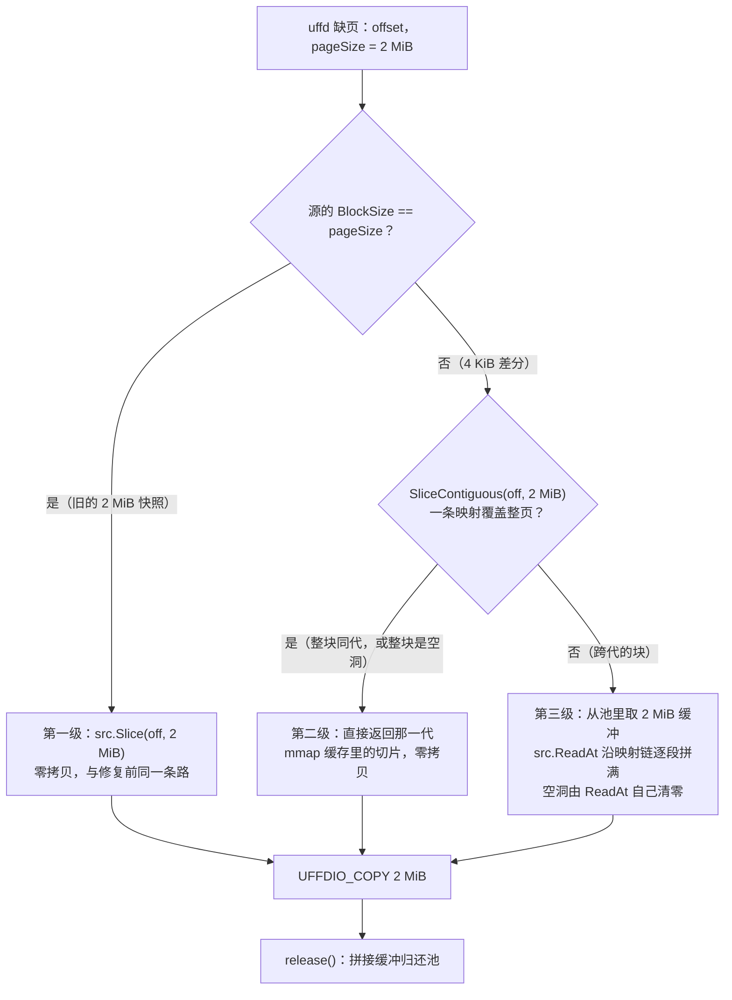

# 16 · 精确增量的改法

## 本章目标

读完本章，你应该能够：

1. 说清两条备选路线（关大页；保大页、4 KiB 存 2 MiB 拼）各自的代价，以及选后者的关键依据；
2. 逐层说出判 / 存 / 填各改了什么，为什么父代的 2 MiB 映射不用重写，一次 2 MiB 缺页的内容怎样从 4 KiB 差分里拼回来、什么时候仍然零拷贝；
3. 解释一个做过 checkpoint 或 restore 的沙箱再做原生 pause 时，为什么只看写跟踪位图会少导页，以及"自启动以来脏页集"怎样把少掉的页补回来；
4. 列出所有让原生 pause 回到驻留判据的条件，并说明为什么每一条退路都退到"多导"而不是"拒绝 pause"。

---

上一章（[15](15-native-increment-diagnosis.md)）把原生 pause 的内存增量拆成三层（① 判、② 存、③ 填），结论是：只换 ① 能治好"读算脏"，但 2 MiB 归并留下约 130 MiB 的地板；
要精确，② 和 ③ 也必须动，方向是 **4 KiB 存、2 MiB 拼**。上一章最后还立了一条规矩：任何判据都必须是"真正写过的页"的超集，**宁可多导，不可少导**。

本章是改法。§1 回顾链条，§2 比较两条路线，§3 逐层讲改动，§4 讲与 checkpoint 叠加使用时的累积位图，§5 汇总所有退路。
代价的数字和验证证据放在下一章 [17](17-native-increment-cost-and-verification.md)。

本章涉及两个改动，都在 KASandbox_0904 仓库的 orchestrator 里，**Firecracker 一行没改**：

| 改动 | 做什么 | 本章 |
|---|---|---|
| 4 KiB 写跟踪差分 | 判据换成写跟踪位图；header 块大小降到 4 KiB；缺页时按 2 MiB 拼 | §2、§3、§5 |
| 累积位图 | 把 checkpoint / restore 让 Firecracker 清掉的脏页记录并回，保证叠加使用时导出完整 | §4 |

---

## 1. 回顾：三层与那根链条

| 层 | 做什么 | 修复前的粒度锁 |
|---|---|---|
| ① 判 | 算出这一代哪些页要导出 | `GET /memory/dirty`：驻留即脏 |
| ② 存 | 按 header 的 `BlockSize` 把页拷进紧凑差分，header 记映射 | `BlockSize` 从模板继承，恒为 2 MiB |
| ③ 填 | uffd 按 guest 页缺页，从映射链取内容填进去 | 硬性要求 guest 页大小等于 `BlockSize` |

guest 页 2 MiB ⇒ ③ 只能按 2 MiB 填 ⇒ ③ 要求 ② 的块等于 2 MiB ⇒ ② 逐代继承 ⇒ ① 再精细也要归并到 2 MiB。
再加上 ① 在 ARM 上塌缩成"驻留即脏"、每一代又都是新进程，导出量就成了工作集，而不是写集。完整推导见 [15](15-native-increment-diagnosis.md#3-原生内存增量的三层)。

---

## 2. 两条路线

要让导出量等于 4 KiB 写集，有两条路：

| | 路线 A：关大页 | 路线 B：保留大页，4 KiB 存、2 MiB 拼 |
|---|---|---|
| 做法 | 模板以 `huge_pages=false` 构建，guest 页、header 块、缺页单位全是 4 KiB；只换 ① | ① 换判据；② header 块降到 4 KiB；③ 缺页仍按 2 MiB，内容从 4 KiB 映射拼 |
| 改动量 | ① 约 40 行 + 模板参数 | ①②③ 共约 200 行（不含单测），5 个包 |
| 导出量 | 4 KiB 真值 | 4 KiB 真值 |
| 缺页次数 | **×512** | 不变 |
| guest TLB | 失去 2 MiB 大页 | 不变 |
| 每次缺页多付 | 无 | 跨代的块：最多 512 次映射查表 + 一次 2 MiB 拷贝；整块同代的块：不多付 |
| 影响面 | 所有用这个模板的沙箱都换成 4 KiB 页，**不只是做快照的** | 只有原生快照的导出与恢复 |
| 定位 | 可以当天验证数字的对照开关 | 落进代码的方案 |

**选 B。** 两条路线导出量相同，差别全在恢复与运行时：

- 路线 A 让缺页次数乘 512。一个 400 MiB 的工作集原来约 200 次 2 MiB 缺页，关大页后约 10 万次 4 KiB 缺页，每一次都是"内核 → orchestrator → `UFFDIO_COPY` → 内核"的往返。
  恢复后首次触碰工作集的延迟会从几百毫秒量级升到秒级。
- 路线 A 还让所有沙箱在**运行时**失去大页：TLB 覆盖范围缩小 512 倍，内存密集型负载的地址翻译开销上升。为快照的导出量让全部沙箱付运行时代价，不划算。

路线 B 的关键判断是：**拼接能力已经存在。** `build.File.ReadAt`（`packages/orchestrator/internal/sandbox/build/build.go:40`）本来就是一个循环：
对当前偏移查一次 `GetShiftedMapping`，从对应那一代读 `min(映射剩余长度, 待读长度)`，然后前进，直到读满。它不限长度，可以跨越任意多代。
修复前只有 `File.Slice` 是"只取一个块"的捷径，而 uffd 恰好用的是它。所以 ③ 要做的不是写一个拼接器，而是把 uffd 路径从"取一个块"换成"能拼的读法"，
再把拼接的开销压下去。

---

## 3. 三层各改了什么

### 3.1 ① 判：换成写跟踪位图

`Uffd.DiffMetadata`（`packages/orchestrator/internal/sandbox/uffd/uffd.go:267`）不再直接调 `f.DirtyMemory`（`GET /memory/dirty`），
而是在门都通过时调 `f.TrackedDirtyMemory`（`packages/orchestrator/internal/sandbox/fc/memory.go:59`）：

1. 发 `PUT /snapshot/save-dirty-bitmap`，让 Firecracker 把当前的写跟踪位图以 FCDB 格式写到一个临时文件（格式见 [08](08-firecracker-api-contract.md#5-fcdb-位图格式)）；
2. `ReadDirtyBitmapFile`（:88）解析这个文件，得到一个按页的位集合和页大小（4 KiB）；
3. 返回 `DiffMetadata{Dirty: 位集合, Empty: 空, BlockSize: 4096}`，临时文件随即删除。

`BlockSize` 取自 FCDB 头里的页大小，也就是宿主页大小 4 KiB，而不是 memfile 的 2 MiB。这个 `BlockSize` 会一路传到 ② 和导出。

这一步有三个前提，都成立，所以 `Pause` 的调用顺序不用动：

- **端点要求虚机已暂停**（`firecracker/src/vmm/src/rollback.rs:796` 开头检查 `VmState::Paused`）。`Pause` 取脏页集合时虚机已经暂停：
  顺序是 `process.Pause` → `CreateSnapshot` → `DiffMetadata`（`sandbox.go:942`、:950、:966）。
- **`Pause` 先做的那次快照不擦位图。** 原生 pause 让 Firecracker 写 snapfile 时不带 `mem_file_path`，Firecracker 只在带这个参数时才导出内存、
  才会在导出后清位图（`firecracker/src/vmm/src/persist.rs:177-178`）。所以到 `DiffMetadata` 时位图还是完整的。
  探针 `rollback/scripts/probes/pb3.py` 在 920B 上量过：快照前后位图的置位页数相同。
- **位图的起点就是这一代的起点。** 原生每一代都是一个新的 Firecracker 进程，从快照加载时位图为空；本代之前写过的页已经在父代的差分里，
  由 header 映射链负责。所以"本代位图"与"父代 header"合起来，正好覆盖"相对模板写过的全部页"。
  这个前提在沙箱做过 checkpoint / restore 之后**不再成立**，§4 专门处理。

**位图覆盖了哪些写？** 它是两份位图的并集（`save_dirty_bitmap` 先把 KVM 位图折进用户态位图再导出，见 [05](05-dirty-page-tracking-and-hdbss.md#32-两层位图)）：

- KVM 脏页日志：guest 经 Stage-2 的每一次写。920B 上靠写保护陷出记录，950 上靠 HDBSS 硬件记录，格式与语义相同；
- Firecracker 用户态位图：Firecracker 自己写 guest 内存的地方（virtio 队列、网卡收包缓冲），这些写不经过 Stage-2，由 Firecracker 自己标。

**哪些页不在位图里，而且不该在？** orchestrator 经 uffd **填**进去的页。它们是"读"意义上的换入，内容等于映射链里已有的内容，不用再存一份。
这正是 [15](15-native-increment-diagnosis.md#4-修复前为什么不精确判据与两个放大) 里"换入即脏"的反面：新判据天然不把换入当成写。

**被换出到 swap 的页呢？** 写跟踪位图与驻留无关，写过的页即使被换出，位也还在；导出时 `process_vm_readv` 读 Firecracker 进程的地址空间，
会把换出页读回来。所以这方面新判据至少不比驻留判据差。

### 3.2 ② 存：header 块大小降到 4 KiB，父代映射原样保留

`ToDiffHeader`（`packages/shared/pkg/storage/header/metadata.go:52`）在 `NextGeneration` 从父代继承 `BlockSize`（2 MiB）之后，加了一条规则（:80-89）：
差分的块比父代细、而且能整除父代的块，就把新 header 的 `BlockSize` 改成差分的块大小。

```go
if d.BlockSize > 0 && uint64(d.BlockSize) < metadata.BlockSize {
    if metadata.BlockSize%uint64(d.BlockSize) != 0 {
        return nil, fmt.Errorf("diff block size %d does not divide header block size %d", ...)
    }
    metadata.BlockSize = uint64(d.BlockSize)
}
```

**父代的映射不用重写**，这是这一层改动很小的原因。理由有三条：

- 映射是**字节区间**（`Offset`、`Length`、`BuildStorageOffset`）。父代的映射全是 2 MiB 对齐的，2 MiB 对齐必然 4 KiB 对齐。
- `NewHeader`（`packages/shared/pkg/storage/header/header.go:24`）用 `Offset / BlockSize` 给每条映射的**起点**建索引（:44），查找时按字节偏移找到覆盖它的那条映射。
  它只要求映射起点落在块边界上，**不要求映射长度等于 `BlockSize`**。
- `MergeMappings`、`NormalizeMappings` 全按字节计算。

所以一个 4 KiB 的 header 里可以同时有 2 MiB 长的父代映射和 4 KiB 长的本代映射，查法相同。举例，父代把块 `[0, 2 MiB)` 整块映射到第 1 代，
本代只写了其中偏移 8 KiB 那一页：

```
合并后（BlockSize = 4 KiB）：
  [0,       8 KiB)   → 第 1 代，偏移 0
  [8 KiB,  12 KiB)   → 本代，偏移 0          ← 本代唯一的一页
  [12 KiB,  2 MiB)   → 第 1 代，偏移 12 KiB
```

原来那条 2 MiB 的映射被切成三段，前后两段仍指向第 1 代，差分文件一个字节都不用动。

导出时 `ExportMemory(ctx, Dirty, path, 4096)`（`fc/memory.go:116`）以 4 KiB 为步长。`BitsetRanges` 把连续置位的页合并成一段区间，
再把区间换算成 Firecracker 进程里的地址，用 `process_vm_readv` 读进紧凑差分文件；一次系统调用最多 `IOV_MAX` 段（运行时从系统取值，
`block/iov.go:15`）。差分文件、上传、模板存储的形态一点没变：它本来就是"紧凑拼接 + header 指偏移"，块大小只是步长。

**代际行为**：模板 header 仍是 2 MiB（模板构建走 `NoopMemory.DiffMetadata`，`uffd/noop.go:35`，没有改）；沙箱**第一次原生 pause 时切到 4 KiB**，
之后每一代继承 4 KiB。

### 3.3 ③ 填：一次 2 MiB 缺页，三级取源

**放宽硬检查。** `NewUserfaultfdFromFd`（`uffd/userfaultfd/userfaultfd.go:56`）的检查从"相等"放宽为"整除"（:64-66），同时记下 guest 页大小，
并要求所有 region 的页大小一致（:68-72）：

```go
if blockSize <= 0 || int64(region.PageSize)%blockSize != 0 {
    return nil, fmt.Errorf("page size %d is not a multiple of block size %d for region %d", ...)
}
```

**三级取源。** 缺页处理 `faultPage`（:325）与预取器（`uffd/prefetch/prefetcher.go:207`）共用一个新入口
`block.ReadPage(ctx, src, off, pageSize)`（`packages/orchestrator/internal/sandbox/block/page.go:63`），它返回一整页内容和一个 `release` 函数：



- **第一级**（page.go:66-71）：块等于页，走原来的 `Slice`。从旧的 2 MiB 快照起沙箱时走这条路，行为与修复前逐字节相同。
- **第二级**（:77-89）：`build.File.SliceContiguous`（`build/build.go:103`）查一次映射，如果这一条映射从缺页地址起覆盖了整整 2 MiB，
  就直接返回那一代 mmap 缓存里的切片。映射指向空洞（从未写过的页，build id 为空）时返回一个共享的全零大页 `header.EmptyHugePage`，同样不分配。
  guest 物理页在 2 MiB 块里是混着的，跨代的块不少，但仍以整块同代居多，所以大多数缺页仍然零拷贝。
- **第三级**（:91-109）：只有跨代的块才拼。缓冲从 `sync.Pool` 取（按页大小分池，`getPageBuffer`，:34），`File.ReadAt` 沿映射链逐段读满；
  空洞段由 `ReadAt` 自己 `clear`（`build.go:70-77`），所以池里拿出来的旧缓冲不会把上一次的内容带进 guest。`UFFDIO_COPY` 完成后 `release` 把缓冲还回池。
  拼出来的字节数不等于页大小时直接报错，不会把半页交给 guest。

`template.Storage` 也补了一个 `SliceContiguous`（`sandbox/template/storage.go:155`），让 `ReadPage` 能透过模板存储这一层问到"是否整页同源"。
`build.File.Slice` 本身也改成了"能零拷贝就零拷贝，否则分配一块新缓冲拼"（`build.go:134`），供不走 `ReadPage` 的调用者使用。

**跟踪器改用页做单位。** 缺页跟踪与预取跟踪（`missingRequests`、`prefetchTracker`，userfaultfd.go:82-83）记的是"哪些 guest 页缺过"，
单位本来就应该是缺页单位，现在按 guest 页大小建。

### 3.4 顺带修掉的两处

有两个旧问题只有在"读的长度与块大小不同"时才会踩到，块降到 4 KiB 之后变成了必经之路，一并修掉，都在 `block` 包：

- **`Cache.isCached` / `setIsCached` 按读偏移记键。** 块等于读长度时，"读偏移"和"所在块"是一回事；4 KiB 块下读 2 MiB 时，按读偏移记键会漏判后面 511 块。
  现在用 `coveringBlocks`（`block/cache.go:365`）算出读区间覆盖的首尾块，按块判断与标记（:370、:380）。
- **`FullFetchChunker.fetchToCache` 只取起始的 4 MiB chunk。** 读区间跨到下一个 chunk 时，后半段是空的。现在取齐 `startingChunk..endingChunk`（`block/chunk.go:213-225`）。

---

## 4. 与 checkpoint 叠加：累积位图

§3.1 的第三个前提是"位图的起点就是这一代的起点"。对从不做 checkpoint 的沙箱，它成立；一旦沙箱在同一代里做过 checkpoint 或 restore，它就不成立了。
本节讲为什么，以及怎么补。

### 4.1 问题：Firecracker 的位图只记"上一次快照或回滚以来"

原生 pause 导出的内存差分是相对于**这一代的父代**（第一代就是模板）的，所以它必须包含这一代 guest **启动以来**写过的每一页。
但 Firecracker 的写跟踪位图有三个时刻会被清零或绕开，每一次都是有意为之（让下一次 Diff 快照恰好相对于那一刻）：

| 时刻 | Firecracker 做了什么 | 位置 |
|---|---|---|
| 每次 checkpoint（写差分快照） | `dump_dirty` 写完之后 `reset_dirty`，位图清零；全量快照同样清零 | `firecracker/src/vmm/src/vstate/memory.rs:308-312`；`vstate/vm.rs:519-522` |
| 每次 restore（原地回滚阶段 9） | `reset_dirty`，位图清零，下一次 Diff 相对于回滚后的状态 | `firecracker/src/vmm/src/rollback.rs:445-452` |
| restore 写回内存时 | 回滚集的页经 Firecracker 进程对 guest 内存的映射写入，**KVM 不记这种写** | 同上，阶段 9 的注释 |

于是，一个做过 checkpoint 的沙箱在原生 pause 时，只看位图的话只会导出"上一次 checkpoint 或 restore 以来"写过的页。更早写过的页没被导出，
恢复时它们从父代读回旧内容：guest 内存由两个时刻拼成。restore 写回的那批页更隐蔽：它们确实改变了 guest 内存（相对模板），
却不在任何一份 KVM 日志里。

后果是 [15](15-native-increment-diagnosis.md#7-改判据之前要先立的规矩宁可多导不可少导) 说的最坏情形：pause 报成功，快照照常上传；
resume 之后 guest 内核在几十毫秒内崩溃（实测形态是 `BUG: Bad rss-counter state` 之后连串的链表损坏与内核 panic）。
如果运气更"好"一点，内核没有立刻崩，那就是一个能跑、但数据已经错乱的沙箱。

这里的设计教训值得写下来：§3.1 改判据时，"位图 = 这一代启动以来写过的页"被当成了显然成立的前提，而它只对从不 checkpoint 的沙箱成立。
**两个各自正确的机制叠加时，要重新检查每一个前提。** 这个缺陷由专门的用例（crtest T39，见 [17](17-native-increment-cost-and-verification.md#8-验证五类证据)）发现并守住。

### 4.2 做法：把即将被忘掉的位图收进一个每虚机的集合

Firecracker 每次清位图时，被清掉的恰好是"即将被忘掉的页"，而这些位图此刻都在 orchestrator 手里：checkpoint 写出的侧车、restore 前导出的活跃脏图、
为 restore 物化的回滚集位图。所以做法很直接：在每个清零时刻之前，把这些位图并进一个**每虚机的"自启动以来脏页集"**（`uffd.DirtySinceBoot`，
`packages/orchestrator/internal/sandbox/uffd/sinceboot.go:42`）；原生 pause 时，把这个集合并回写跟踪位图再导出。

并入的时机与内容（`packages/orchestrator/internal/sandbox/checkpoint.go`）：

| 时机 | 并入什么 | 为什么是它 | 位置 |
|---|---|---|---|
| 增量 checkpoint 之后 | 快照写出的侧车位图 | 侧车恰好列出这次写进差分、随后被清掉的页 | `createEpoch.afterSnapshot`（:180），调用在 :289 |
| 全量 checkpoint 之前 | 拍之前先用 `save-dirty-bitmap` 导出的活跃脏图 | 全量的侧车是全 1，不能用（见下） | `createEpoch.beforeSnapshot`（:160），调用在 :258-261 |
| checkpoint 超时 | 仍然尝试并入侧车 | 超时的快照可能已经写完并清了位图 | :278 |
| restore 回滚之前 | 回滚前导出的活跃脏图 | 上次 checkpoint 以来写过、即将被回滚和清零的页 | :539 |
| restore 物化之后 | 回滚集位图 | Firecracker 即将经不记日志的映射写回的页 | :584 |

**全量 checkpoint 为什么是例外。** 全量快照的侧车说"每一页"。这对"内存文件里有哪些页"是对的，对"guest 写过哪些页"毫无意义。
如果把它并进集合，这个沙箱之后每一次原生 pause 都会导出整份 guest 内存；而沙箱的第一次 checkpoint 总是全量的，等于每个用过 checkpoint 的沙箱都中招。
所以全量 checkpoint 改为在拍快照**之前**、虚机已暂停时，先导出一次活跃脏图：`save-dirty-bitmap` 把 KVM 日志折进用户态位图、**不清零**，
对第一次 checkpoint 而言，这张图正是"启动以来写过的页"。代价是冻结窗口里多一次位图导出（每 GiB guest 内存 32 KiB 的位图），而且只在全量 checkpoint 时发生。
这一步失败时退而求其次：拍完之后并入全 1 的侧车，多导，但不会少导（`createEpoch` 的注释，:126-146）。

**restore 为什么两份都要并。** 活跃脏图是"上次 checkpoint 以来写过的页"，回滚会把它们改回去、然后清零，所以要记下；
回滚集位图是"Firecracker 即将写回的页"，这些写不进任何日志，所以也要记下。回滚集其实包含了活跃脏图，也包含了树路径上各代的纪元位图，
而那些纪元位图大多在 checkpoint 时已经并过。重复并入无害（并集是幂等的），但不能省：全量根的"全 1"纪元没有侧车可并，
集合曾经不可信期间拍的纪元也不在集合里（:570-583 的注释）。

### 4.3 并入的规则：对不上就标"不可信"

`MergeBitmap`（sinceboot.go:95）处理几何不同的位图时只接受一种情况：

| 情况 | 处理 | 理由 |
|---|---|---|
| 第一份位图 | 复制一份作为集合 | — |
| 页大小相同、页数相同 | 直接并 | — |
| 新位图的页更粗（整数倍） | 展开成细页再并：一个粗页置位，就把它覆盖的所有细页都置位（`expandBitmap`，:144） | 只会多记，不会少记 |
| 新位图的页更细，或不是整数倍 | 位照样并进来，但**整个集合标为不可信** | 粗集合表达不了细信息，猜测哪些页重合正是这类缺陷的来源 |
| 页数不同 | 同上 | 两份位图描述的不是同一块内存的同一种切法 |
| 侧车文件缺失或格式不对 | 标为不可信（`MergeFile`，:74） | 集合出现了一个说不清的洞 |

"不可信"只记第一个原因（:170-177）：它解释了集合是怎么失去意义的，之后的抱怨都是它的后果。
并入失败从不让 checkpoint 或 restore 本身失败，它只打一条 warn：这次 checkpoint 的功能不受影响，受影响的是这个沙箱下一次原生 pause 的导出量（checkpoint.go:109-121）。

### 4.4 pause 时怎么用

`Uffd.diffMetadata`（uffd.go:271）在取到写跟踪位图之后：

- 集合为空（从没并过东西）：直接用写跟踪位图，来源标记 `tracked`；
- 集合非空且可信：`UnionInto`（sinceboot.go:182）把集合并进写跟踪位图，来源标记 `tracked+accumulated`；
- 集合不可信，或并入时发现页大小对不上：回到驻留判据，来源标记 `resident`（§5）。

pause 日志会写明这次导出多少页、依据是哪一种、集合里有多少页、并过几次（uffd.go:321-327；`sandbox.go:979-985` 再打一条带沙箱 id 的汇总）。
还有两条理论上不可达的自检：导出页数少于集合页数时打 error（uffd.go:333-337、`sandbox.go:987-996`）。并集不会缩小集合，所以这两条如果出现，
说明两份位图的计数方式对不上，而不是真丢了页；它们只报不拦，因为要导出的集合无论如何都是写跟踪位图的超集。

加这组日志也是一条设计取舍：§4.1 那个缺陷在日志里**完全不可见**，没有任何一行记录"这次 pause 只导出了上次的百分之一"。
现在每次 pause 都说出自己导了多少、凭什么导。

### 4.5 从不 checkpoint 的沙箱不受影响

`DirtySinceBoot` 的零值是"空的、可信的"集合（sinceboot.go:38-41）。从不 checkpoint 的沙箱什么都不并，pause 时不做并集、不额外分配，
来源标记是 `tracked`，导出的页集合与没有这个机制时逐位相同。

### 4.6 磁盘那一半

累积位图只管内存。磁盘在同一场景下有对应的问题：checkpoint 会把写层封存、换上新的空写层，于是当前写层只含最近一次 checkpoint 之后的写。
原生 pause 导出磁盘时要把全部层压平一起导出（`NBDProvider.ExportDiff`，`packages/orchestrator/internal/sandbox/rootfs/nbd.go:72`，
`EjectLayers` 在 :84，有封存层时走 `ExportLayersToDiff`，:106-111）。机制见 [07](07-disk-layering.md#2-原生怎么导出磁盘增量)。
两半合起来，才是"checkpoint 之后做原生 pause"的完整正确性前提，[18](18-native-and-checkpoint-together.md#7-checkpoint-之后做原生-pause-的正确性前提) 会从分工的角度把它们放在一起讲。

---

## 5. 退路：什么时候回到驻留判据

写跟踪位图只有在"这一代从启动起就武装了跟踪、而且没有被清掉而未补回的部分"时才完整。任何一个条件不满足，就回到修复前的驻留判据
（`residentDiffMetadata`，uffd.go:351）。它是所有退路的落脚点，因为它**不会漏掉写过的页**（驻留是写过的超集，见 [15](15-native-increment-diagnosis.md#42-两个放大叠在一起每代新进程换入即脏)）。

`Uffd.diffMetadata` 按顺序检查四道门：

| # | 条件 | 为什么不能用写跟踪位图 | 日志 | 位置 |
|---|---|---|---|---|
| 1 | 这台 orchestrator 没有给虚机武装脏页跟踪 | memslot 没开脏页日志，位图只剩 Firecracker 自己的写；而且 `save-dirty-bitmap` 在这种虚机上会报错 | info：`dirty tracking is off, memfile diff uses the resident-page criterion`，带原因 | uffd.go:279-284 |
| 2 | 自启动以来脏页集不可信 | 集合有洞，并回去也可能少导 | warn：`the since-boot dirty set is incomplete ...` | :286-292 |
| 3 | Firecracker 没有 `save-dirty-bitmap` 端点 | 拿不到位图 | warn：`firecracker has no dirty-tracking bitmap, falling back to resident-page criterion` | :294-299 |
| 4 | 集合并进写跟踪位图时页大小对不上 | 同 2 | warn：`... could not be added to the tracked one ...` | :308-314 |

第 1 道门对应的开关是 `FC_TRACK_DIRTY_PAGES`，判定在 `fc/dirtytracking.go`：没设置时跟硬件走（探到 KVM 能力 502，也就是 HDBSS，就开，否则关；
`hostDefaultTrackDirtyPages`，:92），设置了就按 `strconv.ParseBool` 解析，解析不了则忽略并跟硬件走（`decideTrackDirtyPages`，:68）。
这是整个 orchestrator 一个值，与 checkpoint 用的是同一个开关；为什么默认值跟着硬件走见 [05](05-dirty-page-tracking-and-hdbss.md#47-默认值为什么跟着硬件走)，
开关总表见 [27](27-configuration-and-capacity.md#21-脏页跟踪与-hdbss)。

第 3 道门里"没有端点"的判定（`fc/rollback.go:264-271`）：Firecracker 回 404，或者回 400 且正文是上游 Firecracker 对未知路由的固定报错
`Invalid request method and/or path`，就包成 `ErrDirtyTrackingUnavailable`（`fc/memory.go:29`、:60-63）。其他错误不走退路，直接让 pause 失败：
端点存在却失败，说明出了别的问题，不应该悄悄换判据。

**为什么是退回驻留判据，而不是拒绝 pause？** 因为退路导出的是一个更大的超集，功能完全正确，只是多花时间和空间；而拒绝 pause 会让一个本来能正常离场的沙箱离不了场。
两种错误的代价不对称，[15](15-native-increment-diagnosis.md#7-改判据之前要先立的规矩宁可多导不可少导) 已经说过。

**退路用的块大小。** 驻留判据按当前 header 的块大小取（`DiffMetadata` 传的是 `u.memfile.BlockSize()`，uffd.go:268）。于是分两种情况：

- 这条快照链从没切到过 4 KiB（例如这台 orchestrator 从一开始就没开跟踪）：块是模板的 2 MiB，导出与修复前**逐位相同**，不存在"判据是新的、块是旧的"这种半新半旧的组合；
- 这条链已经切到 4 KiB（前几代在开着跟踪的节点上 pause 过）：`ToDiffHeader` 只会把块改细、从不改粗，所以驻留判据按 4 KiB 取，结果仍是驻留页集合，只是粒度细一些。
  它依然是写过的页的超集，正确性不受影响；这种组合目前只有代码层面的论证，没有专门的实机用例。

---

## 代码位置

对应提交：KASandbox_0904 `deltabox-dev` 上的 `c42d23e`（4 KiB 写跟踪差分）与 `bc19b45`（累积位图）。

| 关注点 | 位置 |
|---|---|
| 判据选择与四道门 | `packages/orchestrator/internal/sandbox/uffd/uffd.go` — `DiffMetadata`（:267）、`diffMetadata`（:271）、`residentDiffMetadata`（:351） |
| 位图落盘与解析 | `packages/orchestrator/internal/sandbox/fc/memory.go` — `TrackedDirtyMemory`（:59）、`ReadDirtyBitmapFile`（:88）、`ExportMemory`（:116） |
| 端点缺失的判定 | `packages/orchestrator/internal/sandbox/fc/rollback.go` — `saveDirtyBitmap`（:225）、`isMissingRoute`（:284） |
| 跟踪开关 | `packages/orchestrator/internal/sandbox/fc/dirtytracking.go` — `decideTrackDirtyPages`（:68）、`TrackDirtyPagesEnabled`（:124） |
| header 块大小 | `packages/shared/pkg/storage/header/metadata.go` — `ToDiffHeader`（:52，细化规则 :80-89）；`header.go` — `NewHeader`（:24） |
| 三级取源与缓冲池 | `packages/orchestrator/internal/sandbox/block/page.go` — `ReadPage`（:63）、`getPageBuffer`（:34） |
| 零拷贝与拼接 | `packages/orchestrator/internal/sandbox/build/build.go` — `ReadAt`（:40）、`SliceContiguous`（:103）、`Slice`（:134）；`template/storage.go:155` |
| uffd 校验与缺页 | `packages/orchestrator/internal/sandbox/uffd/userfaultfd/userfaultfd.go` — `NewUserfaultfdFromFd`（:56）、`faultPage`（:325） |
| 预取器 | `packages/orchestrator/internal/sandbox/uffd/prefetch/prefetcher.go:207` |
| 顺带修的两处 | `packages/orchestrator/internal/sandbox/block/cache.go` — `coveringBlocks`（:365）；`block/chunk.go` — `fetchToCache`（:213） |
| 自启动以来脏页集 | `packages/orchestrator/internal/sandbox/uffd/sinceboot.go` — `DirtySinceBoot`（:42）、`MergeBitmap`（:95）、`UnionInto`（:182） |
| 并入时机 | `packages/orchestrator/internal/sandbox/checkpoint.go` — `accumulateDirtyBitmap`（:109）、`createEpoch`（:147）、restore 两处（:539、:584） |
| pause 汇总日志 | `packages/orchestrator/internal/sandbox/sandbox.go:972-996` |
| Firecracker 清位图的地方 | `firecracker/src/vmm/src/vstate/memory.rs:308-312`；`vstate/vm.rs:519-522`；`rollback.rs:445-452`；`save_dirty_bitmap`（`rollback.rs:796`） |
| 单测 | `uffd/diffmetadata_test.go`、`uffd/sinceboot_test.go`、`sandbox/checkpoint_epoch_test.go`、`block/page_test.go`、`build/file_slice_test.go`、`shared/pkg/storage/header/finer_diff_test.go` |

---

## 本章要点

1. **选路线 B 而不是关大页**：两者导出量相同，但关大页让缺页次数乘 512、所有沙箱在运行时失去大页。拼接能力本来就在 `build.File.ReadAt` 里，③ 只需从"取一个块"换到能拼的读法。
2. **三层各一处改动，Firecracker 零改动**：① 判据换成 `save-dirty-bitmap` 的 4 KiB 位图；② header 块大小降到 4 KiB，父代映射是字节区间、不用重写；
   ③ 硬检查放宽为整除，缺页三级取源：块等于页走原路，整块同代零拷贝，跨代才拼，拼接缓冲走池。
3. 新判据覆盖 KVM 日志与 Firecracker 自身的写，不含 uffd 填进来的页（这是对的），与驻留无关（换出页也能导出）。
4. **checkpoint 与 restore 会让 Firecracker 清掉写跟踪位图，restore 的写回还不进日志。** 原生 pause 必须导出启动以来的全部写，
   所以 orchestrator 在每个清零时刻之前把即将被忘掉的位图并进"自启动以来脏页集"，pause 时并回。全量 checkpoint 用拍前的活跃脏图而不是全 1 侧车。
5. 并不进去的位图（缺失、格式不对、几何对不上）让集合**不可信**，而不是被猜测着并进去；不可信只影响之后的原生 pause 走退路，不影响 checkpoint 本身。
6. 四道门：跟踪没开、集合不可信、没有端点、并入时几何不符，都退回**驻留判据**：导得多，但不会少。从不 checkpoint 的沙箱导出与没有这个机制时逐位相同。
7. pause 日志写明导出页数与依据（`tracked` / `tracked+accumulated` / `resident`），让"导出量突然变小"这类问题在日志里可见。
