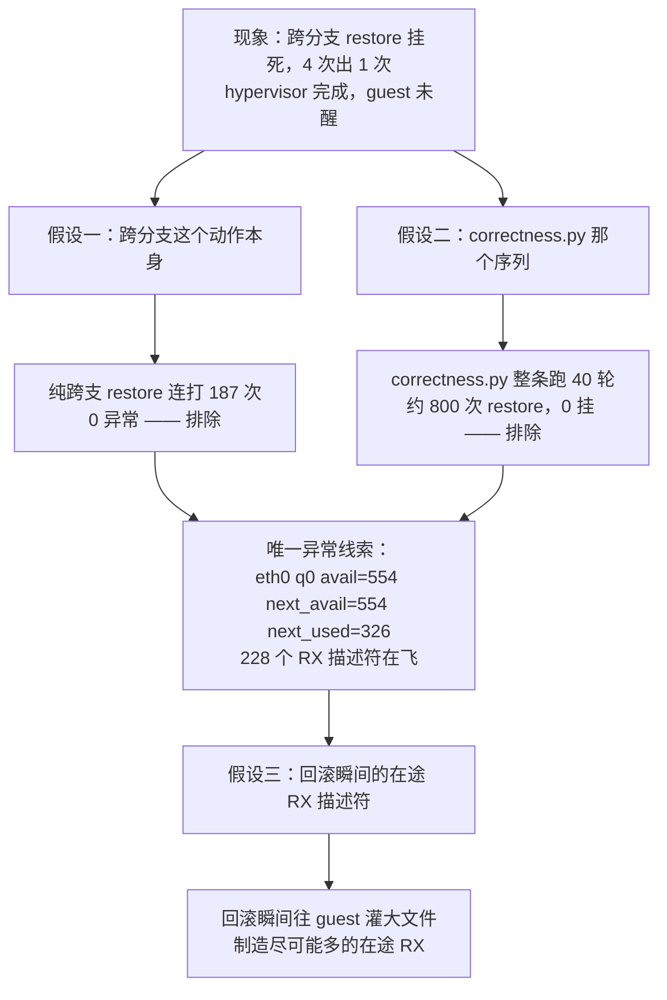

# 22 · 功能正确性测试

> 六个脚本怎么证明「回滚之后，沙箱还是回滚那一刻的那个沙箱」，以及每一条断言为什么长成那样。
> **读者**：接手者 / 评审 / 上机验收的人　**预备**：[第 8 篇](08-memory-diff-tree.md)、[第 14 篇](14-failure-semantics.md)、[第 16 篇](16-lifecycle-and-portability.md)
> **代码**：[`../../benchmark/checkpoint_verify.py`](../../benchmark/checkpoint_verify.py)、[`../test-950/correctness.py`](../test-950/correctness.py)、
> [`pause_verify.py`](../test-950/pause_verify.py)、[`compat_matrix.py`](../test-950/compat_matrix.py)、[`hdbss_evidence.py`](../test-950/hdbss_evidence.py)、[`loop.py`](../test-950/loop.py)

[第 17 篇 §3.2](17-observability-and-verification.md#32-checkpoint_verifypy只证正确性) 已经给过验收脚本的**梗概**。
本篇是详述：每一类断言解决的是哪一种「测试通过但什么也没证明」，项数怎么数出来，
判据在什么条件下会失效。

## 0. 本篇要回答的问题

1. 「回到那一刻」这句话，怎么翻译成机器能判定的断言？为什么要三重证据，最硬的一条是哪条？
2. `checkpoint_verify.py` 报的 **59 项**是哪 59 项？它是不是一个常数？
3. 树形语义（分叉、跨最近公共祖先、删除、失败）为什么需要另一个脚本，它的 **31 项**怎么构成？
4. 有没有哪条判据**本身**会失效？失效时脚本会报错还是照样打 `ALL PASS`？
5. 一个四次里出一次的偶发挂死，怎么一步步缩小到可复现？

---

## 1. 什么叫「回到那一刻」

回滚的正确性不能用「没报错」来判。restore 返回成功、沙箱还能执行命令，
这些和「内容真的回到了目标时刻」是两件事——一个什么都不做、只返回 `true` 的实现
也能满足前两条。所以所有正确性脚本都用**同一组三重证据**：

| 证据 | 观测点 | 它单独能证明什么 | 它单独证明不了什么 |
|---|---|---|---|
| 内存标记 | `/dev/shm/marker`（tmpfs） | tmpfs 完全在 guest RAM 里，永远不落虚拟盘，所以它变回去只可能是**内存**被搬回去了 | 只有一行字，一页命中不代表一大片 |
| 内存大块 | `/dev/shm/blob` 的 md5（`checkpoint_verify.py` 默认 128 MB，`correctness.py` 用 0–512 MB 分档） | 上百 MB 全部逐字节对上，排除「碰巧那一页对了」「共享零页」这类巧合 | 磁盘那一半 |
| 磁盘标记与大文件 | 根文件系统上的 marker 与 32 MB 文件的 md5 | 磁盘视图也被换掉了 | 元数据、删除动作 |

三重证据仍然不够硬——它们都是「内容」，理论上可以靠记账重放伪造出来。
最硬的一条是**进程**：

> 再加一条最硬的证据：快照前起的后台进程，恢复后 PID 和启动时刻都不变 ——
> 说明是内存被搬回去了，不是虚机重启了。
> ——`checkpoint_verify.py` 文件头

`checkpoint_verify.py` 把这条推到极限：先 `kill -9` 掉那个进程，再回滚，
它必须连同 PID 与启动时刻一起活回来（脚本第 5 节）。
**能复活一个已经被杀掉的进程**，是重放式实现绝对做不到的。

同样的道理适用于磁盘那一半：

> 新建能回滚不稀奇，**删除和改属性能回滚**才说明是块级快照而不是补文件。

---

## 2. `checkpoint_verify.py`：一条直链上的 59 项

这是交付态脚本，零共享依赖、单文件、默认参数直接跑。它只走**一条直链**
（三代 A → B → C），图的是好读、跑得快；树形语义交给 `correctness.py`（§3）。

### 2.1 三代现场是怎么设计的

三代不是「同一件事做三遍」，每代都换掉**全部**观测点，另外各自动一样「不好回滚」的东西：

```python
GENS = [
    ("A", "600", "create"),
    ("B", "640", "delete"),
    ("C", "755", "keep"),
]
```

- **`victim` 文件**：A 建它、B 删掉它、C 保持删掉。于是「回到 A」必须让一个**已被删除的文件复活**。
- **权限位**：三代分别 600 / 640 / 755。于是回滚必须连 inode 元数据一起回，光有数据块不够。
- **落点**：标记写在 `/`、`/etc/ckpt-root.conf`、`/ckpt-root/` 下，**不是** `/home/user`。
  用户目录在 e2b 里另有挂载，只测它等于只测了一层。

这三样合起来钉死一个结论：回滚换掉的是**整块磁盘视图**，不是在文件层面打补丁。

### 2.2 先自证「这个检查会失败」

每次恢复后脚本会打一条「11 项现场全部一致」。可是**如果这 11 项在三代之间本来就一样，
这句 PASS 什么也没证明**——一个永远返回真的测试比没有测试更糟。

所以在开始回滚之前，脚本先把三代现场并排打成一张表，逐项确认它确实随代变化
（`checkpoint_verify.py:504-509`）：

```
  项                   gA                        gB                        gC
  内存标记             A                         B                         C
  内存 blob md5        00a3083d3bac              78c4480c5882              feb20a7d662d
  victim 在不在        在                        不在                      不在
  权限位               600                       640                       755
  心跳 PID             220                       220                       220     ← 三代同值（应该的）
```

11 项里有 2 项（`hb_pid`、`hb_start`）被显式排除在区分度校验之外——
它们不是「现场」，是「同一个进程没被重启」的证据，**三代同值才是对的**。
剩下 **9 项**必须各不相同，这是一条断言；「那 2 项必须相同」是另一条断言。
两条方向相反，合起来才把这张表钉住。

### 2.3 活体判据为什么不能用时间

每次快照后、每次恢复后都跑一遍活体检查。这里有一个容易写错的地方，
脚本注释直接写了下来：

> 也不能拿"墙钟往前走"当活体判据：恢复会把 guest 的单调时钟一起拨回快照那一刻
> （实测 `/proc/uptime` 6.77 → 1.70），时间倒流是对的行为，不是故障。

这是 [第 12 篇 §5](12-rollback-pitfalls.md#5-时间) 的直接后果。所以活体判据只用**计数器**：
后台心跳 0.2 秒一拍往日志里追加一行，脚本分两段各数 1.5 秒，
**硬断言只要求 `g1 + g2 >= 1`（在推进），不要求速率**：

> 恢复后紧接着的一两秒里，那个 0.2 秒一拍的循环偶尔只跳一两下（见过 1.5s 只 +1 行，
> 同一位置上一轮是 +8）。进程明明在推进，判成失败并说"vCPU 没恢复"是错的诊断。

节奏（`+7，+8`）照样打印出来给人看，慢的时候加一行「偏慢」提示——
**打印但不判定**，是这类噪声大、信息量也大的观测量的正确处理方式。

### 2.4 `mem_mode` 断言，以及它依赖哪一版 SDK

树根必须自包含所以是全量，之后每代只写脏页所以是增量。
增量档被报成 `full`，说明脏页跟踪压根没开——**测试全过，但测的不是增量**
（[第 21 篇 §1](21-test-overview.md#1-为什么这套方案的测试要格外小心)把它列为第一种静默失效）。
脚本因此加了两条断言：`gA == "full"`、`gB / gC == "incremental"`。

这条判据要成立，需要三段全都在：

| 段 | 位置 | 缺了会怎样 |
|---|---|---|
| 服务端在 `CreateCheckpoint` 响应里带 `mem_mode` | proto 字段 2（[第 17 篇 §2.1](17-observability-and-verification.md#21-memmode每次调用都回报)） | 字段为空 |
| SDK 客户端把它填进 `CheckpointInfo` | `sandbox_sync/checkpoint.py:115` | 属性为 `None` |
| `CheckpointInfo` 有这个属性 | `e2b/sandbox/checkpoint/types.py` | `getattr` 落空 |

脚本取值用的是 `getattr(ck, "mem_mode", None) or "?"`。任何一段缺失，
结果都是 `"?"`，而脚本的处理是**跳过这两条判定**、打印一行说明、继续跑完其余项：

```
  （服务端没有报 mem_mode 字段，跳过全量/增量的判定）
```

于是**防「增量静默退化成全量」的这道判据，自己也会静默失效**——
这是第四种静默失效，也是全套测试里最容易被漏看的一条。
实测对照非常干净：920B 2026-09-04 同一个脚本跑三轮，装了交付的 SDK 覆盖层那轮是
**59/59 ALL PASS**，另外两轮用别的 SDK，三代全报 `mem_mode=?`，末行是
**57/57 ALL PASS**。57 和 59 都是「全部通过」，差别只有把两份日志并排才看得出来。
2026-09-08 那轮基准也是全程 `mem_mode=?`（`benchmark/checkpoint-bench-对比.md` §5.1），
当时靠旁证顶上：内存产物第一代 2048 MB（整份 guest RAM）而第七代只有 276.5 MB。

两条应对，都写在这里备查：

1. **装 SDK 覆盖层是这条判据有效的前提。** 覆盖层的 `install.py` 在安装时就自检
   `CheckpointInfo` 与 proto 两侧都有 `mem_mode`（`install.py:99-103`），装不上会报错而不是降级。
   验收流程（[第 26 篇](26-acceptance-runbook.md)）把它列为前置步骤，就是为了这个。
2. **把判据换成不依赖服务端字段的量。** `checkpoint-bench-对比.md` §5.1 给的建议是改判
   「内存产物是否接近 guest RAM 总量」——宿主机上一个 `st_blocks` 就能得到，成本更低。
   ——推论：跳过还应当在结果里**留痕**（比如末行打「59 项中跳过 2 项」），
   否则 57 和 59 在报告里长得一模一样。

### 2.5 59 项怎么构成

59 项来自三种断言单元的组合。先看单元：

| 单元 | 一次贡献几项 | 内容 |
|---|---|---|
| `verify_live()` | **5** | 还能执行命令 / 根文件系统能写能读回 / 还能起新进程 / 新进程能算出正确结果 / 快照前的后台进程仍在推进 |
| `verify_scene()` | **2** | restore 的 API 返回成功 / 11 项现场全部一致 |
| `mem_mode` | 2 | 树根是全量 / 后两代是增量 |
| 区分度自证 | 2 | 9 项现场三代各不相同 / 心跳 2 项三代同值 |

再按脚本的五节数（默认参数：`--rounds 3`）：

| 场景（脚本节） | `verify_live` | `verify_scene` | 其他 | 小计 |
|---|---|---|---|---|
| 1. 建三代现场 A / B / C | 3 × 5 = 15 | — | `mem_mode` 2 + 区分度 2 | **19** |
| 2. 逐级回退 C → B → A | 1 × 5 = 5 | 2 × 2 = 4 | — | **9** |
| 3. 跨 2 代前滚 A → C | 1 × 5 = 5 | 1 × 2 = 2 | — | **7** |
| 4. A / C 交替 3 轮 | 1 × 5 = 5 | 6 × 2 = 12 | — | **17** |
| 5. `kill -9` 心跳后回滚到 A | 1 × 5 = 5 | 1 × 2 = 2 | — | **7** |
| **合计** | **35** | **20** | **4** | **59** |

第 2 节只在第一次回退后做活体检查（`first` 标志），因为活体检查里有两段 1.5 秒的等待，
每次都做会让脚本变慢而信息量不增加。

与 950 上 2026-08-29 那份日志（`../test-950/reports/950-verify-20260829/checkpoint-verify.log`）
逐条核对，59 条 `[PASS]` 的分布与上表**完全吻合**：15 + 2 + 2 + 9 + 7 + 17 + 7 = 59。

**59 不是常数**，三处会变：

- `--rounds r`：第 4 节是 `4r + 5` 项，`r` 每加 1 多 4 项（默认 `r=3` 给 17）。
- **模板里没有 `python3`**：算术那项会被跳过，每次活体检查降为 4 项，总数变成 52。
  `base` 模板有，换模板要留意。
- **有失败时分母会变大**：`verify_scene` 全过是 2 项，有 `k` 项不一致就是 `1 + k` 项
  （每个不一致项单独记一条 FAIL，附「期望 X 实际 Y」）。所以不要把 59 当固定分母，
  要看的是末行的 `✓ N 项校验全部通过` 与 `[FAIL]` 条数。

逐项比而不是比一个总哈希，理由写在 `verify_scene` 的 docstring 里：

> 不一致时要能直接说出**是内存没回来还是文件没回来**，一个总哈希只会告诉你"不一样"。

### 2.6 怎么读输出

按从上到下的顺序，四段各看一件事：

| 段 | 看什么 |
|---|---|
| 开头两行 | `脏页后端 = hdbss / kvm-wp / off`、`产物落盘 ... 文件系统 = ext4 / xfs`。**这两行是后面所有数字的条件标签**，缺了就不能引用（[第 21 篇 §4](21-test-overview.md#4-测量纪律)） |
| 每代一行 `checkpoint gA 0.283 s mem_mode=full` | `mem_mode` 是不是 `?`（判据是否有效）；三代分别是 `full` / `incremental` / `incremental` |
| 三代现场对照表 | 9 行必须各不相同，2 行必须相同并带 `← 三代同值（应该的）` |
| 末行 | `✓ 59 项校验全部通过。`；失败时列出每条 `[FAIL]` 的名字 |

两处**打印但不判定**的东西不要误读：心跳节奏行（`本次 +7，+8`）是给人看的诊断信息；
末尾那张 API 耗时表**不是性能基准**——样本少、每代现场上百 MB，只当量级看，
基准口径在 [第 23 篇 §1](23-performance-methodology.md#1-指标口径)。
脚本自己也会在跑在软件写保护或脏页跟踪未开时补一行警告。

> 参考量级（950，HDBSS，真盘 ext4，模板 `base`，每代脏内存 128 MB + 根文件系统 32 MB，
> 2026-08-29）：59 项全过；create 全量 0.283 s、create 增量 p50 0.113 s、restore p50 0.100 s（10 次）。
> 完整结果表在 [第 25 篇 §2](25-results-and-compliance.md#2-功能正确性结果)。

---

## 3. `correctness.py`：树形语义的 31 项

### 3.1 与 verify 的分工

`checkpoint_verify.py` 走一条直链，验的是「一次回滚对不对」；
`correctness.py` 验的是**差分树本身的语义**——分叉之后回滚集怎么算、
删掉一个被引用的节点会怎样、算不出回滚集时是拒绝还是硬来。
这些在直链上根本构造不出来。

它是开发态工具箱的一部分，与交付态脚本**不混用**：它有共享模块 `lib.py`、
要读宿主上的产物目录、要人为破坏文件。用法：

```
correctness.py <xfs|ext4> [df挂载点]
```

第一个参数是**方案名不是文件系统名**——它决定第 4 节那条断言比的是 `mem_full` 还是
`mem_diff`（`lib.SCHEME_MEMFILE`）。ext4 方案的产物落在 XFS 格式的卷上是完全正常的
（920B 09-04 那轮就是如此），别被日志里的 `store: ... (xfs)` 带偏。

### 3.2 线性、前滚、跨最近公共祖先

第 1 节建一条五代的链，脏页量分别是 0 / 64 / 256 / 512 / 0 MB——
0 MB 那两代是故意的：**什么都不改的一代也必须能正确回**，它是回滚集为空时的边界。

第 2 节把这条链走遍：逐级回退 ck5→ck4→ck3→ck2→ck1，然后一次前滚回 ck5，再一次回 ck1。
每一跳的 `note` 里写着这一跳的回滚集路径（`路径 (ck4..ck5]`），
和 [第 8 篇 §4.2](08-memory-diff-tree.md#42-定义) 的定义一一对应。

第 3 节才是重点：站在 ck1 上再建 ck6，于是 ck2..ck5 变成旁支。脚本先断言
`ck6.parent_id == ck1`（树真的分叉了，不是接在链尾），再在两条支之间来回跳。
`ck6 → ck3` 这一跳的回滚集是 `ck6→ck1` 与 `ck3→ck2→ck1` 两段的并，
最近公共祖先是 ck1——[第 8 篇 §4.5](08-memory-diff-tree.md#45-最近公共祖先怎么求) 讲的就是这一步。
后面再建 ck7（父节点 ck5），把 LCA = ck2 的情况也覆盖掉。

### 3.3 删除语义

删除是差分树最容易写错的地方：被后代依赖的条目**不能物理删**，
但用户又要求「删掉」。实现的答案是隐藏（[第 8 篇 §9.2](08-memory-diff-tree.md#92-隐藏)、
[第 14 篇 §5](14-failure-semantics.md#5-隐藏条目)）。第 4 节把这个语义拆成四条**产物级**断言：

| 断言 | 为什么 |
|---|---|
| `manifest.hidden == true` | 条目还在，只是不可见 |
| `mem_bitmap` 侧车**保留** | 跨这个纪元回滚要用它算回滚集 |
| `snapfile` 已丢弃 | 隐藏条目不再是恢复目标，虚机状态没人要 |
| ext4 方案的 `mem_diff` **必须留**；XFS 方案的 `mem_full` 可丢 | 两套的内容解析规则不同：差分树的后代靠祖先的差分解析内容，XFS 方案每代自足 |

第四条是**唯一一条两套结论相反的断言**，也正是它证明了「两套通过 API 行为一致」
这句话止步于哪里。断言完产物再断言行为：`list` 里看不到 ck2，但跨 ck2 纪元的回滚照样成功。
最后删一个叶子（ck6），它必须被**物理**删除，其余分支不受影响。

### 3.4 失败语义

第 5 节人为把 ck5 的 `mem_bitmap` 侧车改名移走，再从 ck7 回滚到 ck4——
这条路径必须经过 ck5 的纪元，回滚集算不出来。要求是三条：

1. **拒绝**（抛异常，不是返回 false 后继续）；
2. **拒绝没有动沙箱状态**（`after == before`，两个标记原封不动）；
3. **沙箱在拒绝之后照常运行**（`echo alive`）。

实测报的错是 `failed to materialize revert files: failed to read sidecar of checkpoint...`，
沙箱状态停在 ck7。这正是 [第 14 篇 §1](14-failure-semantics.md#1-总纲静默损坏比报错糟得多)
那条总纲的可执行版本：**宁可报错，不可静默损坏**。侧车放回去之后再回滚立刻又成功，
说明拒绝没有留下任何半吊子状态。

### 3.5 31 项怎么构成

| 节 | 项数 | 构成 |
|---|---|---|
| 1. 线性链 | **2** | 树根 `mem_mode` + ck2..ck5 全增量 |
| 2. 逐级回退 + 前滚 | **7** | 7 次 restore，每次一条三重证据断言 |
| 3. 分叉 / 跨 LCA | **8** | 2 条父节点断言 + 6 次跨支 restore |
| 4. 删除语义 | **9** | 4 条产物断言 + `list` 不可见 + 3 次跨隐藏纪元 restore + 1 条叶子物理删除 |
| 5. 失败语义 | **5** | 1 次站位 restore + 拒绝 + 状态未变 + 沙箱存活 + 修复后恢复 |
| **合计** | **31** | |

第 1 节那条树根断言会随部署走：`CHECKPOINT_FULL_ROOT=false` 时树根本身也是差分
（[第 8 篇 §6.3](08-memory-diff-tree.md#63-全量根为什么是默认)），脚本读 `lib.FULL_ROOT`
自动切换期望值——**判据跟着部署配置走，不是硬编码**。

> 920B（Kunpeng 920，软件写保护，产物卷 XFS，ext4 方案，2026-09-04）：31/31 ALL PASS。

---

## 4. `pause_verify.py`：一个自洽的静默损坏

这个脚本是为一个具体的 bug 写的，值得完整讲，因为它示范了**一整类**测试盲区。

**bug 是什么。** checkpoint 会把沙箱当前的写层封存、另开一层
（[第 10 篇](10-disk-layering.md)）。所以从第一次 checkpoint 起，当前层里只装着那之后的写，
更早的写在下面的 `SealedView` 里。而原生 `Pause` 用来构建沙箱快照的 `ExportDiff`
**只取了当前层**（[第 4 篇 §2](04-e2b-native-snapshot.md#2-打快照sandboxpause-的六步)）——
于是做过 checkpoint 的沙箱一 pause 就丢掉上次 checkpoint 之前的所有写。

**为什么没有任何东西报错。** 引用提交信息（`173a3d5`）：

> Getting that wrong lost every write made before the last checkpoint and said nothing
> (the diff header is derived from what was exported, so it agreed with itself).

diff header 是**从导出内容推出来的**，所以它和导出内容永远自洽。
没有独立的第二方来源可以打脸——校验和对得上，块数对得上，只是内容少了一半。

**为什么已有的测试全抓不到。**

| 已有测试 | 为什么抓不到 |
|---|---|
| Go 单测（`export_layers_test.go`，3 个用例） | 测的是修好之后的函数，覆盖的是层栈压平的逻辑，不经过真实 pause / resume |
| `checkpoint_verify.py`、`correctness.py`、`loop.py`、`timing.py` | **一个都不做 pause**。checkpoint/restore 的路径全绿，与 pause 的组合没人走过 |

**为什么 `O_DIRECT` 是关键。** 第一次验这个修复时是**假通过**的：

> 小文件走 guest page cache 读回来是对的，能把这个 bug 完全盖住 —— 当初第一次
> 验就是这么假通过的。

pause / resume 并不清 guest 的页缓存（内存那一半是完整搬回来的），
所以刚写完的小文件从缓存里读一定是对的，根本没碰到磁盘。脚本因此规定：
写 16 MiB 随机数据（大到不可能全留在缓存里），读回时用 `dd iflag=direct` 绕开页缓存，比 sha256。
`compat_matrix.py` 沿用同一条规矩。

**结构。** checkpoint 前写 `before.bin` → checkpoint（封层）→ 写 `after.bin` → pause / resume →
两份都用 `O_DIRECT` 读回。**抓 bug 的是 `before.bin` 那条**：它落在被封存的层里，
是唯一会丢的那份；`after.bin` 是对照，证明脚本本身在正常工作。

脚本第 6 节把另一条边界钉住：pause / resume 之后回不到 pause 之前的 checkpoint。
注释说明了为什么这也是一条**断言**而不是一句注释：

> 这里把它钉住 —— 哪天行为变了（无论是变得支持、还是变成静默返回错数据），这条会立刻告诉我们。

> 920B 2026-09-04：用两版不同的 SDK 各跑一轮，`before.bin` / `after.bin` 两条都 PASS。

---

## 5. `compat_matrix.py`：与原生生命周期的组合矩阵

本方案给 e2b 加了两个操作（`checkpoint.create` / `checkpoint.restore`），
e2b 原本有四个（`create` / `connect` / `pause` / `kill`，其中 `connect` 对已 pause 的沙箱等同 resume）。
两组操作动的是**同一个沙箱的磁盘层栈和内存**，而在 §4 那个 bug 之前，
没有任何测试覆盖过它们的**组合**。

每格给出三种判定之一，定义写在脚本头部：

| 判定 | 含义 | 它意味着什么 |
|---|---|---|
| `OK` | 能做，做完之后沙箱和数据都对 | —— |
| `REFUSED` | 服务端明确拒绝，且没有留下半吊子状态 | **边界，不是缺陷**。拒绝本身是安全的 |
| `BROKEN` | 能调用但结果不对，**或本该能做的原生操作被我们弄坏了** | 唯一的真问题 |

`BROKEN` 这一档的后半句是这个脚本存在的理由：它要回答的不是「我们的功能好不好用」，
而是「**我们有没有弄坏别人的功能**」。所以第一组（A）是**基线**——
先在没有 checkpoint 的沙箱上跑一遍 pause → connect，确认这些原生能力本来就是好的，
后面才有资格说「是我们弄坏的」。

六组共 15 格：A 基线 1 格；B checkpoint 之后做原生操作 8 格；C restore 之后做原生操作 3 格；
D 三次 checkpoint（**多层封存**）之后 pause 1 格——原 bug 的本质是「当前层之下还有 N 个
`SealedView`」，一层测不透；E 反向（pause/resume 之后再走完整 checkpoint 流程）1 格；F kill 1 格。

两个 `REFUSED` 是：

1. **pause / resume 之后回不到 pause 之前的 checkpoint**（`checkpoint ... not found`）。
   pause 把当时的层栈整体压进沙箱快照，resume 起来的是新实例，
   checkpoint 账本不跨 pause。同一组里 `checkpoint.list` 返回 0 个、
   pause 之后**新建**的 checkpoint 可以正常 restore——所以这是账本边界，不是功能损坏。
   它属于 [第 16 篇 §1.3](16-lifecycle-and-portability.md#13-什么情况下-checkpoint-会失效)
   那张失效事件表的同一类，且账本不从磁盘加载这一点见
   [第 16 篇 §3.3](16-lifecycle-and-portability.md#33-账本不从磁盘加载)。
2. **kill 之后不能 connect**。这是 e2b 本来就有的行为，**与本方案无关**，
   放进矩阵是为了让基线完整。

> 920B 2026-09-04：**OK 13 / REFUSED 2 / BROKEN 0** —— 没有任何 e2b 原生能力被 checkpoint/restore 破坏。

---

## 6. `hdbss_evidence.py`：能力不等于数据面

[第 19 篇 §4.2](19-kunpeng-platform.md#42-hdbss-的三层证据) 已经给过 950 与 920B 的三层证据对照表。
这里讲的是**为什么需要三层**：前两层都只说明「能力打开了」，不说明「硬件真的在记脏页」。

| 层 | 问什么 | 怎么问 | 局限 |
|---|---|---|---|
| L1 能力 | 宿主 KVM 认不认 cap 502 | `cap_test.c`：先 `KVM_CHECK_EXTENSION`，再在一个临时 VM fd 上真的 `KVM_ENABLE_CAP(502, order 1)` | 与是否在跑沙箱无关；**两者可能不一致**，所以两个都问 |
| L2 自报 | Firecracker 为**这个沙箱**选了哪个后端 | `GET /` 的 `dirty_tracking` 字段 → `hdbss` / `kvm-wp` / `off` | 是 Firecracker 的自述，不是数据面证据 |
| L3 数据面 | 硬件到底有没有在记 | 写密集负载下的两个量 | 需要宿主机权限；`kvm_exit` 那项要 `perf` |

L3 的物理含义值得讲清楚。软件写保护下，每个「干净页」的第一次写都要陷出一次
（stage-2 write fault），于是：① `kvm:kvm_exit` 次数 ≈ 被写的页数（每页约 1 次）；
② **刚做完 checkpoint 之后的第一遍写明显慢于第二遍**——因为 checkpoint 会把所有页重新写保护，
第一遍要把陷出的代价全付一遍，第二遍页面已经可写。HDBSS 下 CPU 自己记录，
两条都不成立，冷/热比应该接近 1。

脚本为此做了一件容易忽略的事：**先把文件整份分配出来**，
再跑两遍计时的覆写（`conv=notrunc`），这样两遍都不用付 guest 侧的页分配成本，
剩下的差别只有 stage-2 写故障。

**920B 是这条判据的负样本**：那台机器没有 HDBSS，量到冷/热 = 4.5~5.4
（09-04 单次 4.56），正是写保护的特征。有了这个负样本，950 上的判定才有参照：
如果 `dirty_tracking=hdbss` 而冷/热仍然落在 4~5，说明**能力启用了但数据面没生效**，
要拿 dmesg 和 Firecracker 日志一起看。判据背后的机制见
[第 7 篇 §6.1](07-dirty-page-tracking.md#61-软件写保护的代价模型)。

---

## 7. `loop.py`：稳定性

前面几个脚本各跑一遍就给结论，`loop.py` 回答的是另一个问题：**跳几百次会不会跳着跳着就不对了。**
状态泄漏和累积误差（位图没清干净、层栈引用计数漂移）通常不会在第一次露出来。

两处设计：

- **默认在两个检查点之间交替（a / b），而不是反复回到同一个。** 交替才会真正换回滚集；
  反复回同一个检查点，回滚集每次都一样，测不到路径计算。`--same` 保留作对照组——
  920B 上「慢阶段」现象只在交替模式下出现，两种模式对跑才能把它和本方案的改动区分开。
- **任何一次内容校验失败立刻停下并打印现场。**

  > 静默的内容错误比崩溃危险得多。

  ——所以判定用的不是「restore 返回成功的比例」，而是每一次都做完整的三重证据校验，
  `failures` 必须是 0。分位数（p50 / p90 / max）是顺带出的，**不作判定**。

脚本尾部还会在出现慢样本时打一段说明：920B 上观察到过「慢阶段」——两个检查点交替回滚时
约一半沙箱会进入每次回滚后 guest 内核忙 0.5~2 s 的状态（疑似 khugepaged / timer IRQ 风暴），
**旧 Firecracker + 旧 orchestrator 同样出现，与本方案改动无关**，同一检查点反复回滚不出现。
这条至今没有定位（920B 上没装 `perf`），如实记在这里。

> 920B 2026-09-04（ext4 方案，软件写保护，两个检查点交替）：200 次，failures = 0，
> p50 0.044 s / p90 0.049 s / max 0.056 s，无一次超过 1 s。

---

## 8. 偶发问题怎么复现

2026-08-25 出过一次跨分支回滚挂死：**四次里出一次**。现象是

> restore 返回不了，FC 侧 `PUT /snapshot/rollback` 200 OK、resume 也成功、设备全部 kick 到，
> 但 orchestrator 之后一直等在 envd 上，61 s 后 healthcheck failed。
> 也就是 **hypervisor 那半边干完了，guest 没醒过来**。

这一节讲的是**方法**，不是这个 bug 的修复（那属于 [第 12 篇 §2](12-rollback-pitfalls.md#2-网络-rx-描述符缓存)）。
复现脚本留在工作区的 `tmp/` 下，**不随文档交付**——它们是一次性的追查工具，
不是验收资产，这条界线值得守住。



五条可以复用的做法：

1. **先把「慢」和「挂」分开。** 复现脚本给 restore 设 20 s 超时，理由写在注释里：
   挂死那次等了 60 s 才被 healthcheck 打断，而正常跨支 restore p50 约 0.1 s、最慢一次 0.47 s——
   20 s 足够把两者分开，又不至于每次挂死都要等一分钟。
2. **复现脚本不能被单次失败打断。** `correctness.py` 挂住就整条挂掉，一晚上只能拿到一个样本；
   复现脚本超时后记下现场、接着跑下一轮，并把结果**边跑边写 JSON**，中途被打断也不丢数据。
3. **阴性结果也是结果，而且要写下来。** 187 次纯跨支 0 异常，说明触发条件不是「跨分支」本身；
   40 轮 correctness 0 挂，说明也不是那个序列本身。两条阴性把搜索空间砍掉一大半，
   逼出「问题在别的维度上」这个判断。
4. **从唯一异常的观测量出发施压。** 挂死那次的设备状态是仅有的异常线索
   （228 个 RX 描述符在飞）。其余成功的回滚也有类似 lag，所以它不是充分条件，
   但它是**唯一能施加压力的方向**——于是第三个脚本在回滚瞬间往 guest 灌大文件
   （host → guest 就是 RX 方向），不等它安顿就立刻发 restore。
5. **失败那一轮自动抓现场。** 循环脚本在失败时按沙箱 id 把 orchestrator 日志切出来存好；
   过了的轮次日志直接删掉。事后再翻几百轮的日志是翻不动的。

---

## 9. 小结

- **正确性判据必须先自证会失败。** 三代现场在比对之前先验区分度（9 项必须各异、2 项必须相同）；
  兼容矩阵在测组合之前先测原生基线。少了这一步，`PASS` 可能什么都没证明。
- **最硬的证据是进程。** 内容可以靠重放伪造，`kill -9` 之后连同 PID 与启动时刻一起复活不能。
  磁盘那半的同类证据是**删除与权限位**能回滚。
- **59 项 = 35（7 次活体检查 × 5）+ 20（10 次现场比对 × 2）+ 4（`mem_mode` 2 + 区分度 2）**，
  与 950 2026-08-29 日志里 59 条 `[PASS]` 逐条吻合；它随 `--rounds`、模板里有没有 `python3`、
  以及是否有失败项而变，不是常数。
- **31 项 = 2 + 7 + 8 + 9 + 5**，覆盖线性 / 前滚 / 分叉跨 LCA / 删除语义 / 失败语义，
  其中「隐藏条目的内存产物能不能丢」是两套方案唯一结论相反的断言。
- **判据本身会失效。** `mem_mode` 缺失时脚本**跳过**而不是报错，57/57 与 59/59 都打「全部通过」。
  装 SDK 覆盖层是这条判据有效的前提；更稳的修法是改判内存产物的体积。
- **走缓存的读会盖住磁盘层的错。** pause 那个 bug 第一次验就是这么假通过的，
  凡是验磁盘内容一律 `O_DIRECT`。
- **`REFUSED` 是边界，`BROKEN` 才是缺陷。** 13 / 2 / 0 的含义是：两条已知边界，
  零个被弄坏的原生能力。
- **能力开了不等于数据面生效**，所以 HDBSS 要三层取证；920B 的冷/热 4.5~5.4 是那条判据的负样本。

## 延伸阅读 / 下一篇

- 这些脚本在整个测试体系里的位置、以及全书唯一那张测试矩阵：[第 21 篇 §3](21-test-overview.md#3-测试矩阵)
- 本篇提到的每一个结果数字，完整结果表与条件标签：[第 25 篇 §2](25-results-and-compliance.md#2-功能正确性结果)
- 上机怎么跑、每条命令的期望末行：[第 26 篇](26-acceptance-runbook.md)，
  以及开发态工具箱自己的 [`README.md`](../test-950/README.md)「判据速查」
- **下一篇**：[第 23 篇 · 性能测试：指标与方法](23-performance-methodology.md) —— 正确性说完了，接下来是「多快」。
