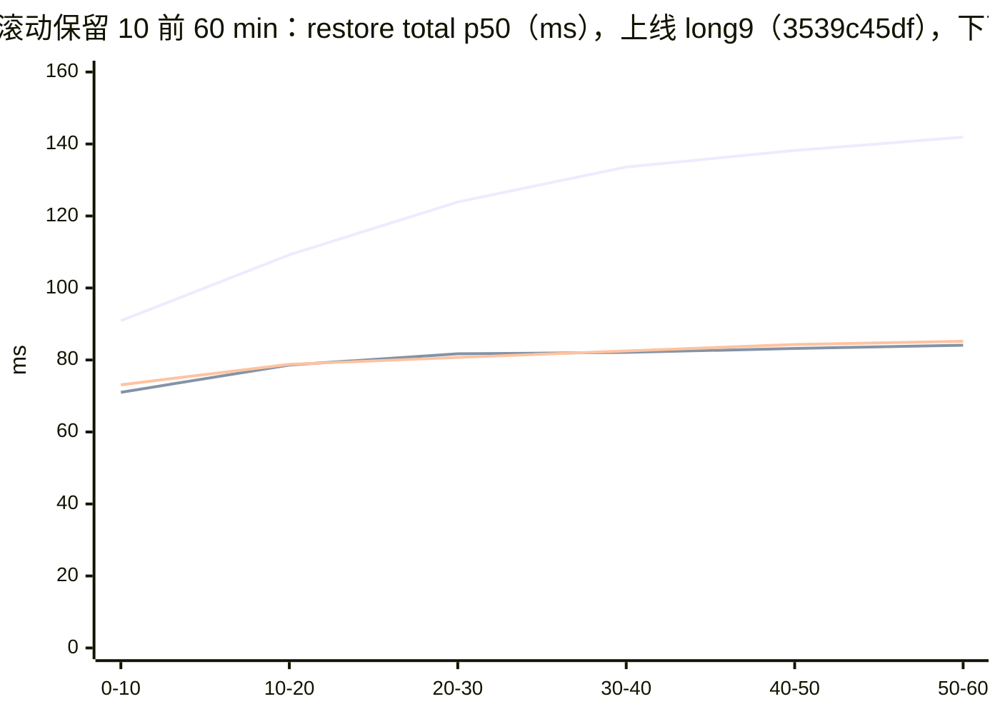
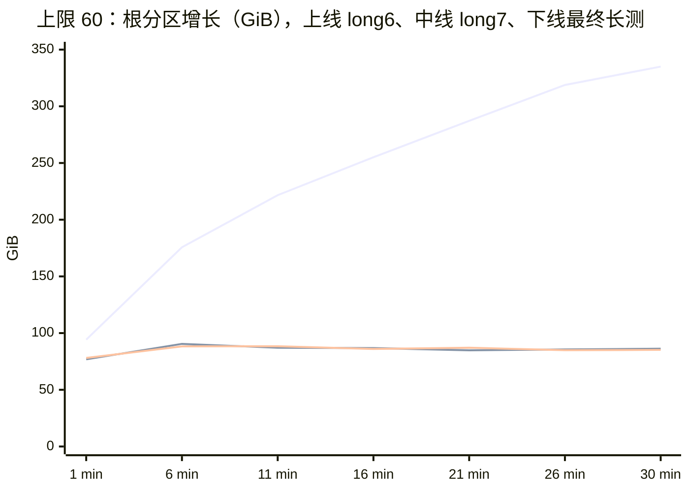
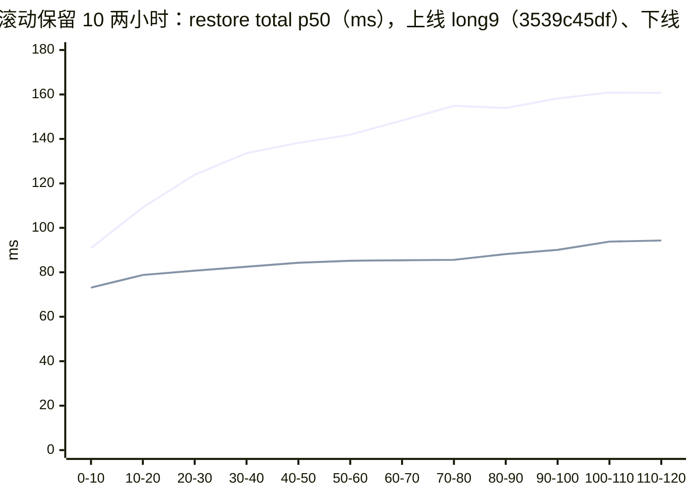

# 22 · 长跑与并发实测

## 本章目标

读完本章，你应该能：

1. 说清为什么分档基准之外还必须长跑，并举出"积累类、概率类、随时间劣化类"问题各一个本次的真实例子；
2. 按本章给的配置复现一轮长跑：用哪个驱动、三种负载加串口段各模拟什么用法、每次 restore 怎么逐项校验、旁路采哪些量；
3. 读懂轮次总表，知道 long1 到 long11 每一轮用的是哪个二进制、开了什么、要回答什么问题；
4. 对本次修掉的每个问题，说出它在哪一轮暴露、证据链是什么、修完在哪一轮验证、前后数字是多少；
5. 判断当前版本在长时间并发下的正确性、延迟、磁盘与内存是否稳定，以及到 950 上要重测哪些项。

上一章（[21](21-benchmarks-and-compliance.md)）用单沙箱串行的分档基准回答了"一次 checkpoint、一次 restore 要多久、达不达标"。那是在理想条件下量出来的：
一个沙箱、一个调用方、页缓存全热、每遍一个新沙箱。真实节点上是几十个沙箱同时反复 checkpoint、restore、delete，
而且一跑就是几小时、几天。本章记录的是在 920B 上连续两天两夜的长跑与并发实测：一共跑了哪些轮、每一轮要回答什么、
暴露了哪些短测看不见的问题、每个问题怎么定位和修掉、修完之后的数字是多少，以及还剩哪些长尾。下一章（[23](23-quickstart.md)）起是第六部分，讲怎么用、怎么部署运维。

本章所有数字都来自 **920B（KVM 软件写保护，`kvm-wp`）**，条件标签见 [21 §1](21-benchmarks-and-compliance.md#1-条件标签)。
**950（HDBSS）上的长跑数据待补**，这些数字不能直接当作 950 的指标。口径（三个钟、分位数取法、条件标签）只在
[20](20-performance-methodology.md) 定义，本章只写用法与配置。

---

## 1. 为什么要长跑

分档基准每一档只跑几十到一百次迭代，每遍都换新沙箱，测的是"一次操作本身"。有三类问题它天然看不见：

| 类别 | 特征 | 本次的真实例子 |
|---|---|---|
| **积累类** | 每次操作留下一点东西，单次无害，累计到几千、几万次才显形 | 隐藏 checkpoint 无上界积累（§4.8）：可见数被上限卡在 60，目录数却在 30 min 里从 1562 涨到 3943，产物盘增长 340.6 GiB 且没有走平的迹象；rootfs 层文件从不回收（§4.7）：30 min 后层文件数等于累计 checkpoint 数 |
| **概率类** | 每次操作有极小概率撞上一个竞态或长尾，短测里期望次数小于 1 | 流式命令偶发截断（§4.1）：实测约每万次代理请求 0.5 次，16 沙箱 30 min 才 5–10 次；Go GC 的长暂停（§4.4）：修复前一轮 30 min 里 ≥ 100 ms 的有 180 次（long2），最长一次 609 ms（long1），单沙箱串行的基准里一次也看不到；16 路并发首个增量 checkpoint 的两种形态（§4.11） |
| **随时间劣化类** | 某个量随运行时间单调增长，操作耗时跟着涨 | 视图块数（§4.9）：guest 的 ext4 不断在新块上重写小文件，2 h 里每沙箱视图块数从约 4.1 万涨到约 9.4 万，restore p50 随之从 90.9 ms 涨到 160.7 ms；`commit_index` 随链深线性变慢（§4.2）：链深 2000 以上时 p50 132 ms |

还有第四类是**跨沙箱干扰**：同一节点上的沙箱共享账本锁、宿主 conntrack 表和一个 memory cgroup（[13 §8](13-state-concurrency-durability.md#8-节点级效应)）。
一个沙箱在锁里删文件、一次宿主表清扫、一次卡在内存回收里的缺页，代价都会落到**别的**沙箱的冻结窗口里。
单沙箱基准没有"别的沙箱"，这类问题只能在并发下看到。

所以本期的做法是：每修一个问题，就用同一套负载再跑一轮 30 min 以上的长跑，对照上一轮。十几轮下来，
既验证了修复，也不断暴露下一个问题。本章 §3 的轮次总表就是这条链。

---

## 2. 负载与判据

### 2.1 驱动：D 段混合稳态

所有长跑都基于 `acceptance/checkpoint_concurrent.py` 的 D 段（四段的分工见 [19 §6](19-testing-and-functional-verification.md#6-checkpoint_concurrentpy并发四段)，
负载的口径定义见 [20 §6](20-performance-methodology.md#6-并发与长跑的测量)）。构造如下：

- **建沙箱**：16 个沙箱，模板 `base`（2 vCPU / 2048 MB，rootfs 940 MiB）。每个沙箱先起一个心跳进程
  （每 0.2 s 往 `/dev/shm/hb.log` 写一行，pid 记在 `/dev/shm/hb.pid`），再预热：内存那份 `/dev/shm/sweep` 写满 96 MB 随机数，
  文件那份 `/bench-root/fsblob` 写满 32 MB 随机数并 `sync`。预热的目的见 [20 §3](20-performance-methodology.md#3-负载构造三种失真)。
- **每个沙箱一个线程**，随机循环，每一步掷一次骰子：
  - 50%：**写脏后 checkpoint**。原地覆写 `sweep` 前 8 MB、`fsblob` 前 4 MB（`dd ... conv=notrunc`，随机数据），
    把本代代号写进 `/dev/shm/gen` 和 `/bench-root/gen`，`sync`，然后 checkpoint；
  - 35%：**restore** 到本沙箱现存 checkpoint 中随机一个；
  - 15%：**delete** 随机一个现存 checkpoint。
  - 现存 checkpoint 不足 2 个时一律走第一种。
- 每次 checkpoint 之前，驱动先在 guest 里读一次"现场"并记下来，作为这个 checkpoint 的期望值。

**每次 restore 之后逐项校验**。驱动在 guest 里执行一段脚本读出 5 个字段，与目标 checkpoint 拍下时记录的值逐项比较，必须完全相同：

| 字段 | 读什么 | 能抓住什么 |
|---|---|---|
| `mem_gen` | `/dev/shm/gen` | 内存没回到目标那一代 |
| `file_gen` | `/bench-root/gen` | 磁盘视图没回到目标那一代 |
| `mem_md5` | `/dev/shm/sweep` 前 4 MiB 的 md5 前 12 位 | 内存内容里有页没回滚或回滚错 |
| `file_md5` | `/bench-root/fsblob` 前 4 MiB 的 md5 前 12 位 | 磁盘块里有块取错层 |
| `hb_pid` | 心跳进程的 pid | 虚机被重启过（内存"对"但不是原地回来的） |

一轮结束时，`D.json` 的 `verified` 字段记"逐项一致数 / 进入校验的 restore 数"。restore 请求本身成功、但紧接着的校验命令被截断的，
不进入校验，也不算不一致（修复前 long2 有 3 次、long3 有 2 次）。

### 2.2 三种负载 + 串口段

同一个驱动，通过服务端开关和驱动参数组合出三种负载，另加一组串口段，各模拟一种使用方式（负载的口径定义见 [20 §6.1](20-performance-methodology.md#61-驱动与负载)）：

| 形态 | 怎么造 | 模拟什么 | 用在哪些轮 |
|---|---|---|---|
| **无上限** | 服务端不设个数上限；驱动随机删，不主动收敛 | 极限压测：链深会长到两千以上，页缓存、回收压力都远超常规。只用来找问题，数字不代表常规负载 | long1–long5；部署后回归 |
| **上限 60** | 服务端 `CHECKPOINT_MAX_PER_SANDBOX=60`；驱动收到 429 不删旧的，只记失败继续随机循环 | 客户"把数量卡住"的常规用法。可见数 20 s 左右就顶到 60，之后约七成的 checkpoint 被 429 拒（服务端在准备阶段就拒绝，不暂停虚机），restore 占比随之升高，restore 频率约为无上限时的 2.5 倍 | long6、ct-opt、d1、long7、最终长测 |
| **滚动保留 10** | 驱动换成 [`rolling_keep10.py`](../scripts/acceptance/rolling_keep10.py)：每个沙箱循环"写脏 → checkpoint → 可见数超过 10 就删最旧的 → 以 0.25 的概率 restore 到保留集合里随机一个并校验，之后从那里继续" | 客户"保留最新 N 个、删最旧"的用法。每次删的都是下一个的父节点，正是隐藏节点积累、合并起作用的场景 | long8、long8 对照、long9、long10、long11 |
| **串口段** | 每段新建一个沙箱，单沙箱随机负载 180 s，旁路抓 tap/eth 报文、采样 vCPU、盯串口输出 | 长时间反复 restore 之后，guest 串口会不会卡死（旧版本出现过，[09 §3.7](09-in-place-rollback.md#37-阶段-6中断控制器)） | 最终版的 10 段 |

滚动保留负载出现任何一次不一致，全体停手、出问题的沙箱不删，留现场（本次从未触发）。
超过 1 h 的长跑必须把建沙箱的寿命显式设大：驱动默认的沙箱 timeout 是 3600 s，到点沙箱被回收，客户端会对着死沙箱空转
（long9 第一次就因此作废，见 §4.12）。

### 2.3 计时口径

长跑的主口径是**服务端 `timings_ms`**：只取驱动起止标记之间的日志行，按 300 s（30 min 的轮）或 600 s（1–2 h 的轮）分段看漂移，分位数用线性插值。为什么不用分档判定用的客户端墙钟、为什么要分段，定义与理由只在 [20 §6.5](20-performance-methodology.md#65-计时口径)。

两个钟在本期差多少，可以用最终长测对一下：服务端 restore `total` p50 / p99 = 87.67 / 171.28 ms，客户端墙钟 90.2 / 178.2 ms；
checkpoint 30.39 / 70.79 对 32.7 / 75.1 ms。p50 差 2–3 ms，是网络往返和代理；p99 差得多一些，是客户端调度。
所以**长跑数字与分档判定表不能直接比**：前者是服务端、多沙箱并发；后者是客户端、单沙箱串行。

### 2.4 旁路采什么

每轮除了驱动自己的 `D.json`，还按 [20 §6.3](20-performance-methodology.md#63-资源判据走平怎么判) 与 [20 §6.6](20-performance-methodology.md#66-旁路取证) 采旁路数据（各路回答什么问题见那两节）。本期各轮实际的频率：产物盘 `df` 10 s；树监视（treemon，只读 manifest，含真实链深与每沙箱视图块数）60 s；GC 每次 GC 一行（`gctrace`，需要细分时加 `CHECKPOINT_RUNTIME_METRICS=1`）；memory cgroup 用量、`failcnt` 与 D 态线程的内核栈 5 s；宿主 `nf_conntrack_count` 5 s；截断全程计数（客户端异常类与两侧 `ReverseProxy read error`）。
20 没有列的一路是**进程资源**：10 Hz 采 orchestrator 的 RSS、线程数、`nbd_inflight`、`procs_blocked`，用来看块设备层是否积压。

并发下看 restore 读了多少，用 `materialize_read_mb`，不用进程级的 `materialize_disk_read_mb`（原因见 §4.5 和 [20 §6.4](20-performance-methodology.md#64-读盘量用哪个键)）。

### 2.5 一轮怎么跑

1. 记录起跑状态：二进制 sha256、orchestrator 进程的环境变量、宿主 netns 数与 nat 规则数；
2. 需要时先清理泄漏的网络槽位（每重启一次 orchestrator 会漏约 290 个，[29](29-troubleshooting.md#9-网络槽位netns泄漏)），
   再带本轮开关重启 orchestrator，跑一遍 smoke 确认栈正常；
3. 起旁路采样，再起驱动；
4. 结束后停旁路，按固定脚本出本轮分析，与上一轮并排；
5. 收尾恢复原栈，再跑一遍 smoke。

起跑条件（尤其 netns 数、cgroup 起始用量）会影响尾延迟，所以每轮的起跑 netns / nat 数都记在分析里；
跨轮对比时，起跑条件不同的只看量级和趋势。

---

## 3. 轮次总表

先把二进制与修复的对应关系列出来（都在 `deltabox-dev` 上，依次叠加；每项修复的原理见右列链接）：

| 二进制 | 在上一个基础上新增 | 原理 |
|---|---|---|
| RPM 部署版 `4af2872c6` | 修复前基线 | —— |
| `cba26f7c1` | index.json 不再每次重写（§4.2）；锁外删文件（§4.3）；GC 直方图取证开关 | [13](13-state-concurrency-durability.md) |
| `baae30b56` | 代理开 full duplex（§4.1） | [25 §5.3](25-errors-timeouts-concurrency.md#53-两类流式截断要分清) |
| `5319de5dc` | 拷贝前 `MADV_POPULATE`（§4.4）；restore 自计读量（§4.5） | [13 §8](13-state-concurrency-durability.md#8-节点级效应) |
| `1b112fbbd` | conntrack 整表扫描与选路（§4.6） | [10 §4](10-rollback-pitfalls.md#4-连接跟踪) |
| `df4b38336` | 层按视图引用计数回收、子节点计数表（§4.7） | [07 §9](07-disk-layering.md#9-层回收按视图引用计数) |
| `0c4c2c5ae` | 隐藏 checkpoint 合并（内存与层，§4.8）；字节配额 | [06 §10](06-memory-diff-tree.md#10-删除隐藏与合并)、[07 §10](07-disk-layering.md#10-层合并) |
| `3539c45df` | 全量根回滚因子恒为全 1（加固，长跑不涉及） | [06](06-memory-diff-tree.md) |
| `8ea5322bf` | 视图装配改位图（§4.9）；`disk_view_read` 计时 | [07 §6](07-disk-layering.md#6-读路径与视图装配) |
| `93ccb02`（部署件，`/usr/bin/template-manager` sha256 `782d6a2a…`） | delete 按实际结果回错误码（id 不存在才回 404，已生效但清文件失败按成功答，其余回 500）；启动时写 checkpoint 能力文件；注释与 Python SDK 的说明文字。restore / checkpoint 热路径与 `8ea5322bf` 相同（`conntrack_flush.go` 只改了注释） | —— |

然后是全部轮次。除注明外都是 16 沙箱、模板 `base`、服务端开 `gctrace`；restore / checkpoint 为服务端 `total` 的 p50 / p99（ms）。
两天的日期是 2026-09-28 与 09-29，时间为北京时间。

| 轮 | 时间 | 二进制 | 形态与开关 | 时长 | restore 逐项一致 | restore p50 / p99 | checkpoint p50 / p99 | 这一轮要回答的问题 |
|---|---|---|---|---|---|---|---|---|
| long1 | 09-28 05:50–06:20 | RPM | 无上限 | 1800 s | 32547 / 32547 | 250.1 / 1148.7 | 115.6 / 738.8 | 修复前的基线长什么样 |
| long2 | 06:55–07:25 | RPM | 无上限；`PROXY_TRACE` 开 | 1800 s | 31680 / 31680 | 309.3 / 1289.4 | 126.1 / 773.5 | 流截断发生在哪一跳、在请求的哪个阶段 |
| long3 | 08:23–08:53 | `cba26f7c1` | 无上限；`CHECKPOINT_RUNTIME_METRICS=1` | 1800 s | 32340 / 32340 | 362.7 / 1535.7 | 70.2 / 680.5 | 去掉 index 热写和锁内删文件后，锁等待与 GC 怎样；长 STW 卡在哪一半 |
| long4 | 09:17–09:47 | `baae30b56` | 同 long3 | 1800 s | 30173 / 30173 | 382.3 / 1705.5 | 76.8 / 800.1 | full duplex 能否让截断归零 |
| long5 | 10:19–10:49 | `5319de5dc` | 同 long3 | 1800 s | 28331 / 28331 | 450.8 / 1698.2 | 91.1 / 759.6 | `MADV_POPULATE` 能否消掉 GC 长暂停；新读量键是否可信 |
| long6 | 10:58–11:28 | `5319de5dc` | **上限 60** | 1800 s | 70702 / 70702 | 193.1 / 337.8 | 34.0 / 128.1 | 常规用法下的基线；有没有常规负载才出现的问题 |
| ct-opt 基线 | 12:12–12:19 | `5319de5dc` + conntrack 子计时 | 上限 60 | 420 s | 17009 / 17009 | 182.7 / 313.1 | 32.3 / 114.0 | conntrack 的时间花在哪一半（不计入总数） |
| ct-opt | 12:30–12:46 | `1b112fbbd` | 上限 60 | 900 s | 41748 / 41748 | 113.5 / 333.3 | 33.7 / 253.1 | 新清扫算法能否把 conntrack 移出冻结窗口 |
| d1 | 13:33–13:48 | `df4b38336` | 上限 60（未开 gctrace） | 900 s | 43352 / 43352 | 107.3 / 192.8 | 32.1 / 93.5 | 层文件是否按视图回收、层数是否等于视图并集 |
| long7 | 16:26–16:56 | `0c4c2c5ae` | 上限 60 | 1800 s | 87973 / 87973 | 105.2 / 191.7 | 31.6 / 80.7 | 合并之后目录、磁盘、链深是否走平 |
| long8 | 17:00–17:30 | `0c4c2c5ae` | **滚动保留 10** | 1800 s | 31443 / 31443 | 106.4 / 202.8 | 36.0 / 81.9 | "保留最新 N 个"用法下是否收敛 |
| long8 对照 | 17:38–17:48 | `0c4c2c5ae` | 滚动保留 10，**`CHECKPOINT_COMPACT=false`** | 600 s | 8128 / 8128 | 405.2 / 930.5 | 41.5 / 167.5 | 不合并时同一负载会怎样 |
| long9 | 09-28 23:26 – 09-29 01:26 | `3539c45df` | 滚动保留 10，沙箱寿命 3 h | 7200 s | 112402 / 112402 | 0–10 min 90.9 / 162.7 → 110–120 min 160.7 / 274.5 | 35.0 / 67.5 → 39.4 / 107.7 | 两小时里有没有随时间劣化的量 |
| long10 | 09-29 02:42–03:43 | `8ea5322bf` | 同 long9 | 3600 s | 75817 / 75817 | 0–10 min 71.0 / 128.3 → 50–60 min 84.1 / 136.3 | 31.8 / 47.0 → 34.0 / 51.5 | 视图装配改位图后，restore 还随块数涨吗 |
| 最终长测 | 04:59–05:29 | `8ea5322bf` | 上限 60；`CHECKPOINT_RUNTIME_METRICS=1` | 1800 s | 97858 / 97858 | 87.7 / 171.3 | 30.4 / 70.8 | 最终版在常规用法下的全貌 |
| 串口段 | 05:43–06:14 | `8ea5322bf` | 单沙箱 × 10 段 × 180 s | 1888 s | 7383 / 7383 | —— | —— | 长时间反复 restore 后串口是否卡死 |
| long11 | 09-29 17:10–19:11 | `93ccb02`（部署件） | 同 long9；`CHECKPOINT_RUNTIME_METRICS=1` | 7200 s | 147557 / 147557 | 0–10 min 73.1 / 131.5 → 110–120 min 94.3 / 160.5 | 32.8 / 47.5 → 34.3 / 54.9 | 部署件跑满 2 h 滚动负载：restore 还随块数涨吗，树与盘是否走平 |

读这张表要注意三点：

- **无上限各轮的数字大，主要不是代码慢**：链深长到 1926–2352，页缓存把 256 GiB 的 memory cgroup 填满（long4、long5 起跑 57 s 就顶满；long3 的 cgroup 采样是中途才开的，起跑后 828 s 的第一个样本已经是满的），之后全程在回收里；
  这些轮只用来暴露问题。long3 到 long5 的 restore p50 一轮比一轮高，与各自的修复无直接关系（修复都不在 restore 的内存回滚路径上），
  而是轮间波动与起跑条件（netns 数 1125 → 1700 → 301）共同作用，long5 的分析里专门说明了没有做交替对照、不能归因。
- **上限 60 各轮的 checkpoint 大部分被 429 拒**：客户端发起 / 成功分别是 long6 100585 / 31355、ct-opt 59722 / 18492、d1 62247 / 19718、
  long7 125841 / 38484、最终长测 139934 / 43117。这是驱动"收到 429 不主动删"的结果，不是失败。
- long9、long10、long11 按段给出首尾两段，因为这几轮要看的正是随时间的变化；逐段数字见 §4.9 与 §5.3。
- long11 是在前 15 组与串口段之后加跑的一轮，用部署件验证 2 h 滚动负载；它的 restore 数单独列出，不并进 §5.1 的 731877 合计。

---

## 4. 问题逐个讲

每个问题按同一个顺序写：在哪一轮暴露、现象和数据 → 怎么定位 → 怎么修（一两句，机制链接到原理章）→ 修后在哪一轮验证、前后对比。

### 4.1 流式命令偶发截断

**暴露**：long1–long3（修复前，无上限）。客户端偶发 `RemoteProtocolError: peer closed connection without sending complete message body (incomplete chunked read)`，
同时 orchestrator 日志出现 `httputil: ReverseProxy read error during body copy: ... use of closed network connection`。

| 轮 | 客户端截断 | orchestrator ReverseProxy 行 |
|---|---|---|
| long1 | 5 | 9 |
| long2 | 6 | 6 |
| long3 | 10 | 10 |

long1 结束时只剩 12 / 16 个线程还活着，推断是驱动原件没有接住这类异常、线程直接退出（没有逐条对日志核实）。long2 起驱动给循环体加了兜底，此后各轮都是 16 / 16。

**定位**：long2 全程打开代理的逐请求追踪（`PROXY_TRACE`）。这一轮代理共转发 123156 个请求，以中断结束的恰好 6 个，
与客户端的 6 次截断一一对应，约每万次 0.5 次。这 6 次的共同点：

- 全部是 `POST /process.Process/Start`（在 guest 里起一个流式命令），请求体 459 或 341 字节；
- 都已经写出 `200` 和第一个事件（36–37 字节），3.8–10.4 ms 后以"响应头之后被中止"结束；
- 连接池没有主动重置这条上游连接；其中一次前后 3 s 内同一沙箱没有任何 restore。

也就是说，上游连接是被**本进程自己**关掉的，与 restore 无关。顺着 Go 标准库往下查：HTTP/1 请求如果没有开 full duplex，
handler 一写响应头，`net/http` 就把请求体剩下的部分读掉并关闭；而反向代理此刻还在用这个请求体做上游往返，
上游的写循环写完最后一个字节后还要再读一次确认 EOF，这次读失败，它就认为连接已死、把它关掉，正在流式转发的响应随之被切断。
窗口只有"写完最后一字节"到"那次 EOF 读"之间的几微秒，节点越忙越容易撞上 —— 这就是它只在长跑里出现的原因。

**修法**：代理 handler 在转发前为请求开启 full duplex（`baae30b`）。orchestrator 的沙箱代理和 client-proxy 共用这段代码，两边都要带上。
两类截断的区分见 [25 §5.3](25-errors-timeouts-concurrency.md#53-两类流式截断要分清)。单元测试让上游在读完请求体之前就应答，确定性复现：旧代码 10 / 10 失败，新代码 20 / 20 通过。

**验证**：long4 客户端截断 0、orchestrator 0 行、client-proxy 0 行，也是三轮里唯一一轮客户端失败为 0 的。
按 long2 / long3 平均每轮 8 次、再按 long4 的操作量缩放（λ ≈ 7.5），泊松分布下出现 0 次的概率约 5 × 10⁻⁴。
此后 long5 到最终长测，orchestrator 侧 `ReverseProxy` 行全部为 0。

**遗留**：ct-opt 和 long9 各有 1 次客户端截断，client-proxy 同一时刻记了 `ReverseProxy read error`，orchestrator 侧 0 行。
这两轮用的 client-proxy 是未带修复的原版（long4–long6 期间换过带修复的版本，long6 收尾时换回了原版），
推断是 client-proxy 未修所致，没有做对照验证。部署件里两者都已带修复（[21 §2.4](21-benchmarks-and-compliance.md#24-部署后回归)）。
另外，**流式调用撞上同一沙箱的 restore 被截断，是既定限制**，与这个缺陷无关。

### 4.2 每次 checkpoint 整份重写 index.json

**暴露**：long1 / long2（无上限，链深到 2352 / 2222）。checkpoint 的 `commit_index` 随链深线性增长：

| 链深 | long1 `commit_index` p50 / p99 / max（ms） | long3 同段 |
|---|---|---|
| 0–249 | 4.0 / 21.9 / 44.8 | 0.002 / 0.014 / 0.1 |
| 1000–1249 | 55.5 / 369.0 / 788.1 | 0.002 / 0.007 / 0.2 |
| 2000–2249 | 127.9 / 502.4 / 1207.0 | 0.002 / 0.009 / 0.2 |
| 2250–2499 | 132.0 / 566.4 / 832.3 | —— |

整段 p50 为 51.63 / 49.79 ms（long1 / long2），最大 1407.7 / 1836.6 ms。旁路记录的 index.json 最大到 12929656 字节（2542 条）。

**定位**：每次提交在全局锁下复制并排序本沙箱全部条目，锁后把整份 JSON 重写一遍。深度 2000 时一次提交分配约 4 MB，
是 GC 最大的垃圾来源。而代码里**没有任何地方读回它**：启动时 store 根目录整个清空，提交的原子性来自文件 rename 与锁内发布。

**修法**：热路径不再写 index；调试开关 `CHECKPOINT_DEBUG_INDEX` 打开时由后台每沙箱最多每 5 s 写一次（[27](27-configuration-and-capacity.md#2-开关总表)）。
计时键名 `commit_index` 保留，只计锁内那段，前后可比。

**验证**（long3）：`commit_index` 各深度 p50 都是 0.002 ms、全程最大 1.2 ms；不再随链深变化。连带效果：

| 项 | long2 | long3 |
|---|---|---|
| GC 次数 | 4461 | 2348 |
| GC 累计 CPU | 15828 s | 8107 s |
| orchestrator 总 CPU | 45936 s | 26057 s |
| 存活堆末值 | 832 MB | 298 MB |

### 4.3 在全局锁里删文件

**暴露**：long1 / long2。账本的全局锁覆盖了所有删除：删 checkpoint 目录、剪枝、隐藏节点重写 manifest、删整个沙箱目录树。
一个沙箱的磁盘代价被算到全节点头上，restore 在冻结窗口里等同一把锁：

| 锁等待 p99（ms） | long1 | long2 | long3 |
|---|---|---|---|
| `commit_lock_wait` | 8.48 | 12.96 | 0.07 |
| `append_lock_wait` | 18.53 | 21.99 | 0.11 |
| `materialize_lock_wait` | 8.42（max 252.5） | 8.37 | 0.00 |

**修法**：锁内只改账本，把要删的文件收进一个回收列表，放锁之后、返回之前再删；整个沙箱的目录树先在锁内改名成临时名再在锁外删
（机制见 [13 §2.1](13-state-concurrency-durability.md#21-storemu保护账本持锁不做-io)）。

**验证**：long3 三个锁等待的 p99 降到上表最右列；客户端 delete p50 也从 54.8 / 53.9 ms（long1 / long2）降到 2.3 ms —— 这里同时去掉了 §4.2 的 index 重写。

### 4.4 GC 长暂停落进别的沙箱的冻结窗口

**暴露**：long1 / long2。Go GC 的 stop-the-world 暂停 p99 205.6 / 226.3 ms，最长 609.45 / 574.5 ms。
这些暂停发生时，别的沙箱正在做的 restore 冻结窗口被原样拉长。

**定位**分三步：

1. **先减垃圾**。§4.2、§4.3 修完的 long3，GC 次数减半、存活堆从 832 降到 298 MB，但 ≥ 100 ms 的暂停仍有 148 次，p99 268.5 ms，最长 533 ms。
   说明长暂停不是"垃圾太多"。
2. **拆开暂停**。long3 起打开 `CHECKPOINT_RUNTIME_METRICS`，每 10 s 取一次 runtime/metrics 里"等所有 P 停下"（stopping）与"总暂停"（total）两个直方图。
   long3 / long4 里窗口最大值 ≥ 50 ms 的窗，stopping 占 total 的比例中位数和按和都是 **100%**：长暂停全部花在"等所有 P 停下"，收集器本身不慢。
3. **看谁不肯停**。orchestrator 与全部 Firecracker 共用一个 256 GiB 的 memory cgroup，页缓存很快把它填满（long4 起跑 57 s；long3 中途才开始采样，828 s 的第一个样本已是满的），之后一直在 cgroup 内回收
   （long3 `failcnt` 增量 2349 万，只含 828 s 之后的采样段；long4 5354 万）。任一时刻约 10 个 orchestrator 线程处于 D 态，其中 86% 睡在 `reclaim_throttle`。
   把 10 s 窗按窗内 `reclaim_throttle` 线程数三等分，stopping 最大值与之的相关系数 r = 0.02：不是"回收越重越长"，而是"只要有一个 goroutine 在回收里睡着就会卡"。

结论：块设备层的 goroutine 在 `MAP_SHARED` 文件映射上拷贝时，缺页发生在用户态，分配页 → 记账到 memcg → 触发回收 → 在回收里睡；
这期间它的 P 一直处于运行态，异步抢占够不着睡在内核缺页里的线程，STW 只能等它醒来。

**修法**：拷贝前先对页对齐的范围调用 `madvise(MADV_POPULATE_READ / MADV_POPULATE_WRITE)`，把缺页、记账和回收挪进系统调用里做；
在系统调用里的 goroutine 其 P 处于系统调用态，STW 不等它（机制与四个调用点见 [13 §8](13-state-concurrency-durability.md#8-节点级效应)）。

**验证**：

| 轮 | 形态 | GC 次数 | STW p50 / p99 / max（ms） | ≥ 10 / ≥ 50 / ≥ 100 / ≥ 200 ms 次数 | 累计 STW |
|---|---|---|---|---|---|
| long1 | 无上限，修复前 | 4895 | 1.08 / 205.6 / 609.5 | 未统计 | 51.7 s |
| long2 | 无上限，修复前 | 4461 | 1.11 / 226.3 / 574.5 | 704 / 384 / 180 / 61 | 63.6 s（墙钟的 3.52%） |
| long3 | 无上限，减垃圾后 | 2348 | 1.24 / 268.5 / 533.0 | 524 / 280 / 148 / 51 | 47.0 s |
| long4 | 无上限 | 2165 | 1.31 / 277.0 / 678.5 | 512 / 305 / 161 / 38 | 47.2 s |
| long5 | 无上限，加 `MADV_POPULATE` | 1990 | 0.84 / 97.6 / 318.3 | 85 / 51 / 19 / 3 | 7.9 s（0.44%） |
| long6 | 上限 60 | 5095 | 0.80 / 1.2 / 67.4 | 6 / 1 / 0 / 0 | 4.4 s |
| long7 | 上限 60，合并后 | 5641 | 0.94 / 1.3 / 7.2 | 0 / 0 / 0 / 0 | 5.4 s |
| 最终长测 | 上限 60 | 5994 | 0.73 / 1.1 / 2.8 | 0 / 0 / 0 / 0 | 4.5 s（0.25%） |

long5 里剩下的长暂停仍然 100% 在"等 P 停下"。它们在后续轮里消失，是因为合并（§4.8）与层回收（§4.7）让写盘量大幅下降，
cgroup 不再顶满：long7 与最终长测 cgroup 用量最大 131.6 / 130.5 GiB、`failcnt` 增量 0，而 long6 是 256 GiB 顶满、增量 2041 万。

**代价与未归因项**：long5 相对 long4 吞吐下降 5.6%–6.1%、restore p50 高 18%，但 p99 持平、最大值下降，而且与 `MADV_POPULATE` 无关的 Firecracker 侧 `fc_memory` 同样变慢，
没做交替对照，不能归因。ct-opt 那一轮出现过 5 次 ≥ 100 ms 的暂停（最长 197.6 ms，全是清扫终止阶段），同期 cgroup 更早顶满、吞吐高 15%，未归因；此后各轮再没出现。

### 4.5 restore 读盘量指标在并发时虚高

**暴露**：long1–long3。旧键 `materialize_disk_read_mb` 取的是 orchestrator **进程级**的读盘字节差，并发 restore 时别的沙箱的读全混进来：
long3 整段 p50 210.8 MB、最后 5 min 段 p50 352.2 MB，而 D 段一次 restore 实际要读的只有几十 MB。

**修法**：物化过程自己边读边计，新增 `materialize_read_mb`（读了多少 checkpoint 文件）和 `materialize_base_read_mb`（从模板内存源读了多少），
都只计本沙箱、含页缓存命中（[20 §6.4](20-performance-methodology.md#64-读盘量用哪个键)，键定义见 [28 §3.3](28-observability-reference.md#33-restore)）。

**验证**（long5）：`materialize_read_mb` p50 / p99 / max = 55.1 / 71.1 / 82.9 MB，`materialize_base_read_mb` 全为 0；
同一条 restore 上旧键是新键的 4.3 倍（中位数）。本章之后凡是说"restore 读了多少"，都用新键。

### 4.6 conntrack 清理占了冻结窗口

**暴露**：long6（第一次上限 60）。上限让 restore 的占比升高，restore 频率从 long5 的 15.7 次/s 升到 39.3 次/s。
restore 冻结窗口里有一段要等宿主 conntrack 清理完成才能 resume（[10 §4](10-rollback-pitfalls.md#4-连接跟踪)）。频率一高，它藏不住了：

| 项（p50 / p99，ms） | long5（无上限） | long6（上限 60） |
|---|---|---|
| `conntrack_bg`（后台清理自己的时长） | 26.6 / 174.8 | 155.7 / 286.8 |
| `conntrack`（冻结窗口内等它的时间） | 0.0 / 107.5 | 73.8 / 221.2 |
| restore `frozen` | 427.1 / 1665.5 | 163.2 / 303.6 |

long6 前 15 min 里，`conntrack` p50 88.6 ms，占 restore 冻结窗口总和的 54%。

**定位**：ct-opt 先加子计时、不改算法跑了一轮基线（420 s，38.8 次 restore/s，稳态段）：

| 子项 | p50 | p99 |
|---|---|---|
| `conntrack_bg` | 175.6 | 293.6 |
| 冻结内等待 | 112.9 | 234.5 |
| 沙箱 netns 表 flush | 12.7 | 43.9 |
| 宿主侧排队（等在途那次清扫） | 52.7 | 156.8 |
| 宿主侧覆盖本次的清扫 | 117.9 | 190.4 |
| 每批槽位数 | 5 | 10 |
| 宿主表条目 | 15.6 k | 16.6 k |

11843 次 restore 里，宿主那一半全都比 netns 那一半长。清扫时长随批大小线性增长：批 1 / 3 / 5 / 7 = 40.8 / 76.3 / 123.9 / 155.5 ms。
再看选路：旧代价模型把一次过滤 dump 定价为固定 5 ms，于是 1.5 万条目时批 ≤ 7 全走过滤路径 —— 每个地址两次过滤 dump，每次内核仍遍历全表，
负载下一次 11–20 ms。频率高 → 批大 → 清扫长 → 清扫期间到的请求更多 → 批更大，形成正反馈，而每个请求最坏要等"在途的一次 + 自己那一次"。

微基准（测试自有 netns，Kunpeng 920，6.6 内核，262144 桶，每次 ms）给出了改法的依据：

| 宿主表条目 | 库函数全表 | 原始报文全表 | 一次过滤 dump |
|---|---|---|---|
| 5000 | 23.22 | 9.23 | 5.19 |
| 20000 | 83.69 | 25.15 | 7.12 |
| 40000 | 154.68 | 44.38 | 11.34 |

原始报文全表扫描对 8 个地址和 1 个地址耗时相同，一次扫描就能服务整批。

**修法**：每批一次原始报文整表扫描，按实测重新定价选路（单地址约 7000 条以上才走过滤，两地址约 43000 条以上，三个及以上永不），
netns 表的 flush 与宿主侧等待并行（[10 §4.4](10-rollback-pitfalls.md#44-宿主表怎么删每批一次整表扫描按代价模型选路)）。

**验证**（服务端，long6 取前 900 s 对齐）：

| 项 | long6 前 15 min | ct-opt 基线 | ct-opt 新算法（900 s） |
|---|---|---|---|
| restore 吞吐（次/s） | 40.1 | 40.0 | 45.9 |
| 宿主表条目 p50 | 未采 | 15519 | 18411 |
| `conntrack_bg` p50 / p99 | 160.0 / 286.4 | 160.1 / 289.1 | 69.0 / 155.9 |
| `conntrack` p50 / p99 | 88.6 / 226.3 | 98.7 / 230.5 | **2.2** / 98.8 |
| restore `frozen` p50 / p99 | 164.8 / 301.4 | 161.7 / 290.9 | 83.5 / 294.5 |
| restore `total` p50 / p99 | 188.9 / 327.9 | 182.7 / 313.1 | 113.5 / 333.3 |
| 宿主侧清扫 p50 / p99 | —— | 108.7 / 188.2 | 34.5 / 104.8 |
| restore 逐项一致 | 36092 / 0 不一致 | 17009 / 0 | 41748 / 0 |

新算法下批 2–14 的清扫都约 34 ms，与批大小无关；批 1 仍走过滤约 44 ms。p99 没降下来，是因为同期宿主表更大、吞吐更高，另有 §4.4 提到的那几次 GC 暂停。

**遗留**：`conntrack_bg` 在最终长测里 p50 74.9 ms、滚动负载（long10）下每 10 min 段 p50 52.3–55.3 ms，宿主表约 1.9 万条，
已贴近冻结窗口的关键路径（最终长测冻结窗口 p50 78.6 ms）；是下一个优化候选（§6.2）。滚动负载跑到第二个小时时它还会继续上涨，见下文。单地址时两次过滤约 44 ms、比整表约 34 ms 贵，
单地址阈值还可以按生产数据上调，预计只影响占 22% 的单槽位批、约 10 ms，没有再迭代。

**新现象：第二个小时宿主表上涨，把 restore 推高（原因待查）**。部署件的 2 h 滚动长测 long11（§5.3）里，宿主 `nf_conntrack_count`（旁路 5 s 采样）前 80 min 各 10 min 段的中位数稳定在 1.87 万–1.93 万条，与 long10 同量级；从第 80 min 起逐段上涨，最后 20 min 中位数约 2.38 万条，峰值 26645 条（约第 108 min），离表上限 262144 还很远。restore 一侧的 conntrack 子计时同步变化（p50，ms；宿主表为段内中位数）：

| 段 | 宿主表条目（旁路） | `conntrack_host_entries_count` | `conntrack_bg` | `conntrack`（冻结内等待） | restore `total` |
|---|---|---|---|---|---|
| 60–70 min | 18662 | 18609 | 52.6 | 0.0 | 85.4 |
| 70–80 min | 19265 | 19228 | 54.4 | 0.0 | 85.6 |
| 80–90 min | 20933 | 20929 | 60.2 | 0.0 | 88.2 |
| 90–100 min | 21820 | 21836 | 62.7 | 0.3 | 90.1 |
| 100–110 min | 23725 | 23750 | 68.5 | 6.0 | 93.8 |
| 110–120 min | 23822 | 23892 | 69.4 | 7.4 | 94.3 |

`conntrack_bg` 长到 60 ms 以上之后，冻结窗口里开始真正等它：`conntrack` p50 在第 100 min 之前不超过 0.3 ms，最后 20 min 变成 6.0–7.4 ms。restore p50 第二个小时从 85.4 升到 94.3 ms，同一时段 `assemble_view_pre`、`disk_view_read` 不变、materialize + fc_rollback 走平（§5.3），多出的这约 9 ms 主要来自 conntrack，不是块数；把 `conntrack` 从 total 里逐条扣掉后，全程对块数的斜率是 0.283 ms / 千块。

这一现象此前没见过：long9 同负载 2 h 里，restore 记下的宿主表条目 p50 反而从 17490 降到 14544 条，`conntrack_bg` p50 从 48.2 降到 38.7 ms；long10 只跑了 60 min，看不到这一段。**原因还没查清**，下面几项是待查方向，都未验证：

- 按协议与连接状态分类统计宿主表（`conntrack -L` 分状态计数），先看涨的是哪一类条目；
- guest 流量在宿主上留下的条目，其超时周期（例如 TCP 已建立、`TIME_WAIT` 各状态的超时）是否与 2 h 负载的节奏叠加，使条目生成快于过期；
- 与 long9 的差别（二进制、起跑 netns / nat 规则数：long11 起跑 547 / 3848）是否相关；
- 更长时间下宿主表是走平还是继续涨。

它已列入 §6.2 的未解决项。

### 4.7 rootfs 层文件从不回收

**暴露**：long6。每次 checkpoint 都在 `layers/` 下封一层（几 MiB），修复前除了随沙箱销毁，从不删除。
long6 里层文件数就等于累计成功的 checkpoint 数，层文件与目录之比从 60 s 时 1.38 涨到 900 s 时 4.81；
结束时 31355 个层文件，约 87% 属于早已物理删除的 checkpoint。

**定位**：直观的想法是"checkpoint 删了，它封的层就删"，即按 checkpoint 树回收。但这只在"脏页跟踪开、链没断"时成立：
层是往活栈上一路叠的，不看 checkpoint 的父子关系。两个反例（都用临时单测证实）：

- **跟踪关闭**：每个 checkpoint 都是全量根、没有父节点，但层照样叠加，checkpoint B 的视图里列着 A 封的层；删 A（叶子，物理删除）时若按树回收 A 的层，
  B 就永远无法 restore；
- **断链之后**：下一次是新的全量根，但视图仍含旧树的层。

所以回收的依据只能是"还有没有视图在读它"（[07 §9](07-disk-layering.md#9-层回收按视图引用计数)）。

**修法**：每个沙箱按层路径维护引用计数，来源恰好是会读层的两类：每个已发布 checkpoint 的视图、活账本；计数归零的层在锁外删除。

**验证**：d1（上限 60，900 s）与 long6 同时刻对比：

| t | d1 目录 / 层文件 / df 增量 GiB | long6 目录 / 累计 checkpoint（= 修复前的层文件数）/ df 增量 GiB |
|---|---|---|
| 60 s | 1585 / 1582 / 90.0 | 1562 / 2160 / 94.2 |
| 300 s | 2677 / 2677 / 137.8 | 2545 / 6194 / 165.8 |
| 600 s | 3222 / 3220 / 154.1 | 3151 / 11328 / 215.6 |
| 900 s | 3495 / 3493 / 162.5 | 3420 / 16463 / 250.2 |

- 运行中 3 次抽查：每沙箱的层文件恰好等于所有视图引用层的并集，多余 0、缺失 0；
- 900 s 时层文件 3493，而累计 checkpoint 19639，少 82%；df 增量少 35%；
- 写盘少了，页缓存和回收压力随之下降：cgroup `failcnt` 增量 32911，long6 前 15 min 是 942 万；restore p50 / p99 107.3 / 192.8 ms（long6 前 15 min 188.9 / 327.9，其中一部分来自 §4.6）；
- 代价：delete 要在锁外删层文件，客户端 delete p50 / p99 慢约 1.7 / 18 ms；锁内一次视图引用加减，链深 60 约 3.1 µs、链深 2000 约 125 µs。

**遗留**：d1 的**目录数**仍在线性涨（1585 → 3495），df 也还在涨 —— 那是下一个问题。

### 4.8 隐藏 checkpoint 无上界积累，磁盘随时间线性增长

**暴露**：long6。可见 checkpoint 被上限卡在 60，但：

| t | 目录数 | 层文件 | df 增量 GiB |
|---|---|---|---|
| 60 s | 1562 | 2098 | 94.2 |
| 660 s | 3136 | 12374 | 221.6 |
| 1260 s | 3646 | 22420 | 287.2 |
| 1800 s | 3943 | 30472 | 335.0 |

df 增长峰值 340.6 GiB，后 15 min 的斜率仍有 6.12 GiB/min；按起跑时可用约 4.1 TiB 推算，约 11 h 写满节点。
写满之后产物盘水位闸会对**同一节点所有沙箱**回 507 `disk_full`，客户自己删可见 checkpoint 也释放不了这些隐藏条目。
同期 restore 的内存物化也在单调变慢：`materialize` p50 25.9 → 51.9 ms，`materialize_read_mb` p50 51.9 → 70.8 MB。

**定位**：个数上限只数可见条目；删除一个有子节点（或是基准）的 checkpoint，只把它标为隐藏、删掉 snapfile 和 rootfs header，
内存差分和位图侧车保留（后代要靠它解析页）；隐藏条目只有变成"无子、非基准的叶子"才会被剪掉。
而在"删最旧"的模式下，每次删的都是下一个的父节点，永远产生不了隐藏叶子，隐藏条目于是没有上界；链深随之增长，restore 物化要走的链也越来越长。

**修法**：合并（compact / fold）。一个隐藏、非基准、恰有一个子节点的条目，把它并进唯一的子节点：子节点接管它的父节点，回滚集取并集，内容以子节点为准，
rootfs 层在"永远成对出现"时成对合并。它不改变任何 restore 的结果，合并追平时条目数 ≤ 2V + 1（V 为可见数）。证明与细节见
[06 §10](06-memory-diff-tree.md#10-删除隐藏与合并) 与 [07 §10](07-disk-layering.md#10-层合并)。合并在 delete 的末尾同步做，每次最多 8 个（`CHECKPOINT_COMPACT_MAX_PER_OP`）。

**验证 ①：上限 60**（long7 对 long6）。

| t | long6 目录 / df GiB | long7 目录 / 可见 / 隐藏 / 层 / 真实链深 / df GiB |
|---|---|---|
| 60 s | 1562 / 94.2 | 1115 / 955 / 160 / 1113 / 18 / 76.9 |
| 360 s | 2609 / 175.7 | 1256 / 959 / 297 / 1254 / 16 / 90.5 |
| 960 s | 3388 / 255.1 | 1242 / 953 / 289 / 1242 / 15 / 86.8 |
| 1800 s | 3943 / 335.0 | 1252 / 954 / 297 / 1251 / 14 / 86.2 |

long7 的目录约 1240 走平，隐藏约 260–300，真实链深 13–19，df 峰值 90.5 GiB；30 min 合并 17773 次，全部连同层一起合并，拷贝 149.6 GiB。
写盘少了，cgroup 不再顶满（最大 131.6 GiB、`failcnt` 增量 0），restore p50 / p99 105.2 / 191.7 ms，`materialize` p50 稳定在 25.8–33.7 ms。

**验证 ②：滚动保留 10，开与不开合并**（long8 与它的对照，同一个二进制）：

| 项 | long8（合并开，1800 s） | 对照（`CHECKPOINT_COMPACT=false`，600 s） |
|---|---|---|
| 目录数 | 约 185，全程走平 | 60 s 2023 → 360 s 10586，每分钟 +1460 |
| 真实链深 | 10–11 | 60 s 164 → 360 s 722；5–10 min 段最大 1024 |
| df 增长峰值 | 42.9 GiB | 574.3 GiB（10 min 内） |
| restore `total` p50 / p99 | 106.4 / 202.8 ms | 405.2 / 930.5 ms |
| `assemble_view_pre` p50 | 21.8 ms | 262.0 ms |
| `materialize_read_mb` p50 | 49.0 MB | 72.7 MB |
| cgroup `failcnt` 增量 | 0 | 1025 万 |

对照组 10 min 就把链深推到上千、盘写掉半个多 TiB，restore 慢了约 4 倍；合并开时一切走平。
这说明"保留最新 N 个、删最旧"这个最常见的用法，没有合并是不可用的。

**验证 ③：最终版**（上限 60，§5.2）：目录约 1240、后 15 min 斜率 −1.02 个/min，真实链深 13–19，df 峰值 90.3 GiB、后 15 min 斜率 −0.13 GiB/min，合并 20121 次。

**遗留**：见 §4.10（delete 变慢）；脏页跟踪关闭时每个 checkpoint 都是全量根，没有"隐藏且只有一个子节点"的条目，不会合并，层照样累积 ——
950 用 HDBSS、920B 显式打开跟踪，都不走这条路。

### 4.9 视图块数增长，restore 随时间变慢

**暴露**：long9（`3539c45df`，滚动保留 10，2 h）。合并让目录、层、磁盘都走平了，但 restore 仍在随时间变慢：

| 段 | restore n | restore `total` p50 / p99 | `assemble_view_pre` p50 / p99 | `materialize` p50 | 每沙箱底层块均值 | 占设备 | 存活堆 p50 MB |
|---|---|---|---|---|---|---|---|
| 0–10 min | 11268 | 90.9 / 162.7 | 12.8 / 53.9 | 28.2 | 40735 | 16.9% | 421 |
| 20–30 min | 9873 | 123.9 / 213.0 | 31.0 / 103.0 | 34.9 | 69262 | 28.8% | 498 |
| 40–50 min | 9185 | 138.2 / 232.8 | 38.7 / 115.0 | 36.2 | 75875 | 31.5% | 527 |
| 60–70 min | 9102 | 148.3 / 252.7 | 44.6 / 127.2 | 37.4 | 82823 | 34.4% | 547 |
| 80–90 min | 8955 | 153.9 / 260.8 | 48.7 / 138.0 | 36.7 | 88640 | 36.8% | 560 |
| 110–120 min | 8752 | 160.7 / 274.5 | 53.3 / 147.3 | 36.7 | 94491 | 39.3% | 578 |

同期目录数 175–188、链深 10–11、df 增量 40.5 → 44.3 GiB，都已走平。变的只有块数。以 60 s 为粒度回归（n = 119）：

| 指标 p50 | 对"所有可见视图总块均值"的 r | 斜率（ms / 千块） |
|---|---|---|
| `assemble_view_pre` | 0.995 | 0.686 |
| restore `total` | 0.990 | 1.190 |
| restore `frozen` | 0.919 | 0.276 |
| `materialize` | 0.887 | 0.132 |

**定位 ①：块数为什么涨**。另起一个沙箱，照负载的写法做 30 轮，在 guest 里查物理块：rootfs 是 ext4，240640 块 × 4 KiB，
日志 128 MiB，起始空闲 128894 块。每轮截断重写的小文件 `/bench-root/gen` 30 轮落在 30 个**不同**的物理块上（两段交替推进）；
32 MiB 的 `fsblob` 是原地覆写，首个 extent 不变。所以 guest 的 ext4 每次截断重写都分配新块，视图最底层（合并后的大层）
约等于"guest 写过的块的并集"，只增不减（[07 §6.3](07-disk-layering.md#63-视图块数为什么会增长)）。
它有上界：不会超过 guest 能写到的块，大致是起始空闲块加上循环写的日志区，约 16 万块，即设备的约 67%。long9 两小时停在 39.3%，
按饱和曲线拟合的"饱和值"约 9.4 万块，但最后 30 min 仍以约 1.1 万块/h 增长，拟合值不可信。
另一个旁证：long10 与 long9 按"累计 checkpoint 次数"对齐时块数几乎重合（5 万次时 47558 对 47923 块，20 万次时 80070 对 80015 块），
块数跟着写的次数走，不跟着时间走。

**定位 ②：为什么块数让 restore 变慢**。restore 要为目标视图重新打开每个封层：对层侧车列出的每个块，在缓存的脏集合里写一次、
在栈的块归属索引里认领一次。旧实现的脏集合是一个按偏移为键的并发 map，每项约 120 字节，而且视图存活期间一直占着，
所以装配时间和存活堆都与块数成正比。

**修法**：脏集合改成按块号的位图，侧车列表按连续区间批量置位、批量认领（[07 §6.2](07-disk-layering.md#62-restore装配视图)）。
读路径语义不变。另外给装配之前读各层块清单这一步加了计时键 `disk_view_read`。基准：10 万块单层零散 33.9 → 1.77 ms，聚簇 33.8 → 0.39 ms，内存 12.3 MB → 517 KB。

**验证**（long10，`8ea5322bf`，与 long9 同负载，对照 long9 前 60 min 同窗）：

| 段 | 所有视图总块均值 long10 / long9 | restore `total` p50 long10 / long9 | `assemble_view_pre` p50 | `disk_view_read` p50 | 存活堆 p50 MB |
|---|---|---|---|---|---|
| 0–10 min | 47558 / 44437 | 71.0 / 90.9 | 0.3 / 12.8 | 0.2 | 323 / 421 |
| 10–20 min | 65544 / 59697 | 78.6 / 109.2 | 0.3 / 21.3 | 0.2 | 325 / 460 |
| 20–30 min | 75254 / 73077 | 81.7 / 123.9 | 0.4 / 31.0 | 0.2 | 326 / 498 |
| 30–40 min | 80070 / 76312 | 82.1 / 133.6 | 0.4 / 36.5 | 0.2 | 325 / 519 |
| 40–50 min | 84075 / 79778 | 83.2 / 138.2 | 0.4 / 38.7 | 0.3 | 325 / 527 |
| 50–60 min | 88963 / 83251 | 84.1 / 141.9 | 0.4 / 41.7 | 0.3 | 325 / 536 |

long10 的块数比 long9 同窗还略多，restore 却一直更快，第 50–60 min 的 p50 从 141.9 降到 84.1 ms。热路径相同的部署件 long11（`93ccb02`）前 60 min 与 long10 逐段只差 0.2–2.1 ms（下图两条下线几乎重合；它的 2 h 全程见 §5.3）。

对块数回归：restore `total` 的斜率从 1.190（long9 全程）/ 1.138（long9 前 60 min）降到 **0.268 ms / 千块**；
`assemble_view_pre` 从 0.686 降到 0.003 ms / 千块；`disk_view_read` 0.002 ms / 千块，基准里 1 万块 56 µs、10 万块 462 µs、20 万块 950 µs，到块数上界也在 1 ms 量级。

**剩下的 0.27 ms / 千块从哪来**：同期 restore 的回滚量也在真实变大。long10 里 `materialize_read_mb` p50 从 45.0 涨到 57.8 MB，
`revert_mem_write` 对它的斜率 0.648 ms/MB（r = 0.957），`fc_rollback` 0.415 ms/MB。guest 后台持续写内存让回滚集变大，
restore p50 71 → 84 ms 主要是这部分工作量，不是缺陷。

### 4.10 删除同步合并，delete 变慢

合并在 delete 的末尾同步执行，所以 delete 变慢了（服务端 `delete.total` 与客户端墙钟，ms）：

| 轮 | 形态 | 带合并的 delete 占比 | `compact` p50 / p99 | 服务端 delete p50 / p99 | 客户端 delete p50 / p99 |
|---|---|---|---|---|---|
| long6 | 上限 60，无合并 | 0 | —— | 2.30 / 50.47 | 4.3 / 52.9 |
| long7 | 上限 60 | 47% | 17.0 / 49.7 | 10.37 / 50.35 | 12.4 / 53.8 |
| 最终长测 | 上限 60 | 47% | 15.9 / 38.8 | 9.51 / 40.56 | 11.6 / 43.3 |
| long8 | 滚动保留 10 | 82% | 27.4 / 77.2 | 25.50 / 81.33 | 27.0 / 84.7 |
| long10 | 滚动保留 10 | 约 82% | 22.1–27.9（各段） | —— | —— |

p50 从几毫秒升到十几到二十几毫秒，p99 基本不变。滚动负载更慢，是因为那里几乎每次 delete 都触发一次合并，
每次拷贝的量也更大（`compact_mb` p50 23.0 对 7.3 MB）。这是有意的取舍：先保证空间收敛；需要时可以改成后台异步合并，本期不改。

### 4.11 16 路并发的首个增量 checkpoint 有两种形态

这一项不是在长跑里发现的，而是在并发 A 段（1 / 2 / 4 / 8 / 16 个沙箱同时做 cp0 全量、cp1、cp2 两次增量）里。它是概率类问题的另一个例子，放在这里一起讲。
N = 16 时 cp1 的客户端墙钟 p50 / p90（ms）：

| 运行 | 二进制 | cp0（全量） | cp1 | cp2 |
|---|---|---|---|---|
| 09-22 | RPM | 779 / 839 | **435 / 468** | 159 / 184 |
| E1 三次 | RPM | 806–895 | 93–111 | 101–115 |
| E1c 两次 | RPM | 806–816 | 96–116 | 104–111 |
| final | `3539c45df` | 877 / 914 | **487 / 522** | 112 / 121 |
| final-r2 | `3539c45df` | 912 / 936 | 133 / 144 | 133 / 139 |

"约 450 ms 一簇"与"约 100–130 ms 一簇"两种形态都出现过：修复前的 RPM 版就有，同一个二进制前后两次也能分属两簇；
慢的那簇在服务端表现为 `snapshot` 和 `seal` 同时变长（final 的 cp1 `seal` p50 23 ms，final-r2 7 ms）。
没有找到稳定的触发条件，暂缓。N ≤ 8 时没有出现。

### 4.12 测试侧的教训

长跑本身也会出问题，下面几条是这两天付过学费的：

- **驱动线程要兜底**：long1 结束时 16 个线程只剩 12 个（推断是截断异常没被接住），那一轮后段的负载实际不足 16 个沙箱。
- **沙箱寿命要设够**：long9 第一次（1 h 档）到点时沙箱被默认的 3600 s 寿命回收，客户端对着死沙箱空转、把 client-proxy 日志以约 5 MB/s 冲刷，只能停掉作废。
  之后滚动驱动加了沙箱寿命参数（环境变量 `SPAWN_TIMEOUT`，默认 10800 s），并在沙箱不存在时让线程退出。
- **netns 泄漏会改变起跑条件**：每重启一次 orchestrator 漏约 290 个网络槽位（上游问题）。起跑 netns 从 301 到 1700 不等，
  宿主 nat 规则相应从 2126 到 11907，会影响 conntrack 与尾延迟。能清就先清，不能清就记下来，对比时只看趋势。
- **日志体量**：最终长测的 orchestrator 日志 30 min 2.76 GB、742 万行，分析完才删；分析脚本要能流式读。

本期另有几项修复不是由长跑暴露的，也不在本章展开：全量根回滚因子恒为全 1（正确性加固，单元测试覆盖，[06](06-memory-diff-tree.md)）、
每沙箱字节配额（新功能，默认关，[24 §4.4](24-semantics-and-limits.md#44-在字节上限下删哪个才能释放空间)、[27](27-configuration-and-capacity.md#44-字节上限怎么选)）、
仓库补齐 Firecracker 单元测试所需的测试内核（[21 §2.1](21-benchmarks-and-compliance.md#21-总表)）。

---

## 5. 最终版的结果

### 5.1 731877 次 restore，0 不一致

两天里所有长跑与串口段的 restore 逐项校验数：

| 轮 | 二进制 | restore 逐项一致 |
|---|---|---|
| long1 | RPM | 32547 |
| long2 | RPM | 31680 |
| long3 | `cba26f7c1` | 32340 |
| long4 | `baae30b56` | 30173 |
| long5 | `5319de5dc` | 28331 |
| long6 | `5319de5dc` | 70702 |
| ct-opt | `1b112fbbd` | 41748 |
| d1 | `df4b38336` | 43352 |
| long7 | `0c4c2c5ae` | 87973 |
| long8 | `0c4c2c5ae` | 31443 |
| long8 对照（不合并） | `0c4c2c5ae` | 8128 |
| long9 | `3539c45df` | 112402 |
| long10 | `8ea5322bf` | 75817 |
| 最终长测 | `8ea5322bf` | 97858 |
| 串口段 10 段 | `8ea5322bf` | 7383 |
| **合计** | | **731877，0 不一致** |

不计入的：ct-opt 基线 17009（它是改算法前的对照）、各功能档与分档基准里的 restore、T36（另计，§5.5）。
d1 的 43352 是驱动全程数，按 900 s 日志窗口统计是 43313，口径不同。

上表的口径是"两天 15 组长跑 + 串口段"。此后另跑了一轮部署件 `93ccb02` 的 2 h 滚动长测 long11（§5.3），单独列出，不并进上表合计：

| 轮 | 二进制 | restore 逐项一致 |
|---|---|---|
| long11 | `93ccb02`（部署件） | 147557 / 147557，0 不一致 |

加上它，restore 逐项校验总数为 731877 + 147557 = **879434 次，全部一致**。

这个数字的含义是：在修复前后的 9 个二进制、三种负载加串口段、链深从 10 到 2352、宿主内存回收从无到持续顶满的全部条件下，
每一次 restore 之后内存代号、磁盘代号、内存内容、磁盘内容、心跳进程五项都回到了目标时刻。
**性能问题一个接一个，数据正确性从头到尾没有出过一次错**。

### 5.2 上限 60 的最终长测：30 min 时间序列

条件：`8ea5322bf`，16 沙箱，上限 60，1800 s，起跑 netns 564。每 5 min 一段；树与盘取段内最后一次 60 s 采样。

| 段 | restore n | restore `total` p50 / p99 | restore `frozen` p50 | checkpoint n | checkpoint `total` p50 / p99 / max | `conntrack_bg` p50 | `materialize_read_mb` p50 | 目录 / 可见 / 隐藏 | 真实链深（段内最大） | df 增量 GiB |
|---|---|---|---|---|---|---|---|---|---|---|
| 0–5 min | 16241 | 80.5 / 164.6 | 71.9 | 7962 | 30.6 / 95.3 / 783.5 | 66.8 | 49.9 | 1229 / 944 / 285 | 17 | 89.2 |
| 5–10 min | 16308 | 86.2 / 170.2 | 77.6 | 7014 | 30.4 / 67.6 / 121.5 | 75.3 | 53.0 | 1232 / 954 / 278 | 18 | 87.0 |
| 10–15 min | 16330 | 86.9 / 166.7 | 77.9 | 6918 | 30.0 / 44.0 / 88.1 | 75.1 | 55.9 | 1245 / 951 / 294 | 14 | 86.5 |
| 15–20 min | 16384 | 90.3 / 171.4 | 81.0 | 7115 | 30.3 / 42.8 / 77.3 | 77.4 | 63.3 | 1225 / 950 / 275 | 17 | 86.1 |
| 20–25 min | 16286 | 90.1 / 175.1 | 80.5 | 7093 | 30.7 / 43.3 / 81.6 | 76.2 | 62.9 | 1223 / 953 / 270 | 19 | 84.3 |
| 25–30 min | 16265 | 91.2 / 177.5 | 81.7 | 6991 | 30.4 / 42.7 / 71.4 | 78.8 | 56.4 | 1240 / 947 / 293 | 17 | 85.2 |
| **全程** | 97814 | **87.67 / 171.28** | 78.56 | 43093 | **30.39 / 70.79** / 783.5 | 74.9 | 54.5 | 约 1240，后 15 min −1.02 / min | 13–19 | 峰值 90.3，后 15 min −0.13 / min |

几点解读：

- **checkpoint 第一段的 p99 和 max 偏高**：全程 > 400 ms 的 16 次 checkpoint，恰好是起跑时 16 个沙箱各自的首次全量 checkpoint（669–784 ms），
  写 2 GiB guest 内存的正常代价；此后各段 max 都在 122 ms 以内。restore 全程没有 > 400 ms 的。
- **restore p50 前 15 min 从 80 升到 87–91 ms 后稳定**：与 `conntrack_bg`（66.8 → 约 77 ms）和回滚量（`materialize_read_mb` 49.9 → 约 56–63 MB）同步，
  它们在前几分钟随宿主表与视图变大而爬升，然后停住。冻结窗口 p50 约 78 ms 里，`conntrack_bg` 已占到可比的量级（§6.2）。
- **盘和树从第 5 分钟起走平**，df 在 84–89 GiB 之间来回，树的规模由"可见 ≤ 60 × 16"和合并的上界共同决定。
- 其他：GC 5994 次，STW p50 / p99 / max 0.73 / 1.1 / 2.8 ms，≥ 10 ms 0 次；cgroup 用量最大 130.5 GiB、`failcnt` 增量 0；
  `assemble_view_pre` p50 / p99 0.31 / 2.97 ms（long7 为 8.98 / 39.26）；delete p50 9.51 ms；截断 0；非 429 的客户端失败 1 次（客户端连接层的 `Bad file descriptor`，服务端没收到这个请求）。

修复前后在同一负载下的对照（long6 → 最终长测，都是上限 60、30 min）：

| 指标 | long6（`5319de5dc`） | 最终长测（`8ea5322bf`） |
|---|---|---|
| restore `total` p50 / p99 | 193.08 / 337.76 ms | **87.67 / 171.28 ms** |
| restore `frozen` p50 / p99 | 163.19 / 303.57 ms | 78.56 / 161.41 ms |
| checkpoint `total` p50 / p99 | 33.99 / 128.12 ms | **30.39 / 70.79 ms** |
| 冻结内等 conntrack p50 | 73.8 ms | 约 0（`conntrack_bg` 被回滚遮住的部分） |
| df 增长 | 峰值 340.6 GiB，仍在涨 | 峰值 90.3 GiB，走平 |
| 目录数 | 1562 → 3943，仍在涨 | 约 1240，走平 |
| GC STW 最大 | 67.4 ms | 2.8 ms |
| cgroup `failcnt` 增量 | 2041 万 | 0 |
| restore 逐项一致 | 70702 / 0 不一致 | 97858 / 0 不一致 |

（long7 与最终长测两条几乎重合。）

### 5.3 滚动保留 10：一小时与两小时

滚动负载跑了三轮，负载完全相同（`rolling_keep10.py`，16 沙箱，保留 10，每次 checkpoint 后以 0.25 的概率 restore 并逐项校验），
服务端都开 `gctrace` 与 `CHECKPOINT_RUNTIME_METRICS=1`：

- **long9**：`3539c45df`，视图装配优化之前，2 h；
- **long10**：`8ea5322bf`，视图装配改位图之后，1 h；
- **long11**：`93ccb02`，RPM 部署件（`template-manager` sha256 `782d6a2a…`），2 h，2026-09-29 17:10:58 → 19:11:55。

`93ccb02` 相对 `8ea5322bf` 只改了 delete 的错误码映射、启动时写的能力文件和注释（含 Python SDK 的说明文字），restore / checkpoint 热路径相同（§3）；
long11 前 60 min 与 long10 逐段重合（下表），可以当作 long10 延长到 2 h。

| 项 | long9（2 h，`3539c45df`） | long10（1 h，`8ea5322bf`） | long11（2 h，`93ccb02`） |
|---|---|---|---|
| checkpoint / restore / delete 次数 | 450302 / 112402 / 450142 | 301295 / 75817 / 301135 | 591185 / 147557 / 591025 |
| restore 逐项一致 | 112402 / 0 不一致 | 75817 / 0 不一致 | 147557 / 0 不一致 |
| 目录 / 真实链深 | 175–188 / 10–11 | 176–183 / 9–11 | 173–188 / 10–11 |
| df 增量 | 40.5 → 44.3 GiB | 41.0 → 43.9 GiB | 41.1 → 45.2 GiB |
| restore `total` p50 首段 → 末段 | 90.9 → 160.7 ms | 71.0 → 84.1 ms | 73.1 → 94.3 ms |
| restore `total` p99 首段 → 末段 | 162.7 → 274.5 ms | 128.3 → 136.3 ms | 131.5 → 160.5 ms |
| checkpoint `total` p50 / p99 末段 | 39.4 / 107.7 ms | 34.0 / 51.5 ms | 34.3 / 54.9 ms |
| 存活堆 p50 | 421 → 578 MB | 323 → 325 MB | 324 → 325 MB |
| GC 次数 / STW ≥ 100 ms / STW 最大 | 18708 / 0 / 6.77 ms | 14396 / 0 / 3.90 ms | 29077 / 0 / 3.32 ms |
| 截断 / 非 429 失败 | 1 / 1（client-proxy 未修，§4.1） | 0 / 0 | 0 / 0（结束时 16 / 16 可用） |

逐段对照（每 10 min 一段；p50 / p99，ms；块数为每沙箱"所有可见视图总块"均值，目录、链深、df 取段内最后一次采样；long10 只有前 60 min）：

| 段 | 块数 long11 / long9 | restore `total` long11 | long9 | long10 | `assemble_view_pre` p50 long11 / long9 | materialize + fc_rollback p50 long11 / long9 | 冻结内等 conntrack p50 long11 | 目录 / 链深 long11 | df 增量 GiB long11 |
|---|---|---|---|---|---|---|---|---|---|
| 0–10 min | 46742 / 44437 | 73.1 / 131.5 | 90.9 / 162.7 | 71.0 / 128.3 | 0.3 / 12.8 | 42.7 / 46.2 | 2.2 | 178 / 11 | 41.1 |
| 10–20 min | 65756 / 59697 | 78.8 / 131.9 | 109.2 / 194.7 | 78.6 / 130.3 | 0.3 / 21.3 | 48.6 / 54.6 | 1.1 | 187 / 11 | 42.2 |
| 20–30 min | 75494 / 73077 | 80.7 / 131.6 | 123.9 / 213.0 | 81.7 / 132.0 | 0.4 / 31.0 | 51.7 / 59.2 | 0.0 | 182 / 10 | 43.1 |
| 30–40 min | 79819 / 76312 | 82.5 / 131.2 | 133.6 / 225.6 | 82.1 / 133.9 | 0.4 / 36.5 | 53.8 / 61.2 | 0.0 | 183 / 11 | 43.7 |
| 40–50 min | 84289 / 79778 | 84.3 / 134.5 | 138.2 / 232.8 | 83.2 / 134.1 | 0.4 / 38.7 | 55.7 / 61.8 | 0.0 | 179 / 10 | 43.7 |
| 50–60 min | 89841 / 83251 | 85.2 / 136.8 | 141.9 / 240.8 | 84.1 / 136.3 | 0.4 / 41.7 | 56.8 / 62.5 | 0.0 | 177 / 11 | 44.1 |
| 60–70 min | 93305 / 87227 | 85.4 / 140.9 | 148.3 / 252.7 | —— | 0.4 / 44.6 | 56.7 / 63.9 | 0.0 | 173 / 11 | 44.7 |
| 70–80 min | 96516 / 89534 | 85.6 / 144.1 | 154.9 / 260.9 | —— | 0.4 / 48.2 | 54.9 / 63.6 | 0.0 | 177 / 11 | 44.3 |
| 80–90 min | 97076 / 92437 | 88.2 / 146.1 | 153.9 / 260.8 | —— | 0.4 / 48.7 | 54.5 / 63.3 | 0.0 | 181 / 10 | 44.8 |
| 90–100 min | 99629 / 94976 | 90.1 / 153.8 | 158.2 / 262.5 | —— | 0.4 / 50.9 | 55.2 / 64.8 | 0.3 | 188 / 11 | 44.8 |
| 100–110 min | 103379 / 97297 | 93.8 / 157.5 | 160.9 / 269.5 | —— | 0.5 / 52.3 | 55.0 / 63.4 | 6.0 | 176 / 10 | 45.2 |
| 110–120 min | 107016 / 98072 | 94.3 / 160.5 | 160.7 / 274.5 | —— | 0.5 / 53.3 | 54.2 / 63.8 | 7.4 | 178 / 11 | 45.2 |

各项 p50 对块数的回归（60 s 粒度，ms / 千块，括号内为 r）：

| 指标 | long11 全程 | long11 前 60 min | long11 后 60 min | long10（60 min） | long9 全程 |
|---|---|---|---|---|---|
| restore `total` | 0.296（0.90） | 0.255（0.84） | 0.744（0.87） | 0.268（0.86） | 1.190（0.99） |
| restore `total` − `conntrack`（逐条相减） | 0.283（0.92） | —— | —— | —— | 1.190（0.99） |
| `assemble_view_pre` | 0.003（0.99） | 0.003（0.99） | 0.003（0.95） | 0.003（1.00） | 0.686（0.99） |
| `disk_view_read` | 0.002（0.99） | 0.002（0.99） | 0.002（0.96） | 0.002（1.00） | —— |
| materialize + fc_rollback | 0.183（0.85） | 0.286（0.97） | −0.117（−0.39） | 0.290（0.96） | 0.278（0.93） |

怎么读：

- **restore 不再随块数明显变慢**。long11 全程斜率 0.296 ms / 千块，与 long10 的 0.268 同量级，约为 long9 的 1/4；装配只剩 `assemble_view_pre` p50 0.3 → 0.5 ms、
  `disk_view_read` p50 0.2–0.3 ms（p99 不超过 1.2 ms）。120 min 时 restore p50 / p99 94.3 / 160.5 ms，long9 同段 160.7 / 274.5 ms，都低约 41%；
  checkpoint 末段 34.3 / 54.9 ms，long9 39.4 / 107.7 ms。
- **后 60 min 的 0.744 不是块数的代价**。这一段 `assemble_view_pre`、`disk_view_read` 的斜率不变，materialize + fc_rollback 在 55 ms 附近走平（斜率 −0.117），
  上涨的是冻结窗口里等 conntrack 的时间（最后 20 min p50 6.0–7.4 ms）。块数和宿主表都随时间上涨，单变量回归分不开两者；逐条扣掉 `conntrack` 后全程斜率 0.283 ms / 千块。
  第二个小时宿主表为什么上涨还没查清，见 §4.6 末。
- **块数没有饱和**。每沙箱所有可见视图总块均值 2 h 末 107016 块（最新视图底层块占设备 42.9%），最后 30 min 仍以约 2.1 万块 / h 增长（long9 同段约 1.1 万块 / h）；
  饱和拟合的饱和值约 10.5 万块，结束时已经超过，拟合不可信。上界约 16 万块（§4.9），按 0.283 ms / 千块外推，涨到上界 restore 约再 +15 ms，仍待更长的实测确认。
- **树与盘走平**。目录数 173–188 来回、无趋势，真实链深始终 10–11；df 头 10 min 涨到 41.1 GiB，此后 110 min 只再涨约 4 GiB，后 60 min 线性拟合约 +1.3 GiB / h。
- **回滚量**：`materialize_read_mb` p50 前 30 min 从 45.1 涨到 54.4 MB，之后稳定在 56.6–57.9 MB，所以 materialize + fc_rollback 在第二个小时走平。
- **GC**：29077 次，STW ≥ 100 ms 0 次，最大 3.32 ms；存活堆 p50 324–326 MB，不随时间涨。

### 5.4 串口段

最终二进制，单沙箱 × 10 段 × 约 189 s，共 1888 s：

| 项 | 结果 |
|---|---|
| restore 逐项一致 | 764 + 755 + 704 + 790 + 728 + 759 + 710 + 724 + 739 + 710 = 7383，0 不一致 |
| 串口卡死 | 10 段全部没有 |
| 慢段、停顿 | 0 |
| 串口行间隔中位 / 最大 | 0.29–0.33 s / 1.595 s，没有 > 2 s 的缺口 |
| guest 命令最长一次 | 1.52 s（负载本身的命令时长） |

旧版本 Firecracker 曾出现"restore 之后 guest 串口卡死"（根因是中断控制器的 active 位残留，已在 Firecracker 侧修复，机制见 [09 §3.7](09-in-place-rollback.md#37-阶段-6中断控制器)）。
这 10 段确认部署件里的 Firecracker 在本期 orchestrator 下没有回退。

### 5.5 T36 全规模

crtest 的 T36 是另一套混合稳态（16 沙箱 × 1800 s，场景含 checkpoint、restore、delete、写文件、list、长命令），
判据与驱动都独立于 D 段，用来交叉验证。最终版：78695 次操作 0 失败、0 不一致，426 条断言通过。分场景（客户端，p50 / p99 / max，ms）：

| 场景 | 修复前（RPM，long2 时段） | 最终版 |
|---|---|---|
| restore | 60 / 221 / 1122（16298 次） | **43 / 62 / 287**（16658 次） |
| checkpoint（脚本场景名 `create`） | 26 / 138 / 1706 | 22 / 31 / 741 |
| delete | 4 / 57 / 209 | 11 / 37 / 422 |
| write | 75 / 112 / 706 | 73 / 88 / 653 |

T36 的 restore 次数（16658）不计入 §5.1 的 731877。

### 5.6 部署后无上限并发

用同一代码出的 RPM 按部署文档重装之后（orchestrator、Firecracker、SDK 覆盖层都换成部署件），跑了一轮 16 沙箱 × 300 s 的 D 段，**不设上限**：

| 项 | 结果 |
|---|---|
| restore | 8594 / 8594 逐项一致 |
| checkpoint / delete | 12183 / 3632 次，全部成功 |
| 结束时可用沙箱 | 16 / 16 |
| 每沙箱同时存在的 checkpoint 数最大 | 586 |
| 服务端 restore `total` p50 / p99 | 81.4 / 958.0 ms（`frozen` p50 72.6 ms） |
| 服务端 checkpoint `total` p50 / p99 | 40.3 / 780.0 ms |

这是无上限负载：链深涨到几百、页缓存压力远大于常规用法，p99 近 1 s 与修复前同类负载同一档（long1–long5 的 p99 1.1–1.7 s）。
它只说明**极限负载下部署件的正确性不受影响**；常规负载的耗时看 §5.2。部署后的功能回归见 [21 §2.4](21-benchmarks-and-compliance.md#24-部署后回归)。

---

## 6. 结论与剩余长尾

### 6.1 已解决

| 问题 | 类别 | 修复前（轮） | 修复后（轮） |
|---|---|---|---|
| 流式命令偶发截断 | 概率 | 每 30 min 5–10 次（long1–3） | 0（long4 起 orchestrator 侧） |
| index.json 热写 | 劣化 | `commit_index` p50 链深 2000+ 时 132 ms（long1） | 0.002 ms，不随链深（long3） |
| 锁内删文件 | 干扰 | `append_lock_wait` p99 22 ms（long2） | 0.11 ms（long3） |
| GC 长暂停 | 概率 / 干扰 | 最长 609 ms，≥ 100 ms 180 次（long1 / long2） | 最长 2.8 ms，≥ 10 ms 0 次（最终） |
| 读盘量指标虚高 | 可观测性 | 旧键是实际的 4.3 倍（long5） | 新键按沙箱自计 |
| conntrack 占冻结窗口 | 干扰 | 冻结内等待 p50 88.6 ms（long6 前 15 min） | 2.2 ms（ct-opt） |
| 层文件泄漏 | 积累 | 层数 = 累计 checkpoint 数（long6） | 层数 = 视图并集（d1） |
| 隐藏 checkpoint 积累 | 积累 | 30 min df 340.6 GiB 仍在涨（long6）；不合并 10 min 574.3 GiB、链深 1024（long8 对照） | 约 90 GiB 走平（上限 60），约 43 GiB 走平（滚动 10） |
| 视图块数拖慢 restore | 劣化 | 1.19 ms / 千块，60 min 时 p50 141.9 ms、120 min 时 160.7 ms（long9） | 0.27–0.30 ms / 千块；60 min 时 84.1 ms（long10），120 min 时 94.3 ms（long11） |

### 6.2 已知、未解决

| 项 | 现状 | 处理 |
|---|---|---|
| delete 同步合并 | delete p50 约 10 ms（上限 60）/ 约 26 ms（滚动 10），p99 基本不变 | 先不改；需要时改后台异步合并 |
| `conntrack_bg` 贴近关键路径 | p50 74.9 ms（上限 60）/ 52–55 ms（滚动 10 第一个小时），宿主表约 1.9 万条；冻结窗口 p50 60–80 ms | 下一个优化候选；可先按生产数据上调单地址阈值 |
| 第二个小时宿主 conntrack 表上涨，推高 restore（long11 新现象） | 宿主表段中位数前 80 min 约 1.9 万条，最后 20 min 约 2.38 万条，峰值 26645；`conntrack_bg` p50 52.6 → 69.4 ms，冻结内等待 p50 第 100 min 前不超过 0.3 ms、之后 6.0–7.4 ms；restore p50 第二个小时 85.4 → 94.3 ms，主要来自这里。long9 同负载同指标反而下降 | **原因待查**。待查项：按协议与状态分类统计宿主表；guest 流量在宿主上留下的条目的超时周期是否与负载节奏叠加；与 long9 的差别（二进制、起跑 netns / nat）是否相关；更长时间下是否走平（§4.6 末） |
| restore 随回滚量增长 | 滚动负载 60 min 内 `materialize_read_mb` 45 → 58 MB，写回滚内存约 0.65 ms/MB；2 h 的 long11 里 30 min 后稳定在约 57 MB | 真实工作量，不是缺陷 |
| 视图块数仍在增长 | 上界约 16 万块；long11 2 h 末约 10.7 万块，最后 30 min 仍约 2.1 万块 / h，未饱和 | 按 0.283 ms / 千块外推到上界约再 +15 ms，待更长的长跑确认；根治需改侧车为区间编码（改盘上格式） |
| 脏页跟踪关闭时不合并 | 每个 checkpoint 都是全量根，层累积 | 设计边界；950 用 HDBSS、920B 显式开跟踪，都不走这条路 |
| 16 路首个增量 checkpoint 两种形态 | 约 450 ms 与约 100–130 ms 两簇，修复前就有 | 未找到触发条件，暂缓 |
| netns 泄漏 | 每重启一次 orchestrator 漏约 290 个 | 上游问题，靠运维清理（[29](29-troubleshooting.md#9-网络槽位netns泄漏)） |
| 客户端偶发 `Bad file descriptor` | 每轮 0–2 次，服务端未收到这些请求 | 客户端连接层，只记录 |
| 并发时 GC 偶发长暂停 | ct-opt 出现过 5 次 ≥ 100 ms，此后各轮未再出现 | 未归因，只记录 |

### 6.3 到 950 上要重测什么

950 与 920B 的脏页后端、CPU、盘都不同，本章所有数字都要在 950 上重测，按优先级：

1. **最终长测原样复跑**（上限 60，16 沙箱，30 min）：逐项一致、restore / checkpoint 时间序列、df 与目录是否走平、GC、cgroup；
2. **滚动保留 10，至少 2 h**：看块数增长与 restore 的斜率，与 920B 上部署件的 2 h 结果（long11，§5.3）对照；
3. **conntrack 分解**：`conntrack_bg` 与宿主表规模，决定下一步优化的优先级；特别看滚动负载第二个小时宿主表是否也上涨（920B 上的现象与待查项见 §4.6 末）；
4. **串口段**与 **T36 全规模**；
5. **16 路并发 A 段**多跑几次，看首个增量 checkpoint 的两种形态是否也出现；
6. 每轮按 §2.5 记全条件标签。HDBSS 相对软件写保护的收益要在**同一台 950** 上开关对照，不能拿 920B 的数相减（[20 §2](20-performance-methodology.md#2-条件标签)）。

---

## 本章要点

- 分档基准测"一次操作"，长跑测"几万次操作叠在一起"：积累、概率、随时间劣化、跨沙箱干扰四类问题只有长跑能暴露。
- 长跑的负载是 D 段混合稳态上的三种负载（无上限、上限 60、滚动保留 10）加串口段，每次 restore 逐项校验内存与磁盘的代号和内容以及心跳 pid；主口径是服务端 `timings_ms`，与分档判定的客户端墙钟不能直接比。
- 两天 15 组长跑与串口段合计 **731877 次 restore，0 不一致**；9 个二进制、链深 10 到 2352、内存回收从无到顶满，数据正确性一次都没出错。另有部署件 2 h 滚动长测 long11 147557 次，同样 0 不一致，合计 879434 次。
- 本期由长跑暴露并修掉的问题：流截断、index 热写、锁内删文件、GC 长暂停、读盘量指标、conntrack 选路、层文件泄漏、隐藏 checkpoint 积累、视图装配随块数变慢。
- 同一常规负载（上限 60、30 min）修复前后：restore p50 / p99 193 / 338 → 88 / 171 ms，checkpoint 34 / 128 → 30 / 71 ms，磁盘 340.6 GiB 且仍在涨 → 约 90 GiB 走平，GC 最长暂停 67 → 2.8 ms。
- "保留最新 N 个、删最旧"离不开合并：不合并时 10 min 链深 1024、磁盘 574 GiB、restore 慢 4 倍；合并开时目录约 185、磁盘约 43 GiB 走平。
- 部署件 `93ccb02` 的 2 h 滚动长测（long11）：目录、链深、磁盘走平，restore 对块数的斜率 0.30 ms / 千块（long9 为 1.19），120 min 时 p50 / p99 94.3 / 160.5 ms（long9 同段 160.7 / 274.5）。
- 剩余长尾：delete 因同步合并变慢、`conntrack_bg` 贴近关键路径、restore 随真实回滚量缓慢增长、视图块数 2 h 仍未饱和；long11 第二个小时宿主 conntrack 表上涨、把 restore p50 推高约 9 ms，原因待查。
- 全部数字来自 920B；950 上的长跑待补，按 §6.3 的清单重测。
