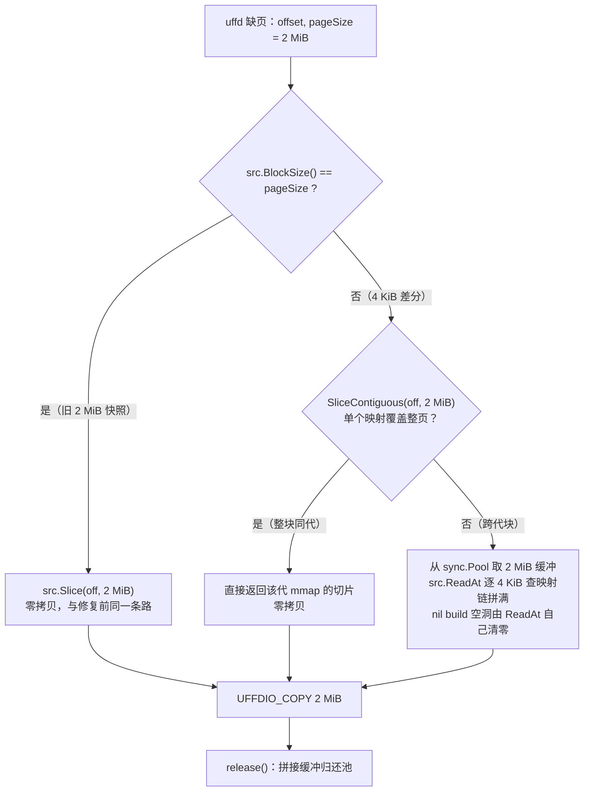

# 22 · 原生 snapshot 的精确增量：4 KiB 存、2 MiB 拼

> 上一篇断定「要精确，②③ 必须动」。本篇是改法：两条备选路线为什么选了保留大页的那条，
> 判 / 存 / 填三层各改了什么，以及脏页追踪没开时它怎么原样退回修复前的行为。
>
> **读者**：工程师。
> **预备**：[第 21 篇 · 原生 snapshot 的增量为什么不精确](21-native-increment-diagnosis.md)；
> [第 8 篇 · 内存差分树](08-memory-diff-tree.md)、[第 9 篇 · 分叉 Firecracker 的接口契约](09-firecracker-api-contract.md)。
> **代码**：infra-arm `jll` 提交 `de25fe4d0`（14 个文件，Firecracker 零改动）：
> `internal/sandbox/uffd/uffd.go`、`internal/sandbox/fc/memory.go`、
> `internal/sandbox/block/page.go`、`internal/sandbox/build/build.go`、
> `internal/sandbox/uffd/userfaultfd/userfaultfd.go`、`packages/shared/pkg/storage/header/metadata.go`
>
> **与本书主线的关系**：这是对**原生路径**的一处独立修复，不属于本方案 checkpoint / restore；
> 两者只共用一个位图端点，不共用任何产物 —— 完整交代见[第 21 篇](21-native-increment-diagnosis.md)。

---

## 0. 本篇要回答的问题

1. 关大页也能得到 4 KiB 精确增量，为什么不选它？
2. 判 / 存 / 填三层各改了什么？为什么父代的 2 MiB 映射不用重写？
3. 恢复时一次 2 MiB 缺页，内容从 4 KiB 差分里怎么拼回来？什么时候还能零拷贝？
4. 脏页追踪没开、或者 Firecracker 没有那个端点时，会发生什么？

---

## 1. 回顾：三层与那根链条

原生 `Pause` 的内存侧分三层：**① 判**（算出这一代哪些页要导出）、**② 存**（按块把脏页拷进紧凑差分文件，
header 记哪块在哪代的哪个偏移）、**③ 填**（恢复时 uffd 缺页，按 guest 页从映射链取内容填进去）。

修复前这三层的粒度被一根链条锁在一起：guest 页 2 MiB ⇒ ③ 只会按 2 MiB 填 ⇒ ③ 硬检查要求 ② 的块等于
2 MiB ⇒ ② 的块写在 header 里逐代继承 ⇒ ① 无论多精细都要归并到 2 MiB 块导出。
再加上 ① 在 ARM 上塌缩成「驻留即脏」、每代又是一个新进程，导出量就成了工作集而不是写集。
（完整推导见[第 21 篇 §2](21-native-increment-diagnosis.md#2-原生内存增量的三层)
与[§3](21-native-increment-diagnosis.md#3-修复前为什么不精确)。）

---

## 2. 两条路线

| | 路线 A：关大页 | 路线 B：保大页，4 KiB 存、2 MiB 拼 |
|---|---|---|
| 改动 | 只有 ①（约 40 行）+ 模板参数 `huge_pages=false` | ①②③ 共约 200 行（不含单测），5 个包 |
| 导出量 | 4 KiB 真值 | 4 KiB 真值 |
| 缺页次数 | ×512 | 不变 |
| TLB | guest 失去 2 MiB 大页 | 不变 |
| 每次缺页多付 | 无 | 最多 512 次映射查表 + 一次 2 MiB memcpy（仅跨代块） |
| 定位 | 一天内可验的对照开关 | 交付形态 |

选 B。关键判断是**拼接能力已经存在**：`build.File.ReadAt` 本来就是一个循环 —— 对每个 4 KiB 偏移查
`GetShiftedMapping`，从对应代读 `min(mappedLength, remaining)`，不限长度、可跨多代。
只有 `File.Slice` 是「只取一个块」的捷径。③ 要做的不是写拼接器，是把 uffd 路径从 `Slice` 改到能拼的读法。

---

## 3. 修复：三层各改了什么

### 3.1 ① 判：换成写跟踪位图

`Uffd.DiffMetadata` 不再调 `f.DirtyMemory`（`GET /memory/dirty`），改调
`f.TrackedDirtyMemory`：`PUT /snapshot/save-dirty-bitmap` 让 Firecracker 把位图落成 FCDB 侧车文件
（格式见[第 9 篇](09-firecracker-api-contract.md)），读回来直接作为 `DiffMetadata.Dirty`，
`BlockSize` 取 FCDB 头里的页大小（4 KiB）：

```go
dirty, pageSize, err := readFCDB(bitmapPath)
return &header.DiffMetadata{Dirty: dirty, Empty: bitset.New(0), BlockSize: pageSize}, nil
```

三个先决条件都成立，所以 `Pause` 的调用顺序不用动：

- 端点要求暂停态，而 `Pause` 取脏页元数据时虚机已经暂停（`process.Pause` → `CreateSnapshot` → `DiffMetadata`）；
- `Pause` 先做的那次 Full 快照**不擦**位图 —— 那次没给 memfile 路径，Firecracker 根本没走到重置分支
  （`rollback/scripts/probes/pb3.py` 实测 53202 页进、53202 页出）；
- 每代都是新进程，位图天然从零开始，不需要 reset。

位图语义 = KVM 脏页日志（920B 上是写保护，950 上是 HDBSS）∪ Firecracker 用户态位图（virtio 队列、
自身写入）。orchestrator 经 uffd **填**进去的页不在其中 —— 这是对的：它们的内容等于映射链里已有的内容，
不用再存。换出到 swap 的页也不受影响：位图与驻留无关，`process_vm_readv` 会把换出页读回来，
比修复前「mincore 驻留」的判据更安全（那个会漏掉换出页）。

### 3.2 ② 存：header 块大小降到 4 KiB，父代映射原样保留

`ToDiffHeader` 里 `NextGeneration` 继承父代 `BlockSize`（2 MiB）之后，加了一条：
差分块比父代细、且能整除，就把新 header 的 `BlockSize` 改成差分块的大小：

```go
if d.BlockSize > 0 && uint64(d.BlockSize) < metadata.BlockSize {
    if metadata.BlockSize%uint64(d.BlockSize) != 0 {
        return nil, fmt.Errorf("diff block size %d does not divide header block size %d", ...)
    }
    metadata.BlockSize = uint64(d.BlockSize)
}
```

**父代映射不用重写**，这是这一层改动小的原因。映射是字节区间（`Offset / Length / BuildStorageOffset`），
父代那些全是 2 MiB 对齐的，必然 4 KiB 对齐；`NewHeader` 用 `Offset / BlockSize` 建索引、`getMapping`
用字节偏移查，都不要求映射长度等于 `BlockSize`。`MergeMappings` / `NormalizeMappings` 全按字节算。
所以一个 4 KiB header 里可以同时有 2 MiB 长的父代映射和 4 KiB 长的本代映射，读法相同。

之后 `ExportMemory(ctx, Dirty, path, 4096)` 按 4 KiB 区间 `process_vm_readv` 进紧凑差分文件；
`BitsetRanges` 会把连续页合并成一段，每次系统调用最多 `IOV_MAX` = 1024 段。差分文件、上传、
模板存储的形态一点没变 —— 它本来就是「紧凑拼接 + header 指偏移」，块大小只是步长。

代际行为：基础模板 header 仍是 2 MiB；**第一次 `pause` 时切到 4 KiB**，之后每代继承 4 KiB。

### 3.3 ③ 填：一次 2 MiB 缺页，三级取源

`NewUserfaultfdFromFd` 的硬检查从「相等」放宽为「整除」，并记下页大小：

```go
if blockSize <= 0 || int64(region.PageSize)%blockSize != 0 {
    return nil, fmt.Errorf("page size %d is not a multiple of block size %d ...", ...)
}
```

缺页处理 `faultPage` 与预取器共用一个新入口 `block.ReadPage(ctx, src, off, pageSize)`，
返回一页内容和一个 `release`，三级取源：



- **第一级**：块等于页，走原来的 `Slice`。从旧 2 MiB 快照起沙箱时就是这条路，行为与修复前逐字节相同。
- **第二级**：`build.File.SliceContiguous` 查一次映射，若单个映射覆盖整个 2 MiB，直接返回那一代 mmap
  缓存的切片。guest 物理页在 2 MiB 块里是混着的，跨代的块不少，但仍以整块同代居多，
  所以大多数缺页仍然零拷贝。
- **第三级**：跨代的块才拼。缓冲从 `sync.Pool` 取（按页大小分池），`File.ReadAt` 逐 4 KiB 走映射链，
  nil build（从未写过的页）的空洞由 `ReadAt` 自己 `clear`，拷进 guest 后立即归还。

缺页跟踪与预取跟踪（`missingRequests`、`prefetchTracker`）改用页大小做单位 —— 它们记的是
「哪些 guest 页缺过」，单位本来就该是缺页单位。

### 3.4 顺手修掉的两处

细粒度读才会踩到的两个旧问题，在 `block` 包里：

- `Cache.isCached` / `setIsCached` 按**读偏移**记键，而不是按所在块。块等于读长度时两者一样，
  4 KiB 块下读 2 MiB 就会漏判；改成按首尾块循环，顺带不再每次分配 512 项切片。
- `FullFetchChunker.fetchToCache` 只取起始 4 MiB chunk，读区间跨到下一个 chunk 时后半段是空的；
  改成取齐 `startingChunk..endingChunk`。

### 3.5 追踪没开时的门

写跟踪位图只有在**虚机启动时**就武装了追踪才完整。追踪没开时 Firecracker 的 memslot 没有脏页日志，
`save-dirty-bitmap` 会报错，原生 `pause` 会直接失败 —— 这在无 HDBSS、默认不开追踪的机器上是常态
（[第 23 篇 §1.3](23-native-increment-cost-and-verification.md#13-写保护的运行期代价平台差异)）。
所以 `DiffMetadata` 加了门：

```go
if !fc.TrackDirtyPagesEnabled() {
    logger.L().Info(ctx, "dirty tracking is off, memfile diff uses the resident-page criterion", ...)
    return f.DirtyMemory(ctx, u.memfile.BlockSize())   // 修复前的判据，2 MiB 块
}
```

另一道门：Firecracker 没有 `save-dirty-bitmap` 端点（上游或 XFS 线的二进制）时返回 404，
封装成 `ErrDirtyTrackingUnavailable`，同样退回修复前判据并记 warn。两条退路都退到**修复前的完整行为**
（2 MiB 块、工作集口径），不是半新半旧。

---

## 4. 小结

1. **选路线 B 而不是关大页**：两者导出量相同，但关大页让缺页次数乘 512、guest 失去 TLB 收益；
   而拼接能力本来就在 `build.File.ReadAt` 里，③ 要做的只是从 `Slice` 换到能拼的读法。
2. **三层各一处改动，Firecracker 零改动**：判据换 `save-dirty-bitmap`；header 块大小降到 4 KiB
   而父代映射不用重写；uffd 缺页三级取源，整块同代零拷贝、跨代才拼、缓冲走池。
3. **两道门保证没有半新半旧的状态**：追踪没开、或二进制没有那个端点，都整体退回修复前的判据与 2 MiB 块。

---

## 思考题

1. §3.1 说 uffd 填进去的页「不在位图里是对的」。构造一个场景，说明如果把它们也算进去，
   导出量会怎样变化，正确性有没有影响。
2. §3.2 允许父代 2 MiB 长的映射与本代 4 KiB 长的映射并存。如果某一代把整个 2 MiB 块全写了，
   `NormalizeMappings` 之后这一块有几条映射？下一代只改其中一页呢？
3. §3.3 第二级「单映射覆盖整页」的命中率决定了拼接路径被走到的频率。什么样的负载会让命中率最低？
   那时 `touch1` 的上界是多少？
4. §3.5 的两道门都退回「2 MiB 块」。如果一个沙箱的链上前几代是 4 KiB header、之后某一代因为
   追踪被关而退回 2 MiB 块，`ToDiffHeader` 的整除校验会怎么处理？这条链还能恢复吗？

---

## 代码位置

| 关注点 | 位置 |
|---|---|
| 判据换源与两道门 | `internal/sandbox/uffd/uffd.go` — `DiffMetadata` |
| 位图落盘与解析 | `internal/sandbox/fc/memory.go` — `TrackedDirtyMemory`、`readFCDB`；`fc/rollback.go` — `saveDirtyBitmap`、`isMissingRoute` |
| 追踪开关 | `internal/sandbox/fc/dirtytracking.go` — `TrackDirtyPagesEnabled`、`resolveTrackDirtyPages` |
| header 块大小继承 | `packages/shared/pkg/storage/header/metadata.go` — `ToDiffHeader` |
| 三级取源 | `internal/sandbox/block/page.go` — `ReadPage`；`build/build.go` — `SliceContiguous`、`ReadAt`、`Slice` |
| uffd 校验与缺页 | `internal/sandbox/uffd/userfaultfd/userfaultfd.go` — `NewUserfaultfdFromFd`、`faultPage` |
| 预取器 | `internal/sandbox/uffd/prefetch/prefetcher.go` |
| 顺手修的两处 | `internal/sandbox/block/cache.go` — `coveringBlocks`；`block/chunk.go` — `fetchToCache` |
| 位图不被 Full 快照擦掉的实测 | `e2b-infra/rollback/scripts/probes/pb3.py` |

**下一篇**：[23 · 原生精确增量的代价、验证与边界](23-native-increment-cost-and-verification.md) ——
改法讲完了，接下来是它在恢复热路径上付了多少、怎么验、影响面到哪为止。
