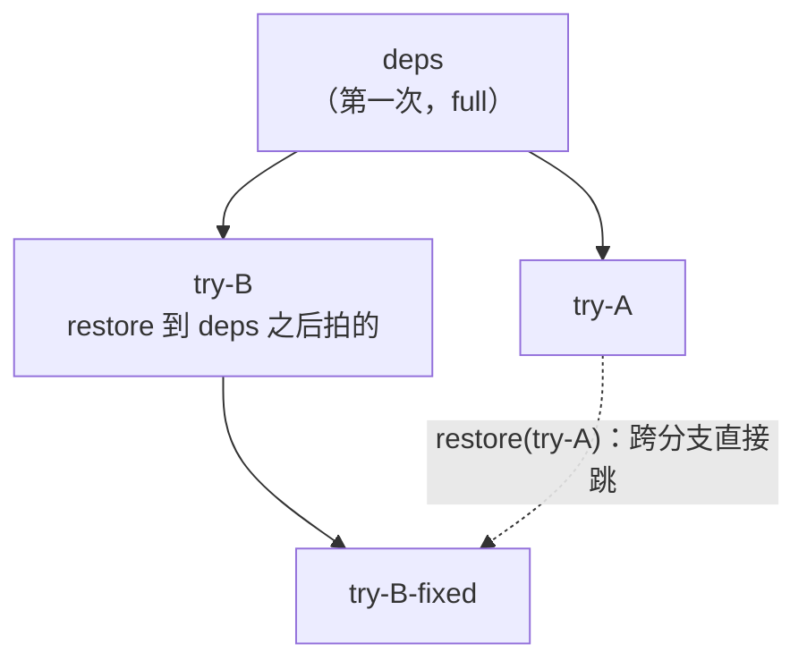

# 23 · 快速上手

## 本章目标

读完本章，你应该能：

1. 装好 `e2b==2.20.0` 与 checkpoint SDK 覆盖层，并用 `install.py --check` 与一行导入确认它装进了业务代码用的那个解释器；
2. 设好四个连接变量，用同步与异步两种写法跑通"checkpoint → 改动 → restore → list → delete"；
3. 读懂 `CheckpointInfo` 的各个字段，尤其是 `mem_mode`：第一次为什么是 `full`，之后仍是 `full` 意味着什么；
4. 按树形历史使用 checkpoint：从同一起点分叉、跨分支来回跳，并自己记录父子关系；
5. 遇到上手阶段最常见的几种报错时，知道多半是哪一步没配好。

上一章（[22](22-long-run-and-concurrency.md)）给完了长跑与并发的实测，第五部分到此结束。第六部分是实践手册。前面五个部分讲了原理与证据：为什么这样设计、怎么实现、失败时怎么办，以及怎么证明它对、它快。
从本章起换一个角度，不再追问"为什么"，只讲"怎么用、怎么部署、怎么运维、出了问题怎么查"：23–25 章面向在代码里调用 checkpoint / restore 的开发者，
26–30 章面向部署、运维与验收。各章可以单独查阅，需要原理时按链接回到前面各部分。

本章是第一步：把 SDK 装好，跑通第一个例子。回滚的语义与边界是下一章（[24](24-semantics-and-limits.md)），错误与超时见 [25](25-errors-timeouts-concurrency.md)。

---

## 1. 前提

### 1.1 服务端

服务端已按部署文档装好并启动（[26](26-deployment-prerequisites.md)、[`single-node-offline-deploy.md`](../../single-node-offline-deploy.md)），
并且至少建过一个模板。本章示例默认用模板 `base`（单机部署的验收与基准都用它，见 [30](30-acceptance-runbook.md)）。

checkpoint 接口在沙箱地址的 **49984** 端口上，但请求由宿主上的 orchestrator 截下并直接应答，
**沙箱里不需要安装任何守护进程**：做 checkpoint 要暂停虚机、驱动 Firecracker 的快照接口，这两件事 guest 内部做不到。

### 1.2 SDK：`e2b==2.20.0` + checkpoint 覆盖层

checkpoint 能力不在 PyPI 的 `e2b` 包里，而是一个**整文件覆盖层**，铺进已经装好的 `e2b==2.20.0`：
一共 21 个文件，12 个新增、9 个覆盖上游文件（覆盖前各留一份 `.orig`）。覆盖层只认 `2.20.0`，版本不对会拒绝安装。

标准部署里这一步由 `build.sh` 的 `install_e2b` 完成，顺序是：

```bash
pip install e2b==2.20.0
python3 /opt/e2b-infra/dep/e2b-sdk-checkpoint/install.py   # 铺覆盖层，装完自动在干净子进程里自检
python3 /opt/e2b-infra/patch_e2b.py                        # 内网明文部署：SDK 对外连接 https → http
```

**顺序不能反**：`patch_e2b.py` 会改 `connection_config.py`，覆盖层排在它后面会把改动盖回去。

覆盖层装进**运行 `install.py` 的那个解释器**的 site-packages。你的业务代码用哪个 Python，就用哪个 Python 执行上面三行
（例如虚拟环境里的 `python`，而不是系统的 `python3`）。

### 1.3 自检

```bash
python3 /opt/e2b-infra/dep/e2b-sdk-checkpoint/install.py --check
```

通过时会打印"payload 的 21 个文件都在位"和一行"自检通过（干净子进程）……"。
自检在一个新解释器里验：`Sandbox.checkpoint` 存在、`CheckpointInfo.mem_mode` 与 proto 字段在、六个方法齐全、端口是 49984、
异常族完整（原有的 8 个子类都在，且 reason 映射表里的每一项都是 `CheckpointException` 的子类）、四个 RPC 不重放、
checkpoint / restore 的默认超时不低于 300 s。任何一项不过都以非零码退出。

再从业务解释器里确认一次能导入：

```bash
python3 -c "from e2b import Sandbox, CheckpointInfo, CheckpointBytesLimitException; print('checkpoint SDK ok')"
```

要还原成原版 SDK：`python3 /opt/e2b-infra/dep/e2b-sdk-checkpoint/install.py --uninstall`。

### 1.4 连接凭据

SDK 从环境变量读连接配置。在服务端本机运行示例时，下面四行可以直接执行：

```bash
export E2B_API_KEY="$(python3 -c 'import json; print(json.load(open("/root/.e2b/config.json"))["teamApiKey"])')"
export E2B_API_URL="http://127.0.0.1:3000"
export E2B_DOMAIN="e2b.app"
export E2B_HTTP_SSL="false"
```

| 变量 | 作用 |
|---|---|
| `E2B_API_KEY` | 建沙箱用的团队 API key。单机部署下由部署脚本写在 `/root/.e2b/config.json` 的 `teamApiKey` 字段 |
| `E2B_API_URL` | API 服务地址。服务端本机用 `http://127.0.0.1:3000` |
| `E2B_DOMAIN` | 沙箱域名，单机部署保持 `e2b.app`（部署时装的 dnsmasq 把 `*.e2b.app` 解析到本机） |
| `E2B_HTTP_SSL` | 内网明文部署必须设为 `false` |

从另一台机器连过来时，`E2B_API_URL` 改成服务端的地址，沙箱域名的解析也要能到服务端，这属于部署网络的配置，
见 [`single-node-offline-deploy.md`](../../single-node-offline-deploy.md)。

---

## 2. 第一个例子：checkpoint → 改动 → restore → list → delete

把下面的内容存成 `cr_quickstart.py`，设好 §1.4 的环境变量后 `python3 cr_quickstart.py`。
它同时改一处磁盘文件和一处内存（`/dev/shm` 是 tmpfs，纯内存），用来证明两者一起回到了 checkpoint 那一刻。

```python
import os
from e2b import Sandbox

TEMPLATE = os.environ.get("CR_TEMPLATE", "base")


def sh(sbx, cmd):
    return sbx.commands.run(cmd, user="root").stdout.strip()


sbx = Sandbox.create(template=TEMPLATE, timeout=600)
try:
    # 现场 v1：磁盘文件 + 内存（tmpfs）+ / 下的一个标记文件
    sh(sbx, "echo v1 > /home/user/state.txt && echo v1 > /dev/shm/mem.txt && touch /etc/cr-marker")

    ck1 = sbx.checkpoint.create(name="v1")
    print("checkpoint:", ck1.checkpoint_id, "mem_mode =", ck1.mem_mode)   # 沙箱的第一次：full

    # 改动：磁盘和内存都改成 v2，再删掉 / 下的一个文件
    sh(sbx, "echo v2 > /home/user/state.txt && echo v2 > /dev/shm/mem.txt && rm -f /etc/cr-marker")
    print("改动后:", sh(sbx, "cat /home/user/state.txt /dev/shm/mem.txt"))

    ck2 = sbx.checkpoint.create(name="v2")
    print("checkpoint:", ck2.checkpoint_id, "mem_mode =", ck2.mem_mode)   # 之后：incremental

    # 回到 v1：磁盘、内存、被删的文件一起回来
    sbx.checkpoint.restore(ck1.checkpoint_id)
    print("restore 后:", sh(sbx, "cat /home/user/state.txt /dev/shm/mem.txt"))
    print("/etc/cr-marker 回来了:", sh(sbx, "test -f /etc/cr-marker && echo yes || echo no"))

    # 列出本沙箱的 checkpoint（从旧到新）；比目标新的 ck2 仍然在，可以再前滚过去
    for info in sbx.checkpoint.list():
        print("list:", info.checkpoint_id, info.name, info.created_at, info.mem_mode)

    sbx.checkpoint.restore(ck2.checkpoint_id)
    print("前滚到 v2:", sh(sbx, "cat /home/user/state.txt /dev/shm/mem.txt"))

    # 不再需要的 checkpoint 显式删除
    sbx.checkpoint.delete(ck1.checkpoint_id)
    print("剩下:", [i.name for i in sbx.checkpoint.list()])
finally:
    sbx.kill()   # 沙箱销毁时，它的全部 checkpoint 一起删除
```

预期输出的要点：

- 第一次 checkpoint 的 `mem_mode` 是 `full`，第二次是 `incremental`（见 §4）；
- restore 之后两处都读回 `v1`，被删的 `/etc/cr-marker` 也回来了；
- `list()` 里仍有 `v2`，restore 到它就"前滚"回去 —— restore 不会删掉比目标更新的 checkpoint；
- 删掉 `v1` 之后 `list()` 只剩 `v2`。

### 2.1 接口一览

全部挂在 `sandbox.checkpoint` 下（异步版 `AsyncSandbox` 的同名方法签名相同，前面加 `await`）。

| 方法 | 返回 | 说明 |
|---|---|---|
| `create(name=None, request_timeout=None)` | `CheckpointInfo` | 做一次 checkpoint。`name` 只是给人看的标签，不要求唯一；ID 由服务端生成 |
| `restore(checkpoint_id, request_timeout=None)` | `bool` | 把沙箱原地回滚到该 checkpoint。**只会返回 `True`**，失败一律抛异常，不要拿返回值做分支 |
| `list(request_timeout=None)` | `List[CheckpointInfo]` | 本沙箱当前这一代的全部可见 checkpoint，按创建时间从旧到新 |
| `delete(checkpoint_id, request_timeout=None)` | `bool` | 从接口上删除一个 checkpoint（空间何时释放见 [24](24-semantics-and-limits.md)）。同样只会返回 `True` |
| `is_available(request_timeout=None)` | `bool` | checkpoint 接口是否应答（探的是宿主侧服务，不是 guest） |
| `is_running(request_timeout=None)` | `bool` | `is_available` 的旧名，为兼容保留 |

各方法的默认超时和"不自动重发"的约定见 [25](25-errors-timeouts-concurrency.md)。

### 2.2 `CheckpointInfo`

| 字段 | 类型 | 说明 |
|---|---|---|
| `checkpoint_id` | `str` | 唯一 ID，`restore` / `delete` 用它 |
| `name` | `Optional[str]` | 做 checkpoint 时给的名字；没给为 `None` |
| `created_at` | `Optional[int]` | 创建时刻，Unix 秒。**只有 `list()` 返回的对象带这个值**；`create()` 返回的对象里是 `None` |
| `mem_mode` | `Optional[str]` | `"full"` 或 `"incremental"`，见 §4；服务端不上报时为 `None` |

`CheckpointInfo` 里**没有父节点字段**：接口上看到的是一张按时间排序的平表。需要按树来管理历史时，由调用方自己记下
"哪个 checkpoint 是在 restore 到哪个之后做的"（§5）。

---

## 3. 异步用法

```python
import asyncio
from e2b import AsyncSandbox


async def main():
    sbx = await AsyncSandbox.create(template="base", timeout=600)
    try:
        await sbx.commands.run("echo v1 > /home/user/state.txt", user="root")
        ck = await sbx.checkpoint.create(name="v1")
        await sbx.commands.run("echo v2 > /home/user/state.txt", user="root")
        await sbx.checkpoint.restore(ck.checkpoint_id)
        print((await sbx.commands.run("cat /home/user/state.txt", user="root")).stdout)   # v1
    finally:
        await sbx.kill()


asyncio.run(main())
```

---

## 4. `mem_mode`：这次是全量还是增量

| 值 | 含义 | 什么时候出现 |
|---|---|---|
| `"full"` | 把整份 guest 内存都写了一遍，耗时和占盘都与虚机内存大小成正比 | 默认配置下沙箱（当前这一代）的**第一次** checkpoint，这是它的树根；以及宿主没开脏页跟踪时的**每一次** |
| `"incremental"` | 只写了自上一个 checkpoint（或上一次 restore 的目标）以来被改过的内存页 | 其余情况 |

对调用方意味着：

- **第一次 checkpoint 必然是 `full`，这是正常的**。每个沙箱只付一次；经原生 pause / resume 换代之后，新一代的第一次也是 `full`（[24](24-semantics-and-limits.md)）。
- **之后仍是 `full`，说明宿主没在跟踪脏页**。功能完全正确、不报错，只是每次都按全量付时间和空间 ——
  所以这种退化只能从这个字段看出来。鲲鹏 950 上 orchestrator 探测到 HDBSS 会自动打开跟踪；
  没有 HDBSS 的机器默认不跟踪，需要运维显式打开（开关见 [27](27-configuration-and-capacity.md)）。
- 极少数失败之后（服务端丢了一段脏页记录，见 [25](25-errors-timeouts-concurrency.md) 的 `chain_broken`），
  下一次 checkpoint 也会是 `full`，它会起一棵新的树根。
- `list()` 里报的 `mem_mode` 是这个 checkpoint **被拍下时**的模式；之后服务端整理存储（[24](24-semantics-and-limits.md) §4）不会改变它。

业务依赖增量耗时的话，可以在自己的代码里加一道断言：

```python
def checkpoint_expect_incremental(sbx, name=None, first=False):
    ck = sbx.checkpoint.create(name=name)
    if ck.mem_mode == "full" and not first:
        raise RuntimeError("这次 checkpoint 是全量：宿主没在跟踪脏页，或刚刚断过链")
    return ck
```

`mem_mode` 为 `None` 时说明服务端版本太老、不上报这个字段，此时不要据此判断。
耗时量级见 [21](21-benchmarks-and-compliance.md#结论先行)。

---

## 5. 树形历史

一个沙箱的 checkpoint 构成一棵树：

- 每个 checkpoint 的父节点是"它被拍下时沙箱所处的那个点"—— 上一个 checkpoint，或者上一次 restore 的目标；
- **restore 不剪枝**：比目标更新的 checkpoint 原样保留，仍然可以 restore 过去（前滚）；
- restore 之后再做 checkpoint，新节点挂在 restore 目标下面，树长出一条新分支；
- 任意两个 checkpoint 之间都可以直接跳，不管它们在不在同一条分支上。



对 Agent 类负载的典型用法：每完成一步打一个点；某一步走坏了就 restore 到上一步、换个做法；
后来发现原先的做法其实是对的，再 restore 回那条分支。

下面的例子从同一个起点分出两条分支，再在两条分支之间来回跳：

```python
import os
from e2b import Sandbox

TEMPLATE = os.environ.get("CR_TEMPLATE", "base")


def sh(sbx, cmd):
    return sbx.commands.run(cmd, user="root").stdout.strip()


sbx = Sandbox.create(template=TEMPLATE, timeout=600)
try:
    sh(sbx, "echo deps-installed > /home/user/step.txt")
    deps = sbx.checkpoint.create(name="deps")

    # 分支 A
    sh(sbx, "echo plan-A > /home/user/step.txt")
    try_a = sbx.checkpoint.create(name="try-A")

    # 回到 deps，走分支 B：新 checkpoint 的父节点是 deps
    sbx.checkpoint.restore(deps.checkpoint_id)
    sh(sbx, "echo plan-B > /home/user/step.txt")
    try_b = sbx.checkpoint.create(name="try-B")
    print("try-B mem_mode =", try_b.mem_mode)      # incremental：相对 deps 的增量

    # 跨分支跳回 A，再跳回 B
    sbx.checkpoint.restore(try_a.checkpoint_id)
    print("在 A:", sh(sbx, "cat /home/user/step.txt"))    # plan-A
    sbx.checkpoint.restore(try_b.checkpoint_id)
    print("在 B:", sh(sbx, "cat /home/user/step.txt"))    # plan-B

    # 调用方自己维护的父子关系（接口不返回父节点）
    parent = {try_a.checkpoint_id: deps.checkpoint_id, try_b.checkpoint_id: deps.checkpoint_id}
    print("全部:", [(i.name, i.mem_mode) for i in sbx.checkpoint.list()])
finally:
    sbx.kill()
```

几条用户视角的规则：

- **跨分支跳转的代价**主要取决于两个点之间被改过的页有多少（沿树路径经最近公共祖先汇总），而不是树有多少分支。
- **删除**一个还有后代依赖的 checkpoint，它只是从 `list()` 里消失，数据由服务端按需保留或合并（compact / fold）；
  怎样删才能真正释放空间见 [24](24-semantics-and-limits.md)。
- 树只属于**这一个沙箱的这一代**：沙箱销毁、orchestrator 重启、经原生 pause / resume 换代，树都随之作废（[24](24-semantics-and-limits.md)）。

---

## 6. 出错时

checkpoint 接口的错误按"调用方下一步该做什么"分类，每一种有自己的异常类；
完整的表、异常类层次、超时与重试约定在 [25](25-errors-timeouts-concurrency.md)。上手阶段最常见的几种：

| 现象 | 多半是 |
|---|---|
| `AuthenticationException` | `E2B_API_KEY` 没设或不对（§1.4） |
| 连到了公网而不是本机 | `E2B_HTTP_SSL` 没设成 `false`；或本机 DNS 没把 `*.e2b.app` 解析到服务端 |
| `import e2b` 报 `duplicate file name checkpoint/checkpoint.proto` | site-packages 里残留了旧版覆盖层的目录；重跑 `install.py`，它会把旧目录挪开 |
| `AttributeError: 'Sandbox' object has no attribute 'checkpoint'` | 覆盖层没装进当前解释器（§1.2、§1.3） |
| `mem_mode` 一直是 `full` | 宿主没开脏页跟踪（§4） |
| restore 之后别的调用抛 `CheckpointInterruptedException` | 那次调用跨越了 restore，被回滚掐断；重连重试即可（[25](25-errors-timeouts-concurrency.md)） |

---

## 本章要点

- checkpoint 接口由宿主上的 orchestrator 截下并应答，沙箱里不需要装任何东西；客户端需要 `e2b==2.20.0` 加整文件覆盖层，先铺覆盖层、后跑 `patch_e2b.py`，并且装进业务代码实际使用的那个解释器。
- 装完做两步自检：`install.py --check`（在干净子进程里验字段、方法、端口、异常族、不重放与默认超时）和一行导入。
- 五个方法都挂在 `sandbox.checkpoint` 下；`restore` 与 `delete` 只会返回 `True`，失败一律抛异常；`created_at` 只有 `list()` 返回的对象才带。
- restore 同时带回内存、整个根文件系统（包括被删的文件）；它不剪枝，比目标新的 checkpoint 仍然可以前滚过去。
- `mem_mode`：沙箱这一代的第一次是 `full` 属正常；之后仍是 `full` 说明宿主没开脏页跟踪或刚断过链，功能正确但按全量付时间和空间，只有这个字段能看出来。
- 历史是一棵树：新 checkpoint 挂在"拍下时沙箱所处的点"下面，任意两点可以直接跳，代价取决于两点之间改过的页；接口不返回父节点，要按树管理就自己记。
- 树只属于这个沙箱的这一代：沙箱销毁、orchestrator 重启、原生 pause / resume 之后都作废。
