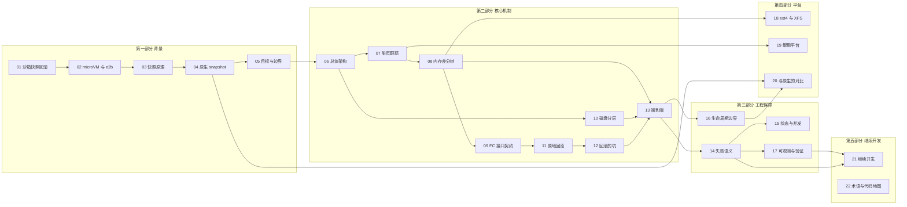

# 文档系列大纲

本文件是这套技术手册的**编写计划**：讲哪些主题、每篇写什么、面向谁、依赖哪些代码事实。
它同时充当写作规约 —— 二十多篇文档要读起来像一本书而不是一堆笔记，靠的是这里约定的
术语、口径与体例。

读者导览请看 [`README.md`](README.md)；本文件是给**编写者与维护者**看的。

---

## 一、这套文档是什么

一本关于「**在不中断沙箱的前提下，把一台正在运行的虚拟机回退到过去某一时刻**」的书。

主线是我们在 Firecracker 与 e2b orchestrator 上实现的 checkpoint / restore：
它怎么设计、为什么这样设计、每个决定的代价是什么、以及要在它上面继续开发需要知道什么。
为了把主线讲清楚，书里也会讲虚机快照、脏页跟踪、写时复制、virtio 设备状态这些背景知识 ——
但始终服务于主线，不做面面俱到的综述。

### 读者

| 读者 | 期待从这套文档得到 | 主要覆盖 |
|---|---|---|
| 对沙箱 / 快照技术感兴趣，但不写这类代码 | 「这东西到底在干什么、难在哪」 | 第一部分 |
| 软件工程师，将接手或参与本项目 | 完整实现、每个不变量、改动时的雷区 | 全书 |
| 系统工程师 / 运维 | 部署条件、能力探测、失效模式、验收方法 | 第一、三、四部分 |
| AI 工程师（本方案的使用方） | 什么时候用它、什么时候用原生 snapshot、边界在哪 | 01、16、20 |
| 评审 / 决策者 | 一篇读完全貌 | 00 |

### 质量标准

对标一本可以出版的技术教材：

- **每个论断可追溯**。凡涉及行为的陈述，要么给出代码位置，要么标注为推论。
  推论与事实必须能被读者区分开。
- **先讲问题，再讲方案**。任何一个机制出场前，读者应当已经知道不这么做会怎样。
- **代价与收益成对出现**。只讲收益的段落是宣传稿，不是教材。
- **每篇自足但不重复**。交叉引用用链接，不复制正文；确实需要重复的关键结论，
  用「回顾」明确标出是回顾。
- **配图服务于理解**，不是装饰。表格用于对比与枚举，流程图用于时序与依赖，
  没有第三类图。

---

## 二、术语与写法约定

### 2.1 方案名称

本项目有两套实现，按它们依赖的文件系统能力命名：

| 称呼 | 指什么 | 什么时候用 |
|---|---|---|
| **ext4 方案** | 内存产物是差分树，每代只存本代脏页，不依赖 reflink | 主线；未特别说明时全书讲的都是它 |
| **XFS 方案** | 内存产物每代自足，靠 XFS 的 `FICLONE` 克隆上一代再覆盖脏页 | 仅在第 18 篇与明确对比处 |

**禁止**使用 v1 / v2 / v3、M1 / M2、D1–D3 这类内部代号 —— 它们是设计过程中的编号，
对读者没有意义，也会让文档显得像工作日志。同理，不写「我们决定」「后来改成」这类过程叙事，
除非那个过程本身是要讲的知识点（例如第 18 篇讲 reflink 依赖为何被取消）。

### 2.2 与 e2b 原生的关系

全书统一口径，三者必须区分清楚：

| 名称 | 指什么 |
|---|---|
| **e2b 原生 snapshot / resume** | 上游 e2b 的快照与恢复能力，x86 上的实现 |
| **ARM 适配版** | 把上游移植到 aarch64 的版本，是本方案的代码基线 |
| **本方案 checkpoint / restore** | 本书主题 |

三条纪律：

1. 本方案**没有改动**原生路径，两者并存，解决不同问题；
2. 凡是「本方案更精确 / 更快」的论断，必须说明对照的是哪一个 —— 特别是脏页判据，
   本方案恢复的是 **ARM 适配中丢失的精确性**，x86 原生本来就是精确的（第 7 篇）；
3. 不写「原生方案的缺陷」，写「原生方案的成本模型不适合这个场景」。

### 2.3 体例

- **语言**：正文中文；文件名、标识符、命令、路径保持英文原样。文件名一律英文 kebab-case。
- **代码引用**：函数名与文件路径用行内代码；引用代码片段时只截取说明问题的部分，
  超过 30 行的片段改用文字描述 + 位置指引。
- **图**：新画的图用内嵌 mermaid（GitHub、VS Code 直接渲染，且可被后来者修改）。
  已有的三张汇报用 SVG 在 [`../diagrams/`](../diagrams/)，需要时链接过去，不重画。
- **单位与口径**：时间统一毫秒（μs 仅用于 Firecracker 内部分段）；容量统一 MiB / GiB；
  任何性能数字必须紧跟测量条件（机型、文件系统、脏页后端、模板大小）。
- **交叉引用**：一律写成指向具体小节的显式链接（篇号 + 节号 + 锚点），不写「见上文」「如前所述」。
  锚点用 GitHub 的中文标题规则（去标点、空格转连字符）。

### 2.4 每篇的固定结构

```
# 标题

> 一句话说明本篇讲什么
> **读者**：… **预备**：第 N 篇 … **代码**：…

## 0. 本篇要回答的问题     ← 3–5 个具体问题，读者读完应能自答
…正文…
## N. 小结                 ← 结论清单，不是内容复述
## 延伸阅读 / 下一篇
```

---

## 三、篇目

状态图例：`○` 未写　`◐` 草稿　`●` 完成

> **2026-08-31：23 篇全部完成**（约 74000 字）。下表状态已更新。

### 概览

| # | 文件 | 标题 | 状态 |
|---|---|---|---|
| 00 | `00-design-overview.md` | 设计总览 | ● |

**00 · 设计总览**
一篇读完全貌，5000 字左右，给没有时间读完整套的人：评审、决策者、第一天到岗的新人。
由原 `checkpoint-restore-design.md` 改写而来（原文件已删除，内容并入本篇）—— 原文是写给自己看的，
这一版要补上背景交代、去掉内部代号、并把「实测」一节的口径说明写足。
结构：定位与场景 → 总体结构 → 内存差分树 → 磁盘分层封存 → 一次 checkpoint / restore →
脏页跟踪 → 与原生的对比 → 优化点汇总 → 当前实测状态 → 全书导读。
**它是全书的浓缩，不是第 6 篇的重复**：第 6 篇讲部件职责与数据流，本篇讲整套方案的全貌与取舍。

---

### 第一部分　背景：这是个什么问题

面向所有读者，不要求预备知识。目标是让一个不写这类代码的人也能理解后面在讨论什么。

| # | 文件 | 标题 | 状态 |
|---|---|---|---|
| 01 | `01-what-and-why.md` | 沙箱、快照与回滚 | ● |
| 02 | `02-microvm-and-e2b.md` | microVM 与 e2b 的沙箱模型 | ● |
| 03 | `03-snapshot-fundamentals.md` | 虚拟机快照的基本原理 | ● |
| 04 | `04-e2b-native-snapshot.md` | e2b 原生 snapshot / resume | ● |
| 05 | `05-design-goals.md` | 设计目标、约束与边界 | ● |

**01 · 沙箱、快照与回滚**
从一个具体场景开始：AI Agent 在沙箱里执行多步任务，第 7 步把环境搞坏了，怎么回到第 6 步。
- 为什么「重来一遍」不可接受：时间成本、外部副作用、不可复现的中间状态
- 三种可选做法及其代价：重建沙箱 / 应用层撤销 / 虚机级快照
- 「快照」在不同层次上的含义：文件系统快照、容器镜像层、进程 checkpoint（CRIU）、虚机快照
- 本方案在这个谱系里的位置：虚机级、进程内、高频、宿主本地
- 一个直觉性的量级对比（不给具体数字，给数量级与成本模型）
- 全书导读：读者按身份该读哪几篇

**02 · microVM 与 e2b 的沙箱模型**
读者可能完全不了解 e2b，这一篇补齐。
- 容器、虚拟机、microVM 的隔离边界与启动代价
- Firecracker：为什么它小、它砍掉了什么、它的设备模型（virtio-mmio、无 PCI、无 BIOS）
- e2b 的对象模型：template / build / sandbox / envd / orchestrator，各自是什么
- 一个沙箱怎么起来的：从模板到运行中的 microVM，内存与 rootfs 分别从哪来
- 关键点：**e2b 的沙箱从不冷启动，一律由快照加载而来** —— 这个事实后面反复用到
- 宿主上的组成部件：orchestrator 进程、Firecracker 进程、NBD 设备、tap、UFFD handler

**03 · 虚拟机快照的基本原理**
- 「一台虚机的状态」由什么构成：guest 内存、vCPU 寄存器、中断控制器、设备逻辑状态、
  磁盘、时间、以及**外部世界对它的记忆**（连接跟踪、对端 TCP 状态）——最后一项是后面的坑源
- 全量快照 vs 增量快照；增量的前提是「知道谁改了」
- 一致性：为什么内存和磁盘必须取自同一瞬间；冻结窗口是什么，为什么它是唯一对业务可见的代价
- 恢复的两种形态：**重建**（新进程加载快照）与**原地回写**（既有进程写回差异），
  成本模型完全不同 —— 全书的核心分野
- 快照恢复的语义边界：时钟被拨回、随机数种子、VMGenID、guest 如何被告知「时间倒流了」
- 为什么「能复活一个已被 kill 的进程」是快照正确性的强证据

**04 · e2b 原生 snapshot / resume**
本方案的基线与对照组，必须先讲清楚，否则第 5 篇的取舍无从谈起。
- Pause RPC 做了什么：写快照 + 停沙箱，产物进对象存储
- 磁盘增量 `ExportDiff`：摘出写层 → 停沙箱 → 逐块紧凑导出 → storage offset ≠ device offset
- 内存增量：UFFD + 写保护判据，`DiffMetadataBuilder` 与 header / mapping
- 恢复：新建 Firecracker 进程 + UFFD handler + chunker 从对象存储按需拉取，靠缺页把工作集换回
- `Checkpoint` RPC（SDK 的 `create_snapshot()`）：snapshot → 停旧沙箱 → 以同一 SandboxID
  拉起新进程，`LifecycleID` 换新 —— **沙箱 id 不变，但底下已经是新进程**
- 成本模型总结：与虚机规格挂钩，与改动量基本无关
- 它擅长什么：跨节点迁移、长期持久化、进程崩溃后恢复。这些本方案不接管

**05 · 设计目标、约束与边界**
- 目标场景的三个特征：高频、低延迟、沙箱不能中断
- 硬约束：aarch64（鲲鹏 920B / 950）、产物落在 ext4、不改动原生路径、
  沙箱内不装任何代理程序
- 三条不复用原生路径的理由，逐条论证（中断、成本模型、ARM 适配上的增量退化）
- **明确的非目标**：宿主崩溃恢复、跨节点迁移、长期持久化、跨沙箱共享。
  这些归原生 snapshot —— 划界本身是设计的一部分
- 由目标推导出的四条设计原则，后面各篇都在实现它们：
  ① 成本只与改动量挂钩　② 不重建任何宿主资源　③ 宁可报错不可静默损坏　④ 能力随硬件自动降级

---

### 第二部分　核心机制：它是怎么做的

面向工程师。这是全书主体。

| # | 文件 | 标题 | 状态 |
|---|---|---|---|
| 06 | `06-architecture.md` | 总体架构 | ● |
| 07 | `07-dirty-page-tracking.md` | 脏页跟踪 | ● |
| 08 | `08-memory-diff-tree.md` | 内存差分树 | ● |
| 09 | `09-firecracker-api-contract.md` | 分叉 Firecracker 的接口契约 | ● |
| 10 | `10-disk-layering.md` | 磁盘分层与零拷贝封存 | ● |
| 11 | `11-in-place-rollback.md` | 进程内原地回滚 | ● |
| 12 | `12-rollback-pitfalls.md` | 原地回滚特有的问题 | ● |
| 13 | `13-end-to-end.md` | 端到端：一次 checkpoint 与一次 restore | ● |

**06 · 总体架构**
- 四个层次及其职责边界：SDK / 宿主代理拦截 / orchestrator Checkpoint Service /
  分叉 Firecracker / KVM 与硬件
- **控制面为什么在宿主侧**：打快照要暂停虚机，沙箱内的程序无法暂停自己。
  拦截点在代理的 token 校验之下，所以 Service 自己再校验一次
- 这个选择的收益：沙箱内不需要 guest agent（与基于 CRIU 的 guest 侧方案对比）
- 数据面：内存产物、磁盘产物、账本各自在哪，谁写谁读
- 存储布局逐目录说明
- API 面：四个 RPC（create / restore / list / delete）+ health，以及 `memMode` 回报字段的用意
- 一次调用的十行摘要（细节在第 13 篇）

**07 · 脏页跟踪**
增量的前提。这一篇决定了后面所有成本模型是否成立。
- 问题定义：如何知道自某时刻起 guest 写过哪些页
- 三种机制及其代价：
  ① userfaultfd 写保护（e2b x86 原生）② KVM 写保护 + `KVM_GET_DIRTY_LOG`
  ③ **HDBSS 硬件标脏**（鲲鹏 950，KVM cap 502）
- 三方判据差异表（x86 原生 / ARM 适配 / 本方案），以及为什么这是**修复退化而非超越上游**
- ARM 适配上 `GET /memory/dirty` 的实际路径：mincore 先筛常驻页，再对这些页读 pagemap；
  判据第二项在 aarch64 上恒真，于是结果等价于 mincore，pagemap 那一级成了纯开销
- KVM 脏页日志的**破坏性读**语义，以及 `store_dirty_bitmap` 为什么必须先折回用户态位图
- 启用：orchestrator 启动时 `KVM_CHECK_EXTENSION(502)` 探测（只查询、不建 VM、无 `/dev/kvm` 也安全）
  → 决定默认值；Firecracker `setup_dirty_tracking()` 用 `KVM_ENABLE_CAP(502, order)` 武装
- **引导与快照加载两条路径都要武装** —— e2b 沙箱只从快照启动，只改 machine-config 等于没开
- 默认值跟着硬件走的理由：有硬件标脏时武装几乎免费；没有时要写保护每个干净页，
  对从不打 checkpoint 的沙箱是纯亏损
- 三个环境变量与 `FC_HDBSS_ORDER` 的缓冲区溢出权衡；能力上报（`hdbss` / `kvm-wp` / `off`）

**08 · 内存差分树**
本方案的核心数据结构。
- 每代产物就是一个稀疏文件：本代脏页写在各自的 guest 物理偏移上，其余是文件空洞
- 为什么不是「每代自包含」：整代克隆在 ext4 上退化为真实字节拷贝，代价与改动量脱钩
  （XFS 方案的做法与它成立的条件，见第 18 篇）
- **树而不是链**：`ParentID`、回滚不剪枝、回滚后新分支从目标长出。
  由此得到三种线性链做不到的操作：回滚后前滚、跨分支跳转、删除中间节点不打断后代
- **回滚集**：`⋃ 纪元位图(树路径 b→LCA→t) ∪ 活跃脏页`，附完整正确性论证
  （若页 p 不在其中，则 p 在分叉后两侧都没被写过 ⇒ b 时刻内容 = LCA 时刻 = t 时刻）
- **内容解析**：沿目标祖先链找第一个位图含该页的一代，从它的 `mem_diff` 读；
  连续同源页合成单次读写（`revertExtentPages = 1024`）
- **全量树根**：为什么树根必须自足 —— 否则回滚路径上藏着一段跨网络依赖
  （模板 memfile 本地不存在，要经 chunker 从对象存储拉）。开关、代价、什么部署适合关掉
- **恢复成本与链深无关**的机制解释：祖先链查找只在已加载的位图上做位测试，
  真正的 `pread` 只发生在命中那一次；创建侧不做克隆。所以不需要周期性压平
- 删除与回收：有后代或身为基准 ⇒ 隐藏保留；否则物理删除并沿父指针级联回收

**09 · 分叉 Firecracker 的接口契约**
两个进程之间的约定，也是「为什么要分叉 Firecracker」的完整回答。
- 上游 Firecracker 的快照 API 与它没有的东西
- 三处扩展，逐一说明动机：
  ① `CreateSnapshotParams.dirty_bitmap_path` —— 位图随快照**同一次调用**落地，
     省一轮接口往返和一次全内存扫描
  ② `PUT /snapshot/rollback` —— 原地回滚本体（第 11 篇详解）
  ③ `PUT /snapshot/save-dirty-bitmap` —— 导出活跃脏页位图
- **为什么 ③ 必须存在**：Firecracker 在回滚时会把自己的活跃脏页并进写回集，并按页从
  调用方给的文件读内容。ext4 方案给的是只含回滚集的稀疏文件，所以 orchestrator
  必须**事先知道**活跃脏页集，否则 Firecracker 会从文件空洞读到零页、静默损坏内存。
  （XFS 方案给的是全量镜像，任何页都读得到，因此不需要这个端点 —— 见第 18 篇）
- **FCDB 位图侧车格式**逐字节说明，附读写两侧的实现位置
- 位图的几何校验：page_size 与 num_pages 必须与运行中的虚机对上，不对就报错而非猜测
- 版本配对纪律：orchestrator 与 Firecracker 成对交付，混用必失败；
  未打补丁的二进制在 `/snapshot/rollback` 上返回 404，客户端据此给出明确错误
- 连接管理：为什么这两个客户端都禁用 keep-alive（Firecracker API 有并发连接上限，
  用光之后每次回滚都 503）
- seccomp：回滚路径用到的 syscall 必须进白名单（vCPU ioctl、vmm 线程的 `pread64`）

**10 · 磁盘分层与零拷贝封存**
- 沙箱的磁盘视图：只读模板 rootfs + COW 写层（稀疏文件 + mmap），经 NBD 暴露给 guest
- 原生 `ExportDiff` 的路径与它的硬约束：必须摘出写层、停沙箱、等 NBD 释放 —— 对高频不可接受
- **`SealLayer` 四步**，逐步说明每步为什么必要：
  `BLKFLSBUF` 刷屏障 → 新建空写层 → `Overlay.Seal()` 两次指针替换 → `MoveFile()` 改名入库
- 类比：OverlayFS 把 upper 降级成 lower 再开一个新 upper，**挂载全程不卸载**
- `SealedView` 链：运行中的沙箱怎么读到自己封存前的写入
- 恒等映射 vs 紧凑 diff：因为不做紧凑化，`storage offset == device offset`，
  映射表是恒等映射，比原生少一步偏移换算；代价是不剔除全零块，按块粒度占盘
- **刻意不做 msync**：一致性不欠这个 flush（所有读者读同一份 page cache），
  msync 买到的是宿主崩溃后的持久性，而账本本来就活在进程内存里、达不到那么远。
  实测 0.49 ms/脏 MB，是封存耗时随改动量线性增长的唯一来源
- `ResetView`：挂载不动、整体换视图；被丢弃时间线的写层连同文件删除，
  封存层只解除映射（文件归 store 所有，可能仍被别的 checkpoint 引用）
- **恢复不走层链**：用每层 `.meta` 侧车重新打开层文件并标记它持有哪些块，
  按 checkpoint 自己的合并 header 组装 —— 所以层数永远不影响恢复
- 账本被污染（poisoned）时的处理：合并校验失败后拒绝再记录视图，而不是记录一个可能错的

**11 · 进程内原地回滚**
Firecracker 侧的主体，`PUT /snapshot/rollback` 的九个阶段。
- 前提：VMM 线程上、虚机暂停时执行 —— 世界是冻结的，没有 vCPU 在跑、没有设备事件
- 阶段 1 校验：`Paused` 状态检查 + `validate_topology`（同 vCPU 数、同内存大小、同设备集、
  设备激活状态逐个对上；balloon / vsock / vhost-user block 一律拒绝）。
  为什么拓扑必须一致：回滚是往**既有对象**上写，对象不存在就没有可写的目标
- 阶段 2 静默：块设备等异步引擎结束；网络读掉并丢弃 tap 里缓存的帧 ——
  那些帧属于正在被丢弃的时间线
- 阶段 3 取活跃脏图：KVM 的读是破坏性的，先折回用户态位图，再与调用方给的位图求并
- **提交点**：从这里开始改动 guest 状态，失败语义由此分成两半
- 阶段 4 内存：按回滚集写回活映射，连续页合批
- 阶段 5 vCPU：固定走 reinit 路线（`KVM_ARM_VCPU_INIT` + 完整寄存器恢复）。
  registers-only 路线为什么被删除（G1 门槛 p95 48.3 ms vs 145.3 ms）
- 阶段 6 GIC：对既有设备 fd 恢复中断控制器状态
- 阶段 7 设备：transport 寄存器 → 依快照重建队列（内存已回滚，所以环内容与索引同一时刻）
  → 写回 acked features 与中断状态；串口重新初始化
- 阶段 8 VMGenID：刷新代号让 guest 知道时间被回拨，**必须在内存写回之后**
- 阶段 9 重置脏页基线：清空跟踪，并重新标脏队列页（运行期队列写不被跟踪）
- 宿主资源清单：进程、KVM fd、eventfd、irqfd / ioeventfd 注册、tap、网络槽位、NBD 设备、
  内存映射 —— **一个都不重建**，这既是它快的原因，也是它离不开活沙箱的原因

**12 · 原地回滚特有的问题**
进程重建路线天然不会遇到、原地回滚必须自己处理的。每个都按
「现象 → 根因 → 为什么重建路线不会遇到 → 怎么修」讲。
- **网络 RX 描述符缓存**：队列索引被回退后，设备对象里还留着按旧时间线解析出的描述符链，
  而那些环页刚被回滚。第一个完成的帧写入携带失效描述符 id 的 used 项，
  guest 驱动拒绝（`id N is not a head!`）后 RX 永久卡死
- **VMGenID 的次序**：放在内存写回之前会被回滚数据覆盖
- **连接跟踪**：恢复后的 guest 忘记了内核仍在跟踪的连接，TCP 序号已经倒退。
  残留表项让内核判定 guest 的包非法而丢弃 —— 表现为连接挂死而不是失败，最难排查。
  为什么暂停窗口是清表的正确时机：此刻没有流量，不可能有人重建一条刚被作废的表项。
  同时要丢弃代理侧到该沙箱的连接池
- **时间语义**：guest 醒来时单调时钟停留在快照时刻，墙钟由 envd 校回。
  这决定了验收脚本不能拿墙钟或 tick 速率当活性判据
- **队列页的脏标记**：运行期队列写不经过跟踪，回滚后必须显式重新标脏，
  否则下一代 Diff 会漏掉它们
- 排查手段：回滚后逐设备打印队列生产/消费位置与 RX 缓存状态

**13 · 端到端：一次 checkpoint 与一次 restore**
把前七篇串起来，按时间顺序走一遍，每一步指明「这在第几篇讲过」。
- create：拦截 → 按沙箱串行 → 决定全量/增量 → 预留条目 → **暂停** →
  写快照（差分 + 位图，一次调用）→ 封存写层 → **恢复** → 合并 header → 提交账本 → 回报
- restore：取条目 → 加载磁盘视图 → **暂停** → 导出活跃脏页 → 算回滚集 → 物化 →
  Firecracker 原地写回 → 切磁盘视图 → 清 conntrack → **恢复** → 等 envd → 移动基准
- 两处「为什么是这个顺序」：
  ① 内存与磁盘在同一次暂停内完成，两者是同一瞬间的镜像，guest 未刷盘的数据位置正确
  ② 暂停之后才导出活跃脏页、才物化 —— 虚机停住后活跃脏页集不再增长，
     物化内容必然覆盖 Firecracker 接下来要写回的全部页
- 冻结窗口里到底有哪些步骤，各自的量级
- 时序图（mermaid）+ 与 [`../diagrams/03-vs-native.svg`](../diagrams/) 的对照

---

### 第三部分　工程保障：怎么保证它不出错

| # | 文件 | 标题 | 状态 |
|---|---|---|---|
| 14 | `14-failure-semantics.md` | 失败语义与不变量 | ● |
| 15 | `15-state-and-concurrency.md` | 状态管理与并发 | ● |
| 16 | `16-lifecycle-and-portability.md` | 生命周期与可移植性边界 | ● |
| 17 | `17-observability-and-verification.md` | 可观测性与验证 | ● |

**14 · 失败语义与不变量**
总纲：**静默损坏比报错糟得多**。没有兜底重建路线之后，失败必须分级报告。
- 提交点模型：前 / 后两类失败的处理完全不同
- 四档失败及其对沙箱的影响（保持可用 / 原样恢复 / 撕裂需重建 / guest 未应答）
- **纪元不能丢**：Firecracker 一旦写完快照就清空了脏页位图，此后 diff 文件是那一代脏页的
  唯一副本。后续步骤失败时以**隐藏条目**提交；连这都失败才标记断链，此后拒绝恢复
  直到下一次全量 checkpoint
- 隐藏条目的完整语义：参与内容解析与回滚集，不出现在 API，不可作为恢复目标
- 45 s / 60 s 超时的取舍：服务端等待上限刻意低于 SDK 默认超时，否则客户端先放弃，
  真正的原因永远到不了调用方
- 账本污染（poisoned rootfs bookkeeping）与断链（invalid base）的区别与恢复方式
- 不变量清单（改代码时不能破坏的）：
  ① 差分条目必须有侧车　② 回滚集必须是超集　③ 恢复目标必须与运行中虚机同拓扑
  ④ 内存与磁盘同一暂停窗口　⑤ 提交前不可见

**15 · 状态管理与并发**
「如何在一台正在运行的机器上换零件」。
- 三类状态：账本（进程内 + 磁盘镜像）、活体对象（Overlay / Firecracker）、文件产物
- 按沙箱串行的操作锁：create / restore / delete 各自全程持有
- `Overlay` 的读写锁：读写路径持共享锁，`Seal` / `ResetView` 持独占锁，
  在 NBD dispatcher 之下换指针
- **暂停窗口作为静默机制**：哪些操作必须在窗口内、为什么
- 原子提交：temp 文件 + fsync + rename + 目录 fsync；`prepared` / `committed` 两态
- `context.WithoutCancel`：客户端放弃不能让一台暂停中的虚机留在暂停态
- 失败时的清理顺序与幂等性
- 单元测试覆盖了哪些不变量（事务、层栈封存链、合并 header 与层栈读一致性、身份映射）

**16 · 生命周期与可移植性边界**
由原 `../checkpoint-lifecycle.md` 改写并入系列（原文件已删除，内容并入本篇）。
- 产物在哪、什么时候被删（`OnRemove` → `RemoveSandbox` 的两个动作）
- 思想实验：把目录完整拷走会怎样 —— 按实际代码路径逐步走失败点
- 四层依赖：恢复机制要求活体 / 磁盘产物不自足 / 账本不从磁盘加载 / 缺运行时环境
- 内存那一半其实已经自足（全量树根的副作用），所以真正的数据缺口只有磁盘半边
- 补齐需要什么，以及**补齐之后得到的就是原生 snapshot**，沿途会逐项丢掉本方案的收益
- 对使用方意味着什么：什么情况下失效、要长期保存怎么办、不要依赖的用法
- 与第 20 篇的分工：本篇讲**边界**，第 20 篇讲**如何与原生配合**

**17 · 可观测性与验证**
- **三个时钟**：客户端墙钟 / 冻结窗口 / 宿主分阶段耗时。前两个说「差了多少」，第三个说「差在哪」
- `timings.json` 与 Firecracker 自报的内部分段，为什么写文件而不是只打日志
- `memMode` 回报：专门用来抓「静默退化成全量拷贝但仍然成功」这类藏在延迟均值里的问题
- 能力上报：脏页后端、reflink 探测结果，启动时说清楚这台机器能做什么
- 验收脚本的设计原则：
  ① **先自证「这个检查会失败」**，再验证恢复 —— 否则通过没有意义
  ② 活性只断言心跳在推进，不用墙钟或 tick 速率（恢复会把单调时钟拨回）
  ③ 交付态脚本零共享依赖、单文件，宿主探针刻意重复一份，防止只拷走一半
- 分档基准的设计：建链后逐级回退，恢复单独成表，每档抓「刚写完」与「宿主平静后」两次
- 当前实测状态与口径：950 HDBSS 正确性 59 项全过；920B 软件写保护对照组；
  **两组数字为什么不能相减**；尚未覆盖的四项

---

### 第四部分　平台与方案选择

| # | 文件 | 标题 | 状态 |
|---|---|---|---|
| 18 | `18-ext4-vs-xfs.md` | 两套方案：ext4 与 XFS | ● |
| 19 | `19-kunpeng-platform.md` | 鲲鹏平台：HDBSS、920B 与 950 | ● |
| 20 | `20-vs-native.md` | 与原生 snapshot 的对比与配合 | ● |

**18 · 两套方案：ext4 与 XFS**
- 起点：`FICLONE` / reflink 是什么，XFS 有、ext4 没有，这个差别为什么足以改变整套设计
- **XFS 方案**：每代产物自足 —— 克隆上一代完整镜像（元数据操作，物理上只落脏页），
  再让 Firecracker 把 Diff 写在克隆上。账本仍是树，但树只用来算回滚集，不用来解析内容
- **ext4 方案**：取消克隆，每代只存本代脏页，内容按页沿祖先链解析
- 两者的差异清单（表格）：产物形态、成本模型、内容解析、Firecracker 端点、
  恢复输入文件、账本用途、对文件系统的要求、存储占用
- **一个关键的连带差异**：XFS 方案给回滚端点的是全量镜像，任何页都读得到，
  所以不需要 `save-dirty-bitmap`；ext4 方案给的是只含回滚集的稀疏文件，
  必须先导出活跃脏页，否则读到空洞 = 静默损坏（回顾第 9 篇）
- 退化检测：两套各自的「静默变慢」形态与探测手段（reflink 探测 / `memMode` 回报）
- **怎么选**：判据是产物落盘的文件系统，不是机型
- 版本配对：两套的 orchestrator 与 Firecracker 各自成对，四个二进制不可交叉混用

**19 · 鲲鹏平台：HDBSS、920B 与 950**
- 鲲鹏 920B 与 950 的差别（就本方案而言）：有无硬件脏状态跟踪
- HDBSS 是什么：CPU 在 stage-2 页表更新时把脏页地址写进每 vCPU 的缓冲区，
  免去写保护陷出。缓冲区阶数、溢出行为、`FC_HDBSS_ORDER` 的调优空间
- 内核侧前提：`CONFIG_ARM64_HDBSS`、KVM capability 502 的 openEuler ioctl 编码
- 探测 → 决策 → 武装 → 上报的完整链路（跨 orchestrator 与 Firecracker 两个进程）
- 降级路径与 `FC_HDBSS_REQUIRED`：回滚部署通常希望 fail fast，而不是默默退回软件路径
- 部署检查清单：内核配置、能力探测、存储文件系统、二进制配对、环境变量
- 920B 上如何做等价验证（软件写保护路径），以及哪些结论可以外推、哪些不行

**20 · 与原生 snapshot 的对比与配合**
放在读者已经理解两者之后，做完整对照。
- 路径级对比表（打快照时沙箱、快照后的身份、内存搬运、磁盘增量、历史结构、恢复方式、
  恢复成本、产物去向）
- 成本模型对照：与虚机规格挂钩 vs 与改动量挂钩，各自的适用区间
- **两者如何配合**：进行中的任务用 checkpoint 快速回退；要跨会话保留的状态用原生 snapshot。
  可以叠加：先回退到已知良好点，再对该状态打一次原生 snapshot
- 优化点汇总表（分层：脏页跟踪 / 内存产物 / 恢复路径 / 磁盘 / 一致性 / 架构 / 工程保障）
- 每条优化的对照基准要写明白（对 ARM 适配版 / 对原生 / 内部路线修正）

---

### 第五部分　继续开发

| # | 文件 | 标题 | 状态 |
|---|---|---|---|
| 21 | `21-extending.md` | 在这套方案上继续开发 | ● |
| 22 | `22-glossary-and-code-map.md` | 术语表与代码地图 | ● |

**21 · 在这套方案上继续开发**
- 代码地图：两个仓库、各自的职责边界、交付形态（patch + 二进制）
- 改动指引，按任务组织：
  加一种设备要动哪里 / 支持一种新文件系统 / 改变产物格式 / 加一个 API / 调整失败语义
- **不能破坏的不变量清单**（引用第 14 篇），以及每条对应的测试
- 已知缺口与可能的方向：可导出的 checkpoint（层栈压平）、账本跨重启加载、
  分档基准在 950 上补齐、`FC_HDBSS_ORDER` 调优、多沙箱并发下的存储压力
- 开发环境：怎么构建、怎么在 920B / 950 上换二进制验证、验收脚本怎么跑
- 阅读源码的建议顺序

**22 · 术语表与代码地图**
- 术语表：中英对照 + 一句话定义 + 首次出现的篇目
- 代码索引：关注点 → 文件 → 函数
- 文件格式索引：FCDB 位图、层 `.meta` 侧车、`manifest.json`、`index.json`、
  合并 header、`timings.json`
- 环境变量总表
- API 总表：SDK 方法、四个 RPC、Firecracker 三处扩展

---

## 四、依赖关系



最短路径（只想搞懂机制）：**06 → 07 → 08 → 10 → 11 → 13**。
最短路径（只想判断能不能用）：**00 → 16 → 20**。

---

## 五、与现有文档的关系

| 现有文件 | 处置 |
|---|---|
| `../checkpoint-restore-design.md` | ✅ 已改写为 `00-design-overview.md`（补背景、去内部代号、补口径、新增两套方案与边界两节），原文件删除 |
| `../checkpoint-lifecycle.md` | ✅ 已改写为 `16-lifecycle-and-portability.md`（去掉问答体例，改为与其他篇一致的讲解体），原文件删除 |
| `../diagrams/` | SVG 与 mermaid 源**未动**；其 README 的跳转已改指本系列 |
| `../slides/` | 稿件**未动**；其 README 的参考链接已改指本系列 |
| `../test-950/` | **不动**。开发态工具箱，第 17、21 篇链接过去 |
| `../README.md` | ✅ 已重写，本系列为首要入口 |

---

## 六、编写顺序

按「先立骨架、再填血肉」，且优先产出能独立使用的篇目：

1. **00** —— 先有全貌，后面各篇都可以引用它，也让读者立刻有东西可读
2. **06 → 07 → 08 → 10 → 11** —— 核心机制主干，全书的技术地基
3. **09、12、13** —— 补齐机制部分
4. **14 → 15 → 16 → 17** —— 工程保障
5. **01 → 02 → 03 → 04 → 05** —— 背景部分放在后面写，因为要以主体内容为准来决定
   「读者到底需要哪些前置知识」，先写主体才知道该铺垫什么
6. **18 → 19 → 20**
7. **21 → 22** —— 术语表与代码索引最后写，此时全书用词已经稳定
