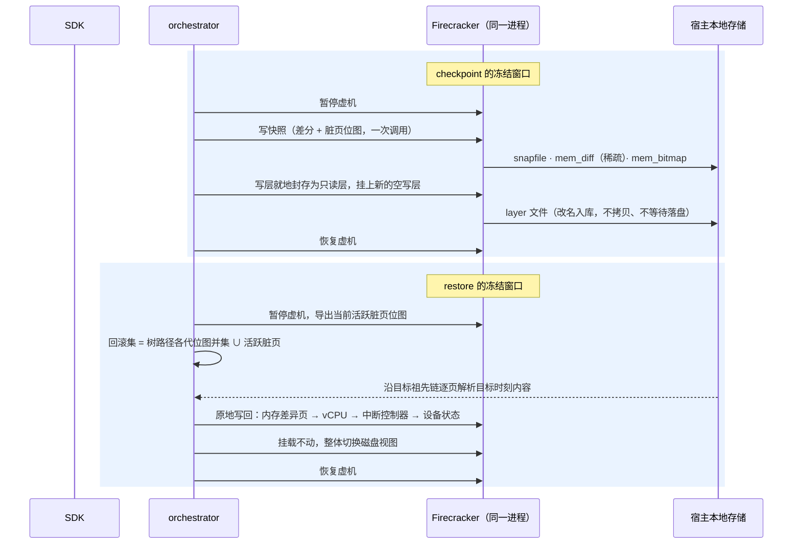

# E2B ARM Checkpoint / Restore

鲲鹏 950 平台上的沙箱快速回滚

执行路径 · 优化点 · 与 e2b 原生 snapshot 的分工

交付形态：e2b-infra 的 ARM patch + 分叉的 Firecracker 二进制 + SDK 覆盖层

---
layout: default
---

# 一句话定位

### 我们解决的

**沙箱活着时的高频快速回退**

执行出错 → 退回上一个检查点 → 继续跑。

沙箱**全程不中断**，进程、网络、磁盘设备一个都不重建。

代价与「**回退了多少**」成正比。

### 仍归 e2b 原生 snapshot 的

**沙箱离场后再回来**

- 跨节点迁移
- 长期持久化
- 进程崩溃后的恢复

两条路径**并存**，我们没有改动原生路径。

一句话概括技术路线：<b>内存做差分树，磁盘做分层封存，回滚在进程内原地完成，脏页由 950 的硬件能力记录。</b>

---
layout: full
class: p-2
---

  

---
layout: full
class: p-2
---

  

---
layout: default
---

# 冻结窗口里到底做了什么

内存与磁盘在<b>同一次暂停窗口内</b>完成 —— 两者是同一瞬间的镜像，不会半新半旧。冻结窗口是唯一对业务可见的代价。

---
layout: full
class: p-2
---

  

---
layout: default
---

# 一处必须讲清楚的前提：脏页判据的三方差异

| | 脏页怎么判 | 结果 |
|---|---|---|
| **e2b x86 原生** | uffd 写保护位区分读 / 写缺页 | 增量**精确**，只有真正被写过的页算脏 |
| **ARM 适配版**（我们的基线） | 该写保护路径在 arm64 上走不通，被注释掉 | 增量**退化**：凡被换入过的页都算脏，量的下限 ≈ 整个工作集 |
| **我们** | 不经过 uffd，直接取 KVM / HDBSS 脏日志 | ARM 上**恢复精确增量**；950 上进一步由 CPU 硬件记录 |

这一条是**修复 ARM 适配引入的退化**，不是「超越 x86 原生」。
在 x86 上 e2b 的增量本来就是精确的 —— 对外表述时不要把两者混为一谈。

同理，「与改动量无关的下限」也只在 ARM 适配版上成立：x86 上重新换入的是干净页，不计入增量。

---
layout: default
---

# 优化点汇总

| 层次 | 优化点 | 带来什么 |
|---|---|---|
| **脏页跟踪** | HDBSS 硬件标脏自动接管；启动探测能力，无硬件安全退回 | 由 CPU 自己记录写过哪些页，950 上开箱即用 |
| | 判据取自硬件 / 内核日志，绕开 uffd | 补回 ARM 适配中丢掉的精确增量 |
| **内存产物** | 差分树：每代只存本代脏页，不复制上一代 | 成本只与改动量有关，**ext4 上不需要 reflink** |
| | 树形历史而非线性链 | 回滚后可再前滚、可跨分支跳，历史不丢 |
| | 树根存一次全量 | 整棵树自给自足，回滚不回头依赖模板与对象存储 |
| **恢复路径** | 按页沿祖先链解析，不合并链、不重建完整镜像 | 恢复成本**与历史链长度无关** |
| | 进程内原地回滚 | 宿主资源全部保留，恢复后无需重新换入工作集 |
| | 回滚范围精确到页 | 代价与回退跨度成正比，而非与虚机规格成正比 |
| **磁盘** | 写层就地封存 + 视图活体切换 | **打快照与回滚都不停沙箱**，挂载全程不卸载 |
| | 封存不等待落盘 | 封存耗时不再随改动量增长 |
| **架构** | 接口在宿主侧接管 | 沙箱内不需要安装任何代理程序 |
| **工程保障** | 失败语义分级、断链拒绝恢复、删除不打断后代 | 杜绝「看起来成功、实际数据已坏」 |
| | 三层计时 + 全量/增量模式回报 | 能定位到具体阶段，能发现静默退化 |

---
layout: default
---

# 实测：950 已在硬件标脏路径上跑通

### 950 · HDBSS 硬件标脏（08-29）

**59 项校验全部通过**，服务端自报脏页后端 = `HDBSS（硬件标脏）`，产物落根盘 ext4。

- 逐级回退、跨 2 代前滚、A / C 交替 3 轮
- `kill -9` 掉心跳进程后回滚，**连 PID 与启动时刻一起复活**
- 树根 `full`、后续 `incremental`

950 客户端墙钟（模板 `base`，每代脏内存 128 MB + 文件系统 32 MB）：

| 操作 | 次数 | p50 | min | max |
|---|---|---|---|---|
| create 全量（第一代） | 1 | 0.283 s | 0.283 s | 0.283 s |
| create 增量 | 2 | 0.113 s | 0.111 s | 0.115 s |
| restore | 10 | 0.100 s | 0.089 s | 0.153 s |

### 920B · 软件写保护（对照）

- 链深 5 / 20 / 50 代全部正确，恢复不随链深增长
- 200 次回滚 **0 失败**
- 分档基准六档全覆盖（全量 1.549 s；64 MB 档 0.062 s）

**口径**：950 那一轮是<b>正确性验收</b>，耗时只是顺带打印。两组数字的模板大小、存储介质、
脏页后端三项全不同，<b>不能相减归因于 HDBSS</b>。

剩余缺口：950 上的分档基准、HDBSS 与软件写保护的对照、`FC_HDBSS_ORDER` 取 1 / 2 / 4 的对比。

---
layout: center
class: text-center
---

# 小结

1. **技术路线**：内存差分树 + 磁盘分层封存 + 进程内原地回滚 + 硬件标脏。
2. **核心收益**：打快照与回滚都不中断沙箱；成本从「与虚机规格挂钩」变成「与改动量挂钩」。
3. **平台价值**：950 的 HDBSS 被自动识别并启用，无硬件时安全退回，一套代码两种平台 ——
   08-29 已在 950 的硬件标脏路径上通过 59 项正确性验收。
4. **边界清晰**：不替代 e2b 原生 snapshot，跨节点与崩溃恢复仍归原生。
5. **下一步**：在 950 上跑分档性能基准，并量化 HDBSS 相对软件写保护的收益。

